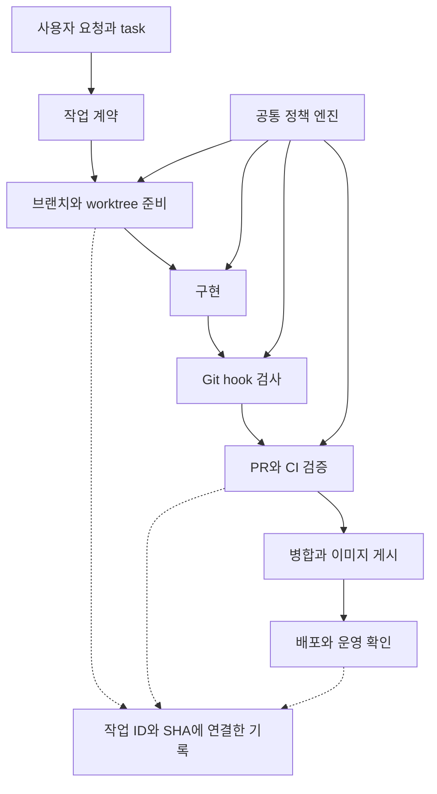

# Git 브랜치 전략과 개발 harness 설계

- 작성: 2026-09-25. 사용자 요청에 따른 설계 문서화.
- 상태: **설계 문서 작성, 구현·설치·원격 보호 활성화는 미실행**.
- 적용 시점: [구현 계획](harness-implementation-plan.md)의 단계별 수용 후 신규 작업부터 적용한다. 이 문서 추가만으로 기존 브랜치·worktree·Git 설정을 변경하지 않는다.
- 범위: Blariyo의 작업 식별, Git 작업, 검증, 인계와 배포 증거 연결. 제품 기능·법무·인프라 공급자 계약을 변경하지 않는다.
- 상위 지침: [AGENTS.md](../../AGENTS.md), [AI 작업 안내](README.md). 현재 상태는 [status](../status.md), 잔여 순서는 [roadmap](../roadmap.md)을 따른다.

## 1. 목표와 현재 기준선

Harness는 작업 준비·범위 확인·검증·인계를 실행하는 공통 도구다. Hook은 편집·commit·push 등의 시점에 이 도구를 호출하는 진입점이다.

목표는 작업 ID부터 소스 SHA, 검증 결과와 전달 상태까지 추적하고, 다른 세션에서 같은 작업을 안전하게 재개하는 것이다. 로컬 hook은 빠른 피드백을, CI와 원격 보호 규칙은 병합 전 검증을 담당한다.

2026-09-25 문서화 시작 시 확인한 로컬 기준선:

| 항목 | 확인 내용 | 증거·한계 |
| --- | --- | --- |
| Git | HEAD `964fb445d57da834f29ae9382b4a51bb42d672a0`, `main`, 작업 트리 clean, 로컬 `origin/main`보다 1커밋 앞섬 | 로컬 조회이며 원격 최신 상태를 조회한 결과가 아님 |
| Worktree | 현재 checkout과 별도 `feature/m0-core` checkout 존재 | 기존 자원을 자동 이전·삭제하지 않음 |
| CI | `verify`, `collector`, 이후 API/Web `images` | [실행 정의](../../.github/workflows/ci.yml); 현재 SHA 원격 성공을 뜻하지 않음 |
| 복원 검사 | 별도 예약·수동 workflow | [backup-restore](../../.github/workflows/backup-restore.yml) |
| 실행 도구 | npm workspace, Node·Java·PostgreSQL 기반 검사 | [package.json](../../package.json), [검증 안내](../testing/README.md) |
| Hook | `core.hooksPath` 미설정 | harness 설치·동작 증거 없음 |

실행 버전은 package·lockfile·Gradle·workflow에서 읽고, 문서에 적힌 과거 버전을 실행기의 별도 기본값으로 복제하지 않는다.

## 2. 브랜치와 변경 단위

### 2.1 선택

| 전략 | 장점 | 비용·제약 | 선택 |
| --- | --- | --- | --- |
| `main` + 짧은 작업 브랜치 | 작은 변경을 빠르게 검토·통합 | 자주 동기화하고 필수 검사 필요 | 채택 설계 |
| `main` + `develop` + 장기 release | 여러 출시선을 병행하기 좋음 | 동기화·hotfix 전달 경로 증가 | 다중 출시선이 실제 필요할 때 재검토 |
| `main` 직접 작업 | 절차가 적음 | 변경 혼합·동시 작업·미검증 반영 위험 | 도입 이후 기본 개발 경로에서 제외 |

### 2.2 운영 규칙

- `main`은 검증된 통합 기준선이다. 실제 운영 버전은 배포 SHA·이미지 digest로 별도 식별한다.
- 브랜치명은 `<type>/<task-id>-<slug>`다. type은 `feature`, `fix`, `docs`, `refactor`, `chore`, `hotfix`를 사용한다.
- 예: `fix/UX-01-policy-viewer-focus`. 등록되지 않은 task ID를 형식만 맞춰 만들지 않는다.
- 한 브랜치·PR에는 독립적으로 검토하고 되돌릴 수 있는 변경 하나를 담는다. 가능하면 1~3 작업일 내 통합하되 납기나 자동 종료 조건으로 사용하지 않는다.
- 하나의 기능을 완성하는 API·Web·테스트·정본 변경은 같은 PR에 포함할 수 있다. 관계없는 기능은 분리한다.
- 기능별 커밋을 유지하고 merge commit을 기본으로 한다. 선형 이력 강제 규칙은 이 선택과 함께 활성화하지 않는다.
- 공유·push한 작업 브랜치는 최신 `main`을 merge한다. 미공유 브랜치의 rebase는 기존 변경 보존과 사용자 권한 범위 안에서 선택한다. 자동 autostash·reset은 하지 않는다.
- 기본 hotfix도 최신 `main`에서 분기한다. 운영 SHA와 `main`의 차이로 긴급 적용이 불가능하면 실제 배포 SHA 기반 임시 유지보수 경로, 별도 CI·이미지 게시와 `main` 재반영을 먼저 정한다. 기존 main 전용 image job이 이를 지원한다고 간주하지 않는다.
- 기존 `office`, 설계 브랜치, 오래된 feature/worktree는 이 문서로 폐기하지 않는다. 정리 시 고유 커밋·미커밋·미추적·로컬 증거와 승인 범위를 확인한다.

커밋 메시지 제안:

```text
fix(web): 정책 이력 변경 후 초점 이동

Task-Id: UX-01
Change-Id: <등록된 변경 ID>
```

`Change-Id`는 harness가 생성·등록하는 기술 식별자다. 제품·화면 ID를 새로 채번하는 기능은 아니다. 자동 merge 메시지의 형식 예외는 허용할 수 있지만, 최종 소스·비밀·필수 검증을 면제하지 않는다.

## 3. 정본과 실행 구조



| 자산 | 역할 |
| --- | --- |
| 이 문서 | 개발 흐름·판정 계약·선택 이유의 정본 |
| `docs/planning`, `docs/system-design`, 개발 명세 | 제품·기술 요구사항의 기존 정본; harness가 복제하거나 대체하지 않음 |
| `.harness/policy.json` — 구현 예정 | 규칙 ID·경로·검증 profile 등 기계 판정 입력; 이 설계와 같은 변경에서 동기화 |
| `.harness/tasks/<task-id>.json` — 구현 예정 | 기존 task 참조, 허용 변경 경로, 정본·완료 조건 링크, change 등록 |
| 공통 CLI·정책 엔진 — 구현 예정 | Git·AI·CI 진입점에서 같은 판정 로직 실행 |
| AGENTS·CLAUDE·GEMINI 진입 파일 | 정본으로 안내하는 얇은 포인터. 별도 정책 복사본을 만들지 않음 |

문서와 실행 정책이 어긋나면 자기검사가 지적하고 해당 규칙을 수정한다. 코드에 이미 있다는 이유로 제품 정본을 자동 변경하지 않는다. 새로운 정책은 규칙 ID·이유·적용 범위·검사·복구 방법을 함께 등록한다.

## 4. 식별자와 작업 계약

| 필드 | 의미 | 수명 |
| --- | --- | --- |
| `repoId` | Blariyo 저장소 식별 | 폴더 위치와 무관하게 유지 |
| `taskId` | 기존에 등록된 해야 할 일 | 세션·AI 변경 후에도 유지 |
| `changeId` | 하나의 PR로 검토할 변경 묶음 | task를 여러 PR로 나누면 각각 발급 |
| `worktreeId` | 로컬 실제 작업 공간; CI에서는 null | 공간 재생성 시 변경 |
| `runId` | 개별 실행·검증 | 실행마다 새로 발급 |

Task manifest에는 `schemaVersion`, `taskId`, `taskRef`, 정본·수용 조건 참조, 허용 경로, 검증 profile, 관련 change ID를 둔다. 제품 요구사항·날짜별 상태·비밀을 복제하지 않고 임의 shell 명령을 저장하지 않는다. 신규 task는 task 문서에 등록한 뒤 연결한다.

실행 기록에는 사용한 manifest hash와 정책 hash를 함께 남긴다. manifest를 바꿔 범위나 검증을 넓히거나 줄였으면 변경 이유를 검토하고 관련 증거를 다시 평가한다. 에이전트가 통과를 위해 허용 범위를 자동 확대하지 않는다.

단일 변경 manifest의 `taskId`·`changeId`와 CI 집계 증거를 구분한다. 집계 증거는 `changeBindings` 배열의 각 항목에 `taskId`, `changeId`, `taskManifestHash`, 해당 변경의 commit SHA 목록을 묶는다. 여러 PR이 포함된 main 실행을 임의의 한 task에 귀속하지 않는다. CI의 임시 checkout은 `checkoutId`로 식별하며 로컬 `worktreeId`를 만들어 넣지 않는다. 이벤트별 연결 기준은 §9.1을 따른다.

기존 [제품 task 17개](../implementation-tasks/README.md)와 [harness 구현 task](harness-implementation-plan.md)는 별도 묶음이다. 예시 `UX-01`을 사용해도 해당 제품 작업이 착수·완료된 것은 아니다.

## 5. 상태와 권한

| 상태 축 | 기록 | 근거 |
| --- | --- | --- |
| 작업 | 대기·진행·차단·완료 | task별 수용 조건 |
| 검증 | 미실행 또는 §8의 검사 결과 | 대상 소스·환경·실행 결과 |
| 승인 | 허용 행위·대상·범위·요청 근거 | 사용자 요청 또는 실제 검토 기록 |
| 전달 | commit·push·merge·이미지 게시·배포·운영 확인 각각 | Git·원격 CI·배포·readback 증거 |

- `ready`는 PR 준비 결과이며 제품 task의 완료나 운영 승인이 아니다.
- 테스트 통과, push 요청, 검토 확정, 배포와 QA는 서로 대신하지 않는다.
- 이미 받은 승인은 동일한 대상·범위에서 재사용한다. 단순한 도구 경계를 이유로 반복 확인하지 않는다.
- 에이전트가 manifest에 `approved: true`를 쓰거나 커밋에 `Local-Test: Y`를 넣는 것만으로 승인·통과를 만들 수 없다.
- commit·push·merge·삭제·배포·외부 전송은 기존 AGENTS와 해당 사용자 요청의 권한 범위를 따른다. `start`는 원격 브랜치를 자동 push하지 않는다.
- 배포·QA 표시는 실제 SHA·digest의 사건 기록으로 남긴다. 표시만을 위한 빈 커밋을 기본 경로로 사용하지 않는다.

## 6. Worktree·동시 작업·재개

1. `start`는 기존 변경과 task 등록을 확인하고 기준 commit SHA를 고정한다. 원격 기준선은 실제 fetch/조회 시각과 로컬 추적 참조를 구분한다.
2. 설정 가능한 저장소 바깥 worktree 루트에 작업 공간을 만든다. 고정 절대경로를 공유 정책에 넣지 않는다. 저장소 안 경로를 선택하면 Git 제외와 재귀 탐색 제외를 함께 검증한다.
3. 활성 작성자는 worktree당 하나다. 같은 task·변경 경로의 중복 작업을 탐지한다. 서로 다른 worktree에서 같은 파일을 수정할 수는 있지만 통합 순서와 충돌 책임을 명시한다.
4. 포트·임시 DB·미디어·결과 폴더를 작업별로 배정한다. 현재 고정 포트에 의존하는 테스트는 먼저 직렬 실행하며 자동 격리가 구현됐다고 가정하지 않는다.
5. 소유권은 lease(기간이 있는 사용권 기록)로 관리한다. 갱신 중단만으로 프로세스 종료·잠금 강탈·폴더 삭제를 하지 않는다. PID만 믿지 말고 실행 ID·작업 공간·실제 상태를 확인한다.
6. `resume`은 기록된 HEAD·소스 hash·policy·자원 소유권과 현재 상태를 비교한다. 차이를 표시하고 영향받는 검증을 다시 요구한다.
7. 종료·정리는 자신이 만든 임시 자원만 대상으로 한다. 기존 DB·볼륨·사용자 파일·다른 실행 결과를 지우지 않는다.

로컬 lease는 같은 PC·checkout 계열의 충돌만 조정한다. 다른 PC까지 전역 잠금이 된다고 주장하지 않는다. 다중 PC 조정은 명시적으로 공유된 task/PR 기록을 사용한다.

새 worktree에는 미추적 설정·의존성·테스트 자원이 자동 준비되지 않는다. 준비 과정은 명시된 비운영 profile과 기존 안전한 로컬 실행기를 사용하며 운영 자격증명을 일괄 복사하지 않는다. `skip-worktree`를 비밀 보호 수단으로 도입하지 않는다.

## 7. Hook과 설치 계약

| 진입점 | 대상 | 실패 시 |
| --- | --- | --- |
| AI 작업 시작·편집 전 | task·정본·허용 경로·보호 경로 | 지원되는 도구에서 조기 안내·차단 |
| `pre-commit` | 실제 index의 내용·모드·경로, task 범위, 비밀·충돌 흔적 | commit 차단 |
| `commit-msg` | 메시지 형식, 등록 task/change와의 일치 | commit 차단 |
| `pre-push` | stdin의 모든 목적지 ref·전송 SHA와 전송 이력의 비밀 | 직접 main push, 금지된 삭제·이력 덮어쓰기, 비밀 발견·필수 검증 누락 차단 |
| `post-commit` | 생성된 commit SHA와 실행 기록의 연결 | 기록 오류 보고; commit 성공을 실패로 바꿔 보고하지 않음 |
| `post-checkout` — 선택 | 변경된 작업 정보·환경 안내 | 차단 없이 재확인 안내 |

- 공통 엔진을 호출하는 얇은 wrapper로 구현한다. 경로 정책·사용자 목록을 hook마다 복제하지 않는다.
- 부분 staging에서는 파일 시스템의 최신 파일이 아니라 Git index를 읽는다. `GIT_INDEX_FILE` 등 Git이 전달한 문맥도 존중한다.
- 파일 목록은 NUL 구분 등 안전한 방식으로 읽고 공백·한글·rename·삭제·symlink·경로 이탈을 다룬다.
- hook에서 포맷 수정·`git add`·stash·reset·fetch·외부 발송·배포를 자동 실행하지 않는다. 필수 검사기 누락은 성공 종료하지 않는다.
- pre-commit은 빠른 정적 검사로 한정한다. build·DB·브라우저 전체 검사는 명시적 `verify`와 CI에서 실행한다.
- push 검사에는 작업 폴더의 dirty 내용이 아니라 실제 전송 SHA의 증거가 필요하다. 작업 브랜치명만 검사해 `HEAD:main` 전송을 놓치지 않는다.
- merge로 승인된 main 변경을 가져오는 것과 사람이 충돌을 해결한 변경을 구분한다. 부모 중 하나와 같다는 이유만으로 출처가 불명확한 변경까지 면제하지 않는다. 최종 비밀·정책·테스트 검사는 유지한다.
- `git user.email`은 로컬 식별 보조값이며 권한 인증 수단이 아니다.
- AI hook은 셸·다른 편집 도구를 포함한 모든 쓰기를 보장해 통제하지 못한다. 지원 기능은 도구별로 확인하고 Git·CI 검사를 공통 최종 경계로 둔다.

### 7.1 전송 이력의 비밀 검사

최종 SHA의 앱 테스트와 전송 이력의 비밀 검사는 별도 필수 검사다. 앞선 commit에 비밀을 넣고 마지막 commit에서 삭제했어도 이전 객체는 전송될 수 있으므로 최종 tree 검사만으로 push를 허용하지 않는다.

| push 입력 | 검사 범위·판정 |
| --- | --- |
| 기존 ref 갱신 | hook stdin의 remote old OID와 local new OID를 고정하고 `old..new`에 해당하는 모든 부모 경로의 commit·내용을 검사; first-parent나 최종 diff만 사용하지 않음 |
| 새 ref — remote OID가 모두 0 | new에서 도달 가능한 전체 이력을 기본 검사. 제외하려면 동일 scanner·정책으로 검사된 객체 집합의 증거가 있어야 하며, `origin/main`이라는 이름만으로 제외하지 않음 |
| 다중 ref | 모든 입력의 검사 집합을 합치고 중복 객체만 제거. 한 ref라도 실패하면 push 전체 차단 |
| tag | commit을 가리키는 lightweight/annotated tag의 도달 이력과 annotated tag 메시지 검사. commit으로 해석할 수 없는 tag·지원하지 않는 객체 유형은 명시적 차단 |
| 삭제 — local OID가 모두 0 | 새 전송 이력 없음과 삭제 권한 판정을 분리; 다른 ref의 검사는 계속 수행 |
| old 객체 부재·shallow 이력·객체 읽기 실패 | 범위를 증명할 수 없으면 BLOCKED/ERROR. hook에서 fetch하지 않고 사전 이력 준비 후 재시도 안내 |

commit 메시지와 각 commit의 파일 내용까지 검사하며, 삭제된 중간 비밀도 탐지해야 한다. 증거에는 ref별 old/new OID, 검사한 객체 집합 hash·개수, scanner/정책 버전과 결과를 남긴다. 비밀 원문은 로그·artifact에 남기지 않는다. 범위가 실제로 비어 있음이 확인된 경우에만 사유 있는 NOT_APPLICABLE로 처리한다.

CI도 §9.1의 고정 이력 범위를 다시 검사해 병합을 차단한다. 다만 CI는 push 이후 실행되므로 이미 원격에 전송된 비밀 노출을 예방하거나 되돌리는 수단이 아니다. 로컬 hook 역시 우회 가능하며, 원격 전송 전 강제 차단 기능은 서버 지원 여부를 따로 확인해야 한다. stdin·0 OID의 의미는 [Git pre-push 계약](https://git-scm.com/docs/githooks#_pre_push)을 따른다.

### 7.2 지정 worktree 설치·복원

기본 설치 범위는 **명시적으로 지정한 worktree 하나**다. 공유 `core.hooksPath`나 전역 설정을 바꿔 다른 worktree에 자동 적용하지 않는다. 기존 hook 파일을 덮어쓰지 않고 대상 worktree에서만 연결한다.

1. 전체 worktree 목록과 유효한 hook 경로·설정 출처·원본을 읽고 백업한다. `.git` 파일/디렉터리를 모두 지원하며 Git이 알려주는 경로를 사용한다.
2. `extensions.worktreeConfig` 지원과 CLI·GUI가 사용하는 Git의 호환성을 확인한다. 처음 활성화할 때 공유 설정에 있던 `core.worktree`·`core.bare`의 이관과 기존 worktree별 설정 영향을 먼저 검토한다. 이 확장은 저장소 공통 변경이므로 영향 범위를 설치 보고에 표시한다. 접근 불가능한 worktree나 호환성 미확인 환경 때문에 보존을 확인할 수 없으면 BLOCKED로 남긴다.
3. 대상에만 `git config --worktree core.hooksPath`를 적용한다. 확장 미지원 시 저장소 공통 설치로 조용히 전환하지 않는다. 설정 공유·이관 규칙은 [Git worktree 설정 계약](https://git-scm.com/docs/git-worktree#_configuration_file)을 따른다.
4. hook 선택 경로는 브랜치 전환으로 사라지지 않는 로컬 dispatcher에 연결한다. dispatcher는 원래 hook의 호출 순서·실패 결과를 보존하고 wrapper/runner 버전을 확인한다. 대상 branch에 필수 runner가 없으면 성공 종료하지 않는다. 재설치는 중복 연결·호출 순환을 만들지 않는다.
5. 설치·제거 전후 대상과 비대상 worktree의 실제 hook 선택·동작을 비교한다. 제거 시 대상의 기존 설정 유무·값·연결을 복원한다. 다른 worktree가 사용하는 공통 확장이나 설치 후 생긴 설정을 삭제하지 않는다. 확장·이관까지 되돌릴 때는 전체 사용 상태를 확인하고 이번 설치의 변경만 복원한다.

`doctor`는 파일 존재, 실행권한, 실제 hook 선택 경로, wrapper 호출 대상·버전과 임시 저장소에서의 동작 검사를 구분한다. 설치·복구·제거는 백업된 기존 설정과 연결 상태를 복원할 수 있어야 한다.

## 8. 검증 profile과 결과 계약

### 8.1 결과

| 값 | 뜻 | 필수 검사인 경우 |
| --- | --- | --- |
| `PASS` | 실제 검사했고 조건 만족 | 통과 |
| `FAIL` | 실제 검사했고 조건 위반 | 차단 |
| `NOT_APPLICABLE` | 신뢰된 변경 분류에서 적용 대상 아님 | 이유·정책 규칙이 있을 때만 허용 |
| `BLOCKED` | 필요한 입력·환경이 없어 미실행 | 차단 |
| `ERROR` | 검사기 오류·timeout·잘못된 입력 | 차단 |

검사 전에는 미실행으로 표시한다. 검사 대상 0개·입력 파일 부재·필수 report 누락을 자동 PASS로 처리하지 않는다. 외부 서비스 장애 때문에 검증하지 못한 상태도 통과가 아니다.

### 8.2 영향 범위

| 변경 | 검증 profile |
| --- | --- |
| 일반 설명 문서 | 링크·참조·diff, 정본 동기화·미정/출시 차단 항목 보존 검토 |
| API | build·lint·단위·관련 PostgreSQL 통합 |
| Web | build·typecheck·lint·관련 브라우저 |
| Collector | 기존 `test:collector`, Gradle build와 DB readback |
| 공유 계약·migration | 소비 앱 전체·계약·migration·호환성 |
| harness·CI·의존성·미분류 경로 | 전체 기본 검사와 harness 회귀 |

문서 확장자나 `docs/` 경로만으로 검사를 줄이지 않는다. `docs/migration/`의 계약 입력, 실행 명령·생성기 입력·보안 정책 변경은 영향 범위를 별도로 판정한다. 삭제·rename 양쪽 경로와 전이 의존성을 포함하고, 모르면 전체 검사로 돌아간다.

초기 도입은 기존 CI `verify`·`collector`를 유지한다. 최적화는 전체 검사와 결과를 비교해 누락이 없다는 증거를 확보한 뒤 켠다. migration·복구 관련 변경은 §9.2의 조건부 restore job을 PR/main gate에 연결한다. 기존 예약·수동 복원 workflow는 운영 점검으로 유지하며 다른 SHA의 결과로 변경 검증을 대신하지 않는다.

Harness의 `.mjs`는 기존 TypeScript 전용 test/lint glob에 포함된 것으로 간주하지 않는다. HARN-01에서 `test:harness`와 `lint:harness`를 추가해 `tests/harness/*.test.mjs`, `scripts/harness/**/*.mjs`와 harness 테스트 파일을 명시적으로 검사한다. HARN-05의 필수 `harness` job은 두 명령을 실행하고 실제 실행 테스트 수가 0이거나 report가 없으면 실패한다. `.mjs` lint·실행 테스트와 TypeScript typecheck의 검증 범위는 구분한다.

### 8.3 증거 필드와 유효성

검증 기록의 최소 필드:

```text
schemaVersion, repoId, runId, worktreeId (CI에서는 null)
changeBindings [{ taskId, changeId, taskManifestHash, commitShas }]
executionContext { kind, event, providerRunId, jobId, attempt, checkoutId }
subjectKind (index | commit | merge-result | runtime)
subjectSha, sourceTreeHash, baseSha, headSha, beforeSha
historyRange { refs, commitSetHash, objectSetHash, objectCount }
policyHash, runnerVersion, lockfileHash, environmentFingerprint
profile, checkId, result, exitCode, reason, startedAt, finishedAt
artifactRefs, producer (local | ci | manual), evidenceKind
```

- index 검증에는 아직 commit SHA가 없으므로 해당 필드는 null, `changeBindings`의 `commitShas`는 빈 배열로 두고 등록 task/change와 tree hash로 식별한다. commit 생성 후 연결하되 서로 다른 내용을 검사한 것처럼 바꾸지 않는다.
- `executionContext`는 로컬·CI·수동 실행을 구분한다. CI에서 provider run/job/attempt와 임시 checkout ID는 필수이며, 로컬에는 해당 없는 필드를 null로 둔다. `historyRange`는 이력 검사에 필수이고 그 외 검사에서는 null이다. 단일 task 실행도 같은 `changeBindings` 형식을 사용한다.
- 로컬 소스 스냅샷·commit·PR head·병합 결과 SHA·실제 운영 대상을 구분한다. 미커밋 변경을 HEAD 하나로 표현하지 않는다.
- 실행 전후 입력 hash가 다르면 결과를 무효로 표시한다. 코드·기준 main·정책·필수 환경 변경 시 관련 증거를 다시 평가한다.
- 과거 전체 PASS를 새로운 SHA의 PASS로 복제하지 않는다. 로컬 캐시는 정확한 입력으로만 재사용하며 CI는 깨끗한 환경에서 재검증한다.
- 수동 확인은 확인자·대상·시각·방법을 기록하고 자동 검사와 구분한다. 인간의 확인 선언을 실제 명령 실행 기록으로 위장하지 않는다.
- 결과물은 검사 대상 소스와 분리한다. 결과 기록 때문에 source hash가 달라지거나 커밋에 자기 SHA를 넣는 순환을 만들지 않는다.
- Git 제외 로컬 실행 기록과 공유 artifact를 분리한다. 결과 보존기간·장기 release 증거 저장 위치는 구현 전에 정한다. CI artifact 만료 후에도 필요할 release 증거를 링크 하나에만 의존하지 않는다.
- 비밀·환경변수 원문·대화 전문을 수집하지 않는다. 임의 path의 외부 업로드·자동 원장 커밋을 하지 않는다.

## 9. CI·원격 보호·정책 변경

목표 DAG는 `policy/분류 → verify·collector·harness·이력 비밀 검사·조건부 restore → harness-gate`다. gate는 고정 이름을 사용하고 `always()`에 해당하는 실행 조건으로 선행 실패·취소·생략도 판정한다. workflow 전체 취소 등으로 gate 자체가 실행되지 않으면 성공한 필수 check가 없는 상태로 병합·이미지 게시를 차단해야 한다. 필수 workflow 전체를 path filter로 생략하지 않는다.

- 필수 job의 실제 성공과 결과 파일을 함께 확인한다. 예기치 않은 skip·cancel·누락이면 gate 실패다.
- 문서 전용 변경에도 gate를 실행한다. 신뢰된 분류의 `NOT_APPLICABLE`만 생략 근거로 인정한다.
- main은 PR 경유, 필수 gate, 최신 기준선 검증, force push·삭제 금지, 미해결 검토 대화 해결을 목표로 한다.
- merge commit 전략과 맞지 않는 선형 이력 강제는 적용하지 않는다. merge queue를 나중에 도입하면 `merge_group` 실행과 해당 SHA 검증을 추가한다.
- 1인 운영에서 독립 승인자 1명을 무조건 요구해 모든 PR이 막히게 하지 않는다. 검토자 수·계정 요금제·권한·보호 기능은 원격 확인 후 설정한다.
- 로컬 hook 우회 가능성을 인정하고 원격 gate로 다시 검사한다. 원격 보호가 비활성이면 강제력이 완성됐다고 보고하지 않는다.
- PR이 `.harness`, 검사기, workflow를 바꿔 스스로 PASS를 만드는 경로를 검토한다. 최소 정책은 기준 브랜치의 신뢰된 버전으로 판정하고 정책 변경 PR은 별도 검토한다.
- 기준 브랜치 정책을 읽는 것만으로 workflow 전체의 변조 방지가 완성되지는 않는다. 보호된 workflow 또는 독립된 신뢰 실행 주체를 쓸 수 있는지 원격 기능을 확인한다. 그 전에는 악의적 변조 방지까지 보장하지 않는다.
- PR 검증은 최소 읽기 권한·비운영 자원으로 실행한다. 신뢰하지 않는 PR 코드를 운영 secret이 주입된 문맥에서 실행하지 않는다.

이미지 게시 job은 기존 verify·collector 성공 조건에 새 gate를 추가한다. PR 성공과 병합 후 main SHA 성공을 구분하며, 검사된 그 SHA의 이미지·digest를 기록한다. 이미지 게시 실패는 코드 병합 여부와 별도로 보고한다.

### 9.1 CI 이벤트별 작업·SHA 식별

| 이벤트 | 고정 입력과 실제 검사 대상 | task/change 연결 |
| --- | --- | --- |
| PR | 이벤트의 PR 번호·base/head SHA와 실제 checkout한 merge-result SHA를 기록. 앱 검사는 merge-result SHA, 이력 비밀 검사는 `base..head`와 생성된 merge commit을 포함 | head에 추적된 manifest와 commit trailer를 대조하고 기준 정책으로 검증. 자동 merge commit은 PR 변경 연결을 상속하며 trailer를 억지 생성하지 않음 |
| main push | 이벤트의 before/after SHA 고정. 앱·이미지 대상은 after SHA, 변경 집계·이력 검사는 `before..after`의 모든 부모 경로 | 범위 안의 여러 PR/task/change를 `changeBindings`로 집계. manifest hash와 commit별 연결을 보존하고 merge 메시지 한 줄만으로 추정하지 않음 |
| 수동 CI | 입력 target ref를 시작 시 SHA로 해석·고정하고 목적, 비교 base SHA, change 집합을 명시. 앱 대상은 고정 target SHA, 이력 검사는 `base..target` | 실행자의 로컬 branch/worktree에서 추정하지 않음. 지정 SHA의 manifest와 입력 change 집합 일치 확인. 다른 SHA의 PR/main 필수 검사를 대신하지 않음 |

각 job은 같은 이벤트 입력·subject SHA·정책을 사용하고 실제 checkout SHA를 확인한다. CI 재실행은 별도 `runId`와 provider attempt로 구분한다. PR 제목·본문·branch 이름은 표시용 보조값이며 task 등록이나 권한 증거로 신뢰하지 않는다. manifest·trailer에 선언된 연결도 등록 task·허용 경로·기준 정책과 대조해야 한다.

필수 연결 누락·상충은 BLOCKED/ERROR로 남긴다. 도입 이전 이력은 검토된 고정 baseline SHA와 적용 시작점을 기록해 task 연결 면제 범위만 한정할 수 있다. 임의 task를 채워 넣거나 baseline을 비밀 검사 면제로 사용하지 않는다. before가 0이거나 비교 이력이 없을 때 비밀 검사는 §7.1의 전체 이력/차단 규칙을 따르고, task 집계 범위를 확정할 수 없으면 차단한다.

### 9.2 Migration·복구 변경의 restore gate

HARN-05에서 다음 최소 분류를 먼저 구현한다. HARN-06의 선택 검사 최적화까지 미루지 않는다. rename·삭제는 양쪽 경로를 판정하고 분류 입력이 불완전하면 NOT_APPLICABLE로 처리하지 않는다.

| 변경 경로·범위 | 필수 복원 검증 |
| --- | --- |
| `apps/api/migrations/**`, `apps/api/src/commands/migrat*`, `apps/api/src/persistence/migrations.repository.ts` | Core migration 적용·기존 ledger/data 보존·독립 DB 복원 |
| `deploy/backup/**`, `deploy/postgresql/**`, `docs/migration/**`의 실행·계약 입력 | Core 복원과 변경된 백업/DB 경로의 관련 검사 |
| `apps/api/test/schema-restore.integration.test.ts`, `scripts/test-nest-integration.ts`, CI/backup-restore workflow, restore 분류·runner 정책 | 복원 검사가 실제 선택·실행됐는지와 결과 판정 회귀 |
| `apps/collector/src/main/resources/db/**` | Collector DB의 migration·복원 증거. 기존 Core suite의 성공만으로 대체하지 않음 |
| 위 영향이 없는 일반 변경 | 신뢰된 분류 규칙·변경 목록 hash를 기록한 NOT_APPLICABLE |

기존 [schema restore suite](../../apps/api/test/schema-restore.integration.test.ts)와 [runner](../../scripts/test-nest-integration.ts)를 재사용해 조건부 `restore` job을 같은 workflow의 동일 subject SHA에서 실행한다. 현재 `verify`의 restore 제외 옵션은 중복 실행을 피하기 위해 유지할 수 있으나 별도 job이 필요한 검사를 반드시 담당해야 한다. Collector 등 기존 suite가 다루지 않는 변경은 해당 adapter·검증 범위를 보완하기 전까지 BLOCKED다.

gate는 분류 결과와 실제 restore job 성공, 검사 수·report·subject SHA·policy hash·run/attempt를 함께 대조한다. 필요한데 skip됐거나 report가 없거나 SHA가 다르면 실패한다. 예약·수동 workflow의 성공은 운영 복원 관측으로 별도 보관하고 PR/main의 필수 restore job을 대신하지 않는다. 배포 시의 백업 신선도·대상 환경 검증도 별도로 유지한다.

## 10. 배포 경계

기존 [인프라 계약](../system-design/04-infrastructure-design.md), [배포·복귀 계약](../system-design/05-security-operations.md#11-배포와-rollback), [배포 실행서](../operations/deployment-runbook.md)를 따른다.

- `main` 병합과 이미지 게시만으로 운영 배포하지 않는다.
- `release-check`는 후보 SHA·CI·API/Web digest·대상 architecture·DB ledger 호환·최근 백업/복원·복귀 경로를 대조한다. 직접 배포하거나 DB를 수정하는 명령이 아니다.
- 현재 계약의 최근 18시간 이내 백업 등 시간 조건은 확인 시점에 다시 평가한다. 과거 배포·백업 증거를 현재 유효한 값으로 재사용하지 않는다.
- 이전 앱이 현재 DB에서 readiness를 통과하는지 확인한다. additive migration이라는 이유만으로 앱만 되돌릴 수 있다고 가정하지 않는다.
- 배포·DB 반영·실제 Access 인수·운영 관찰·수집 활성화는 각각 증거를 남긴다. 법무 placeholder와 출시 차단 조건을 harness가 임의 해제하지 않는다.

## 11. Harness 자기검사와 예외

| 검사 | 내용 |
| --- | --- |
| 정책 정합성 | 지침·hook·CI 규칙 ID, 적용 범위·버전, 서로 충돌하는 직접 main 작업 지시 |
| 설치 정합성 | 실제 선택되는 hook, 실행권한·대상·연결 순환, worktree 지원 |
| 계약 정합성 | 존재를 주장한 파일·명령·profile, 생성 타입·API 계약의 참조 |
| 증거 정합성 | 입력 SHA/hash·환경·결과와 report 연결, 미실행·필수 누락 |
| 어댑터 정합성 | 도구별 진입점이 동일한 정본·실행기를 안내하는지 |

설계의 미래 요구사항과 현행 구현 설명을 구분한다. 실행 가능한 주장만 자동 검사하고 제품 의미의 충족은 관련 수용 검증으로 판단한다. 검증자가 구현자와 같은 문서만 읽고 동의하는 것으로 독립 증거를 대신하지 않는다.

기존 부채는 `ruleId`, 정확한 대상·fingerprint, 사유, 담당, 해소 조건을 기록한다. 신규 위반을 기존 부채에 자동 추가하거나 광범위 경로 예외로 가리지 않는다. 필수 테스트 실패를 자동 면제하지 않는다. 예외 만료·대상 변경 시 재평가한다.

## 12. S2B 참고와 채택 경계

참고 루트는 사용자 지정 `/Volumes/MicroVault/iCloudDrive/git/PLTR/S2B/workspace`다. 이 경로는 조사 출처이며 Blariyo 실행 의존성이 아니다. 아래는 해당 루트 기준 경로이고 S2B 현행 전체 운영 보증이 아니다.

| 참고 경로 | 관측·채택 | 그대로 이식하지 않을 부분 |
| --- | --- | --- |
| `s2b-develop-history/dev-guide.md` §4 | 불변 ID·feature/worktree·이력 연결, 테스트·검토·배포 구분 | S2B UID·사내 관리대장·착수 자동 push·빈 Stage 커밋 |
| `AGENTS.md`와 위 dev-guide | 정본의 단일화 필요 | main 직접 커밋 지시와 feature 지시의 중복 유지 |
| `s2b-sell/.claude/hooks/protect-core.sh`, `.githooks/pre-commit` | 편집·commit 양 단계 검사 | 두 스크립트에 경로·허용자 복제, 이메일을 권한 인증처럼 취급 |
| `s2b-sell/.githooks/commit-msg` | 기존 hook 연결과 설치 상태 확인 필요 | 위임 대상 부재 시 성공 종료 |
| `s2b-sell/.githooks/prepare-commit-msg` | 실행과 commit 연결 | 폴더 basename·마지막 run으로 추정; 주석의 6시간 조건이 구현되지 않은 선택 |
| `s2b_batch/scripts/install-git-hooks.sh` | 설치 진단 필요 | `.git` 디렉터리 전제·기존 hook 덮어쓰기 |
| `s2b-sell/.claude/tools/harness-check.py`, `drift-check.py` | 코드·문서·hook 불일치 검사 | 입력 부재·조건부 생략을 전체 정상으로 해석 |
| `s2b_batch/.claude/skills/batch-verify/scripts/check-harness-drift.sh` | 표준·실제 코드·멀티툴 진입점 대조 | 표준과 다른 코드를 무조건 정본으로 승격 |
| `ai-skill/dev_docs/tools/commit-id-gate/githooks/` | dispatcher·기존 hook 보존·재귀 방지 참고 | post-commit의 자동 publish·commit·push |
| `s2b-docs/ai-effort-metrics/` | 실행별 기록과 증거 연결 | 활동 통계·공수 추정·원장 자동 커밋을 초기 범위에 포함 |

선행 설계 검토에서 읽기 전용 스크립트를 실행한 관측: batch 자기검사 `PASS 14 / WARN 0 / FAIL 0`, sell 자기검사 콘솔 직접 호출 3건, 수치 drift 1건(문서 11 / 실제 16). 이 문서화 단계에서는 재실행하지 않았고, 결과는 해당 정적 검사 범위만 뜻한다. S2B 앱 전체·Git hook·관리대장 API·배포 검증으로 사용하지 않는다.

## 13. 도입·되돌리기

상세 변경 단위와 회귀 목록은 [구현 계획](harness-implementation-plan.md)에 둔다. 최초 도입은 기존 작업을 보존하고 신규 작업에 시범 적용한 뒤 필수 gate를 활성화한다.

기능 도입 시 로컬 hook 원본·설정 출처를 보관한다. 오탐이나 설치 장애 발생 시 해당 변경을 좁게 수정하거나 설치 전 연결 상태로 복원한다. 원격 필수 검사는 성공한 실행이 생긴 뒤 등록하고, 제거·이름 변경은 기존 규칙과 함께 조정해 모든 PR이 영구 대기하지 않게 한다. 제품 검증 자체를 일괄 끄는 방식으로 장애를 해결하지 않는다.

참고 공식 문서: [Git hooks](https://git-scm.com/docs/githooks), [Git worktree](https://git-scm.com/docs/git-worktree), [GitHub 보호 브랜치](https://docs.github.com/en/repositories/configuring-branches-and-merges-in-your-repository/managing-protected-branches/about-protected-branches), [필수 검사 문제 해결](https://docs.github.com/en/pull-requests/how-tos/merge-and-close-pull-requests/troubleshooting-required-status-checks). 실제 설치·원격 활성화 때 지원 기능을 다시 확인한다.

## 14. Review Findings

### 1차 검토 — 2026-09-25

`audit` 검토 5건: Critical 0 / High 1 / Medium 4 / Low 0. 신뢰도 High 4 / Medium 1. 사용자가 5건 모두 반영을 선택했다. 아래 상태는 **설계·계획 문서 반영 완료 / 구현·회귀 실행 대기**이며 실행 결함 해소를 뜻하지 않는다.

| ID | 심각도 | 유형 | 신뢰도 | 발견 내용·영향 | 반영 위치 | 구현·회귀 연결 |
| --- | --- | --- | --- | --- | --- | --- |
| D1-1 | High | Design | High | 마지막 tree만 검사하면 이전 commit에서 삭제된 비밀도 전송 가능 | §7.1, §9.1: 모든 전송 이력 검사와 CI 한계 명시 | HARN-04/05, HV-18/19 |
| E1-1 | Medium | Error | High | 기존 TS 전용 glob이 harness의 `.mjs` 테스트·lint를 누락 | §8.2, §9: 별도 명령·필수 harness job·0 tests 차단 | HARN-01/05, HV-20 |
| C1-1 | Medium | Contradiction | High | 복원 증거 요구와 CI 제외/별도 예약 실행이 연결되지 않음 | §8.2, §9.2: 동일 SHA 조건부 restore와 gate 대조 | HARN-05, HV-21 |
| A1-1 | Medium | Ambiguity | High | 지정 worktree 시범 설치가 공유 hook 설정으로 다른 공간에 영향 가능 | §7.2: 개별 설정·공통 확장 이관·비대상 보존·복원 | HARN-04, HV-22 |
| A1-2 | Medium | Ambiguity | Medium | PR merge/main 집계/수동 실행을 단일 task·로컬 worktree에 잘못 연결 가능 | §4, §8.3, §9.1: 변경별 연결·이벤트 문맥·SHA 계약 | HARN-03/05, HV-23 |
