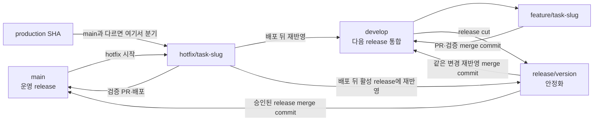
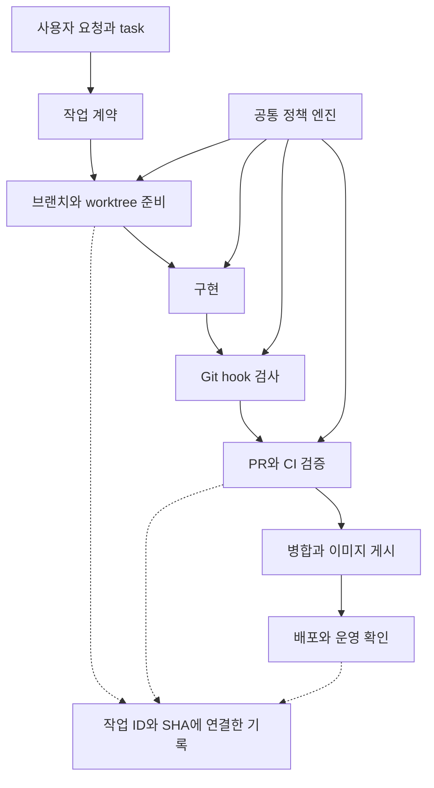

# Git 브랜치 전략과 개발 harness 설계

> 2026-09-25 전달 상태: 현재 checkout은 검토용 `feature/HARN-09-ci-diagnostics`다. 원본 stash와 복구 branch `5957492`, 기존 PR #1/#2를 보존하고 새 Draft PR #3~#8을 생성했다. 실제 분리 범위·검증·선행 관계는 [CI 복구·전달 기록](../../worklog/2026-09-25/git-governance/CI-RECOVERY.md)을 따른다. develop 통합·원격 보호·배포는 미완료다.

- 작성: 2026-09-25. 사용자 요청에 따른 설계 문서화.
- 상태: **설계 적용 및 로컬 harness/CI 일부 구현. worktree별 hook 적용·stash 복구 커밋 완료; develop 원격 생성 완료, 기존 작업 통합·원격 보호는 미완료**.
- 적용 시점: [구현 계획](harness-implementation-plan.md)의 단계별 수용 후 신규 작업부터 적용한다. 이 문서 추가만으로 기존 브랜치·worktree·Git 설정을 변경하지 않는다.
- 범위: Blariyo의 작업 식별, Git 작업, 검증, 인계와 배포 증거 연결. 제품 기능·법무·인프라 공급자 계약을 변경하지 않는다.
- 상위 지침: [AGENTS.md](../../AGENTS.md), [AI 작업 안내](README.md). 현재 상태는 [status](../status.md), 잔여 순서는 [roadmap](../roadmap.md)을 따른다.

## 원문 fixture의 포맷 경계

`apps/collector/src/test/resources/sites/**/*.html`은 parser 입력 데이터이므로 Prettier에서 제외한다. 캡처 바이트·provenance SHA-256·파싱 결과 fingerprint를 기존 Collector 회귀로 검증하며 formatter로 바꾸거나 통과를 위해 기대 hash를 갱신하지 않는다. 2026-09-25 stash 복구에서는 해당 HTML 49개의 원래 바이트를 보존했다. 이 제외는 실행 source의 lint 예외 승인이 아니다.

## 1. 목표와 현재 기준선

Harness는 작업 준비·범위 확인·검증·인계를 실행하는 공통 도구다. Hook은 편집·commit·push 등의 시점에 이 도구를 호출하는 진입점이다.

목표는 작업 ID부터 소스 SHA, 검증 결과와 전달 상태까지 추적하고, 다른 세션에서 같은 작업을 안전하게 재개하는 것이다. 로컬 hook은 빠른 피드백을, CI와 원격 보호 규칙은 병합 전 검증을 담당한다.

2026-09-25 문서화 시작 시 확인한 과거 기준선(아래 표는 당시 관측이며 현재 Git·CI 상태는 §15와 status를 따른다):

| 항목      | 확인 내용                                                                                                                                                        | 증거·한계                                                                                          |
| --------- | ---------------------------------------------------------------------------------------------------------------------------------------------------------------- | -------------------------------------------------------------------------------------------------- |
| Git       | 2026-09-25 구현 확인 시 local `main`=`e51f1b501f7cc327da279102dd69eac2f4c554db`, `origin/main`=`8af72449a7d56c9701efd0d73dc7d430a66f9610`; local 8 commits ahead | `git ls-remote` read-only 결과와 운영 배포 기록 대조. 원격 `develop` 없음                          |
| Worktree  | 현재 checkout과 별도 `feature/m0-core` checkout 존재                                                                                                             | 기존 자원을 자동 이전·삭제하지 않음                                                                |
| CI        | `quality`, `verify`, `collector`, restore scope/conditional schema restore, `harness-gate`, main image publish                                                   | [실행 정의](../../.github/workflows/ci.yml); 원격 실행·required check 보호 미확인                  |
| 복원 검사 | 별도 예약·수동 workflow와 CI의 동일 workflow SHA 조건부 Core restore job                                                                                         | [backup-restore](../../.github/workflows/backup-restore.yml), [CI](../../.github/workflows/ci.yml) |
| 실행 도구 | npm workspace, Node·Java·PostgreSQL 기반 검사; package별 lint와 architecture test 일부 존재                                                                      | [package.json](../../package.json), [검증 안내](../testing/README.md)                              |
| 브랜치    | local/remote feature·planning refs와 dirty linked `feature/m0-core`; `develop` 없음                                                                              | 실제 기준점 선택·branch 이관은 하지 않음; [HARN 계획](harness-implementation-plan.md) 참조         |
| Hook      | `extensions.worktreeConfig=true`; main에만 worktree `core.hooksPath=.git/harness-hooks`                                                                          | main의 네 hook 설치·실행 smoke 통과; dirty `feature/m0-core` worktree에는 hook 설정 없음           |

실행 버전은 package·lockfile·Gradle·workflow에서 읽고, 문서에 적힌 과거 버전을 실행기의 별도 기본값으로 복제하지 않는다.

## 2. 브랜치와 변경 단위

### 2.1 선택과 비용

이번 목표는 `main`·`develop`·`feature/*`·`release/*`·`hotfix/*`를 역할별로 분리하는 Gitflow형 운영이다. 간단한 `main`+짧은 브랜치 안을 기존 기본안에서 교체한다. 선택 근거는 이번 요청에서 요구한 상시 개발 통합선과 출시 안정화선을 분리하는 흐름이다. 저장소에서 동시 release 필요성이 이미 관측됐다는 뜻은 아니다.

이 선택은 release 중 feature freeze와 hotfix 재반영을 명시적으로 다룰 수 있다. 비용은 장기 branch 간 merge, CI 실행, 보호 설정과 branch 정리 책임이 늘어나는 점이다. 따라서 기본은 **동시에 안정화 중인 release 하나**로 제한한다. 실제 병렬 지원 release가 필요해지면 지원 기간·담당·백포트 정책·추가 CI 비용을 결정하기 전까지 새 장기 `support` branch를 만들지 않는다.

### 2.2 역할과 계약

| Branch                     | 시작점                                                                                       | 허용 변경                                                                         | PR 대상·검증                                                                                                                                    | 종료                                                        |
| -------------------------- | -------------------------------------------------------------------------------------------- | --------------------------------------------------------------------------------- | ----------------------------------------------------------------------------------------------------------------------------------------------- | ----------------------------------------------------------- |
| `main`                     | 승인된 `release/<version>` 또는 운영 긴급 `hotfix/*`                                         | 배포 가능한 검증 완료 release만                                                   | PR 필수. 성공한 품질·architecture·앱 검증. `main` SHA에서 production image를 만든다                                                             | 운영 교체·복귀는 실제 배포 기록으로 확인; branch 영구 유지  |
| `develop`                  | 초기 전환 때 사용자가 승인한 검토 baseline; 이후 `main`으로부터 자동 재설정하지 않음         | 다음 release에 들어갈 통합 변경                                                   | 기능·release/hotfix 재반영 PR의 기본 목표. 모든 필수 CI gate                                                                                    | branch 영구 유지; 통합 기준점                               |
| `feature/<task-id>-<slug>` | 최신 `develop`                                                                               | task 하나의 구현·테스트·관련 정본. 일반 fix/refactor/docs도 등록 task 단위로 분기 | PR은 `develop`; 최신 develop와 겹침·충돌을 확인하고 전체 관련 workspace lint·검증                                                               | 병합·미처리 증거 확인 뒤 branch 소유자가 삭제 가능          |
| `release/<version>`        | release cut 시점의 `develop` SHA                                                             | 출시 안정화, 확정된 version·문서, 승인된 release blocker 수정만. 새 기능은 금지   | 일반 task PR은 받지 않음. release 후보 전체 lint·architecture·앱/복원 검증. 완료 후 이 branch를 `main`과 `develop` 양쪽에 merge commit으로 반영 | 양쪽 merge·배포 SHA·release 기록 확인 뒤 소유자가 삭제 가능 |
| `hotfix/<task-id>-<slug>`  | 우선 실제 production SHA; production SHA와 `main`이 동일하고 최신임을 확인하면 `main`도 가능 | 긴급한 운영 결함의 최소 수정과 회귀                                               | 검증 PR을 `main`에 merge. 성공적인 production 배포 뒤 같은 변경을 `develop`과 모든 활성 `release/*`에 각각 merge하고 검증                       | 모든 재반영·운영 증거 확인 뒤 삭제 가능                     |

제품 공통 release version/tag 규약은 현재 확인하지 못했다. Collector의 Gradle `version = 0.1.0`은 해당 산출물 값이므로 전체 제품 버전 근거로 재사용하지 않는다. `<version>`을 release manifest/task에서 승인·고정하고 branch cut 전에 version의 정본·tag·이미지 표기 규칙을 정한다. 규칙 확정 전에는 `(미정)`으로 두고 branch 이름을 임의 채번하지 않는다.



### 2.3 병합·출시 운영

- 모든 공유 branch integration은 merge commit을 기본으로 한다. Shared branch history를 squash/rebase/force-push하지 않는다. 단일 unpublished feature 내부 수정은 공유 전 정리할 수 있지만 task evidence와 base SHA를 다시 확인한다.
- feature는 작업 도중 최신 `develop`을 merge하고, 기능을 release에 실을지는 release owner가 scope freeze 시 판단한다. 빠진 feature는 `develop`에 남아 다음 release를 기다린다. 출시 안정화 중 편의를 위해 feature 전체를 release에 끌어오지 않는다.
- release cut은 등록 task·manifest, `develop` SHA, 버전 정본, 포함·제외 목록, 필수 lint·architecture·앱·migration/restore 결과와 복귀 SHA를 기록한 뒤 진행한다. branch cut은 worktree/CI만으로 release 승인을 뜻하지 않는다.
- release 수정은 PR로 검토하고 기존 release scope 안의 blocker만 허용한다. 수정은 release에서 `main`과 `develop`으로 모두 전파한다. merge conflict는 대상 branch의 실제 소스·현재 작업을 읽고 사람이 해결하고, 영향 검사를 재실행한다. 자동 rebase/reset이나 결과를 숨기는 선택적 cherry-pick을 하지 않는다.
- 기본 활성 release는 하나다. 동시에 서로 다른 버전을 지원해야 하면 각 release 소유자·지원 종료·backport 방향·CI 비용을 승인된 계획에 기록한 뒤 병렬 허용 여부를 재검토한다. 이 조건 전에는 `support`나 다중 장기 release를 만들지 않는다.
- hotfix는 확인한 production SHA에서 분기해 최소 변경을 만든다. `npm run harness -- start-hotfix <task-id> --slug <slug> --production-sha <full-sha> --path <absolute-path>`는 manifest·전체 commit ID·`main` 조상 관계를 확인한 뒤 해당 SHA에서 격리 worktree를 만든다. 이 검사는 provider의 실제 production 배포 SHA를 조회하지 않으므로 작업자가 배포 기록과 SHA를 대조해야 한다. 검증 PR을 `main`에 merge하고 실제 배포를 확인한 뒤 `develop`과 활성 release branch에 각각 merge한다. 동일 변경이 이미 포함됐는지 SHA·diff로 판정하고, 누락이면 재반영 PR을 열어 둔다. 충돌을 이유로 재반영을 생략하지 않는다.
- `npm run harness -- merge-back-check <release-or-hotfix-branch>`는 release의 `origin/main`·`origin/develop` 반영과 hotfix의 `origin/main`·`origin/develop`·설정된 `activeRelease` remote-tracking ref 반영을 source commit ancestry로 읽기 전용 검사한다. 실행 전 `git fetch origin`으로 remote-tracking refs를 갱신해야 하며, 이 검사는 provider 상태·required checks·production 배포·branch 보호를 증명하지 않는다.
- 기능별 커밋을 유지한다. CI·검토·운영 기록에서 PR base branch와 merge SHA를 연결하며 이름만으로 branch 목적을 추론하지 않는다.
- `office`, `planning-design-only`, `feature/m0-core`, `feature/m0-core-web` 등 기존 local/remote branch와 worktree는 새 정책으로 자동 변경·삭제·재작성하지 않는다. 전환 때 각 브랜치의 base, 고유 commit, dirty/untracked 파일, owner를 inventory해 `develop` PR·보존·별도 종료 중 처리 방안을 정한다.

### 2.4 신규 task 기본 흐름

1. task를 정본에 등록하고 task ID를 확인한다.
2. `develop` 존재·접근·기준 SHA·작업 트리를 확인한다. local branch는 policy의 승인 bootstrap SHA에서 시작해야 하며, 작업 시작 전 `origin/develop`과 동일해야 한다. 빠진 remote ref는 BLOCKED로 보고하고 자동 생성·push하지 않는다.
3. `feature/<task-id>-<slug>` branch/worktree를 `develop` 기준으로 준비한다.
4. 전체 적용 lint와 영향 architecture·application 검증을 실행하고 결과를 실제 SHA에 연결한다.
5. `develop` 대상 PR에서 필수 CI를 통과한 뒤 merge commit으로 반영한다.
6. release scope 결정 때 포함할 feature를 선택한다. freeze 뒤 기능은 다음 release로 남긴다.

커밋 메시지 제안:

```text
feat(web): 등록 task에 따른 기능 변경

Task-Id: <등록된 task ID>
Change-Id: <등록된 변경 ID>
```

`Change-Id`는 harness가 생성·등록하는 기술 식별자다. 제품·화면 ID를 새로 채번하는 기능은 아니다. 자동 merge 메시지의 형식 예외는 허용할 수 있지만, 최종 소스·비밀·필수 검증을 면제하지 않는다.
feature/hotfix branch의 `Task-Id`는 branch task ID와 같아야 한다. staged 검사는 manifest의 `allowedPaths`를 적용하고, PR 범위 검사는 base SHA에 등록된 trusted manifest를 사용해 변경 파일 전체를 다시 판정한다. 정책·task manifest 수정은 일반 task PR에서 차단하고 별도 governance review로 분리한다.

## 3. 정본과 실행 구조



| 자산                                             | 역할                                                                                                                                                                                                                                                                |
| ------------------------------------------------ | ------------------------------------------------------------------------------------------------------------------------------------------------------------------------------------------------------------------------------------------------------------------- |
| 이 문서                                          | 개발 흐름·판정 계약·선택 이유의 정본                                                                                                                                                                                                                                |
| `docs/planning`, `docs/system-design`, 개발 명세 | 제품·기술 요구사항의 기존 정본; harness가 복제하거나 대체하지 않음                                                                                                                                                                                                  |
| `.harness/policy.json` — 구현됨                  | branch role·PR 방향·commit trailer 계약 입력. schema validation은 보강 필요                                                                                                                                                                                         |
| `.harness/tasks/<task-id>.json` — 구현됨         | HARN 로컬 task manifest, staged/PR allowlist, 사전 등록 `changeIds`; CI job receipts는 같은 binding hash를 포함                                                                                                                                                     |
| 공통 CLI·정책 엔진 — 부분 구현                   | doctor·staged/range/pre-push·PR 방향·develop 기준 확인 task start·release/hotfix merge-back check·hook 설치·고정 verify·task/resource advisory lease·로컬 evidence/ready/handoff·CI event-context·job receipt 처리; 작성 session heartbeat·원격 receipt 확인은 대기 |
| AGENTS·CLAUDE·GEMINI 진입 파일                   | 정본으로 안내하는 얇은 포인터. 별도 정책 복사본을 만들지 않음                                                                                                                                                                                                       |

문서와 실행 정책이 어긋나면 자기검사가 지적하고 해당 규칙을 수정한다. 코드에 이미 있다는 이유로 제품 정본을 자동 변경하지 않는다. 새로운 정책은 규칙 ID·이유·적용 범위·검사·복구 방법을 함께 등록한다.

## 4. 식별자와 작업 계약

| 필드         | 의미                               | 수명                              |
| ------------ | ---------------------------------- | --------------------------------- |
| `repoId`     | Blariyo 저장소 식별                | 폴더 위치와 무관하게 유지         |
| `taskId`     | 기존에 등록된 해야 할 일           | 세션·AI 변경 후에도 유지          |
| `changeId`   | 하나의 PR로 검토할 변경 묶음       | task를 여러 PR로 나누면 각각 발급 |
| `worktreeId` | 로컬 실제 작업 공간; CI에서는 null | 공간 재생성 시 변경               |
| `runId`      | 개별 실행·검증                     | 실행마다 새로 발급                |

Task manifest에는 `schemaVersion`, `taskId`, `taskRef`, 정본·수용 조건 참조, 허용 경로, 검증 profile, `changeIds` 목록을 둔다. Change ID는 구현 commit 전에 manifest 변경으로 등록하고 commit trailer가 등록 값과 같아야 한다. 제품 요구사항·날짜별 상태·비밀을 복제하지 않고 임의 shell 명령을 저장하지 않는다. 신규 task는 task 문서에 등록한 뒤 연결한다.

실행 기록에는 사용한 manifest hash와 정책 hash를 함께 남긴다. manifest를 바꿔 범위나 검증을 넓히거나 줄였으면 변경 이유를 검토하고 관련 증거를 다시 평가한다. 에이전트가 통과를 위해 허용 범위를 자동 확대하지 않는다.

단일 변경 manifest의 `taskId`·`changeId`와 CI 집계 증거를 구분한다. 집계 증거는 `changeBindings` 배열의 각 항목에 `taskId`, `changeId`, `taskManifestHash`, 해당 변경의 commit SHA 목록을 묶는다. 여러 PR이 포함된 main 실행을 임의의 한 task에 귀속하지 않는다. CI의 임시 checkout은 `checkoutId`로 식별하며 로컬 `worktreeId`를 만들어 넣지 않는다. 이벤트별 연결 기준은 §9.1을 따른다.

기존 [제품 task 17개](../implementation-tasks/README.md)와 [harness 구현 task](harness-implementation-plan.md)는 별도 묶음이다. 예시 `UX-01`을 사용해도 해당 제품 작업이 착수·완료된 것은 아니다.

## 5. 상태와 권한

| 상태 축 | 기록                                              | 근거                            |
| ------- | ------------------------------------------------- | ------------------------------- |
| 작업    | 대기·진행·차단·완료                               | task별 수용 조건                |
| 검증    | 미실행 또는 §8의 검사 결과                        | 대상 소스·환경·실행 결과        |
| 승인    | 허용 행위·대상·범위·요청 근거                     | 사용자 요청 또는 실제 검토 기록 |
| 전달    | commit·push·merge·이미지 게시·배포·운영 확인 각각 | Git·원격 CI·배포·readback 증거  |

- `ready`는 PR 준비 결과이며 제품 task의 완료나 운영 승인이 아니다.
- 테스트 통과, push 요청, 검토 확정, 배포와 QA는 서로 대신하지 않는다.
- 이미 받은 승인은 동일한 대상·범위에서 재사용한다. 단순한 도구 경계를 이유로 반복 확인하지 않는다.
- 에이전트가 manifest에 `approved: true`를 쓰거나 커밋에 `Local-Test: Y`를 넣는 것만으로 승인·통과를 만들 수 없다.
- commit·push·merge·삭제·배포·외부 전송은 기존 AGENTS와 해당 사용자 요청의 권한 범위를 따른다. `start`는 원격 브랜치를 자동 push하지 않는다.
- 배포·QA 표시는 실제 SHA·digest의 사건 기록으로 남긴다. 표시만을 위한 빈 커밋을 기본 경로로 사용하지 않는다.

## 6. Worktree·동시 작업·재개

1. `start`는 기존 변경과 task 등록을 확인하고 기준 commit SHA를 고정한다. 원격 기준선은 실제 fetch/조회 시각과 로컬 추적 참조를 구분한다.
2. 설정 가능한 저장소 바깥 worktree 루트에 작업 공간을 만든다. 고정 절대경로를 공유 정책에 넣지 않는다. 저장소 안 경로를 선택하면 Git 제외와 재귀 탐색 제외를 함께 검증한다.
3. 활성 작성자는 worktree당 하나다. 같은 task·변경 경로의 중복 작업을 탐지한다. 서로 다른 worktree에서 같은 파일을 수정할 수는 있지만 통합 순서와 충돌 책임을 명시한다.
4. 포트·임시 DB·미디어·결과 폴더를 작업별로 배정한다. 현재 고정 포트에 의존하는 테스트는 먼저 직렬 실행하며 자동 격리가 구현됐다고 가정하지 않는다.
5. 소유권은 lease(기간이 있는 사용권 기록)로 관리한다. 갱신 중단만으로 프로세스 종료·잠금 강탈·폴더 삭제를 하지 않는다. PID만 믿지 말고 실행 ID·작업 공간·실제 상태를 확인한다.
6. `resume`은 기록된 HEAD·소스 hash·policy·자원 소유권과 현재 상태를 비교한다. 차이를 표시하고 영향받는 검증을 다시 요구한다.
7. 종료·정리는 자신이 만든 임시 자원만 대상으로 한다. 기존 DB·볼륨·사용자 파일·다른 실행 결과를 지우지 않는다.

로컬 lease는 같은 PC·checkout 계열의 충돌만 조정한다. 다른 PC까지 전역 잠금이 된다고 주장하지 않는다. 다중 PC 조정은 명시적으로 공유된 task/PR 기록을 사용한다.

새 worktree에는 미추적 설정·의존성·테스트 자원이 자동 준비되지 않는다. 준비 과정은 명시된 비운영 profile과 기존 안전한 로컬 실행기를 사용하며 운영 자격증명을 일괄 복사하지 않는다. `skip-worktree`를 비밀 보호 수단으로 도입하지 않는다.

## 7. Hook과 설치 계약

| 진입점                 | 대상                                                   | 실패 시                                                                  |
| ---------------------- | ------------------------------------------------------ | ------------------------------------------------------------------------ |
| AI 작업 시작·편집 전   | task·정본·허용 경로·보호 경로                          | 지원되는 도구에서 조기 안내·차단                                         |
| `pre-commit`           | 실제 index의 내용·모드·경로, task 범위, 비밀·충돌 흔적 | commit 차단                                                              |
| `commit-msg`           | 메시지 형식, 등록 task/change와의 일치                 | commit 차단                                                              |
| `pre-push`             | stdin의 모든 목적지 ref·전송 SHA와 전송 이력의 비밀    | 직접 main push, 금지된 삭제·이력 덮어쓰기, 비밀 발견·필수 검증 누락 차단 |
| `post-commit`          | 생성된 commit SHA와 실행 기록의 연결                   | 기록 오류 보고; commit 성공을 실패로 바꿔 보고하지 않음                  |
| `post-checkout` — 선택 | 변경된 작업 정보·환경 안내                             | 차단 없이 재확인 안내                                                    |

- 공통 엔진을 호출하는 얇은 wrapper로 구현한다. 경로 정책·사용자 목록을 hook마다 복제하지 않는다.
- 부분 staging에서는 파일 시스템의 최신 파일이 아니라 Git index를 읽는다. `GIT_INDEX_FILE` 등 Git이 전달한 문맥도 존중한다.
- `post-commit`은 `.git/harness-post-commit.jsonl`에 commit SHA·branch·task/change ID·시각만 기록한다. 외부 전송·추가 commit은 하지 않으며 기록 실패는 stderr로 알리고 이미 생성된 commit의 성공 상태를 바꾸지 않는다.
- 파일 목록은 NUL 구분 등 안전한 방식으로 읽고 공백·한글·rename·삭제·symlink·경로 이탈을 다룬다.
- hook에서 포맷 수정·`git add`·stash·reset·fetch·외부 발송·배포를 자동 실행하지 않는다. 필수 검사기 누락은 성공 종료하지 않는다.
- pre-commit은 빠른 정적 검사로 한정한다. build·DB·브라우저 전체 검사는 명시적 `verify`와 CI에서 실행한다.
- push 검사에는 작업 폴더의 dirty 내용이 아니라 실제 전송 SHA의 증거가 필요하다. 작업 브랜치명만 검사해 `HEAD:main` 전송을 놓치지 않는다.
- merge로 승인된 main 변경을 가져오는 것과 사람이 충돌을 해결한 변경을 구분한다. 부모 중 하나와 같다는 이유만으로 출처가 불명확한 변경까지 면제하지 않는다. 최종 비밀·정책·테스트 검사는 유지한다.
- `git user.email`은 로컬 식별 보조값이며 권한 인증 수단이 아니다.
- AI hook은 셸·다른 편집 도구를 포함한 모든 쓰기를 보장해 통제하지 못한다. 지원 기능은 도구별로 확인하고 Git·CI 검사를 공통 최종 경계로 둔다.

### 7.1 전송 이력의 비밀 검사

최종 SHA의 앱 테스트와 전송 이력의 비밀 검사는 별도 필수 검사다. 앞선 commit에 비밀을 넣고 마지막 commit에서 삭제했어도 이전 객체는 전송될 수 있으므로 최종 tree 검사만으로 push를 허용하지 않는다.

| push 입력                                 | 검사 범위·판정                                                                                                                                                  |
| ----------------------------------------- | --------------------------------------------------------------------------------------------------------------------------------------------------------------- |
| 기존 ref 갱신                             | hook stdin의 remote old OID와 local new OID를 고정하고 `old..new`에 해당하는 모든 부모 경로의 commit·내용을 검사; first-parent나 최종 diff만 사용하지 않음      |
| 새 ref — remote OID가 모두 0              | new에서 도달 가능한 전체 이력을 기본 검사. 제외하려면 동일 scanner·정책으로 검사된 객체 집합의 증거가 있어야 하며, `origin/main`이라는 이름만으로 제외하지 않음 |
| 다중 ref                                  | 모든 입력의 검사 집합을 합치고 중복 객체만 제거. 한 ref라도 실패하면 push 전체 차단                                                                             |
| tag                                       | commit을 가리키는 lightweight/annotated tag의 도달 이력과 annotated tag 메시지 검사. commit으로 해석할 수 없는 tag·지원하지 않는 객체 유형은 명시적 차단        |
| 삭제 — local OID가 모두 0                 | 새 전송 이력 없음과 삭제 권한 판정을 분리; 다른 ref의 검사는 계속 수행                                                                                          |
| old 객체 부재·shallow 이력·객체 읽기 실패 | 범위를 증명할 수 없으면 BLOCKED/ERROR. hook에서 fetch하지 않고 사전 이력 준비 후 재시도 안내                                                                    |

현재 구현은 branch 외 `refs/tags/*`·기타 ref 전송을 block한다. 제품 release tag/version 정책이 `(미정)`이라 scanner가 tag 이력을 검사하더라도 tag push를 허용하지 않는다.

commit 메시지와 각 commit의 파일 내용까지 검사하며, 삭제된 중간 비밀도 탐지해야 한다. 증거에는 ref별 old/new OID, 검사한 객체 집합 hash·개수, scanner/정책 버전과 결과를 남긴다. 비밀 원문은 로그·artifact에 남기지 않는다. 범위가 실제로 비어 있음이 확인된 경우에만 사유 있는 NOT_APPLICABLE로 처리한다.

CI도 §9.1의 고정 이력 범위를 다시 검사해 병합을 차단한다. 다만 CI는 push 이후 실행되므로 이미 원격에 전송된 비밀 노출을 예방하거나 되돌리는 수단이 아니다. 로컬 hook 역시 우회 가능하며, 원격 전송 전 강제 차단 기능은 서버 지원 여부를 따로 확인해야 한다. stdin·0 OID의 의미는 [Git pre-push 계약](https://git-scm.com/docs/githooks#_pre_push)을 따른다.

### 7.2 지정 worktree 설치·복원

기본 설치 범위는 **명시적으로 지정한 worktree 하나**다. 공유 `core.hooksPath`나 전역 설정을 바꿔 다른 worktree에 자동 적용하지 않는다. 기존 hook 파일을 덮어쓰지 않고 대상 worktree에서만 연결한다.

1. 전체 worktree 목록과 유효한 hook 경로·설정 출처·원본을 읽고 백업한다. `.git` 파일/디렉터리를 모두 지원하며 Git이 알려주는 경로를 사용한다.
2. `extensions.worktreeConfig` 지원과 CLI·GUI가 사용하는 Git의 호환성을 확인한다. 처음 활성화할 때 공유 설정에 있던 `core.worktree`·`core.bare`의 이관과 기존 worktree별 설정 영향을 먼저 검토한다. 이 확장은 저장소 공통 변경이므로 영향 범위를 설치 보고에 표시한다. 접근 불가능한 worktree나 호환성 미확인 환경 때문에 보존을 확인할 수 없으면 BLOCKED로 남긴다.
3. 대상에만 `git config --worktree core.hooksPath`를 적용한다. 확장 미지원 시 저장소 공통 설치로 조용히 전환하지 않는다. 설정 공유·이관 규칙은 [Git worktree 설정 계약](https://git-scm.com/docs/git-worktree#_configuration_file)을 따른다.
4. hook 선택 경로는 브랜치 전환으로 사라지지 않는 로컬 dispatcher에 연결한다. dispatcher는 원래 hook의 호출 순서·실패 결과를 보존하고 wrapper/runner 버전을 확인한다. 대상 branch에 필수 runner가 없으면 성공 종료하지 않는다. 재설치는 중복 연결·호출 순환을 만들지 않는다.
5. 설치·제거 전후 대상과 비대상 worktree의 실제 hook 선택·동작을 비교한다. 제거 시 대상의 기존 설정 유무·값·연결을 복원한다. 다른 worktree가 사용하는 공통 확장이나 설치 후 생긴 설정을 삭제하지 않는다. 확장·이관까지 되돌릴 때는 전체 사용 상태를 확인하고 이번 설치의 변경만 복원한다.

`doctor`는 파일 존재, 실행권한, 실제 hook 선택 경로, wrapper 호출 대상·버전과 임시 저장소에서의 동작 검사를 구분한다. 설치·복구·제거는 백업된 기존 설정과 연결 상태를 복원할 수 있어야 한다.

## 8. 검증 profile과 결과 계약

### 8.1 결과

| 값               | 뜻                                  | 필수 검사인 경우                |
| ---------------- | ----------------------------------- | ------------------------------- |
| `PASS`           | 실제 검사했고 조건 만족             | 통과                            |
| `FAIL`           | 실제 검사했고 조건 위반             | 차단                            |
| `NOT_APPLICABLE` | 신뢰된 변경 분류에서 적용 대상 아님 | 이유·정책 규칙이 있을 때만 허용 |
| `BLOCKED`        | 필요한 입력·환경이 없어 미실행      | 차단                            |
| `ERROR`          | 검사기 오류·timeout·잘못된 입력     | 차단                            |

검사 전에는 미실행으로 표시한다. 검사 대상 0개·입력 파일 부재·필수 report 누락을 자동 PASS로 처리하지 않는다. 외부 서비스 장애 때문에 검증하지 못한 상태도 통과가 아니다.

### 8.2 영향 범위

현재 구현과 미적용 범위를 구분한다. root `lint:all`과 전용 quality CI job이 생겼고, 이 job은 CI branch trigger에서 실행되며 main image 게시 job의 선행 조건이다. 로컬 `verify`는 task manifest가 허용하는 고정 npm 명령만 실행해 checkout 증거를 저장한다. CI `event-context`는 각 이벤트의 비교 SHA·실행 문맥·작업 경로의 non-merge commit별 Task-Id/Change-Id를 등록 manifest와 대조하고 hash를 남긴다. 원격 필수 check 보호는 아직 적용되지 않았다.

| 현재 코드·설정                                                                                                           | 현재 CI 증거                                                                                             | 설계상 한계                                                                                            |
| ------------------------------------------------------------------------------------------------------------------------ | -------------------------------------------------------------------------------------------------------- | ------------------------------------------------------------------------------------------------------ |
| API/Web/contracts ESLint, root scripts/tests TS lint, scripts/tests 전체 `.mjs` lint, harness 전용 `lint:harness`        | `quality` job은 `lint:harness`와 `lint:all`을 실행                                                       | contracts는 여전히 `src/index.mjs`; TS declaration/generated contract 검증은 별도 보강 필요            |
| Python `deploy/`, `scripts/`, `tools/`                                                                                   | Ruff 0.16.9 (`E9`, `F`); undefined names supplied dynamically by remote wrapper are line-specific `noqa` | Ruff passes; broader style rules await baseline review                                                 |
| SQL migrations                                                                                                           | PostgreSQL SQLFluff 4.3.0, core/layout rules                                                             | 434 legacy findings across 17 files; exact finding baseline candidate is generated but unapproved      |
| Active Shell scripts                                                                                                     | ShellCheck 0.11.0 binary pinned by archive SHA-256                                                       | one active script; passes after quoting/empty `CDPATH` correction                                      |
| Markdown and Web CSS                                                                                                     | markdownlint-cli2 0.23.3; Stylelint 17.15.0                                                              | Markdown: 0 findings; CSS: 0 findings; exact candidate remains unapproved                              |
| GitHub Actions YAML and other YAML                                                                                       | actionlint 1.7.12 checks both workflow files; generic YAML linter absent                                 | actionlint passes; other YAML files are not covered by a generic schema/lint tool                      |
| Collector main/test Java·Checkstyle 14.1.0; trailing space·tab·EOF newline 중심 제한 규칙                                | `quality` job이 `lint:all`을 통해 실행                                                                   | 현재 규칙은 초기 style subset이며 import/style debt 전체 검사는 아님                                   |
| `tests/architecture.test.ts`, API `architecture.service.test.ts`, Collector Java package checks, Web/contracts AST graph | `test:architecture`가 quality job에서 독립 실행                                                          | 9개 architecture test; reflection·외부 동적 edge와 workspace dependency manifest 검증은 추가 보강 필요 |
| Prettier 3.9.6 root dependency와 `.lintstagedrc`의 `--write`                                                             | `lint-debt.mjs`가 `prettier --list-different .`를 read-only 대조                                         | 저장소 전체 포맷 완료, `format:check` 통과; 미포맷 파일 0개                                            |

실제 앱·도구에서 확인되는 언어는 TypeScript/JavaScript/MJS/Vue, Java, Python, SQL, shell, CSS, Markdown, JSON, YAML, Gradle Kotlin DSL 등이다. worklog·정적 프로토타입·fixture·생성물은 실행 제품 source와 별도 분류한다. 확장자 수만 세거나 디렉터리 이름만으로 실행 범위를 정하지 않는다.

#### 언어별 현재 적용과 목표

| 언어·파일 묶음                                                  | 현재 검사                                                                                                                                                                            | 목표 적용                                                                                                                                   |
| --------------------------------------------------------------- | ------------------------------------------------------------------------------------------------------------------------------------------------------------------------------------ | ------------------------------------------------------------------------------------------------------------------------------------------- |
| TypeScript/JavaScript/MJS/Vue — API/Web/contracts/scripts/tests | `lint:all`이 기존 package ESLint와 root TS·일반 `.mjs` glob을 실행; contracts AST 경계 검사는 `.d.ts`/`.d.mts` import도 확인                                                         | 선언 생성 결과 parity·전체 report/config fingerprint와 format check 보강                                                                    |
| Java — Collector main/test                                      | Checkstyle 14.1.0의 제한된 공백·파일 규칙을 `qualityStyle`로 실행                                                                                                                    | 규칙 baseline·Java dependency/package lint 추가; main/test 214개 파일 대상                                                                  |
| Python — `deploy/`, `scripts/`, `tools/`                        | Ruff 0.16.9 (`E9`, `F`) CI 연결; 동적 wrapper 주입 2곳은 line-specific 설명 주석                                                                                                     | broader style rules와 type checking은 미적용                                                                                                |
| SQL — 저장소 전체 `.sql` 27개                                   | PostgreSQL SQLFluff 4.3.0이 migration·배포·콘텐츠 SQL 전체를 검사; 현재 위반 0건                                                                                                     | 신규 SQL도 전체 scope에서 검사; 이미 적용된 migration의 기존 ledger hash만 명시 호환하고 미등록 checksum은 차단                             |
| Shell — 운영·개발 active script                                 | ShellCheck 0.11.0 전체 1개 파일 검사 통과                                                                                                                                            | 새 script가 대상 0으로 빠지지 않도록 scope inventory 확인                                                                                   |
| CSS — Web app stylesheet                                        | Stylelint 17.15.0 전체 2개 source 검사; whitespace·range 표기 정리 후 0 findings                                                                                                     | specificity cascade를 확인하고 신규 CSS도 계속 검사                                                                                         |
| Markdown                                                        | markdownlint-cli2 0.23.3 전체 145 product/docs Markdown 파일 검사; 현재 0 findings. MD024는 반복 API endpoint template에 맞춰 형제 제목만 검사. `worklog/`와 session transcript 제외 | 기준 문서의 상대 링크 검사도 별도 유지                                                                                                      |
| JSON/YAML                                                       | Prettier `--check` 실행; 두 GitHub workflow는 actionlint 1.7.12 통과                                                                                                                 | 일반 YAML schema lint는 미적용; JSON/YAML schema별 validator 추가 대기                                                                      |
| Gradle Kotlin DSL·XML·HTML·Dockerfile                           | Gradle/build·브라우저/build 검사는 일부; 전용 linter 없음                                                                                                                            | 사용 경로를 HARN-06에서 inventory. HTML prototype, generated/legacy, build-only 형식을 각각 구분하고 미선택은 `(미정)`과 미적용 이유로 기록 |

다국어 lint 도구는 package/config와 CI 진입점에 연결됐다. Checkstyle 14.1.0은 Gradle lockfile, npm 도구·Python requirement·ShellCheck/actionlint native archive는 정확한 버전으로 고정한다. 도구·대상 0개·실행 불가·필수 report 누락은 `BLOCKED`/`ERROR`이며 lint 성공으로 대체하지 않는다. SQLFluff는 저장소 전체 SQL 27개를 검사하고 현재 finding은 0건이다. CSS·Markdown·Prettier finding도 0건이다. 예외 baseline이 없어도 전체 finding이 0건이면 통과하며, 하나라도 있으면 승인 baseline이 없을 때 차단한다.

현재 full lint의 native tool 설치기는 `darwin-arm64`와 `linux-x64`만 지원하며 CI quality job은 Ubuntu에서 실행한다. Windows job은 lease 회귀만 돌고 Windows full lint는 지원·검증되지 않았다. 일반 YAML schema와 Gradle Kotlin DSL 전용 lint도 없다.

Markdownlint MD024는 `siblings_only: true`를 적용한다. 개발 명세는 여러 API endpoint마다 Request/Response 같은 같은 이름의 하위 섹션을 반복하므로 부모 endpoint가 다른 중복은 허용하되, 한 API 섹션 안의 중복 heading은 계속 차단한다.

#### Lint·formatter·예외 계약

- `npm run lint:all`은 로컬·CI 공통 진입점이며 API/Web/contracts, scripts/tests, Collector Java, deploy/tools Python, 저장소 전체 SQL, active shell, Web CSS, Markdown, Actions workflow를 전체 검사한다. 대상 0개는 실패한다. `scripts/quality/lint-debt.mjs`가 Prettier `--list-different`를 포함해 SQL/CSS/Markdown/format legacy finding을 검사하며 source를 고치지 않는다. 사용자가 전체 포맷을 요청해 2026-09-25 비보호 파일을 포맷했고 `npm run format:check`가 통과한다. Prettier는 migration과 hash-locked OpenAPI/generated contract 파일을 계속 제외한다. SQL migration은 SQLFluff 스타일로 정리하고 원본·현재 SHA-256을 migration evolution contract에 남겼다. API·Collector·콘텐츠 runner는 이미 기록된 구 checksum만 전환 호환하고 미등록 checksum은 거부한다. 별도 format 확인 명령도 read-only로 유지한다.
- Linter는 규칙 위반과 source 정적 문제를 판정한다. Formatter는 공백·정렬 등 표현을 정리한다. CI·hook은 source를 고쳐 저장하지 않는다. 자동 수정은 사용자가 명시한 `format` 명령에서만 하고, 결과를 다시 lint·diff한다. 기존 `.lintstagedrc`의 `--fix`/`--write` 항목만으로 자동 hook이 활성화됐다고 주장하지 않는다.
- 전체 기존 codebase를 새 규칙에 한 번에 clean이라고 가정하지 않는다. `scripts/quality/lint-debt.mjs --draft`는 SQL·CSS·Markdown·format 위반을 정확한 path, line/rule/message, source/config hash, tool version별 fingerprint로 `.quality/baseline.candidate.json`에 기록한다. 최초 초안에는 SQL 434건이 있었다. 이후 사용자가 과거 migration 정리를 결정해 저장소 SQL 27개를 lint·수정했고 현재 SQL·CSS·Markdown·format finding은 0건이다. SQL migration의 기존/current SHA-256과 구 ledger 허용 해시를 계약에 기록한다. 초안의 항목은 owner/reason/expiry가 비어 있고 상태가 `draft-needs-review`이므로 예외 승인으로 사용할 수 없다. 승인 baseline은 위반별 사유·owner·expiry를 요구하고 신규·만료 finding 및 파일·설정 hash 변경을 차단한다. finding이 0건일 때만 예외 baseline 없이 통과한다. 이미 사라진 stale 항목은 gate를 막지 않으며 정리 권고를 출력한다.
- CI는 PR 대상 base SHA의 `.quality/baseline.json`만 신뢰한다(`LINT_BASELINE_SHA`). PR이 후보 코드와 baseline을 함께 바꿔 자기 예외를 승인할 수 없다. linter 버전·설정 hash는 baseline 정책과 같아야 한다. finding이 있으면 baseline 부재, 불일치, 만료, 새 위반은 실패한다. finding이 0건이면 예외 baseline 없이 통과한다. baseline 예외 승인을 위한 원격 code-owner 보호는 아직 적용 전이며, 현재 0건 candidate를 approved로 승격하지 않았다.
- **신뢰 한계:** 현재 `quality` job은 event subject checkout에서 workflow, `lint-all`, `lint-debt`, architecture test와 설정을 실행한다. 기준 branch의 baseline JSON을 읽는 사실만으로 검사기 자체가 신뢰되는 것은 아니며, PR이 workflow·검사기·설정을 함께 바꾸면 같은 PR에서 enforcement를 약화할 수 있다. 따라서 HARN-05의 로컬/workflow 연결은 구현됐지만 governance 파일 변경 보호는 미완료다. 원격 ruleset이 trusted-ref required workflow 또는 base 기준 code-owner review를 강제하고 실제 설정 readback을 마칠 때까지 원격 강제 완료로 판정하지 않는다.

#### 구조 규칙과 architecture 검사

`npm run test:architecture`를 독립된 고정 CI check로 실행한다. 기존 [M0 코드 구조 계약](../system-design/08-code-structure.md)의 실제 layer 책임을 이어받는다. 목표 edge는 `apps/web → HTTP 및 packages/contracts`, `apps/api ↔ 그 외 앱 source 직접 참조 금지`, `apps/collector ↔ 그 외 앱 source 직접 참조 금지`, `apps/{api,web} → packages/contracts`, `packages/contracts → apps/* 역참조 금지`다. 검증 도구·scripts·tests의 source 참조는 제품 runtime edge와 분리한다.

API 내부는 `features` business service의 구체 persistence·driver 직접 접근 금지, `features` 상호 참조는 code-structure 계약의 collection→posts/images와 posts→images만 허용, `shared`의 상위 layer 참조 금지, runtime cycle 금지를 검사한다. Controller·Service·Repository port/adapter와 transaction/HTTP layer 경계는 기존 system-design §2에 적힌 소유권을 기준으로 한다. Collector는 package 선언·실제 import와 dependency graph를 읽어 `shared/config/run/source/core/spool/execution/web/discord/scheduling/ops` 간 code-structure 계약 및 site module 고립을 검사한다.

정적 검사는 TypeScript AST 및 실제 `import`/`export`/`require`/동적 import 해석, workspace/package export 경로와 alias, Vue script를 분석한다. Java는 package/import를 source tree와 비교하고 Gradle dependency graph를 대조한다. 정규식으로 디렉터리명만 비교하는 검사로 끝내지 않는다. reflection, 문자열 기반 class loading, 생성 코드 등 자동 해석할 수 없는 경로는 명시 규칙·수동 검토 대상이며 의존 관계가 모호하면 PASS 대신 BLOCKED다. 위반 예외는 lint baseline과 동일하게 정확한 대상·사유·owner·기한으로 한정한다.

| 변경                                               | 검증 profile                                                                       |
| -------------------------------------------------- | ---------------------------------------------------------------------------------- |
| 일반 설명 문서                                     | 전체 정본 Markdown lint/format-check·상대 링크·diff, 미정/출시 차단 항목 보존 검토 |
| API                                                | build·workspace 전체 lint·architecture·단위·관련 PostgreSQL 통합                   |
| Web                                                | build·typecheck·workspace 전체 lint·architecture·관련 브라우저                     |
| Collector                                          | 전체 main/test Java lint·architecture·`test:collector`·Gradle build와 DB readback  |
| 공유 계약·migration                                | 소비 앱 전체·계약·migration·호환성                                                 |
| scripts·deploy tools·harness·CI·의존성·미분류 경로 | language inventory에서 고른 전체 lint·architecture·기본 검사와 harness 회귀        |

문서 확장자나 `docs/` 경로만으로 검사를 줄이지 않는다. `docs/migration/`의 계약 입력, 실행 명령·생성기 입력·보안 정책 변경은 영향 범위를 별도로 판정한다. 삭제·rename 양쪽 경로와 전이 의존성을 포함하고, 모르면 전체 검사로 돌아간다.

초기에는 전체 package/workspace lint와 architecture 검사를 branch gate에 연결한다. 전체 검사를 path 기반으로 줄이는 최적화는 비교 실행으로 누락이 없다는 증거를 확보한 뒤 켠다. migration·복구 관련 변경은 §9.2의 조건부 restore job을 PR/main/develop/release gate에 연결한다. 기존 예약·수동 복원 workflow는 운영 점검으로 유지하며 다른 SHA의 결과로 변경 검증을 대신하지 않는다.

Harness의 `.mjs`는 기존 TypeScript 전용 test/lint glob에 포함된 것으로 간주하지 않는다. HARN-01에서 `test:harness`와 `lint:harness`를 추가해 `tests/harness/*.test.mjs`, `scripts/harness/**/*.mjs`와 harness 테스트 파일을 명시적으로 검사한다. HARN-05의 필수 `harness` job은 두 명령을 실행하고 실제 실행 테스트 수가 0이거나 report가 없으면 실패한다. `.mjs` lint·실행 테스트와 TypeScript typecheck의 검증 범위는 구분한다.

### 8.3 증거 필드와 유효성

검증 기록의 최소 필드:

```text
schemaVersion, repoId, runId, worktreeId (CI에서는 null)
changeBindings [{ taskId, changeId, taskManifestHash, commitShas }]
executionContext { kind, event, providerRunId, jobId, attempt, checkoutId }
subjectKind (index | commit | merge-result | runtime)
subjectSha, sourceTreeHash, baseSha, headSha, beforeSha
historyRange { refs, commitSetHash, objectSetHash, objectCount }
policyHash, runnerVersion, lockfileHash, environmentFingerprint
profile, checkId, result, exitCode, reason, startedAt, finishedAt
artifactRefs, producer (local | ci | manual), evidenceKind
```

- index 검증에는 아직 commit SHA가 없으므로 해당 필드는 null, `changeBindings`의 `commitShas`는 빈 배열로 두고 등록 task/change와 tree hash로 식별한다. commit 생성 후 연결하되 서로 다른 내용을 검사한 것처럼 바꾸지 않는다.
- `executionContext`는 로컬·CI·수동 실행을 구분한다. CI에서 provider run/job/attempt와 임시 checkout ID는 필수이며, 로컬에는 해당 없는 필드를 null로 둔다. `historyRange`는 이력 검사에 필수이고 그 외 검사에서는 null이다. 단일 task 실행도 같은 `changeBindings` 형식을 사용한다.
- 로컬 소스 스냅샷·commit·PR head·병합 결과 SHA·실제 운영 대상을 구분한다. 미커밋 변경을 HEAD 하나로 표현하지 않는다.
- 실행 전후 입력 hash가 다르면 결과를 무효로 표시한다. 코드·기준 main·정책·필수 환경 변경 시 관련 증거를 다시 평가한다.
- 과거 전체 PASS를 새로운 SHA의 PASS로 복제하지 않는다. 로컬 캐시는 정확한 입력으로만 재사용하며 CI는 깨끗한 환경에서 재검증한다.
- 수동 확인은 확인자·대상·시각·방법을 기록하고 자동 검사와 구분한다. 인간의 확인 선언을 실제 명령 실행 기록으로 위장하지 않는다.
- 결과물은 검사 대상 소스와 분리한다. 결과 기록 때문에 source hash가 달라지거나 커밋에 자기 SHA를 넣는 순환을 만들지 않는다.
- Git 제외 로컬 실행 기록과 공유 artifact를 분리한다. 결과 보존기간·장기 release 증거 저장 위치는 구현 전에 정한다. CI artifact 만료 후에도 필요할 release 증거를 링크 하나에만 의존하지 않는다.
- 비밀·환경변수 원문·대화 전문을 수집하지 않는다. 임의 path의 외부 업로드·자동 원장 커밋을 하지 않는다.

## 9. CI·원격 보호·정책 변경

목표 DAG는 `trusted policy/분류 → lint·architecture·verify·collector·harness·이력 비밀 검사·조건부 restore → harness-gate`다. PR은 target base `develop`, `release/*`, `main`에 맞는 정책을 검증한다. push CI는 `develop`, `release/*`, `main`에서 실행하며 hotfix는 PR로 `main`에 검증한다. main의 image publish만 최종 gate 성공에 연결한다. gate는 고정 이름을 사용하고 `always()`에 해당하는 실행 조건으로 선행 실패·취소·생략도 판정한다. workflow 전체 취소 등으로 gate 자체가 실행되지 않으면 성공한 필수 check가 없는 상태로 병합·이미지 게시를 차단해야 한다. 필수 workflow 전체를 path filter로 생략하지 않는다.

- 필수 job의 실제 성공과 결과 파일을 함께 확인한다. 예기치 않은 skip·cancel·누락이면 gate 실패다.
- main·develop·release는 PR 경유, 해당 base 최신 기준선, 필수 gate, force push·삭제 금지, 미해결 검토 대화 해결을 목표로 한다. feature의 PR target은 develop, release는 main/develop 양쪽, hotfix는 main 후 배포 시 develop/활성 release다.
- release push CI는 출시 안정화 검증만 하고 기능 범위 확대를 허용하지 않는다. feature→main 직접 병합은 차단한다. release candidate branch는 검사·비운영 image build를 할 수 있지만 production image publish/deploy는 main SHA에서만 한다.
- 공통 gate는 린트·architecture·필수 결과를 포함한다. GitHub ruleset/요금제/관리 권한은 원격 확인 후 각 보호 대상 branch에 설정하고 readback한다. 문서에 적었다고 실제 branch protection이 켜진 것으로 보지 않는다.
- merge commit 전략과 맞지 않는 선형 이력 강제는 적용하지 않는다. merge queue를 나중에 도입하면 `merge_group` 실행과 해당 SHA 검증을 추가한다.
- 1인 운영에서 독립 승인자 1명을 무조건 요구해 모든 PR이 막히게 하지 않는다. 검토자 수·계정 요금제·권한·보호 기능은 원격 확인 후 설정한다.
- 로컬 hook 우회 가능성을 인정하고 원격 gate로 다시 검사한다. 원격 보호가 비활성이면 강제력이 완성됐다고 보고하지 않는다.
- PR이 `.harness`, 검사기, workflow를 바꿔 스스로 PASS를 만드는 경로를 검토한다. 최소 정책은 기준 브랜치의 신뢰된 버전으로 판정하고 정책 변경 PR은 별도 검토한다.
- 기준 브랜치 정책을 읽는 것만으로 workflow 전체의 변조 방지가 완성되지는 않는다. 보호된 workflow 또는 독립된 신뢰 실행 주체를 쓸 수 있는지 원격 기능을 확인한다. 그 전에는 악의적 변조 방지까지 보장하지 않는다.
- PR 검증은 최소 읽기 권한·비운영 자원으로 실행한다. 신뢰하지 않는 PR 코드를 운영 secret이 주입된 문맥에서 실행하지 않는다.

이미지 게시 job은 기존 verify·collector 및 새 lint·architecture gate 성공을 요구한다. release/PR 성공과 병합 후 main SHA 성공을 구분하며 main 검사 SHA의 이미지·digest를 기록한다. release 후보 검증은 production tag를 발행하지 않는다. 이미지 게시 실패는 코드 병합 여부와 별도로 보고한다.

### 9.1 CI 이벤트별 작업·SHA 식별

| 이벤트                    | 고정 입력과 실제 검사 대상                                                                                                                                     | task/change 연결                                                                                                                                |
| ------------------------- | -------------------------------------------------------------------------------------------------------------------------------------------------------------- | ----------------------------------------------------------------------------------------------------------------------------------------------- |
| PR                        | PR 번호·base/head SHA·실제 merge-result SHA, target branch role을 고정. 앱 검사는 merge-result SHA, 이력 비밀 검사는 `base..head`와 생성된 merge commit을 포함 | feature→develop, release→main/develop, hotfix→main의 허용 방향을 검사. manifest/trailer를 대조하고 기준 정책으로 검증                           |
| main/develop/release push | 이벤트의 before/after SHA를 고정. 앱 대상은 after SHA, 변경 집계·이력 검사는 `before..after`의 모든 부모 경로                                                  | 범위 안의 여러 PR/task/change를 `changeBindings`로 집계. main에서만 production image publish. release의 안정화 변경만 허용                      |
| 수동 CI                   | 입력 target ref를 시작 시 SHA로 해석·고정하고 목적, 비교 base SHA, change 집합을 명시. 앱 대상은 고정 target SHA, 이력 검사는 `base..target`                   | 실행자의 로컬 branch/worktree에서 추정하지 않음. 지정 SHA의 manifest와 입력 change 집합 일치 확인. 다른 SHA의 PR/main 필수 검사를 대신하지 않음 |

각 job은 같은 `event-context`의 subject SHA·context hash·bindings hash를 입력으로 받고 실제 checkout SHA를 확인한다. CI 재실행은 `runId`와 provider attempt의 조합으로 구분하며, 변경 집합과 binding 배열은 `ci-context-<run>-<attempt>` artifact로 남긴다. 실행된 quality·verify·collector·restore 분류·schema restore job과 최종 gate는 result·checkout SHA·context/binding hash를 담은 개별 JSON receipt를 업로드한다. 시작되지 않은 job은 개별 receipt를 만들 수 없으므로 최종 gate의 job 결과 진단에 skip을 기록한다. 현재 구현은 PR 방향과 feature/hotfix 변경 경로를 target base manifest로 대조한다. task manifest는 event head에 존재하고 활성 상태여야 하며, 각 `Change-Id`는 manifest의 사전 등록 `changeIds`와 일치해야 한다. 신규 ref(push before=0), 수동 실행의 base 누락·비조상, trailer 누락·충돌은 차단한다. PR 제목·본문·branch 이름은 task 등록 증거로 신뢰하지 않는다. 실제 GitHub artifact readback은 아직 검증하지 않았다.

최종 gate는 context 검증 실패에도 `ci-diagnostic-harness-gate-<run>-<attempt>` artifact를 별도로 남긴다. 진단은 `recordType=ci-gate-diagnostic`, `verificationEvidence=false`이며 run/attempt·event SHA·job 결과와 복원 분류만 담는다. 분류 값이 없으면 `null`로 기록하고 `false`로 추정하지 않는다. 진단은 검증 receipt나 merge/release 승인 증거로 사용할 수 없다. 유효한 context가 생성된 경우에만 기존 `ci-receipt-harness-gate-<run>-<attempt>`를 만들며 SHA·context/binding hash 검증은 유지한다. 진단 업로드는 receipt 생성보다 먼저 실행해 receipt가 실패해도 진단이 남도록 한다. runner 장애·workflow 전체 취소로 gate 자체가 시작되지 않으면 artifact 생성을 보장하지 못하며, 이때도 필수 check 성공이 없으므로 병합을 차단해야 한다.

필수 연결 누락·상충은 BLOCKED/ERROR로 남긴다. 도입 이전 이력은 검토된 고정 baseline SHA와 적용 시작점을 기록해 task 연결 면제 범위만 한정할 수 있다. 임의 task를 채워 넣거나 baseline을 비밀 검사 면제로 사용하지 않는다. before가 0이거나 비교 이력이 없을 때 비밀 검사는 §7.1의 전체 이력/차단 규칙을 따르고, task 집계 범위를 확정할 수 없으면 차단한다.

### 9.2 Migration·복구 변경의 restore gate

HARN-05에서 다음 최소 분류를 먼저 구현한다. HARN-06 lint·architecture gate와 같은 P0 범위이며 path 검사 최적화까지 미루지 않는다. rename·삭제는 양쪽 경로를 판정하고 분류 입력이 불완전하면 NOT_APPLICABLE로 처리하지 않는다.

| 변경 경로·범위                                                                                                                               | 필수 복원 검증                                                                 |
| -------------------------------------------------------------------------------------------------------------------------------------------- | ------------------------------------------------------------------------------ |
| `apps/api/migrations/**`, `apps/api/src/commands/migrat*`, `apps/api/src/persistence/migrations.repository.ts`                               | Core migration 적용·기존 ledger/data 보존·독립 DB 복원                         |
| `deploy/backup/**`, `deploy/postgresql/**`, `docs/migration/**`의 실행·계약 입력                                                             | Core 복원과 변경된 백업/DB 경로의 관련 검사                                    |
| `apps/api/test/schema-restore.integration.test.ts`, `scripts/test-nest-integration.ts`, CI/backup-restore workflow, restore 분류·runner 정책 | 복원 검사가 실제 선택·실행됐는지와 결과 판정 회귀                              |
| `apps/collector/src/main/resources/db/**`                                                                                                    | Collector DB의 migration·복원 증거. 기존 Core suite의 성공만으로 대체하지 않음 |
| 위 영향이 없는 일반 변경                                                                                                                     | 신뢰된 분류 규칙·변경 목록 hash를 기록한 NOT_APPLICABLE                        |

Core 변경은 기존 [schema restore suite](../../apps/api/test/schema-restore.integration.test.ts)와 [runner](../../scripts/test-nest-integration.ts)를 같은 workflow의 동일 subject SHA에서 조건부 실행한다. Collector migration 경로는 [`test:collector:restore`](../../scripts/test-collector-restore.mjs)로 별도 검증한다. 이 검사는 두 개의 무작위 이름 tmpfs PostgreSQL 18 컨테이너를 만들고 현재 migration을 적용한 뒤 synthetic data를 넣어 custom archive를 복원한다. schema dump, table row, sequence 값을 비교하고 복원 DB에서 migration idempotency를 다시 확인한다. 2026-09-25 로컬 격리 실행에서 Collector 41개 table/sequence 복원을 통과했고 동일 결과를 CI의 `collector-schema-restore` job에 연결했다. 원격 runner는 아직 실행되지 않았다. `restore-scope`는 Core·Collector 영향 여부를 별도 output으로 내고 `harness-gate`는 해당 영역 job의 성공/skip을 각각 강제한다. `verify`의 restore 제외 옵션은 중복 실행 방지를 위해 유지한다.

`harness-gate`는 분류 결과와 quality/Windows lease/verify/collector/restore job 결과를 확인하며, restore artifact는 subject SHA·policy hash·run/attempt와 성공 event를 기록한다. 필요한데 skip됐거나 report가 없거나 SHA가 다르면 실패한다. 예약·수동 workflow의 성공은 운영 복원 관측으로 별도 보관하고 PR/main/develop/release의 필수 restore job을 대신하지 않는다. 배포 시의 백업 신선도·대상 환경 검증도 별도로 유지한다.

## 10. 배포 경계

기존 [인프라 계약](../system-design/04-infrastructure-design.md), [배포·복귀 계약](../system-design/05-security-operations.md#11-배포와-rollback), [배포 실행서](../operations/deployment-runbook.md)를 따른다.

- `main` 병합과 이미지 게시만으로 운영 배포하지 않는다.
- production release는 승인된 `release/<version>`이 검증 뒤 `main`에 반영된 SHA를 기준으로 한다. 현재 CI가 이미지 게시만 하고 deploy하지 않는 기존 경계를 유지한다. release version/tag naming은 단일 정본 확정 전 `(미정)`이다.
- `release-check`는 후보 SHA·CI·API/Web digest·대상 architecture·DB ledger 호환·최근 백업/복원·복귀 경로를 대조한다. 직접 배포하거나 DB를 수정하는 명령이 아니다.
- 현재 계약의 최근 18시간 이내 백업 등 시간 조건은 확인 시점에 다시 평가한다. 과거 배포·백업 증거를 현재 유효한 값으로 재사용하지 않는다.
- 이전 앱이 현재 DB에서 readiness를 통과하는지 확인한다. additive migration이라는 이유만으로 앱만 되돌릴 수 있다고 가정하지 않는다.
- 배포·DB 반영·실제 Access 인수·운영 관찰·수집 활성화는 각각 증거를 남긴다. 법무 placeholder와 출시 차단 조건을 harness가 임의 해제하지 않는다.

## 11. Harness 자기검사와 예외

| 검사          | 내용                                                                    |
| ------------- | ----------------------------------------------------------------------- |
| 정책 정합성   | 지침·hook·CI 규칙 ID, 적용 범위·버전, 서로 충돌하는 직접 main 작업 지시 |
| 설치 정합성   | 실제 선택되는 hook, 실행권한·대상·연결 순환, worktree 지원              |
| 계약 정합성   | 존재를 주장한 파일·명령·profile, 생성 타입·API 계약의 참조              |
| 증거 정합성   | 입력 SHA/hash·환경·결과와 report 연결, 미실행·필수 누락                 |
| 어댑터 정합성 | 도구별 진입점이 동일한 정본·실행기를 안내하는지                         |

설계의 미래 요구사항과 현행 구현 설명을 구분한다. 실행 가능한 주장만 자동 검사하고 제품 의미의 충족은 관련 수용 검증으로 판단한다. 검증자가 구현자와 같은 문서만 읽고 동의하는 것으로 독립 증거를 대신하지 않는다.

기존 부채는 `ruleId`, 정확한 대상·fingerprint, 사유, 담당, 해소 조건을 기록한다. 신규 위반을 기존 부채에 자동 추가하거나 광범위 경로 예외로 가리지 않는다. 필수 테스트 실패를 자동 면제하지 않는다. 예외 만료·대상 변경 시 재평가한다.

## 12. S2B 참고와 채택 경계

참고 루트는 사용자 지정 `/Volumes/MicroVault/iCloudDrive/git/PLTR/S2B/workspace`다. 이 경로는 조사 출처이며 Blariyo 실행 의존성이 아니다. 아래는 해당 루트 기준 경로이고 S2B 현행 전체 운영 보증이 아니다.

| 참고 경로                                                              | 관측·채택                                                 | 그대로 이식하지 않을 부분                                                 |
| ---------------------------------------------------------------------- | --------------------------------------------------------- | ------------------------------------------------------------------------- |
| `s2b-develop-history/dev-guide.md` §4                                  | 불변 ID·feature/worktree·이력 연결, 테스트·검토·배포 구분 | S2B UID·사내 관리대장·착수 자동 push·빈 Stage 커밋                        |
| `AGENTS.md`와 위 dev-guide                                             | 정본의 단일화 필요                                        | main 직접 커밋 지시와 feature 지시의 중복 유지                            |
| `s2b-sell/.claude/hooks/protect-core.sh`, `.githooks/pre-commit`       | 편집·commit 양 단계 검사                                  | 두 스크립트에 경로·허용자 복제, 이메일을 권한 인증처럼 취급               |
| `s2b-sell/.githooks/commit-msg`                                        | 기존 hook 연결과 설치 상태 확인 필요                      | 위임 대상 부재 시 성공 종료                                               |
| `s2b-sell/.githooks/prepare-commit-msg`                                | 실행과 commit 연결                                        | 폴더 basename·마지막 run으로 추정; 주석의 6시간 조건이 구현되지 않은 선택 |
| `s2b_batch/scripts/install-git-hooks.sh`                               | 설치 진단 필요                                            | `.git` 디렉터리 전제·기존 hook 덮어쓰기                                   |
| `s2b-sell/.claude/tools/harness-check.py`, `drift-check.py`            | 코드·문서·hook 불일치 검사                                | 입력 부재·조건부 생략을 전체 정상으로 해석                                |
| `s2b_batch/.claude/skills/batch-verify/scripts/check-harness-drift.sh` | 표준·실제 코드·멀티툴 진입점 대조                         | 표준과 다른 코드를 무조건 정본으로 승격                                   |
| `ai-skill/dev_docs/tools/commit-id-gate/githooks/`                     | dispatcher·기존 hook 보존·재귀 방지 참고                  | post-commit의 자동 publish·commit·push                                    |
| `s2b-docs/ai-effort-metrics/`                                          | 실행별 기록과 증거 연결                                   | 활동 통계·공수 추정·원장 자동 커밋을 초기 범위에 포함                     |

선행 설계 검토에서 읽기 전용 스크립트를 실행한 관측: batch 자기검사 `PASS 14 / WARN 0 / FAIL 0`, sell 자기검사 콘솔 직접 호출 3건, 수치 drift 1건(문서 11 / 실제 16). 이 문서화 단계에서는 재실행하지 않았고, 결과는 해당 정적 검사 범위만 뜻한다. S2B 앱 전체·Git hook·관리대장 API·배포 검증으로 사용하지 않는다.

## 13. 도입·되돌리기

상세 변경 단위와 회귀 목록은 [구현 계획](harness-implementation-plan.md)에 둔다. 최초 도입은 기존 작업을 보존하고 신규 작업에 시범 적용한 뒤 필수 gate를 활성화한다.

기능 도입 시 로컬 hook 원본·설정 출처를 보관한다. 오탐이나 설치 장애 발생 시 해당 변경을 좁게 수정하거나 설치 전 연결 상태로 복원한다. 원격 필수 검사는 성공한 실행이 생긴 뒤 등록하고, 제거·이름 변경은 기존 규칙과 함께 조정해 모든 PR이 영구 대기하지 않게 한다. 제품 검증 자체를 일괄 끄는 방식으로 장애를 해결하지 않는다.

참고 공식 문서: [Git hooks](https://git-scm.com/docs/githooks), [Git worktree](https://git-scm.com/docs/git-worktree), [GitHub 보호 브랜치](https://docs.github.com/en/repositories/configuring-branches-and-merges-in-your-repository/managing-protected-branches/about-protected-branches), [필수 검사 문제 해결](https://docs.github.com/en/pull-requests/how-tos/merge-and-close-pull-requests/troubleshooting-required-status-checks). 실제 설치·원격 활성화 때 지원 기능을 다시 확인한다.

## 14. Review Findings

### 1차 검토 — 2026-09-25

`audit` 검토 5건: Critical 0 / High 1 / Medium 4 / Low 0. 신뢰도 High 4 / Medium 1. 사용자가 5건 모두 반영을 선택했다. 아래 상태는 **설계·계획 반영 완료**이며 구현은 아래 개별 현황과 구현 계획을 따른다.

| ID   | 심각도 | 유형          | 신뢰도 | 발견 내용·영향                                                          | 반영 위치                                         | 구현·회귀 연결       |
| ---- | ------ | ------------- | ------ | ----------------------------------------------------------------------- | ------------------------------------------------- | -------------------- |
| D1-1 | High   | Design        | High   | 마지막 tree만 검사하면 이전 commit에서 삭제된 비밀도 전송 가능          | §7.1, §9.1: 모든 전송 이력 검사와 CI 한계 명시    | HARN-04/05, HV-18/19 |
| E1-1 | Medium | Error         | High   | 기존 TS 전용 glob이 harness의 `.mjs` 테스트·lint를 누락                 | §8.2, §9: 별도 명령·필수 harness job·0 tests 차단 | HARN-01/05, HV-20    |
| C1-1 | Medium | Contradiction | High   | 복원 증거 요구와 CI 제외/별도 예약 실행이 연결되지 않음                 | §8.2, §9.2: 동일 SHA 조건부 restore와 gate 대조   | HARN-05, HV-21       |
| A1-1 | Medium | Ambiguity     | High   | 지정 worktree 시범 설치가 공유 hook 설정으로 다른 공간에 영향 가능      | §7.2: 개별 설정·공통 확장 이관·비대상 보존·복원   | HARN-04, HV-22       |
| A1-2 | Medium | Ambiguity     | Medium | PR merge/main 집계/수동 실행을 단일 task·로컬 worktree에 잘못 연결 가능 | §4, §8.3, §9.1: 변경별 연결·이벤트 문맥·SHA 계약  | HARN-03/05, HV-23    |

## 15. REQUEST 기반 설계 개정 — 2026-09-25

[Git governance REQUEST](../../worklog/2026-09-25/git-governance/REQUEST.md)의 브랜치 역할, 실제 저장소 lint/CI/architecture 조사, 문서 간 일치 요구를 반영했다. 후속 구현과 상태 반영은 기존 요구 범위를 확장한 별도 실행으로 진행했다. 현재 구현 사실과 목표 설계는 다음과 같이 구분한다.

- 브랜치 목표는 §2의 Gitflow 역할을 유지한다. 초기 develop 기준 SHA `8af72449a7d56c9701efd0d73dc7d430a66f9610`은 policy에 고정됐고 local/remote develop 생성·tracking이 끝났다. 2026-09-25 재조회에서 main/develop/단일 release의 원격 SHA가 모두 같은 것을 확인했다. 단일 `release`는 `release/<version>` 설계와 다르며 자동 삭제·전환하지 않는다. local main의 기존 8개 commit은 복구 branch의 선행 이력으로 보존하고 develop에는 미반영이다.
- 인증된 GitHub Settings 조회에서 classic branch protection과 ruleset 모두 미설정임을 확인했다. PR #1은 브라우저 오류로 verify 실패, PR #2는 base policy 부재로 event-context·harness-gate 실패 및 8개 후속 job skip이다. 복구 branch는 별도 local 검증·커밋만 완료했으며 기존 PR의 source나 결과를 바꾸지 않았다. 실패 단계·job URL·복구 범위는 [복구 결과](../../worklog/2026-09-25/git-governance/STASH-RECOVERY.md), 다음 작업은 [로드맵](../roadmap.md)에 둔다.
- 구현 전 baseline에서 ESLint는 API/Web/contracts 일부 package에 있었고 CI에서 해당 package lint를 직접 실행하지 않았다. CI의 scripts/tests lint glob, typecheck, `npm test` architecture 회귀는 존재했지만 전체 workspace lint·명시 `test:architecture` gate는 없었고 Collector Java style linter도 없었다. 현재 `lint:all`, Checkstyle, `test:architecture` 및 quality CI job이 추가됐으나 전체 언어 검사와 원격 필수 check 설정은 남아 있다.
- 구현 전 `tests/architecture.test.ts`는 API/Web/Collector 일부 import·package 경계를 검사해 `npm test`에 포함됐다. 현재 이를 확장해 API persistence·정적 runtime import 경계, Collector package/site, Web/contracts AST·layer 경계를 9개 architecture test로 검사하고 workflow gate에 연결했다. cycle fixture, CommonJS `require()`와 TypeScript import-equals require의 정적 경로를 검사하고, 해석 불가 경로 차단 회귀를 추가했다. 동적/reflection 경계와 full CI 원격 실행은 별도 제한이다.
- `lint:all`, `format:check`, `test:architecture`, `lint:harness`, `test:harness`와 CI quality/Windows lease/harness/restore gate는 package/config/workflow에 연결됐다. hash-locked 파일을 제외한 Prettier 포맷과 CSS whitespace 정리, `format:check`가 통과했다. Harness tests 52/52, quality tests 10/10 (빈 scope·report 실패, 전체 SQL scope 포함), 도구별 양성·음성 fixture 6/6 (TS/MJS/Vue·Java·Python·SQL·shell·CSS·Markdown·GitHub Actions·Prettier), architecture 9/9, Ruff/ShellCheck/actionlint는 로컬 통과했다. 저장소 SQL 27개 모두 lint 위반 0건이고 현재 `lint:all`도 로컬 통과한다. `verify`/`ready`/`handoff`는 고정 검사 명령과 checkout source에 묶인 로컬 증거를 지원하며, CI `event-context`와 per-check receipt JSON은 run/binding identity를 공유한다. HARN-02는 task/resource advisory lease와 read-only resume inspector를 구현했지만 작성 세션 자동 heartbeat·다중 host 자원 조정은 미완료다. release provider artifact readback, 기존 작업의 develop 통합, 원격 보호도 미완료다. 원본 worktree의 네 hook smoke와 복구 worktree의 별도 hook 설치·commit 검증을 완료했고 다른 세션 worktree는 보존했다. Windows lease 회귀는 `windows-leases` job에 연결했으나 원격 실행은 미검증이다. quality workflow·검사기는 PR checkout에서 실행되므로 trusted-ref 보호가 설정·readback되기 전에는 self-weakening 위험이 남는다.
- 기존 main 8개 commit은 Draft PR #4에 SHA 그대로 전달했다. 브라우저 #3·정책 #5·cleanup #6·harness #7·CI 진단 #8의 분리 commit·push·Draft 생성을 완료했다. feature base는 차등 검토용이며 최종 feature→develop 계약을 바꾸지 않는다. 선행 변경 통합 후 develop로 retarget해 실제 head/merge-result를 재검증한다. trailer가 없는 기존 이력은 새 gate 활성화 전에 검증하고 SHA·작성자를 유지한다. 후속 CI 수정은 HARN-09 등록안으로 분리했으며 trusted base 반영은 대기 중이다. 정책 등록과 구현을 분리하는 도입 순서·실제 문서 충돌·검증 근거는 [CI 복구 계획](../../worklog/2026-09-25/git-governance/CI-RECOVERY.md)을 따른다. 도입 이후의 policy/task 등록용 전용 governance gate는 아직 구현되지 않았으므로 일반 구현 gate의 자기확장 차단을 우회하지 않는다.
- 제품 release version/tag/image convention, 각 신규 linter의 최종 버전·호환성, remote ruleset 권한은 `(미정)`이다. 초기 `develop` 기준 SHA는 위 운영 SHA로 결정됐다. Collector artifact version `0.1.0`을 제품 버전으로 간주하지 않는다.
