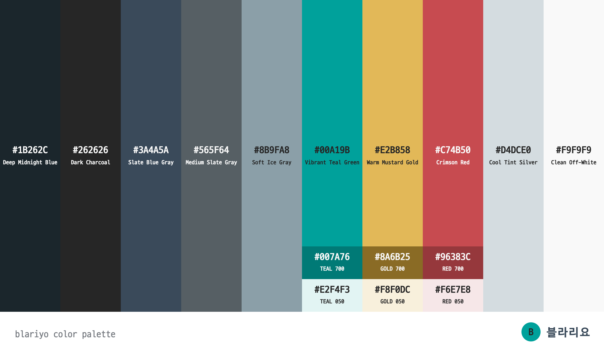

# 블라리요 컬러 팔레트

- 문서 상태: 반응형 퍼블리싱 적용안
- 정합성 검토일: 2026-08-20
- 적용 대상: 데스크톱·모바일 웹
- 원칙: 쿨톤 베이스를 유지하고 청록은 행동, 적색은 상태, 골드는 제한된 강조에만 사용한다.



## 1. 기본 팔레트

| 구분 | Hex Code | 색상명 | 역할 | 주요 사용처 |
| :--- | :--- | :--- | :--- | :--- |
| Dark Base | `#1B262C` | Deep Midnight Blue | 가장 어두운 배경 | 검토 도구, 상세 이미지, 다크 영역 |
| Dark Base | `#262626` | Dark Charcoal | 기본 글자 | 제목, 본문, 활성 버튼 글자 |
| Slate | `#3A4A5A` | Slate Blue Gray | 브랜드 골격 | 서비스 헤더, 데스크톱 외곽 배경 |
| Slate | `#565F64` | Medium Slate Gray | 보조 정보 | 메타 정보, 설명, 비활성 텍스트 |
| Slate | `#8B9FA8` | Soft Ice Gray | 강한 경계 | 입력 테두리, 비활성 버튼, 이미지 골격 |
| Primary | `#00A19B` | Vibrant Teal Green | 주요 행동 | 활성 탭, 포커스, 현재 글 표시, 주요 링크 밑줄 |
| Secondary | `#E2B858` | Warm Mustard Gold | 제한된 강조 | 광고 라벨, 제휴 배지, 시각 자료 포인트 |
| Functional | `#C74B50` | Crimson Red | 주의와 상태 | 오류, 삭제, 권리 검토, 현재 페이지 경계 |
| Light Base | `#D4DCE0` | Cool Tint Silver | 옅은 구분 | 목록 광고 배경, 구획 분리, 스켈레톤 |
| Light Base | `#F9F9F9` | Clean Off-White | 기본 표면 | 본문, 목록, 카드, 모바일 배경 |

## 2. 파생색

파생색은 hover·pressed·soft background처럼 기본색만으로 상태 구분이 어려울 때만 사용한다.

| Token | Hex Code | 기준색 | 사용처 |
| :--- | :--- | :--- | :--- |
| `teal-700` | `#007A76` | `#00A19B` | 밝은 표면 위 작은 링크와 pressed 상태 |
| `teal-050` | `#E2F4F3` | `#00A19B` | 현재 글, 선택 행, teal hover 배경 |
| `red-700` | `#96383C` | `#C74B50` | 밝은 표면 위 오류·삭제 텍스트 |
| `red-050` | `#F6E7E8` | `#C74B50` | 권리 검토·오류 안내 배경 |
| `gold-700` | `#8A6B25` | `#E2B858` | 밝은 표면 위 제휴·광고 텍스트 |
| `gold-050` | `#F8F0DC` | `#E2B858` | 제휴·광고 안내 배경 |

파생색을 새로운 브랜드 색으로 취급하지 않는다. 기본 팔레트의 의미를 유지하기 위한 명도 보정값이다.

## 3. 화면 역할별 조합

| 화면 요소 | 배경 | 글자·아이콘 | 강조·경계 |
| :--- | :--- | :--- | :--- |
| 검토 도구 | `#1B262C` | `#F9F9F9` | 활성 탭 `#00A19B` + 글자 `#262626` |
| 서비스 헤더 | `#3A4A5A` | `#F9F9F9` | 로고 마크 `#00A19B` |
| 게시판 탭 | `#F9F9F9` | `#262626` | 하단선 `#C74B50` |
| 일반 목록 행 | `#F9F9F9` | `#262626`, 메타 `#565F64` | 경계 `#D4DCE0` |
| 목록 hover | `#E2F4F3` | `#262626` | 별도 테두리 없음 |
| 현재 글 행 | `#E2F4F3` | `#262626` | 좌측선 `#00A19B` |
| 광고 영역 | `#D4DCE0` 계열 옅은 면 | `#565F64` | 라벨 `#8A6B25` 또는 `#E2B858` |
| 권리·오류 안내 | `#F6E7E8` | `#262626` | 테두리 `#C74B50` |
| 상세 이미지 | `#1B262C` → `#262626` | `#F9F9F9` | 그래픽 `#00A19B`, `#E2B858`, `#8B9FA8` |
| 푸터 | `#D4DCE0` 계열 옅은 면 | `#565F64` | 링크 `#3A4A5A` |

## 4. 사용 규칙

1. 한 화면에서 강조색은 청록·적색·골드 중 최대 두 계열만 동시에 강하게 사용한다.
2. 청록은 클릭 가능하거나 현재 선택된 요소에 사용한다.
3. 적색은 단순 장식보다 오류, 삭제, 권리 검토 같은 상태에 우선 사용한다.
4. 골드는 광고·제휴·콘텐츠 이미지의 보조 포인트에만 사용한다.
5. 본문과 제목은 `#262626`을 유지하고 장문의 컬러 텍스트를 만들지 않는다.
6. `#00A19B` 배경 위 작은 글자는 `#F9F9F9`가 아니라 `#262626`을 사용한다.
7. 밝은 표면 위 작은 청록 링크는 `#007A76`을 사용한다.
8. 색만으로 현재 상태를 전달하지 않고 밑줄, 굵기, 아이콘, 테두리를 함께 사용한다.

## 5. CSS 토큰

```css
:root {
  --color-midnight: #1B262C;
  --color-ink: #262626;
  --color-slate: #3A4A5A;
  --color-muted: #565F64;
  --color-ice: #8B9FA8;
  --color-teal: #00A19B;
  --color-teal-strong: #007A76;
  --color-teal-soft: #E2F4F3;
  --color-gold: #E2B858;
  --color-gold-strong: #8A6B25;
  --color-gold-soft: #F8F0DC;
  --color-red: #C74B50;
  --color-red-strong: #96383C;
  --color-red-soft: #F6E7E8;
  --color-silver: #D4DCE0;
  --color-paper: #F9F9F9;
}
```

## 6. 퍼블리싱 적용 범위

- [반응형 퍼블리싱](../publishing/responsive/index.html)에 기본·파생 토큰을 적용한다.
- 검토 도구는 실제 서비스 UI가 아니므로 운영 화면 구현 시 제거한다.
- 향후 다크 모드는 별도 검토한다. 현재 팔레트의 다크 색상은 헤더·그래픽·외곽에만 사용한다.
