# M0 데이터 모델

M1 회원·M1.5 익게의 추가 계약은 [회원·익게 기술 설계](06-member-community-design.md)를 따른다. 이 문서의 M0 한정 계약과 구분한다.
- 문서 상태: M0 데이터 계약 · 신규 migration 구현 입력
- 기준일: 2026-09-04
- 정합성 검토일: 2026-09-04
- DBMS: PostgreSQL 18
- 문자 인코딩: 데이터베이스 `UTF8`
- 시간 기준: `TIMESTAMPTZ(3)`로 절대 시각을 저장하고 DB·session timezone은 UTC, 화면에서 Asia/Seoul 변환

## 1. 모델링 원칙

1. 게시판 내부 식별자와 URL `slug`, 변경 가능한 표시명을 분리한다.
2. 본문은 plain text와 복수 이미지를 순서대로 배치할 수 있게 block으로 저장한다. TEXT block의 입력을 HTML이나 Markdown으로 해석하지 않는다.
3. 공개 이미지는 원본 URL이 아니라 object storage key로 참조한다.
4. 게시 상태 변경과 이력은 같은 transaction에서 저장한다.
5. 물리 삭제보다 공개 상태 차단을 먼저 수행한다.
6. provider·스토리지·컴퓨트 사업자 이름을 핵심 테이블에 넣지 않는다.
7. 모든 schema 변경은 순번 migration으로 적용하고 운영 DB에서 init SQL을 재실행하지 않는다.
8. 논리명은 한국어 업무 용어, 물리명은 `schema.table_name` 형식의 소문자 `snake_case`로 표기하고 double quote를 사용하지 않는다.
9. schema는 `content`, `legal`, `ops`, `collect`로 나누고 SQL·migration에서 물리명을 schema까지 명시한다.
10. entity PK는 `id`, FK는 논리 entity 기준 `<entity>_id`, URL 식별자는 `slug`, Boolean은 `is_*`, 낙관적 잠금 값은 `lock_version`으로 통일한다. 따라서 `content.board_post.id`를 참조하는 FK와 API 식별자는 각각 `post_id`, `postId`다. 연결 테이블은 의미가 분명할 때 복합 PK를 허용한다.
11. 자동 번호는 `GENERATED BY DEFAULT AS IDENTITY`, JSON document는 `JSONB`, 고정 길이 hash는 `BYTEA`와 길이 `CHECK`를 사용한다.
12. API가 반환하거나 command 처리에 사용하는 값은 반드시 저장 위치 또는 계산 근거를 이 문서에 가진다.
13. 모든 테이블은 `created_by`(등록자), `created_at`(등록일시), `updated_by`(수정자), `updated_at`(수정일시)를 가진다.

`ops.schema_migration`은 애플리케이션 데이터가 아니라 migration runner의 무결성 ledger이므로 13번 감사 컬럼 규칙의 예외다. migrator만 기록하고 application role에는 접근 권한을 주지 않는다.

### 공통 감사 컬럼

| 논리명 | 물리명 | 타입 | 규칙 |
| --- | --- | --- | --- |
| 등록자 | `created_by` | `VARCHAR(100)` | 최초 등록 actor key |
| 등록일시 | `created_at` | `TIMESTAMPTZ(3)` | 최초 등록 시각, UTC |
| 수정자 | `updated_by` | `VARCHAR(100)` | 마지막 수정 actor key |
| 수정일시 | `updated_at` | `TIMESTAMPTZ(3)` | 마지막 수정 시각, UTC |

actor key는 `<주체 유형>:<식별값>` 형식으로 저장한다. migration·scheduler·정책 시행·수집 실행
주체는 `system:migration`, `system:scheduler`, `system:policy-publisher`, `system:outbox-worker`,
`system:collector`를 사용한다. 아래 CHECK 정규식의 허용 목록과 이 목록은 항상 같아야 하며, 새
system actor를 추가할 때 두 곳을 같은 migration에서 함께 바꾼다. 운영자는
`admin:v<keyVersion>:<base64url(HMAC-SHA-256(operatorId))>`를 사용한다. `operatorId`는 BFF
adapter가 외부 identity와 분리해 유지하는 안정적인 내부 식별자이므로 provider를 바꿔도 같은
값을 사용한다. 외부 provider subject 원문은 저장하지 않는다. M1 사용자 actor는 같은 형식의
`user:v<keyVersion>:<HMAC>`을 사용할 수 있다.

등록 시 두 actor와 두 시각은 각각 같은 값으로 시작하고, 변경 시 `updated_by`, `updated_at`만 갱신한다. 수정하지 않는 이력성 행도 네 컬럼을 유지하며 수정 값은 등록 값과 같다. 작성자·소유자처럼 업무상 필요한 주체는 감사 컬럼을 재사용하지 않고 별도 FK로 둔다.

네 컬럼은 모두 `NOT NULL`이며 각 테이블에 아래 공통 제약을 적용한다. `V002` seed와 정책 seed의 actor key는 `system:migration`이다.

```text
CHECK created_by ~ '^(system:(migration|scheduler|policy-publisher|outbox-worker|collector)|(admin|user):v[1-9][0-9]*:[A-Za-z0-9_-]{43})$'
CHECK updated_by ~ '^(system:(migration|scheduler|policy-publisher|outbox-worker|collector)|(admin|user):v[1-9][0-9]*:[A-Za-z0-9_-]{43})$'
CHECK updated_at >= created_at
```

### Schema 경계

| schema | 단계 | 책임 |
| --- | --- | --- |
| `content` | M0 Core | 게시판·게시글·본문·이미지·상태 이력 |
| `legal` | M0 Core | 정책 원문과 버전 |
| `ops` | M0 Core | outbox와 멱등 요청 |
| `collect` | M0 수집 보조 | 수집 출처와 후보 큐 |
| `identity` | M1 확장 계약 | 계정·소셜 연동·동의·session |
| `community` | M1.5 확장 계약 | 글 소유자·글별 랜덤 이름·댓글 (반응은 범위 밖) |
| `moderation` | M1.5 확장 계약 | 신고·검토·제재 이력 |

후속 단계 schema와 table은 `M0 Core` `V001`에서 만들지 않는다. 해당 단계의 planning과
system-design을 확정한 migration에서 추가한다.

## 2. ERD

```mermaid
erDiagram
  content_board["게시판 / content.board"] {
    bigint id PK "게시판 ID"
    varchar slug UK "URL 식별자"
    varchar display_name "표시명"
    boolean is_active "활성 여부"
    varchar posting_policy "작성 정책"
    smallint display_order "표시 순서"
    varchar(100) created_by "등록자"
    timestamptz created_at "등록일시"
    varchar(100) updated_by "수정자"
    timestamptz updated_at "수정일시"
  }
  content_board_post["게시글 / content.board_post"] {
    bigint id PK "게시글 ID"
    bigint board_id FK "게시판 ID"
    varchar title "제목"
    varchar source_name "출처명"
    varchar source_url "출처 URL"
    varchar status "상태"
    smallint pinned_position "공지 위치"
    timestamptz scheduled_at "예약 발행일시"
    timestamptz published_at "최초 공개일시"
    bigint view_count "조회수"
    int lock_version "잠금 버전"
    varchar(100) created_by "등록자"
    timestamptz created_at "등록일시"
    varchar(100) updated_by "수정자"
    timestamptz updated_at "수정일시"
  }
  content_board_post_block["게시글 본문 블록 / content.board_post_block"] {
    bigint id PK "본문 블록 ID"
    bigint post_id FK "게시글 ID"
    smallint position "본문 순서"
    varchar type "블록 유형"
    text text_content "텍스트 내용"
    bigint image_id FK "이미지 ID"
    varchar alt_text "대체 텍스트"
    varchar(100) created_by "등록자"
    timestamptz created_at "등록일시"
    varchar(100) updated_by "수정자"
    timestamptz updated_at "수정일시"
  }
  content_board_post_image["게시글 이미지 / content.board_post_image"] {
    bigint id PK "이미지 ID"
    bigint post_id FK "게시글 ID"
    varchar private_storage_key UK "비공개 저장 키"
    varchar public_storage_key UK "공개 저장 키"
    varchar status "상태"
    bytea content_sha256 "콘텐츠 해시"
    varchar mime_type "MIME 유형"
    int byte_size "파일 크기"
    int width "너비"
    int height "높이"
    varchar(100) created_by "등록자"
    timestamptz created_at "등록일시"
    varchar(100) updated_by "수정자"
    timestamptz updated_at "수정일시"
  }
  content_board_post_status_history["게시글 상태 이력 / content.board_post_status_history"] {
    bigint id PK "상태 이력 ID"
    bigint post_id FK "게시글 ID"
    varchar from_status "이전 상태"
    varchar to_status "변경 상태"
    varchar reason_code "변경 사유 코드"
    varchar actor_type "행위자 유형"
    varchar(100) created_by "등록자"
    timestamptz created_at "등록일시"
    varchar(100) updated_by "수정자"
    timestamptz updated_at "수정일시"
  }
  legal_policy_version["정책 버전 / legal.policy_version"] {
    bigint id PK "정책 버전 ID"
    varchar policy_type "정책 유형"
    varchar version_label "공개 버전"
    varchar title "제목"
    text body_html "본문 HTML"
    varchar status "상태"
    timestamptz effective_at "시행일시"
    timestamptz ended_at "종료일시"
    varchar(100) created_by "등록자"
    timestamptz created_at "등록일시"
    varchar(100) updated_by "수정자"
    timestamptz updated_at "수정일시"
  }
  ops_outbox_task["외부 작업 / ops.outbox_task"] {
    bigint id PK "외부 작업 ID"
    varchar type "작업 유형"
    varchar status "상태"
    varchar aggregate_type "대상 유형"
    bigint aggregate_id "대상 ID, storage object cleanup은 NULL"
    jsonb payload "실행 데이터"
    smallint attempt_count "시도 횟수"
    timestamptz next_attempt_at "다음 실행일시"
    varchar last_error_code "마지막 오류 코드"
    varchar(100) created_by "등록자"
    timestamptz created_at "등록일시"
    varchar(100) updated_by "수정자"
    timestamptz updated_at "수정일시"
  }
  ops_idempotency_request["멱등 요청 기록 / ops.idempotency_request"] {
    bigint id PK "멱등 요청 ID"
    varchar operation_scope "작업 범위"
    varchar idempotency_key "멱등 키"
    bytea request_hash "요청 해시"
    smallint response_status "응답 status"
    jsonb response_body "응답 본문"
    varchar resource_type "대상 유형"
    bigint resource_id "대상 ID"
    timestamptz expires_at "만료일시"
    varchar(100) created_by "등록자"
    timestamptz created_at "등록일시"
    varchar(100) updated_by "수정자"
    timestamptz updated_at "수정일시"
  }

  collect_source["수집 출처 / collect.source"] {
    bigint id PK "수집 출처 ID"
    varchar name "출처명"
    varchar base_url "기준 URL"
    varchar host UK "출처 host"
    varchar parser_type "parser 유형"
    varchar fetch_mode "수집 방식"
    varchar list_url "목록 주소"
    boolean is_active "활성 여부"
    boolean is_list_crawl_enabled "목록 수집 활성 여부"
    boolean robots_allowed "robots 허용 여부"
    timestamptz robots_checked_at "robots 확인일시"
    int request_interval_ms "요청 간격"
    int daily_fetch_limit "일일 상한"
    timestamptz last_fetched_at "최근 수집일시"
    varchar last_error_code "최근 오류 코드"
    smallint consecutive_error_count "연속 실패 횟수"
    varchar disabled_reason_code "비활성 사유"
    int lock_version "잠금 버전"
    varchar(100) created_by "등록자"
    timestamptz created_at "등록일시"
    varchar(100) updated_by "수정자"
    timestamptz updated_at "수정일시"
  }
  collect_candidate["수집 후보 / collect.candidate"] {
    bigint id PK "수집 후보 ID"
    bigint source_id FK "수집 출처 ID"
    varchar origin_url "원문 URL"
    bytea origin_url_sha256 UK "원문 URL 해시"
    varchar title "후보 제목"
    timestamptz source_published_at "원문 게시 시각"
    varchar parser_version "parser 버전"
    jsonb warnings "추출 경고 코드"
    varchar status "수집·검수 상태"
    varchar discovery_mode "수집 경로"
    bigint duplicate_post_id FK "중복 게시글 ID"
    bigint post_id FK "승격 게시글 ID"
    varchar reject_reason_code "반려 사유 코드"
    varchar fetch_error_code "수집 오류 코드"
    varchar collector_id "collector ID"
    timestamptz requested_at "요청일시"
    timestamptz claimed_at "선점일시"
    timestamptz lease_until "lease 만료일시"
    timestamptz fetched_at "수집일시"
    timestamptz reviewed_at "검수일시"
    int attempt_count "시도 횟수"
    int lock_version "잠금 버전"
    varchar(100) created_by "등록자"
    timestamptz created_at "등록일시"
    varchar(100) updated_by "수정자"
    timestamptz updated_at "수정일시"
  }
  collect_candidate_image["수집 후보 이미지 / collect.candidate_image"] {
    bigint id PK "후보 이미지 ID"
    bigint candidate_id FK "수집 후보 ID"
    smallint position "후보 순서"
    varchar remote_url "원격 이미지 URL"
    varchar preview_storage_key "미리보기 저장 key"
    timestamptz preview_expires_at "미리보기 만료일시"
    bigint image_id FK "저장된 이미지 ID"
    varchar status "상태"
    varchar fetch_error_code "저장 실패 코드"
    varchar(100) created_by "등록자"
    timestamptz created_at "등록일시"
    varchar(100) updated_by "수정자"
    timestamptz updated_at "수정일시"
  }
  ops_schema_migration["스키마 migration 이력 / ops.schema_migration"] {
    varchar version PK "migration 버전"
    varchar filename "파일명"
    bytea checksum_sha256 "파일 checksum"
    timestamptz applied_at "적용일시"
    int duration_ms "적용 소요시간"
  }

  content_board ||--o{ content_board_post : contains
  content_board_post ||--o{ content_board_post_block : has
  content_board_post |o--o{ content_board_post_image : owns
  content_board_post_image ||--o| content_board_post_block : referenced_by
  content_board_post ||--o{ content_board_post_status_history : changes
  collect_source ||--o{ collect_candidate : discovers
  collect_candidate ||--o{ collect_candidate_image : has
  collect_candidate_image |o--o| content_board_post_image : stored_as
  collect_candidate |o--o| content_board_post : promoted_to
```



Mermaid 내부 entity ID는 관계 연결을 위해 `schema_table`로 두고, 화면 별칭에는 `논리명 / schema.table`을 표시한다. 컬럼은 `물리명` 뒤 주석에 `논리명`을 표시한다. ERD와 아래 테이블 정의의 컬럼 집합은 같아야 한다. 컬럼을 추가·삭제하면 두 곳을 같은 변경에서 함께 고친다.

## 3. 핵심 테이블

### 게시판 — `content.board`

| 열 | 타입 | Null | 설명 |
| --- | --- | --- | --- |
| `id` | `BIGINT GENERATED BY DEFAULT AS IDENTITY` | N | PK, 내부 게시판 식별자 |
| `slug` | `VARCHAR(32)` | N | URL 경로 식별자 |
| `display_name` | `VARCHAR(50)` | N | 화면 표시명 |
| `is_active` | `BOOLEAN` | N | 공개 메뉴·작성 대상 활성 여부 |
| `posting_policy` | `VARCHAR(16)` | N | 작성 주체, M0는 `ADMIN` |
| `display_order` | `SMALLINT` | N | 메뉴 순서, `0 이상` |
| `created_by` | `VARCHAR(100)` | N | 등록자 actor key |
| `created_at` | `TIMESTAMPTZ(3)` | N | 등록일시, UTC |
| `updated_by` | `VARCHAR(100)` | N | 수정자 actor key |
| `updated_at` | `TIMESTAMPTZ(3)` | N | 수정일시, UTC |

제약·인덱스:

```text
PK (id)
UK uq_board__slug (slug)
UK uq_board__display_order (display_order)
CHECK slug ~ '^[a-z0-9]+(?:-[a-z0-9]+)*$'
CHECK length(trim(display_name)) BETWEEN 1 AND 50
CHECK posting_policy IN ('ADMIN', 'USER')
CHECK display_order >= 0
INDEX ix_board__active_order (is_active, display_order)
TRIGGER slug 변경 거부
```

초기 seed는 `slug=meme / 짤 / true / ADMIN / 10` 한 건만 넣는다.

공개 목록·상세 API와 웹 URL은 `boardSlug`를 게시판 경로 변수로 받고 내부 관계와 집계에는 `board_id`를 저장한다. 상세 조회는 `post.id`뿐 아니라 `post.board_id = board.id`를 함께 확인한다. M0에서 seed 후 `slug`는 변경할 수 없고 수정 API도 만들지 않는다. 후속 단계에서 slug 변경이 필요하면 기존 URL을 보존하는 alias·redirect 테이블과 계약을 먼저 설계한 뒤 migration으로 추가한다.

### 게시글 — `content.board_post`

| 열 | 타입 | Null | 설명 |
| --- | --- | --- | --- |
| `id` | `BIGINT GENERATED BY DEFAULT AS IDENTITY` | N | PK, 공개 게시글 식별자 |
| `board_id` | `BIGINT` | N | `content.board` FK |
| `title` | `VARCHAR(200)` | N | 제목, trim 후 1~200자 |
| `source_name` | `VARCHAR(200)` | Y | 외부 콘텐츠 출처명 |
| `source_url` | `VARCHAR(2048)` | Y | 출처 `https` URL |
| `status` | `VARCHAR(20)` | N | 초안·예약·공개·숨김·제거 상태 |
| `pinned_position` | `SMALLINT` | Y | 공지 `1~3`, 일반 글 `NULL` |
| `scheduled_at` | `TIMESTAMPTZ(3)` | Y | 예약 발행 시각 |
| `published_at` | `TIMESTAMPTZ(3)` | Y | 최초 공개 시각, 재공개 시 유지 |
| `view_count` | `BIGINT` | N | 공개 상세 화면의 참고용 누적 조회 수, 초기 `0` |
| `lock_version` | `INTEGER` | N | 낙관적 잠금 값, 초기 `1` |
| `created_by` | `VARCHAR(100)` | N | 등록자 actor key |
| `created_at` | `TIMESTAMPTZ(3)` | N | 등록일시, UTC |
| `updated_by` | `VARCHAR(100)` | N | 수정자 actor key |
| `updated_at` | `TIMESTAMPTZ(3)` | N | 수정일시, UTC |

제약·인덱스:

```text
PK (id)
FK (board_id) -> content.board(id) ON UPDATE RESTRICT ON DELETE RESTRICT
CHECK status IN ('DRAFT','SCHEDULED','PUBLISHED','HIDDEN_REVIEW','REMOVED')
CHECK length(trim(title)) BETWEEN 1 AND 200
CHECK pinned_position IS NULL OR pinned_position BETWEEN 1 AND 3
CHECK pinned_position IS NULL OR status IN ('DRAFT','SCHEDULED','PUBLISHED')
CHECK (source_name IS NULL) = (source_url IS NULL)
CHECK source_name IS NULL OR length(trim(source_name)) BETWEEN 1 AND 200
CHECK source_url IS NULL OR source_url ~ '^https://'
CHECK (status='DRAFT' AND scheduled_at IS NULL AND published_at IS NULL)
   OR (status='SCHEDULED' AND scheduled_at IS NOT NULL AND published_at IS NULL)
   OR (status IN ('PUBLISHED','HIDDEN_REVIEW','REMOVED') AND scheduled_at IS NULL AND published_at IS NOT NULL)
CHECK view_count >= 0
CHECK lock_version >= 1
UNIQUE INDEX uq_board_post__active_pin (board_id, pinned_position)
  WHERE status IN ('SCHEDULED','PUBLISHED') AND pinned_position IS NOT NULL
INDEX ix_board_post__public (board_id, published_at DESC, id DESC)
  WHERE status='PUBLISHED'
INDEX ix_board_post__scheduled (scheduled_at, id)
  WHERE status='SCHEDULED'
INDEX ix_board_post__updated (updated_at, id)
```

숨김 시 `pinned_position`은 `NULL`로 변경한다. 재공개 시 공지 위치는 운영자가 다시 선택한다.

`view_count` 증가는 콘텐츠 수정이 아니므로 `updated_by`, `updated_at`, `lock_version`을 바꾸지
않는다. 조회 수 endpoint는 공개 상태와 게시판 소속 조건을 포함한 단일 원자 증가 SQL로 경쟁을
처리한다. 이 예외는 조회 수 컬럼에만 적용한다.

공지 위치 unique index는 `SCHEDULED`와 `PUBLISHED`를 함께 덮는다. 따라서 예약 등록·수정 시점에 중복이 `409 PINNED_ORDER_CONFLICT`로 걸러지고, due 발행이 공지 위치 제약으로 실패하는 상황을 만들지 않는다. `DRAFT`는 제약 대상이 아니므로 초안 여러 건이 같은 위치를 임시로 가질 수 있고, 예약 또는 발행 시점에 검증한다.

### 게시글 이미지 — `content.board_post_image`

| 열 | 타입 | Null | 설명 |
| --- | --- | --- | --- |
| `id` | `BIGINT GENERATED BY DEFAULT AS IDENTITY` | N | PK, 이미지 자산 식별자 |
| `post_id` | `BIGINT` | Y | staging은 `NULL`, 연결 후 게시글 FK |
| `private_storage_key` | `VARCHAR(512)` | N | 비공개 canonical 원본 key |
| `public_storage_key` | `VARCHAR(512)` | Y | 공개 media object key |
| `status` | `VARCHAR(24)` | N | staging·공개·삭제 상태 |
| `content_sha256` | `BYTEA` | N | 중복·무결성 확인 hash, 32 bytes |
| `mime_type` | `VARCHAR(50)` | N | 검증된 MIME |
| `byte_size` | `INTEGER` | N | 파일 크기, 양수 |
| `width` | `INTEGER` | N | 실제 너비, 양수 |
| `height` | `INTEGER` | N | 실제 높이, 양수 |
| `created_by` | `VARCHAR(100)` | N | 등록자 actor key |
| `created_at` | `TIMESTAMPTZ(3)` | N | 등록일시, UTC |
| `updated_by` | `VARCHAR(100)` | N | 수정자 actor key |
| `updated_at` | `TIMESTAMPTZ(3)` | N | 수정일시, UTC |

```text
PK (id)
FK (post_id) -> content.board_post(id) ON DELETE RESTRICT
UK (private_storage_key)
UNIQUE INDEX uq_board_post_image__public_key (public_storage_key) WHERE public_storage_key IS NOT NULL
UK (post_id, id)
INDEX ix_board_post_image__content_sha256 (content_sha256)
INDEX ix_board_post_image__status_updated (status, updated_at)
CHECK status IN ('STAGED','PUBLIC','PUBLIC_DELETE_PENDING','PRIVATE_REVIEW','PRIVATE_DELETE_PENDING','DELETED')
CHECK octet_length(content_sha256) = 32
CHECK byte_size > 0 AND width > 0 AND height > 0
CHECK (status IN ('PUBLIC','PUBLIC_DELETE_PENDING') AND public_storage_key IS NOT NULL)
   OR (status IN ('STAGED','PRIVATE_REVIEW','PRIVATE_DELETE_PENDING','DELETED') AND public_storage_key IS NULL)
CHECK post_id IS NOT NULL OR status IN ('STAGED','PRIVATE_DELETE_PENDING','DELETED')
```

`content_sha256`는 중복 경고용이며 자동 결합·삭제에는 쓰지 않는다.

업로드 이미지는 `post_id=NULL`, `STAGED`로 시작한다. 초안 저장 transaction이 이미지를 선점하고 IMAGE block을 함께 생성한다. 발행 시 private 원본을 public 영역에 복사하고, 숨김 시 public object 삭제 outbox를 만든다. private 원본은 재공개·복구를 위해 유지한다.

연결 규칙:

- `content.board_post_image.post_id IS NULL`인 이미지는 아직 어떤 block에도 배치되지 않은 staging 자산이다.
- `content.board_post_image.post_id IS NOT NULL`인 이미지는 같은 `post_id`의 IMAGE block 정확히 한 건에서 참조되어야 한다.
- `DRAFT`·`SCHEDULED`에서 block 교체로 빠진 `STAGED` 이미지는 같은 transaction에서 `post_id=NULL`로 해제한다.
- `HIDDEN_REVIEW`의 block 교체는 연결 이미지의 public 삭제가 끝난 뒤 허용한다. 빠진 `PRIVATE_REVIEW` 이미지는 `post_id=NULL`, `PRIVATE_DELETE_PENDING`으로 바꾸고 private 삭제 outbox를 만든다.

복합 FK와 unique index가 소유권·중복 참조를 막는다. 연결 image마다 block이 한 건 있어야 한다는 규칙은 service와 integration test로 검증하며, 필요하면 deferred constraint trigger로 강화한다.

### 게시글 본문 블록 — `content.board_post_block`

| 열 | 타입 | Null | 설명 |
| --- | --- | --- | --- |
| `id` | `BIGINT GENERATED BY DEFAULT AS IDENTITY` | N | PK, block 식별자 |
| `post_id` | `BIGINT` | N | 게시글 FK |
| `position` | `SMALLINT` | N | 본문 순서, 1부터 연속 |
| `type` | `VARCHAR(16)` | N | `TEXT`, `IMAGE` |
| `text_content` | `TEXT` | Y | TEXT block의 plain text |
| `image_id` | `BIGINT` | Y | IMAGE block의 이미지 FK |
| `alt_text` | `VARCHAR(300)` | Y | IMAGE block 대체 텍스트, 1~300자 |
| `created_by` | `VARCHAR(100)` | N | 등록자 actor key |
| `created_at` | `TIMESTAMPTZ(3)` | N | 등록일시, UTC |
| `updated_by` | `VARCHAR(100)` | N | 수정자 actor key |
| `updated_at` | `TIMESTAMPTZ(3)` | N | 수정일시, UTC |

```text
PK (id)
FK (post_id) -> content.board_post(id) ON DELETE RESTRICT
FK (post_id, image_id) -> content.board_post_image(post_id, id) ON DELETE RESTRICT
UK (post_id, position)
UNIQUE INDEX uq_board_post_block__image (image_id) WHERE image_id IS NOT NULL
CHECK position >= 1
CHECK type IN ('TEXT','IMAGE')
CHECK (type='TEXT' AND text_content IS NOT NULL AND image_id IS NULL AND alt_text IS NULL)
   OR (type='IMAGE' AND text_content IS NULL AND image_id IS NOT NULL AND alt_text IS NOT NULL)
CHECK text_content IS NULL OR length(trim(text_content)) BETWEEN 1 AND 20000
CHECK alt_text IS NULL OR length(trim(alt_text)) BETWEEN 1 AND 300
```

TEXT는 plain text로 저장하고 출력 시 escape한다. 이미지 테이블은 파일·storage 상태를, block 테이블은 본문 배치·순서·대체 텍스트를 담당한다.

### 게시글 상태 이력 — `content.board_post_status_history`

| 열 | 타입 | Null | 설명 |
| --- | --- | --- | --- |
| `id` | `BIGINT GENERATED BY DEFAULT AS IDENTITY` | N | PK, 상태 이력 식별자 |
| `post_id` | `BIGINT` | N | 게시글 FK |
| `from_status` | `VARCHAR(20)` | Y | 이전 상태, 최초 생성은 `NULL` |
| `to_status` | `VARCHAR(20)` | N | 변경 후 상태 |
| `reason_code` | `VARCHAR(30)` | N | 변경 사유 코드 |
| `actor_type` | `VARCHAR(16)` | N | `ADMIN`, `SYSTEM` |
| `created_by` | `VARCHAR(100)` | N | 상태 변경 등록자 actor key |
| `created_at` | `TIMESTAMPTZ(3)` | N | 상태 변경 등록일시, UTC |
| `updated_by` | `VARCHAR(100)` | N | 수정자 actor key, 등록 후 변경하지 않음 |
| `updated_at` | `TIMESTAMPTZ(3)` | N | 수정일시, 등록 후 변경하지 않음 |

```text
PK (id)
FK (post_id) -> content.board_post(id) ON DELETE RESTRICT
INDEX ix_board_post_status_history__post_created (post_id, created_at DESC)
INDEX ix_board_post_status_history__reason_created (reason_code, created_at DESC)
CHECK reason_code IN ('CREATE','EDIT','SCHEDULE','PUBLISH','UNSCHEDULE','RIGHTS_EMAIL','REPUBLISH','REMOVE','SYSTEM_DUE','PINNED_ORDER_CONFLICT')
CHECK from_status IS NULL OR from_status IN ('DRAFT','SCHEDULED','PUBLISHED','HIDDEN_REVIEW','REMOVED')
CHECK to_status IN ('DRAFT','SCHEDULED','PUBLISHED','HIDDEN_REVIEW','REMOVED')
CHECK actor_type IN ('ADMIN','SYSTEM')
```

이메일 본문, 권리 소명 자료와 내부 자유 메모는 이 테이블에 저장하지 않는다.

## 4. 정책 데이터

### 정책 버전 — `legal.policy_version`

| 열 | 타입 | Null | 설명 |
| --- | --- | --- | --- |
| `id` | `BIGINT GENERATED BY DEFAULT AS IDENTITY` | N | PK, 정책 버전 식별자 |
| `policy_type` | `VARCHAR(20)` | N | `TERMS`, `PRIVACY` |
| `version_label` | `VARCHAR(20)` | N | 공개 버전, 예: `v0.3` |
| `title` | `VARCHAR(200)` | N | 버전별 문서 제목 |
| `body_html` | `TEXT` | N | 정제된 버전별 HTML 전문 |
| `status` | `VARCHAR(20)` | N | 초안·시행·종료 상태 |
| `effective_at` | `TIMESTAMPTZ(3)` | Y | 시행 시작 시각 |
| `ended_at` | `TIMESTAMPTZ(3)` | Y | 시행 종료 시각 |
| `created_by` | `VARCHAR(100)` | N | 등록자 actor key |
| `created_at` | `TIMESTAMPTZ(3)` | N | 등록일시, UTC |
| `updated_by` | `VARCHAR(100)` | N | 수정자 actor key |
| `updated_at` | `TIMESTAMPTZ(3)` | N | 수정일시, UTC |

```text
PK (id)
UK uq_policy_version__type_label (policy_type, version_label)
INDEX ix_policy_version__type_status_effective (policy_type, status, effective_at DESC)
UNIQUE INDEX uq_policy_version__effective_one (policy_type)
  WHERE status='EFFECTIVE'
CHECK policy_type IN ('TERMS','PRIVACY')
CHECK length(trim(title)) BETWEEN 1 AND 200
CHECK length(trim(body_html)) > 0
CHECK status IN ('DRAFT','EFFECTIVE','RETIRED')
CHECK (status='DRAFT' AND effective_at IS NULL AND ended_at IS NULL)
   OR (status='EFFECTIVE' AND effective_at IS NOT NULL AND ended_at IS NULL)
   OR (status='RETIRED' AND effective_at IS NOT NULL AND ended_at IS NOT NULL AND ended_at > effective_at)
```

유형별 `EFFECTIVE`는 한 건만 허용한다. 시행된 본문은 수정하지 않고 새 버전을 만든다. 정책 적용 기간은 시작을 포함하고 종료를 포함하지 않는 `[effective_at, ended_at)` 반개방 구간이다. 새 버전의 `effective_at`과 이전 버전의 `ended_at`은 같은 경계 시각을 사용한다. `body_html`은 제한된 문서용 태그와 안전한 링크만 허용하도록 저장 전에 sanitize한다.

M0 정책 시행은 관리자 API나 예약 scheduler로 제공하지 않는다. 승인된 정책 release artifact를 배포 서버에 전달하고 `npm run policies:publish -- --artifact=<path>` 단발성 명령으로 실행한다. artifact에는 유형·버전·제목·정제 전 본문·시행 시각과 checksum을 포함하며, command가 schema와 checksum을 검증하고 본문을 허용 목록으로 sanitize한다. command는 artifact 시행 시각이 서버 현재 시각보다 미래이거나 5분 넘게 과거면 거부한다. 허용 범위에서는 advisory lock으로 정책 유형을 잠근 한 transaction에서 기존 `EFFECTIVE`를 새 버전 `effective_at`과 같은 시각으로 `RETIRED` 처리하고 새 버전을 `EFFECTIVE`로 insert한 뒤 정책 URL cache purge outbox를 기록한다. 시행 시각 이전 자동 전환은 M0 범위가 아니므로 운영자는 고지된 시행 시각에 명령을 실행한다. 5분 window를 놓치면 과거 시각을 강제로 기록하지 않고 새 시행 시각을 반영한 artifact를 다시 승인한다. 실패하면 전체 DB 변경을 rollback하고 기존 정책을 유지한다.

M1의 정책 동의 이력은 문자열 label이 아니라 `legal.policy_version.id`를 FK로 참조한다.

## 5. 외부 작업 재시도

### 외부 작업 — `ops.outbox_task`

DB commit 이후 실행해야 하는 외부 작업을 기록한다.

| 열 | 타입 | Null | 설명 |
| --- | --- | --- | --- |
| `id` | `BIGINT GENERATED BY DEFAULT AS IDENTITY` | N | PK, 작업 식별자 |
| `type` | `VARCHAR(30)` | N | cache·object 작업 유형 |
| `status` | `VARCHAR(20)` | N | 대기·실행·성공·실패·중단 상태 |
| `aggregate_type` | `VARCHAR(20)` | N | `POST`, `IMAGE`, `POLICY`, `STORAGE_OBJECT` |
| `aggregate_id` | `BIGINT` | Y | 대상 aggregate 식별자. rollback된 object cleanup은 `NULL` |
| `payload` | `JSONB` | N | 실행 payload, token·개인정보 금지 |
| `attempt_count` | `SMALLINT` | N | 실패 누적 횟수, 초기 `0` |
| `next_attempt_at` | `TIMESTAMPTZ(3)` | N | 다음 실행 시각 |
| `last_error_code` | `VARCHAR(50)` | Y | 마지막 오류 분류 코드 |
| `created_by` | `VARCHAR(100)` | N | 등록자 actor key |
| `created_at` | `TIMESTAMPTZ(3)` | N | 등록일시, UTC |
| `updated_by` | `VARCHAR(100)` | N | worker actor key |
| `updated_at` | `TIMESTAMPTZ(3)` | N | 수정일시, UTC |

```text
PK (id)
INDEX ix_outbox_task__due (next_attempt_at, id)
  WHERE status IN ('PENDING','FAILED')
INDEX ix_outbox_task__running (updated_at, id)
  WHERE status='RUNNING'
CHECK type IN ('CACHE_PURGE','OBJECT_DELETE_PUBLIC','OBJECT_DELETE_PRIVATE')
CHECK status IN ('PENDING','RUNNING','SUCCEEDED','FAILED','DEAD')
CHECK aggregate_type IN ('POST','IMAGE','POLICY','STORAGE_OBJECT')
CHECK (
  (type='CACHE_PURGE' AND aggregate_type IN ('POST','POLICY'))
  OR (type IN ('OBJECT_DELETE_PUBLIC','OBJECT_DELETE_PRIVATE') AND aggregate_type='IMAGE')
  OR (type='OBJECT_DELETE_PRIVATE' AND aggregate_type='STORAGE_OBJECT')
)
CHECK (
  (aggregate_type IN ('POST','IMAGE','POLICY') AND aggregate_id IS NOT NULL AND aggregate_id > 0)
  OR (aggregate_type='STORAGE_OBJECT' AND aggregate_id IS NULL)
)
CHECK jsonb_typeof(payload) = 'object'
CHECK attempt_count BETWEEN 0 AND 8
```

worker는 처리할 행을 `FOR UPDATE SKIP LOCKED`로 선점하고 `RUNNING`, `updated_at=now()`로 바꾼 뒤 외부 작업을 실행한다. `RUNNING`이 5분 넘게 유지되면 중단된 작업으로 보고 `FAILED`로 회수한다. 실패·회수 때 `attempt_count`를 올려 지수 backoff를 적용하고 실패가 8회 누적되면 `DEAD`로 전환해 운영 알림을 만든다. cache purge와 object 삭제는 재실행해도 같은 결과가 되도록 처리한다.

`OBJECT_DELETE_PUBLIC` payload에는 token이 아닌 public storage key와 그 key로 결정되는 정확한 CDN URL을 넣는다. worker는 public object를 멱등 삭제한 뒤 CDN URL을 purge하고, 두 작업이 모두 성공한 경우에만 image를 `PRIVATE_REVIEW`로 바꾼다. purge 또는 삭제가 실패하면 image는 `PUBLIC_DELETE_PENDING`에 남고 같은 전체 순서를 재시도한다. object를 먼저 삭제하므로 purge 재시도 중 원본에서 cache가 다시 채워지지 않는다. `CACHE_PURGE`의 `POST` payload는 영향받는 목록·상세 URL을 담는다. `POLICY` payload는 `/api/v1/policies/:type`과 해당 `/terms` 또는 `/privacy` 직접 경로를 함께 담는다.

업로드 all-or-nothing rollback으로 image row가 사라진 private object는 존재하지 않는 image ID를
참조하지 않는다. 즉시 보상 삭제가 실패하면 rollback과 분리된 cleanup transaction에서
`type=OBJECT_DELETE_PRIVATE`, `aggregate_type=STORAGE_OBJECT`, `aggregate_id=NULL` outbox를 commit한다.
payload는 `privateStorageKey`, `objectCreatedAt`, `cleanupReason=UPLOAD_ROLLBACK`만 포함하고 token·원본
파일명·관리자 identity는 넣지 않는다. 일반 image row의 삭제는 기존 `aggregate_type=IMAGE`와 실제
`aggregate_id=image.id`를 유지한다.

### 멱등 요청 기록 — `ops.idempotency_request`

초안 생성·발행·예약·예약 취소·숨김·재공개·삭제 command의 재전송 결과를 보존한다.

| 열 | 타입 | Null | 설명 |
| --- | --- | --- | --- |
| `id` | `BIGINT GENERATED BY DEFAULT AS IDENTITY` | N | PK, 멱등 요청 식별자 |
| `operation_scope` | `VARCHAR(120)` | N | HTTP method·route pattern |
| `idempotency_key` | `VARCHAR(128)` | N | client opaque key |
| `request_hash` | `BYTEA` | N | 경로 매개변수와 요청 본문을 포함한 정규 JSON의 SHA-256, 32 bytes |
| `response_status` | `SMALLINT` | N | 완료 HTTP status |
| `response_body` | `JSONB` | N | 재전송할 성공 `data` |
| `resource_type` | `VARCHAR(40)` | N | M0 Core는 `POST`, 수집 보조는 후보·quota·운영 event 종류 추가 |
| `resource_id` | `BIGINT` | Y | 게시글·후보·출처처럼 bigint인 resource |
| `resource_key` | `VARCHAR(100)` | Y | Job·execution·reservation·event 같은 UUID/opaque resource |
| `expires_at` | `TIMESTAMPTZ(3)` | N | key 만료 시각 |
| `created_by` | `VARCHAR(100)` | N | 요청 등록자 actor key |
| `created_at` | `TIMESTAMPTZ(3)` | N | 등록일시(최초 수신), UTC |
| `updated_by` | `VARCHAR(100)` | N | 수정자 actor key, 등록 후 변경하지 않음 |
| `updated_at` | `TIMESTAMPTZ(3)` | N | 수정일시, 등록 후 변경하지 않음 |

```text
PK (id)
UK uq_idempotency_request__actor_scope_key (created_by, operation_scope, idempotency_key)
INDEX ix_idempotency_request__expires (expires_at)
INDEX ix_idempotency_request__resource (resource_type, resource_id, created_at DESC)
CHECK octet_length(request_hash) = 32
CHECK response_status BETWEEN 200 AND 299
CHECK jsonb_typeof(response_body) = 'object'
CHECK resource_type IN ('POST','CANDIDATE','CANDIDATE_CLAIM','CANDIDATE_HEARTBEAT','CANDIDATE_PREVIEW','SOURCE_REQUEST_RESERVATION','COLLECTOR_EVENT')
CHECK resource_id IS NULL OR resource_id > 0
CHECK resource_id IS NOT NULL OR resource_key IS NOT NULL
CHECK expires_at > created_at
```

비교 입력은 `{ params, body }`이며 객체 키를 재귀 정렬하고 배열 순서는 유지한다.
본문만 해시한 이전 구현의 기록은 새 해시와 호환되지 않는다. 기존 환경에 적용할 때는
보존 기간(24시간)이 지난 뒤 전환하거나 기존 키 충돌을 명시적으로 처리한다.
기록을 임의 삭제해 이미 성공한 명령을 다시 실행하지 않는다. 열·제약 변경은 필요하지 않다.

command transaction은 actor·scope·key의 hash로 `pg_try_advisory_xact_lock`을 먼저 얻는다. lock을 얻지 못하면 `IDEMPOTENCY_IN_PROGRESS`다. lock을 얻은 뒤 같은 actor·scope·key의 행이 있으면 request hash가 같을 때 저장된 결과를 새 request ID envelope로 반환하고, 다르면 `IDEMPOTENCY_CONFLICT`다. 행이 없으면 도메인 변경·상태 이력·outbox·완료 결과 insert를 한 transaction에서 commit한다. key는 완료 후 24시간 보존한다.

`M0 수집 보조` migration은 위 collector resource type, nullable `resource_id`와 `resource_key`를 추가한다.
후보 접수·결과 제출은 CANDIDATE, claim·heartbeat·preview와 quota·운영 event는 해당 type으로 기록한다.
초안 승격 결과는 POST를 유지한다. collector 인증은
등록 token에 연결된 collectorId를 검증하고 actor는 `system:collector`를 사용한다. collector의 scope는
`collectorId + HTTP method + route pattern`이며 120자 한도 안의 결정적 코드로 만든다. 관리자 scope는
기존 규칙을 유지한다. 일반 command는 24시간, `SPRING_V2` collector의 2xx 완료 receipt는 7일 보존한다.
429·503 등 완료되지 않은 오류는 durable response로 저장하지 않아 같은 key가 현재 상태를 재평가한다.
collector receipt에는 request SHA-256과 ID·version·lease·claim 시점 source 제한 snapshot 같은 최소 응답만
두고 title·origin URL·binary를 복제하지 않는다. 일반 재전송은 멱등 기록을 먼저 확인한다. COLLECT claim
replay는 receipt 확인 뒤 후보가 RUNNING이고 current execution·lease가 여전히 유효할 때만 현재 candidate
URL과 조합한다. result 뒤 URL 변경이나 소유권 종료가 확인되면 409 조정으로 보낸다. 첫 실행의 결과 기록과
후보 상태 변경은 같은 transaction이다.

## 6. 수집 데이터

수집 출처와 후보는 게시글과 분리된 `collect` schema에 둔다. 후보 단계에서는 원문 URL과 metadata만
DB에 저장한다. Java/Spring 추출기 작업 경로의 임시 이미지 파일은 DB image row가 아니며, 이미지 binary는
초안 승격 시점에 검증·재인코딩 후 `content.board_post_image`로 들어간다.

### 수집 출처 — `collect.source`

| 열 | 타입 | Null | 설명 |
| --- | --- | --- | --- |
| `id` | `BIGINT GENERATED BY DEFAULT AS IDENTITY` | N | PK, 출처 식별자 |
| `name` | `VARCHAR(50)` | N | 운영자 표시명 |
| `base_url` | `VARCHAR(2048)` | N | 출처 기준 `https` URL |
| `host` | `VARCHAR(255)` | N | `base_url`의 소문자 host, 매칭 키 |
| `fetch_mode` | `VARCHAR(16)` | N | M0 수집 보조는 `URL_ONLY`; 후속 자동 수집은 `LIST_CRAWL` |
| `list_url` | `VARCHAR(2048)` | Y | M0 수집 보조에서는 `NULL`; 후속 `LIST_CRAWL`에서 목록·피드 주소 |
| `parser_type` | `VARCHAR(24)` | N | `RSS`, `HTML_LIST`, `MANUAL` |
| `is_active` | `BOOLEAN` | N | 출처 활성 여부 |
| `is_list_crawl_enabled` | `BOOLEAN` | N | 목록 수집 활성 여부 |
| `robots_allowed` | `BOOLEAN` | Y | 확인 결과, 미확인은 `NULL` |
| `robots_checked_at` | `TIMESTAMPTZ(3)` | Y | robots 확인 시각 |
| `request_interval_ms` | `INTEGER` | N | 최소 요청 간격, `1000` 이상 |
| `daily_fetch_limit` | `INTEGER` | N | 일일 요청 상한, 양수 |
| `last_fetched_at` | `TIMESTAMPTZ(3)` | Y | 최근 요청 시각 |
| `next_request_at` | `TIMESTAMPTZ(3)` | Y | 날짜 경계를 넘어 유지하는 다음 외부 HTTP reservation 허용 시각 |
| `last_error_code` | `VARCHAR(50)` | Y | 최근 실패 분류 코드 |
| `consecutive_error_count` | `SMALLINT` | N | 연속 실패 횟수, 초기 `0` |
| `disabled_reason_code` | `VARCHAR(30)` | Y | 자동 비활성 사유 |
| `lock_version` | `INTEGER` | N | 출처 수정 낙관적 잠금, 초기 `1` |
| `created_by` | `VARCHAR(100)` | N | 등록자 actor key |
| `created_at` | `TIMESTAMPTZ(3)` | N | 등록일시, UTC |
| `updated_by` | `VARCHAR(100)` | N | 수정자 actor key |
| `updated_at` | `TIMESTAMPTZ(3)` | N | 수정일시, UTC |

```text
PK (id)
UK uq_collect_source__host (host)
INDEX ix_collect_source__crawl_due (is_active, is_list_crawl_enabled, last_fetched_at)
CHECK base_url ~ '^https://'
CHECK host = lower(host) AND length(host) BETWEEN 3 AND 255
CHECK fetch_mode IN ('URL_ONLY','LIST_CRAWL')
CHECK parser_type IN ('RSS','HTML_LIST','MANUAL')
CHECK (fetch_mode='LIST_CRAWL' AND list_url IS NOT NULL AND list_url ~ '^https://')
   OR (fetch_mode='URL_ONLY' AND list_url IS NULL)
CHECK is_list_crawl_enabled = false
   OR (fetch_mode='LIST_CRAWL' AND robots_allowed IS TRUE AND robots_checked_at IS NOT NULL)
CHECK request_interval_ms >= 1000
CHECK daily_fetch_limit > 0
CHECK consecutive_error_count >= 0
CHECK lock_version >= 1
CHECK disabled_reason_code IS NULL OR disabled_reason_code IN ('ROBOTS_DISALLOWED','BLOCKED','FETCH_ERROR','OPERATOR')
```

`robots_allowed`가 `true`이고 확인 시각이 있어야 후속 목록 수집을 켤 수 있다는 규칙은 DB CHECK로
강제한다. 차단·실패가 연속 누적되면 command가 `is_list_crawl_enabled=false`와
`disabled_reason_code`를 기록하고, 재활성화는 운영자 요청으로만 수행한다. 출처 seed는 출처별
명세에서 사용 결정된 뒤 추가하며 최초 상태는 `fetch_mode=URL_ONLY`, `is_list_crawl_enabled=false`,
`robots_allowed=NULL`이다. M0 수집 보조는 단일 상세 페이지만 처리하며, robots 확인 결과를 채우기
전에는 후속 목록 수집을 켤 수 없다.

### 수집 후보 — `collect.candidate`

| 열 | 타입 | Null | 설명 |
| --- | --- | --- | --- |
| `id` | `BIGINT GENERATED BY DEFAULT AS IDENTITY` | N | PK, 후보 식별자 |
| `source_id` | `BIGINT` | N | `collect.source` FK |
| `origin_url` | `VARCHAR(2048)` | N | 정규화한 원문 `https` URL |
| `origin_url_sha256` | `BYTEA` | N | 정규화 URL SHA-256, 32 bytes |
| `title` | `VARCHAR(300)` | Y | 추출한 후보 제목 |
| `source_published_at` | `TIMESTAMPTZ(3)` | Y | 신뢰 가능한 원문 게시 시각, 없으면 NULL |
| `parser_version` | `VARCHAR(100)` | Y | 성공 추출에 사용한 parser 버전, 성공 시 필수 |
| `warnings` | `JSONB` | N | 기본 `[]`, 최대 20개 일반화 경고 코드. 원문·개인정보 금지 |
| `status` | `VARCHAR(16)` | N | 후보 수집·검수 상태 |
| `discovery_mode` | `VARCHAR(16)` | N | `MANUAL_URL`, `LIST_CRAWL` |
| `duplicate_post_id` | `BIGINT` | Y | 중복으로 판단한 기존 게시글 |
| `post_id` | `BIGINT` | Y | 승격으로 생성된 게시글 |
| `reject_reason_code` | `VARCHAR(30)` | Y | 반려 사유 코드 |
| `fetch_error_code` | `VARCHAR(50)` | Y | 마지막 fetch 실패 분류 |
| `collector_id` | `VARCHAR(100)` | Y | 마지막으로 claim한 collector 식별자 |
| `collector_execution_id` | `UUID` | Y | 현재 또는 마지막 Spring 처리 execution, retry→PENDING에서 NULL |
| `requested_at` | `TIMESTAMPTZ(3)` | N | 관리자 입력 또는 Discord 명령 접수 시각 |
| `claimed_at` | `TIMESTAMPTZ(3)` | Y | collector가 작업을 선점한 시각 |
| `last_heartbeat_at` | `TIMESTAMPTZ(3)` | Y | 마지막 성공 heartbeat 시각 |
| `lease_until` | `TIMESTAMPTZ(3)` | Y | collector 작업 lease 만료 시각 |
| `fetched_at` | `TIMESTAMPTZ(3)` | Y | 후보 수집 완료 시각. `PENDING`·`RUNNING`에서는 `NULL` |
| `result_payload_sha256` | `BYTEA` | Y | canonical result bytes SHA-256, NEW/FETCH_FAILED 복구 대조 |
| `reviewed_at` | `TIMESTAMPTZ(3)` | Y | 승격·반려 시각 |
| `attempt_count` | `INTEGER` | N | collector 처리 시도 횟수, 초기 `0` |
| `lock_version` | `INTEGER` | N | 낙관적 잠금 값, 초기 `1` |
| `created_by` | `VARCHAR(100)` | N | 등록자 actor key |
| `created_at` | `TIMESTAMPTZ(3)` | N | 등록일시, UTC |
| `updated_by` | `VARCHAR(100)` | N | 수정자 actor key |
| `updated_at` | `TIMESTAMPTZ(3)` | N | 수정일시, UTC |

```text
PK (id)
FK (source_id) -> collect.source(id) ON DELETE RESTRICT
FK (duplicate_post_id) -> content.board_post(id) ON DELETE RESTRICT
FK (post_id) -> content.board_post(id) ON DELETE RESTRICT
UK uq_collect_candidate__origin_url (origin_url_sha256)
UNIQUE INDEX uq_collect_candidate__post (post_id) WHERE post_id IS NOT NULL
INDEX ix_collect_candidate__status_fetched (status, fetched_at DESC)
INDEX ix_collect_candidate__source_fetched (source_id, fetched_at DESC)
INDEX ix_collect_candidate__claimable (status, lease_until, requested_at)
  WHERE status IN ('PENDING','RUNNING')
CHECK origin_url ~ '^https://'
CHECK octet_length(origin_url_sha256) = 32
CHECK status IN ('PENDING','RUNNING','NEW','FETCH_FAILED','APPROVED','REJECTED')
CHECK discovery_mode IN ('MANUAL_URL','LIST_CRAWL')
CHECK title IS NULL OR length(trim(title)) BETWEEN 1 AND 300
CHECK parser_version IS NULL OR length(trim(parser_version)) BETWEEN 1 AND 100
CHECK status NOT IN ('NEW','APPROVED') OR parser_version IS NOT NULL
CHECK jsonb_typeof(warnings) = 'array'
CHECK jsonb_array_length(warnings) <= 20
CHECK (status='APPROVED' AND post_id IS NOT NULL AND reviewed_at IS NOT NULL AND reject_reason_code IS NULL)
   OR (status='REJECTED' AND post_id IS NULL AND reviewed_at IS NOT NULL AND reject_reason_code IS NOT NULL)
   OR (status IN ('PENDING','RUNNING','NEW','FETCH_FAILED') AND post_id IS NULL AND reviewed_at IS NULL AND reject_reason_code IS NULL)
CHECK status <> 'FETCH_FAILED' OR fetch_error_code IS NOT NULL
CHECK status <> 'RUNNING' OR (collector_id IS NOT NULL AND claimed_at IS NOT NULL AND lease_until IS NOT NULL)
CHECK status = 'RUNNING' OR lease_until IS NULL
CHECK status <> 'RUNNING' OR collector_execution_id IS NOT NULL
CHECK result_payload_sha256 IS NULL OR octet_length(result_payload_sha256) = 32
CHECK status IN ('PENDING','RUNNING') OR fetched_at IS NOT NULL
CHECK attempt_count >= 0
CHECK lock_version >= 1
```

`collector_execution_id`의 RUNNING 필수 CHECK는 최종 `SPRING_V2` 제약이다. PostgreSQL의 `NOT VALID`
CHECK도 새 INSERT·UPDATE에는 즉시 적용되므로 1차 migration에서는 nullable 열만 추가하고 이 CHECK 자체를
추가하지 않는다. legacy 신규 claim 중지와 RUNNING drain을 확인한 뒤 남은 legacy RUNNING을 임의 execution
ID로 채우지 않고 정상 종료·만료 처리한다. 2차 migration에서 CHECK를 ADD·VALIDATE한 다음에만 Spring
claim을 활성화한다.

`origin_url` 정규화는 scheme·host 소문자화, 기본 port 제거, fragment 제거, 추적용 query(`utm_*` 등) 제거, 경로 끝 `/` 정리까지만 수행하고 나머지 query는 유지한다. 정규화 규칙을 바꾸면 기존 해시와 충돌하므로 migration에서 재계산한다.

후보 제목·URL 외에 원문 본문 전체와 응답 HTML은 저장하지 않는다. `PENDING`은 BE가 관리자 URL 입력을
접수했지만 로컬 collector가 아직 처리하지 않은 상태이고, `RUNNING`은 collector가 claim한 상태다.
collector는 작업을 claim할 때 `collector_id`, `collector_execution_id`, `claimed_at`, `lease_until`,
`attempt_count`를 갱신한다. 처리 cycle의 `attempt_count < 3`이고 요청 후 24시간 미만인 만료 RUNNING은
claim transaction에서 직접 새 execution으로 재선점한다. 한계를 넘은 만료 RUNNING은
`FETCH_FAILED/LEASE_EXPIRED`로 전환한다. PENDING 복귀는 운영자 retry에서만 사용하며 새 cycle의
`attempt_count=0`과 execution·heartbeat·result digest 초기화를 함께 수행한다.
반려 사유 코드는 `DUPLICATE`, `LOW_QUALITY`, `RIGHTS_RISK`, `NOT_FUNNY`, `SOURCE_GONE`, `OTHER`를
사용한다. 후보 반려·보존 기간 만료·재시도 교체 시 연결된 로컬 수집기 임시 이미지 파일은 삭제
대상이다.

### 수집 후보 이미지 — `collect.candidate_image`

| 열 | 타입 | Null | 설명 |
| --- | --- | --- | --- |
| `id` | `BIGINT GENERATED BY DEFAULT AS IDENTITY` | N | PK, 후보 이미지 식별자 |
| `candidate_id` | `BIGINT` | N | `collect.candidate` FK |
| `position` | `SMALLINT` | N | 후보 내 순서, 1부터 연속 |
| `remote_url` | `VARCHAR(2048)` | N | 원격 이미지 `https` URL |
| `preview_storage_key` | `VARCHAR(500)` | Y | collector가 업로드한 24시간 미리보기 object key |
| `preview_expires_at` | `TIMESTAMPTZ(3)` | Y | 미리보기 object 만료 시각 |
| `preview_source_sha256` | `BYTEA` | Y | collector가 제출한 file bytes SHA-256 |
| `preview_uploaded_at` | `TIMESTAMPTZ(3)` | Y | 현재 preview 첫 성공 시각 |
| `image_id` | `BIGINT` | Y | 저장 성공 시 `content.board_post_image` FK |
| `status` | `VARCHAR(16)` | N | `DISCOVERED`, `STORED`, `SKIPPED`, `FAILED` |
| `fetch_error_code` | `VARCHAR(50)` | Y | 저장 실패 분류 |
| `created_by` | `VARCHAR(100)` | N | 등록자 actor key |
| `created_at` | `TIMESTAMPTZ(3)` | N | 등록일시, UTC |
| `updated_by` | `VARCHAR(100)` | N | 수정자 actor key |
| `updated_at` | `TIMESTAMPTZ(3)` | N | 수정일시, UTC |

```text
PK (id)
FK (candidate_id) -> collect.candidate(id) ON DELETE RESTRICT
FK (image_id) -> content.board_post_image(id) ON DELETE RESTRICT
UK uq_collect_candidate_image__position (candidate_id, position)
UNIQUE INDEX uq_collect_candidate_image__image (image_id) WHERE image_id IS NOT NULL
CHECK position >= 1
CHECK remote_url ~ '^https://'
CHECK status IN ('DISCOVERED','STORED','SKIPPED','FAILED')
CHECK (status='STORED' AND image_id IS NOT NULL) OR (status <> 'STORED' AND image_id IS NULL)
CHECK (preview_storage_key IS NULL) = (preview_expires_at IS NULL)
CHECK (preview_storage_key IS NULL) = (preview_source_sha256 IS NULL)
CHECK preview_source_sha256 IS NULL OR octet_length(preview_source_sha256) = 32
CHECK status <> 'FAILED' OR fetch_error_code IS NOT NULL
```

`preview_storage_key`와 `preview_source_sha256`의 동치 CHECK도 최종 `SPRING_V2` 제약이라 1차 migration에
추가하지 않는다. private preview는 재인코딩된 bytes여서 collector 업로드 원본의 hash를 복원할 수 없으므로
기존 preview hash를 backfill하지 않는다. legacy preview를 24시간 TTL·cleanup으로 모두 만료시키고
storage key·expiry를 함께 비운 뒤 2차 migration에서 CHECK를 ADD·VALIDATE한다. 검증이 끝나기 전 Spring
preview upload를 활성화하지 않는다.

한 후보의 이미지 후보는 최대 20건까지 저장한다. 여기서 저장한다는 뜻은 `remote_url`, 순서, 상태 같은
metadata 저장이며 image binary 저장이 아니다. 초과분은 저장하지 않고 후보 상세에 잘렸다는 사실만
표시한다. 운영자 미리보기가 필요하면 로컬 collector가 thumbnail 또는 재인코딩 가능한 preview 파일을
BE collector preview upload API로 제출하고, BE는 private staging object로 최대 24시간 보관한다.
관리자 응답에는 `previewPath`만 제공하고 로컬 임시 파일의 내부 절대 경로와 `preview_storage_key`는
응답하지 않는다. preview가 만료되면 원격 URL metadata만 표시하거나 collector 재처리를 요청한다.

### 수집 후보 상태 전이

| 현재 | 허용 다음 상태 | 추가 조건 |
| --- | --- | --- |
| 없음 | `PENDING` | 관리자 URL 또는 인증된 collector의 Discord URL 접수, 정규화 URL 중복 없음 |
| `PENDING` | `RUNNING` | 로컬 collector가 작업 claim |
| `RUNNING` | `RUNNING` | lease 만료, attempt_count 3 미만·요청 후 24시간 미만이면 새 execution으로 직접 재선점 |
| `RUNNING` | `NEW` | 등록·활성 출처 매칭·robots 허용·요청 상한 통과, 정규화 URL 중복 없음, 추출 성공 |
| `RUNNING` | `FETCH_FAILED` | fetch gate 거부·응답/파싱 실패 또는 lease attempt/24시간 한계 초과 |
| `FETCH_FAILED` | `PENDING` | 운영자 재시도 접수, fetched_at·fetch_error_code·lease/execution/result digest 초기화, attempt_count=0 |
| `NEW` | `APPROVED` | 초안 생성 transaction 성공, 선택 이미지 1~20건 모두 `STORED`, 각 IMAGE block의 alt 필수 |
| `NEW` | `REJECTED` | 운영자 반려, 사유 코드 필수 |
| `FETCH_FAILED` | `REJECTED` | 운영자 반려 |
| `APPROVED` | 없음 | terminal state, 이후 편집은 게시글에서 수행 |
| `REJECTED` | 없음 | terminal state |

접수·claim을 제외한 후보 변경 command는 요청의 `lockVersion`과 DB `lock_version`을 비교한다. 다르면 `409 CANDIDATE_VERSION_CONFLICT`를 반환한다.

### 스키마 migration 이력 — `ops.schema_migration`

| 열 | 타입 | Null | 설명 |
| --- | --- | --- | --- |
| `version` | `VARCHAR(20)` | N | PK, `V001` 형식 순번 |
| `filename` | `VARCHAR(200)` | N | 적용한 파일명 |
| `checksum_sha256` | `BYTEA` | N | 파일 SHA-256, 32 bytes |
| `applied_at` | `TIMESTAMPTZ(3)` | N | 적용 완료 시각, UTC |
| `duration_ms` | `INTEGER` | N | 적용 소요 시간 |

```text
PK (version)
UK uq_schema_migration__filename (filename)
CHECK version ~ '^V[0-9]{3,}$'
CHECK octet_length(checksum_sha256) = 32
CHECK duration_ms >= 0
```

Core readiness는 배포 artifact의 기대 migration version을 `ops.is_schema_ready(expected_version TEXT)`에
전달해 Boolean만 받는다. 함수는 ledger의 숫자 순번상 최대 version과 기대값을 비교하며 ledger가
비어 있으면 false다. 기대값을 DB에서 읽어 자기 자신과 비교하지 않는다. migrator 소유의
`SECURITY DEFINER` 함수로 만들고 `SET search_path = pg_catalog`, schema-qualified 정적 SQL만 사용한다.
`PUBLIC`의 EXECUTE를 회수하고 application role에 이 함수의 EXECUTE만 부여한다. ledger 자체의
SELECT·DML은 허용하지 않는다. 함수와 권한은 M0 Core migration에서 생성하며 아직 구현 검증 전이다.
외부 health 응답에는 version을 내보내지 않는다. 이 테이블은 §1의 13번 감사 컬럼 규칙 예외다.

## 7. 상태 전이

| 현재 | 허용 다음 상태 | 추가 조건 |
| --- | --- | --- |
| 없음 | `DRAFT` | title과 block 1개 이상 |
| `DRAFT` | `SCHEDULED` | 미래 `scheduled_at`, 공개 가능한 이미지, 같은 게시판의 `SCHEDULED`·`PUBLISHED` 공지 위치와 중복 없음 |
| `DRAFT` | `PUBLISHED` | source pair·block·이미지 검증 통과, 공지 위치 중복 없음 |
| `SCHEDULED` | `DRAFT` | 예약 취소 |
| `SCHEDULED` | `PUBLISHED` | 예약 도래 또는 운영자 즉시 발행 |
| `PUBLISHED` | `HIDDEN_REVIEW` | `RIGHTS_EMAIL` 등 사유 |
| `HIDDEN_REVIEW` | `PUBLISHED` | 운영자 재검토·cache purge, 기존 `published_at` 유지 |
| `HIDDEN_REVIEW` | `REMOVED` | 최종 삭제 결정 |
| `REMOVED` | 없음 | terminal state |

모든 command는 요청의 `lock_version`과 DB 값을 비교한다. 다르면 `409 POST_VERSION_CONFLICT`를 반환한다.

command별로 기록할 수 있는 `reason_code`는 다음으로 제한한다.

| command | 허용 `reason_code` |
| --- | --- |
| 초안 생성 | `CREATE` |
| 초안·예약·숨김 글 수정 | `EDIT` |
| 예약 | `SCHEDULE` |
| 즉시 발행 | `PUBLISH` |
| 예약 취소 | `UNSCHEDULE` |
| 숨김 | `RIGHTS_EMAIL`, `EDIT` |
| 재공개 | `REPUBLISH` |
| 최종 삭제 | `REMOVE` |
| scheduler 예약 발행 | `SYSTEM_DUE` |
| scheduler의 공지 충돌로 초안 복귀 | `PINNED_ORDER_CONFLICT` |
| 후보 승격 초안 생성 | `CREATE` |

허용 목록 밖의 값은 `400 VALIDATION_FAILED`로 거부한다. `actor_type`은 운영자 command에서 `ADMIN`, cron·단발성 command에서 `SYSTEM`이다.

## 8. 페이지 계산

### 일반 목록

- page size: `20`
- 정렬: `published_at DESC, id DESC`
- 공지: 별도 query 0~3건
- 일반 글: `pinned_position IS NULL`만 count·page 계산
- M0는 전체 일반 글이 적으므로 `LIMIT 20 OFFSET (page-1)*20`을 사용한다.

### 상세의 현재 페이지

현재 글보다 앞에 있는 공개 일반 글 수를 같은 정렬 기준으로 계산한다.

```text
newer_count = COUNT(
  published_at > current.published_at
  OR (published_at = current.published_at AND id > current.id)
)
list_page = FLOOR(newer_count / 20) + 1
```

현재 글이 공지면 `list_page=1`로 반환하고 공지 영역에서 현재 행을 강조한다.

## 9. 보존과 삭제

| 데이터 | 보존 |
| --- | --- |
| 게시글·상태 이력 | 운영 중 유지, `REMOVED`도 물리 삭제하지 않음 |
| public image | 숨김 후 우선순위 outbox로 삭제하고 cache purge |
| private 원본 | 게시글 `REMOVED` 후 30일 복구 유예 뒤 삭제 |
| private staging orphan object | 생성 후 24시간이 지났고 DB image row·미완료(`PENDING`,`RUNNING`,`FAILED`,`DEAD`) cleanup outbox에 key가 없으면 inventory가 삭제 |
| 수집 후보 `PENDING` | 24시간 이상 미완료 시 상태 유지·운영 알림. collector 중단만으로 실패 전환하지 않음 |
| 수집 후보 `RUNNING` | 24시간 이상 또는 claim 3회 한계의 만료 lease는 `FETCH_FAILED/LEASE_EXPIRED` |
| 수집 후보 `NEW`·`FETCH_FAILED` | 수집 후 30일, 이후 삭제 |
| 수집 후보 `REJECTED` | 반려 후 30일, 이후 삭제 |
| 수집 후보 `APPROVED` | 승격 게시글이 남아 있는 동안 유지 |
| 수집 출처 | 운영 기간 유지, 비활성 처리로 중단 |
| outbox 성공 행 | 30일 |
| outbox DEAD 행 | 해결 후 90일 |
| idempotency key | 일반 command 완료 후 24시간, `SPRING_V2` collector 2xx 완료 receipt는 7일 |
| 정책 본문 | 모든 시행 버전 유지 |

## 10. 기존 DB와 migration 경계

새 runner는 `apps/api/src/db/migrate.ts`, migration은 같은 디렉터리의 `migrations/`에 작성한다.
과거 실험 init SQL과 구분하며 파일 존재·DB 적용·제약 검증은 각각 별도 증거로 판정한다.

향후 M0 migration은 `V001__name.sql` 형식으로 관리하고 `ops.schema_migration`(§6)에 version,
filename, SHA-256 checksum과 적용 시각을 기록한다. runner는 PostgreSQL advisory lock으로
동시 실행을 직렬화하고 migration 한 건을 한 transaction으로 적용한다. 이미 적용된 파일이
없어지거나 checksum이 바뀌면 실행을 중단해야 한다.

- `V001__create_m0_core_schema.sql`: `content`, `legal`, `ops`와 M0 Core 애플리케이션 테이블·제약·인덱스
- `V002__seed_m0_core_reference_data.sql`: `meme / 짤 / true / ADMIN / 10` 게시판 seed
- `M0 수집 보조` 착수 migration(version `(미정)`): `collect` schema·출처·후보 테이블을 추가하고
  모든 출처는 `URL_ONLY`, 목록 수집 비활성, robots 미확인 상태로 seed
- 개발 연결 확인용 init SQL은 운영 migration과 분리한다.
- 운영 정책 본문은 migration seed로 시행하지 않는다. 승인된 artifact를 `policies:publish`로 시행한다(§4). 로컬 테스트 fixture는 운영 DB와 분리한다.

## 11. 실행 준비 gate

아래 항목은 전체 요구사항 gate다. 초기 파일 존재만으로 체크하지 않으며 실제 migration·test 파일과
해당 실행 결과를 함께 확인한 항목만 완료로 바꾼다.

- [ ] `V001`에 application schema, 모든 table·constraint·partial index·composite FK를 PostgreSQL DDL로 구현
- [ ] `V002`에 `meme / 짤 / true / ADMIN / 10` seed 구현
- [ ] 출시 확정된 약관·개인정보처리방침 version을 별도 seed migration으로 구현
- [ ] 빈 PostgreSQL 18에 `V001 -> V002` 순차·동시 적용 test
- [ ] 동일 migration 재실행 차단, checksum 변경 거부와 적용 version 확인 test
- [ ] 이미지 선점 경쟁, 연결 image당 IMAGE block 정확히 한 건, 숨김 글 image 제거, block `alt_text`, 공지 순서 충돌, 낙관적 잠금, 멱등 key 경쟁 integration test
- [ ] 상태별 시각 column과 정책 상태 제약 test
- [ ] 공개 상세 조회 수 endpoint의 공개 상태 확인·원자 증가·payload 거부·실패 격리 test
- [ ] 중단된 `RUNNING` outbox 회수와 실패 8회 `DEAD` 전환 test
- [ ] upload rollback 뒤 별도 cleanup transaction의 `STORAGE_OBJECT` outbox와 image ID 비참조 test
- [ ] 재공개 시 최초 `published_at` 유지와 private image 재승격 test
- [ ] `REMOVED` 전이와 private 원본 30일 지연 삭제 test
- [ ] M0 수집 보조에서 출처가 `URL_ONLY`와 목록 수집 비활성으로 생성되는지 test
- [ ] 정규화 URL 중복 후보 거부와 동시 요청 경쟁 test
- [ ] 후보 승격 transaction 실패 시 후보 상태 원복과 staging 이미지 orphan 분류 test
- [ ] 후보 이미지 20건 초과 절단과 `STORED` 이미지의 `image_id` 유일성 test
- [ ] 후보 30일 보존 만료 삭제와 `APPROVED` 후보 유지 test
- [ ] 같은 게시판 `SCHEDULED`·`PUBLISHED` 공지 위치 중복 거부와 due 발행 성공 test
- [ ] `ops.schema_migration` version·checksum 기록과 application role 직접 접근 차단과 readiness 함수의 기대 version 일치·불일치 test
- [ ] `system:policy-publisher`·`system:collector` actor key가 감사 컬럼 CHECK를 통과하는지 test
- [ ] rollback·restore 환경에 migration version 검증 추가

모든 항목이 통과하기 전에는 데이터 계층을 “구현 준비 완료” 또는 “구현 완료”로 표시하지 않는다.

## Spring 수집 배치 저장 경계

[Spring 상세 설계](./07-spring-collector-design.md)에 따라 운영자 PC의 전용 PostgreSQL 18에서
`batch`·`quartz`·`collector` schema를 사용한다. 공개 서비스 PostgreSQL과 물리적으로 분리하고 collector에
service DB 계정을 주지 않는다. service `collect`·`content` 변경은 Core API만 수행한다.

local `collector` schema는 trigger request HMAC, `jobRequestId`, candidate/execution ID, 상태·시각·hash,
암호화 spool의 random reference와 notification outbox만 저장한다. Batch ExecutionContext와 Quartz
JobDataMap에도 이 최소 참조만 넣고 token·원문 HTML·title·origin URL·image binary·절대 경로를 넣지 않는다.
result 원문 payload와 image temp는 macOS Keychain key로 AES-256-GCM 암호화한 local spool에 둔다.

Core에는 다음 quota 표를 추가한다.

### 출처 요청 budget — `collect.source_request_budget`

| 열 | 타입 | Null | 설명 |
| --- | --- | --- | --- |
| `source_id` | `BIGINT` | N | `collect.source` FK |
| `budget_date` | `DATE` | N | `Asia/Seoul` 날짜 |
| `reserved_count` | `INTEGER` | N | 성공 reservation 즉시 증가, 환불 없음 |
| `lock_version` | `INTEGER` | N | 초기 1 |
| `created_at` | `TIMESTAMPTZ(3)` | N | UTC |
| `updated_at` | `TIMESTAMPTZ(3)` | N | UTC |

```text
PK (source_id, budget_date)
CHECK reserved_count >= 0
CHECK lock_version >= 1
```

### 출처 요청 reservation — `collect.source_request_reservation`

| 열 | 타입 | Null | 설명 |
| --- | --- | --- | --- |
| `id` | `UUID` | N | reservation ID |
| `source_id` | `BIGINT` | N | `collect.source` FK |
| `candidate_id` | `BIGINT` | N | `collect.candidate` FK |
| `collector_execution_id` | `UUID` | N | fencing execution |
| `request_key_hash` | `BYTEA` | N | opaque request key HMAC-SHA-256 |
| `request_kind` | `VARCHAR(16)` | N | `ROBOTS`, `DETAIL`, `REDIRECT`, `IMAGE` |
| `budget_date` | `DATE` | N | 차감 날짜 |
| `reserved_at` | `TIMESTAMPTZ(3)` | N | 발급 시각 |
| `valid_until` | `TIMESTAMPTZ(3)` | N | 최대 10초, 날짜 경계를 넘지 않는 permit 만료 |
| `status` | `VARCHAR(12)` | N | `ISSUED`, `EXPIRED`; 원격 사용 완료 증거가 아님 |

```text
PK (id)
FK (source_id) -> collect.source(id) ON DELETE RESTRICT
FK (candidate_id) -> collect.candidate(id) ON DELETE CASCADE
UK uq_source_request_reservation__source_key (source_id, request_key_hash)
INDEX ix_source_request_reservation__retention (reserved_at)
CHECK octet_length(request_key_hash) = 32
CHECK request_kind IN ('ROBOTS','DETAIL','REDIRECT','IMAGE')
CHECK status IN ('ISSUED','EXPIRED')
CHECK valid_until > reserved_at
```

### Collector 운영 이벤트 — `collect.collector_operational_event`

| 열 | 타입 | Null | 설명 |
| --- | --- | --- | --- |
| `id` | `UUID` | N | event ID |
| `delivery_id` | `UUID` | N | collector outbox 멱등 ID |
| `job_request_id` | `UUID` | Y | local Job 상관 ID |
| `candidate_id` | `BIGINT` | Y | 후보 관련 event만 FK |
| `event_code` | `VARCHAR(50)` | N | allowlist 일반화 코드 |
| `severity` | `VARCHAR(8)` | N | `INFO`, `WARN`, `ERROR` |
| `delivery_status` | `VARCHAR(16)` | N | `DELIVERED`, `FINAL_FAILED`, `ACKNOWLEDGED` |
| `attempt_count` | `SMALLINT` | N | 0 이상 |
| `occurred_at` | `TIMESTAMPTZ(3)` | N | event 발생 시각 |
| `acknowledged_at` | `TIMESTAMPTZ(3)` | Y | 관리자 확인 시각 |
| `created_at` | `TIMESTAMPTZ(3)` | N | UTC |

```text
PK (id)
FK (candidate_id) -> collect.candidate(id) ON DELETE SET NULL
UK uq_collector_operational_event__delivery (delivery_id)
INDEX ix_collector_operational_event__unacked (severity, occurred_at DESC) WHERE acknowledged_at IS NULL
CHECK severity IN ('INFO','WARN','ERROR')
CHECK delivery_status IN ('DELIVERED','FINAL_FAILED','ACKNOWLEDGED')
CHECK attempt_count >= 0
```

quota reservation은 source와 당일 budget row를 잠그고 `source.next_request_at`, 일일 상한, execution·
version·상태를 같은 transaction에서 확인한다. permit 발급과 budget 증가·다음 허용 시각 갱신은 한
transaction이다. local DB나 memory quota를 권위로 사용하지 않는다.

| 배치 측 상황 | BE 후보 상태 해석 |
| --- | --- |
| 실행 요청 접수·대기 | 후보가 생성됐다는 뜻이 아님. 기존 접수 API 성공 후 PENDING |
| 선점 성공·추출 중 | RUNNING, 현재 collectorId·executionId·lease·lockVersion 필요 |
| 결과 API 성공 | NEW 또는 FETCH_FAILED. 추출 실패 결과 제출 성공과 배치 기술적 성공은 별개 |
| Batch 실패·중지·프로세스 종료 | 후보 상태 자동 rollback 없음. RUNNING lease 만료 또는 이미 제출된 상태를 확인해야 함 |
| result 후 preview 실패 | NEW일 수 있음. 후보를 무조건 FETCH_FAILED/PENDING으로 되돌리지 않음 |
| NEW preview 만료·누락 | `PREVIEW_REFRESH` execution으로 이미지만 재처리. 일반 claim·result 반복 금지 |
| Batch 완료 | 검수·초안 생성·발행 완료를 의미하지 않음 |

Job/Step, replay·digest reconcile, lease·quota와 local 보존은 07의 확정 기준을 따른다. framework schema와
위 service migration, constraint, cleanup·동시성 test가 실제로 작성·실행되기 전에는 구현 완료가 아니다.
