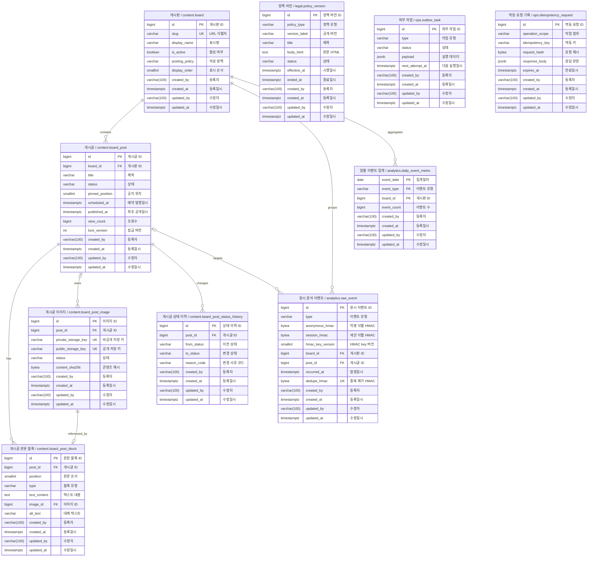

# M0 데이터 모델

- 문서 상태: 설계 계약 검토 완료 · 현행 migration·DB 검증 산출물 없음
- 기준일: 2026-08-15
- 정합성 검토일: 2026-08-19
- DBMS: PostgreSQL 18
- 문자 인코딩: 데이터베이스 `UTF8`
- 시간 기준: `TIMESTAMPTZ(3)`로 절대 시각을 저장하고 DB·session timezone은 UTC, 화면에서 Asia/Seoul 변환

## 1. 모델링 원칙

1. 게시판 내부 식별자와 URL `slug`, 변경 가능한 표시명을 분리한다.
2. 본문은 plain text와 복수 이미지를 순서대로 배치할 수 있게 block으로 저장한다. TEXT block의 입력을 HTML이나 Markdown으로 해석하지 않는다.
3. 공개 이미지는 원본 URL이 아니라 object storage key로 참조한다.
4. 게시 상태 변경과 이력은 같은 transaction에서 저장한다.
5. 물리 삭제보다 공개 상태 차단을 먼저 수행한다.
6. 원시 이용 이벤트는 90일 후 삭제하고 일별 집계만 남긴다.
7. provider·스토리지·컴퓨트 사업자 이름을 핵심 테이블에 넣지 않는다.
8. 모든 schema 변경은 순번 migration으로 적용하고 운영 DB에서 init SQL을 재실행하지 않는다.
9. 논리명은 한국어 업무 용어, 물리명은 `schema.table_name` 형식의 소문자 `snake_case`로 표기하고 double quote를 사용하지 않는다.
10. schema는 `content`, `legal`, `analytics`, `ops`로 나누고 SQL·migration에서 물리명을 schema까지 명시한다.
11. entity PK는 `id`, FK는 논리 entity 기준 `<entity>_id`, URL 식별자는 `slug`, Boolean은 `is_*`, 낙관적 잠금 값은 `lock_version`으로 통일한다. 따라서 `content.board_post.id`를 참조하는 FK와 API 식별자는 각각 `post_id`, `postId`다. 집계·연결 테이블은 의미가 분명할 때 복합 PK를 허용한다.
12. 자동 번호는 `GENERATED BY DEFAULT AS IDENTITY`, JSON document는 `JSONB`, 고정 길이 hash는 `BYTEA`와 길이 `CHECK`를 사용한다.
13. API가 반환하거나 command 처리에 사용하는 값은 반드시 저장 위치 또는 계산 근거를 이 문서에 가진다.
14. 모든 테이블은 `created_by`(등록자), `created_at`(등록일시), `updated_by`(수정자), `updated_at`(수정일시)를 가진다.

`ops.schema_migration`은 애플리케이션 데이터가 아니라 migration runner의 무결성 ledger이므로 14번 감사 컬럼 규칙의 예외다. migrator만 기록하고 application role에는 접근 권한을 주지 않는다.

### 공통 감사 컬럼

| 논리명 | 물리명 | 타입 | 규칙 |
| --- | --- | --- | --- |
| 등록자 | `created_by` | `VARCHAR(100)` | 최초 등록 actor key |
| 등록일시 | `created_at` | `TIMESTAMPTZ(3)` | 최초 등록 시각, UTC |
| 수정자 | `updated_by` | `VARCHAR(100)` | 마지막 수정 actor key |
| 수정일시 | `updated_at` | `TIMESTAMPTZ(3)` | 마지막 수정 시각, UTC |

actor key는 `<주체 유형>:<식별값>` 형식으로 저장한다. migration·scheduler·event worker는 `system:migration`, `system:scheduler`, `system:policy-publisher`, `system:event-ingest`, `system:event-aggregate`, `system:outbox-worker`처럼 고정된 이름을 사용한다. 운영자는 `admin:v<keyVersion>:<base64url(HMAC-SHA-256(operatorId))>`를 사용한다. `operatorId`는 BFF adapter가 외부 identity와 분리해 유지하는 안정적인 내부 식별자이므로 provider를 바꿔도 같은 값을 사용한다. 외부 provider subject 원문은 저장하지 않는다. M1 사용자 actor는 같은 형식의 `user:v<keyVersion>:<HMAC>`을 사용할 수 있다.

등록 시 두 actor와 두 시각은 각각 같은 값으로 시작하고, 변경 시 `updated_by`, `updated_at`만 갱신한다. 수정하지 않는 이력성 행도 네 컬럼을 유지하며 수정 값은 등록 값과 같다. 작성자·소유자처럼 업무상 필요한 주체는 감사 컬럼을 재사용하지 않고 별도 FK로 둔다.

네 컬럼은 모두 `NOT NULL`이며 각 테이블에 아래 공통 제약을 적용한다. `V002` seed와 정책 seed의 actor key는 `system:migration`이다.

```text
CHECK created_by ~ '^(system:(migration|scheduler|event-ingest|event-aggregate|outbox-worker)|(admin|user):v[1-9][0-9]*:[A-Za-z0-9_-]{43})$'
CHECK updated_by ~ '^(system:(migration|scheduler|event-ingest|event-aggregate|outbox-worker)|(admin|user):v[1-9][0-9]*:[A-Za-z0-9_-]{43})$'
CHECK updated_at >= created_at
```

### Schema 경계

| schema | 단계 | 책임 |
| --- | --- | --- |
| `content` | M0 | 게시판·게시글·본문·이미지·상태 이력 |
| `legal` | M0 | 정책 원문과 버전 |
| `analytics` | M0 | 원시 이벤트와 집계 |
| `ops` | M0 | outbox와 멱등 요청 |
| `identity` | M1 예약 | 계정·소셜 연동·동의·session |
| `community` | M1.5 예약 | 댓글·반응·제보 |
| `moderation` | M1.5 예약 | 신고·검토·제재 이력 |

예약 schema와 후속 table은 M0 `V001`에서 만들지 않는다. 해당 단계의 planning과 system-design을 확정한 migration에서 추가한다.

## 2. ERD



Mermaid 내부 entity ID는 관계 연결을 위해 `schema_table`로 두고, 화면 별칭에는 `논리명 / schema.table`을 표시한다. 컬럼은 `물리명` 뒤 주석에 `논리명`을 표시한다.

## 3. 핵심 테이블

### 게시판 — `content.board`

| 열 | 타입 | Null | 설명 |
| --- | --- | --- | --- |
| `id` | `BIGINT GENERATED BY DEFAULT AS IDENTITY` | N | PK, 내부 게시판 식별자 |
| `slug` | `VARCHAR(32)` | N | URL 경로 식별자 |
| `display_name` | `VARCHAR(50)` | N | 화면 표시명 |
| `is_active` | `BOOLEAN` | N | 공개 메뉴·작성 대상 활성 여부 |
| `posting_policy` | `VARCHAR(16)` | N | 작성 주체, M0는 `ADMIN` |
| `display_order` | `SMALLINT` | N | 메뉴 순서, `0 이상` |
| `created_by` | `VARCHAR(100)` | N | 등록자 actor key |
| `created_at` | `TIMESTAMPTZ(3)` | N | 등록일시, UTC |
| `updated_by` | `VARCHAR(100)` | N | 수정자 actor key |
| `updated_at` | `TIMESTAMPTZ(3)` | N | 수정일시, UTC |

제약·인덱스:

```text
PK (id)
UK uq_board__slug (slug)
UK uq_board__display_order (display_order)
CHECK slug ~ '^[a-z0-9]+(?:-[a-z0-9]+)*$'
CHECK length(trim(display_name)) BETWEEN 1 AND 50
CHECK posting_policy IN ('ADMIN', 'USER')
CHECK display_order >= 0
INDEX ix_board__active_order (is_active, display_order)
TRIGGER slug 변경 거부
```

초기 seed는 `slug=meme / 짤 / true / ADMIN / 10` 한 건만 넣는다.

공개 목록·상세 API와 웹 URL은 `boardSlug`를 게시판 경로 변수로 받고 내부 관계와 집계에는 `board_id`를 저장한다. 상세 조회는 `post.id`뿐 아니라 `post.board_id = board.id`를 함께 확인한다. M0에서 seed 후 `slug`는 변경할 수 없고 수정 API도 만들지 않는다. 후속 단계에서 slug 변경이 필요하면 기존 URL을 보존하는 alias·redirect 테이블과 계약을 먼저 설계한 뒤 migration으로 추가한다.

### 게시글 — `content.board_post`

| 열 | 타입 | Null | 설명 |
| --- | --- | --- | --- |
| `id` | `BIGINT GENERATED BY DEFAULT AS IDENTITY` | N | PK, 공개 게시글 식별자 |
| `board_id` | `BIGINT` | N | `content.board` FK |
| `title` | `VARCHAR(200)` | N | 제목, trim 후 1~200자 |
| `source_name` | `VARCHAR(200)` | Y | 외부 콘텐츠 출처명 |
| `source_url` | `VARCHAR(2048)` | Y | 출처 `https` URL |
| `status` | `VARCHAR(20)` | N | 초안·예약·공개·숨김·제거 상태 |
| `pinned_position` | `SMALLINT` | Y | 공지 `1~3`, 일반 글 `NULL` |
| `scheduled_at` | `TIMESTAMPTZ(3)` | Y | 예약 발행 시각 |
| `published_at` | `TIMESTAMPTZ(3)` | Y | 최초 공개 시각, 재공개 시 유지 |
| `view_count` | `BIGINT` | N | 검증된 `POST_VIEW` 누적값, 초기 `0` |
| `lock_version` | `INTEGER` | N | 낙관적 잠금 값, 초기 `1` |
| `created_by` | `VARCHAR(100)` | N | 등록자 actor key |
| `created_at` | `TIMESTAMPTZ(3)` | N | 등록일시, UTC |
| `updated_by` | `VARCHAR(100)` | N | 수정자 actor key |
| `updated_at` | `TIMESTAMPTZ(3)` | N | 수정일시, UTC |

제약·인덱스:

```text
PK (id)
FK (board_id) -> content.board(id) ON UPDATE RESTRICT ON DELETE RESTRICT
CHECK status IN ('DRAFT','SCHEDULED','PUBLISHED','HIDDEN_REVIEW','REMOVED')
CHECK length(trim(title)) BETWEEN 1 AND 200
CHECK pinned_position IS NULL OR pinned_position BETWEEN 1 AND 3
CHECK pinned_position IS NULL OR status IN ('DRAFT','SCHEDULED','PUBLISHED')
CHECK (source_name IS NULL) = (source_url IS NULL)
CHECK source_name IS NULL OR length(trim(source_name)) BETWEEN 1 AND 200
CHECK source_url IS NULL OR source_url ~ '^https://'
CHECK (status='DRAFT' AND scheduled_at IS NULL AND published_at IS NULL)
   OR (status='SCHEDULED' AND scheduled_at IS NOT NULL AND published_at IS NULL)
   OR (status IN ('PUBLISHED','HIDDEN_REVIEW','REMOVED') AND scheduled_at IS NULL AND published_at IS NOT NULL)
CHECK view_count >= 0
CHECK lock_version >= 1
UNIQUE INDEX uq_board_post__published_pin (board_id, pinned_position)
  WHERE status='PUBLISHED' AND pinned_position IS NOT NULL
INDEX ix_board_post__public (board_id, published_at DESC, id DESC)
  WHERE status='PUBLISHED'
INDEX ix_board_post__scheduled (scheduled_at, id)
  WHERE status='SCHEDULED'
INDEX ix_board_post__updated (updated_at, id)
```

숨김 시 `pinned_position`은 `NULL`로 변경한다. 재공개 시 공지 위치는 운영자가 다시 선택한다.

### 게시글 이미지 — `content.board_post_image`

| 열 | 타입 | Null | 설명 |
| --- | --- | --- | --- |
| `id` | `BIGINT GENERATED BY DEFAULT AS IDENTITY` | N | PK, 이미지 자산 식별자 |
| `post_id` | `BIGINT` | Y | staging은 `NULL`, 연결 후 게시글 FK |
| `private_storage_key` | `VARCHAR(512)` | N | 비공개 canonical 원본 key |
| `public_storage_key` | `VARCHAR(512)` | Y | 공개 media object key |
| `status` | `VARCHAR(24)` | N | staging·공개·삭제 상태 |
| `content_sha256` | `BYTEA` | N | 중복·무결성 확인 hash, 32 bytes |
| `mime_type` | `VARCHAR(50)` | N | 검증된 MIME |
| `byte_size` | `INTEGER` | N | 파일 크기, 양수 |
| `width` | `INTEGER` | N | 실제 너비, 양수 |
| `height` | `INTEGER` | N | 실제 높이, 양수 |
| `created_by` | `VARCHAR(100)` | N | 등록자 actor key |
| `created_at` | `TIMESTAMPTZ(3)` | N | 등록일시, UTC |
| `updated_by` | `VARCHAR(100)` | N | 수정자 actor key |
| `updated_at` | `TIMESTAMPTZ(3)` | N | 수정일시, UTC |

```text
PK (id)
FK (post_id) -> content.board_post(id) ON DELETE RESTRICT
UK (private_storage_key)
UNIQUE INDEX uq_board_post_image__public_key (public_storage_key) WHERE public_storage_key IS NOT NULL
UK (post_id, id)
INDEX ix_board_post_image__content_sha256 (content_sha256)
INDEX ix_board_post_image__status_updated (status, updated_at)
CHECK status IN ('STAGED','PUBLIC','PUBLIC_DELETE_PENDING','PRIVATE_REVIEW','PRIVATE_DELETE_PENDING','DELETED')
CHECK octet_length(content_sha256) = 32
CHECK byte_size > 0 AND width > 0 AND height > 0
CHECK (status IN ('PUBLIC','PUBLIC_DELETE_PENDING') AND public_storage_key IS NOT NULL)
   OR (status IN ('STAGED','PRIVATE_REVIEW','PRIVATE_DELETE_PENDING','DELETED') AND public_storage_key IS NULL)
CHECK post_id IS NOT NULL OR status IN ('STAGED','PRIVATE_DELETE_PENDING','DELETED')
```

`content_sha256`는 중복 경고용이며 자동 결합·삭제에는 쓰지 않는다.

업로드 이미지는 `post_id=NULL`, `STAGED`로 시작한다. 초안 저장 transaction이 이미지를 선점하고 IMAGE block을 함께 생성한다. 발행 시 private 원본을 public 영역에 복사하고, 숨김 시 public object 삭제 outbox를 만든다. private 원본은 재공개·복구를 위해 유지한다.

연결 규칙:

- `content.board_post_image.post_id IS NULL`인 이미지는 아직 어떤 block에도 배치되지 않은 staging 자산이다.
- `content.board_post_image.post_id IS NOT NULL`인 이미지는 같은 `post_id`의 IMAGE block 정확히 한 건에서 참조되어야 한다.
- `DRAFT`·`SCHEDULED`에서 block 교체로 빠진 `STAGED` 이미지는 같은 transaction에서 `post_id=NULL`로 해제한다.
- `HIDDEN_REVIEW`의 block 교체는 연결 이미지의 public 삭제가 끝난 뒤 허용한다. 빠진 `PRIVATE_REVIEW` 이미지는 `post_id=NULL`, `PRIVATE_DELETE_PENDING`으로 바꾸고 private 삭제 outbox를 만든다.

복합 FK와 unique index가 소유권·중복 참조를 막는다. 연결 image마다 block이 한 건 있어야 한다는 규칙은 service와 integration test로 검증하며, 필요하면 deferred constraint trigger로 강화한다.

### 게시글 본문 블록 — `content.board_post_block`

| 열 | 타입 | Null | 설명 |
| --- | --- | --- | --- |
| `id` | `BIGINT GENERATED BY DEFAULT AS IDENTITY` | N | PK, block 식별자 |
| `post_id` | `BIGINT` | N | 게시글 FK |
| `position` | `SMALLINT` | N | 본문 순서, 1부터 연속 |
| `type` | `VARCHAR(16)` | N | `TEXT`, `IMAGE` |
| `text_content` | `TEXT` | Y | TEXT block의 plain text |
| `image_id` | `BIGINT` | Y | IMAGE block의 이미지 FK |
| `alt_text` | `VARCHAR(300)` | Y | IMAGE block 대체 텍스트, 1~300자 |
| `created_by` | `VARCHAR(100)` | N | 등록자 actor key |
| `created_at` | `TIMESTAMPTZ(3)` | N | 등록일시, UTC |
| `updated_by` | `VARCHAR(100)` | N | 수정자 actor key |
| `updated_at` | `TIMESTAMPTZ(3)` | N | 수정일시, UTC |

```text
PK (id)
FK (post_id) -> content.board_post(id) ON DELETE RESTRICT
FK (post_id, image_id) -> content.board_post_image(post_id, id) ON DELETE RESTRICT
UK (post_id, position)
UNIQUE INDEX uq_board_post_block__image (image_id) WHERE image_id IS NOT NULL
CHECK position >= 1
CHECK type IN ('TEXT','IMAGE')
CHECK (type='TEXT' AND text_content IS NOT NULL AND image_id IS NULL AND alt_text IS NULL)
   OR (type='IMAGE' AND text_content IS NULL AND image_id IS NOT NULL AND alt_text IS NOT NULL)
CHECK text_content IS NULL OR length(trim(text_content)) BETWEEN 1 AND 20000
CHECK alt_text IS NULL OR length(trim(alt_text)) BETWEEN 1 AND 300
```

TEXT는 plain text로 저장하고 출력 시 escape한다. 이미지 테이블은 파일·storage 상태를, block 테이블은 본문 배치·순서·대체 텍스트를 담당한다.

### 게시글 상태 이력 — `content.board_post_status_history`

| 열 | 타입 | Null | 설명 |
| --- | --- | --- | --- |
| `id` | `BIGINT GENERATED BY DEFAULT AS IDENTITY` | N | PK, 상태 이력 식별자 |
| `post_id` | `BIGINT` | N | 게시글 FK |
| `from_status` | `VARCHAR(20)` | Y | 이전 상태, 최초 생성은 `NULL` |
| `to_status` | `VARCHAR(20)` | N | 변경 후 상태 |
| `reason_code` | `VARCHAR(30)` | N | 변경 사유 코드 |
| `actor_type` | `VARCHAR(16)` | N | `ADMIN`, `SYSTEM` |
| `created_by` | `VARCHAR(100)` | N | 상태 변경 등록자 actor key |
| `created_at` | `TIMESTAMPTZ(3)` | N | 상태 변경 등록일시, UTC |
| `updated_by` | `VARCHAR(100)` | N | 수정자 actor key, 등록 후 변경하지 않음 |
| `updated_at` | `TIMESTAMPTZ(3)` | N | 수정일시, 등록 후 변경하지 않음 |

```text
PK (id)
FK (post_id) -> content.board_post(id) ON DELETE RESTRICT
INDEX ix_board_post_status_history__post_created (post_id, created_at DESC)
INDEX ix_board_post_status_history__reason_created (reason_code, created_at DESC)
CHECK reason_code IN ('CREATE','EDIT','SCHEDULE','PUBLISH','UNSCHEDULE','RIGHTS_EMAIL','REPUBLISH','REMOVE','SYSTEM_DUE')
CHECK from_status IS NULL OR from_status IN ('DRAFT','SCHEDULED','PUBLISHED','HIDDEN_REVIEW','REMOVED')
CHECK to_status IN ('DRAFT','SCHEDULED','PUBLISHED','HIDDEN_REVIEW','REMOVED')
CHECK actor_type IN ('ADMIN','SYSTEM')
```

이메일 본문, 권리 소명 자료와 내부 자유 메모는 이 테이블에 저장하지 않는다.

## 4. 정책 데이터

### 정책 버전 — `legal.policy_version`

| 열 | 타입 | Null | 설명 |
| --- | --- | --- | --- |
| `id` | `BIGINT GENERATED BY DEFAULT AS IDENTITY` | N | PK, 정책 버전 식별자 |
| `policy_type` | `VARCHAR(20)` | N | `TERMS`, `PRIVACY` |
| `version_label` | `VARCHAR(20)` | N | 공개 버전, 예: `v0.3` |
| `title` | `VARCHAR(200)` | N | 버전별 문서 제목 |
| `body_html` | `TEXT` | N | 정제된 버전별 HTML 전문 |
| `status` | `VARCHAR(20)` | N | 초안·시행·종료 상태 |
| `effective_at` | `TIMESTAMPTZ(3)` | Y | 시행 시작 시각 |
| `ended_at` | `TIMESTAMPTZ(3)` | Y | 시행 종료 시각 |
| `created_by` | `VARCHAR(100)` | N | 등록자 actor key |
| `created_at` | `TIMESTAMPTZ(3)` | N | 등록일시, UTC |
| `updated_by` | `VARCHAR(100)` | N | 수정자 actor key |
| `updated_at` | `TIMESTAMPTZ(3)` | N | 수정일시, UTC |

```text
PK (id)
UK uq_policy_version__type_label (policy_type, version_label)
INDEX ix_policy_version__type_status_effective (policy_type, status, effective_at DESC)
UNIQUE INDEX uq_policy_version__effective_one (policy_type)
  WHERE status='EFFECTIVE'
CHECK policy_type IN ('TERMS','PRIVACY')
CHECK length(trim(title)) BETWEEN 1 AND 200
CHECK length(trim(body_html)) > 0
CHECK status IN ('DRAFT','EFFECTIVE','RETIRED')
CHECK (status='DRAFT' AND effective_at IS NULL AND ended_at IS NULL)
   OR (status='EFFECTIVE' AND effective_at IS NOT NULL AND ended_at IS NULL)
   OR (status='RETIRED' AND effective_at IS NOT NULL AND ended_at IS NOT NULL AND ended_at > effective_at)
```

유형별 `EFFECTIVE`는 한 건만 허용한다. 시행된 본문은 수정하지 않고 새 버전을 만든다. 정책 적용 기간은 시작을 포함하고 종료를 포함하지 않는 `[effective_at, ended_at)` 반개방 구간이다. 새 버전의 `effective_at`과 이전 버전의 `ended_at`은 같은 경계 시각을 사용한다. `body_html`은 제한된 문서용 태그와 안전한 링크만 허용하도록 저장 전에 sanitize한다.

M0 정책 시행은 관리자 API나 예약 scheduler로 제공하지 않는다. 승인된 정책 release artifact를 배포 서버에 전달하고 `npm run policies:publish -- --artifact=<path>` 단발성 명령으로 실행한다. artifact에는 유형·버전·제목·정제 전 본문·시행 시각과 checksum을 포함하며, command가 schema와 checksum을 검증하고 본문을 허용 목록으로 sanitize한다. command는 artifact 시행 시각이 서버 현재 시각보다 미래이거나 5분 넘게 과거면 거부한다. 허용 범위에서는 advisory lock으로 정책 유형을 잠근 한 transaction에서 기존 `EFFECTIVE`를 새 버전 `effective_at`과 같은 시각으로 `RETIRED` 처리하고 새 버전을 `EFFECTIVE`로 insert한 뒤 정책 URL cache purge outbox를 기록한다. 시행 시각 이전 자동 전환은 M0 범위가 아니므로 운영자는 고지된 시행 시각에 명령을 실행한다. 5분 window를 놓치면 과거 시각을 강제로 기록하지 않고 새 시행 시각을 반영한 artifact를 다시 승인한다. 실패하면 전체 DB 변경을 rollback하고 기존 정책을 유지한다.

M1의 정책 동의 이력은 문자열 label이 아니라 `legal.policy_version.id`를 FK로 참조한다.

## 5. 분석 데이터

### 원시 분석 이벤트 — `analytics.raw_event`

| 열 | 타입 | Null | 설명 |
| --- | --- | --- | --- |
| `id` | `BIGINT GENERATED BY DEFAULT AS IDENTITY` | N | PK, 원시 이벤트 식별자 |
| `type` | `VARCHAR(30)` | N | 이벤트 유형 |
| `anonymous_hmac` | `BYTEA` | N | 익명 ID HMAC, 32 bytes |
| `session_hmac` | `BYTEA` | N | session ID HMAC, 32 bytes |
| `hmac_key_version` | `SMALLINT` | N | 보정된 `occurred_at`이 속한 schedule의 key 버전 |
| `board_id` | `BIGINT` | N | 게시판 FK |
| `post_id` | `BIGINT` | Y | 대상 게시글 FK |
| `list_page` | `INTEGER` | Y | 조회한 목록 페이지 |
| `item_count` | `SMALLINT` | Y | Core가 계산한 공개 응답 항목 수 |
| `dedupe_hmac` | `BYTEA` | N | 10초 중복 제거 HMAC, 32 bytes |
| `occurred_at` | `TIMESTAMPTZ(3)` | N | 보정된 이벤트 시각 |
| `aggregated_at` | `TIMESTAMPTZ(3)` | Y | 집계 반영 완료 시각 |
| `created_by` | `VARCHAR(100)` | N | 수집 service actor key |
| `created_at` | `TIMESTAMPTZ(3)` | N | 등록일시(서버 수신), UTC |
| `updated_by` | `VARCHAR(100)` | N | 마지막 처리 service actor key |
| `updated_at` | `TIMESTAMPTZ(3)` | N | 수정일시, UTC |

```text
PK (id)
INDEX ix_raw_event__occurred (occurred_at, id)
INDEX ix_raw_event__type_occurred (type, occurred_at)
INDEX ix_raw_event__anonymous_occurred (hmac_key_version, anonymous_hmac, occurred_at)
INDEX ix_raw_event__session (hmac_key_version, session_hmac)
INDEX ix_raw_event__unaggregated (id) WHERE aggregated_at IS NULL
UK uq_raw_event__dedupe_hmac (dedupe_hmac)
FK (board_id) -> content.board(id) ON DELETE RESTRICT
FK (post_id) -> content.board_post(id) ON DELETE RESTRICT
CHECK octet_length(anonymous_hmac) = 32
CHECK octet_length(session_hmac) = 32
CHECK octet_length(dedupe_hmac) = 32
CHECK hmac_key_version >= 1
CHECK list_page IS NULL OR list_page >= 1
CHECK item_count IS NULL OR item_count BETWEEN 0 AND 20
CHECK type IN ('FEED_VIEW','POST_VIEW','DETAIL_LIST_VIEW')
CHECK (type='FEED_VIEW' AND post_id IS NULL AND list_page IS NOT NULL AND item_count IS NOT NULL)
   OR (type='POST_VIEW' AND post_id IS NOT NULL AND list_page IS NULL AND item_count IS NULL)
   OR (type='DETAIL_LIST_VIEW' AND post_id IS NOT NULL AND list_page IS NOT NULL AND item_count IS NOT NULL)
```

`dedupe_hmac`은 이벤트 정보와 서버 수신 시각의 10초 bucket으로 만든다. 중복 요청은 `204`로 처리하며 제목·본문·전체 URL·원본 IP·User-Agent는 저장하지 않는다.

내부 통계 초기화 요청은 보존 중인 모든 HMAC key version으로 전달된 `anonymous_id`와 `session_id`를 계산한 뒤 version과 HMAC이 일치하는 raw 행을 한 transaction에서 삭제한다. 이미 식별자 없이 집계된 일별 수치와 게시글 `view_count`는 역산하지 않는다. API는 삭제 행 수와 식별자 존재 여부를 반환하지 않는다.

### 일별 이벤트 집계 — `analytics.daily_event_metric`

| 열 | 타입 | Null | 설명 |
| --- | --- | --- | --- |
| `event_date` | `DATE` | N | 집계 기준 UTC 날짜 |
| `event_type` | `VARCHAR(30)` | N | 이벤트 유형 |
| `board_id` | `BIGINT` | N | 게시판 FK |
| `event_count` | `BIGINT` | N | 중복 제거 후 이벤트 수 |
| `unique_anonymous_count` | `BIGINT` | N | 일별 distinct `(hmac_key_version, anonymous_hmac)` 수 |
| `created_by` | `VARCHAR(100)` | N | 집계 job actor key |
| `created_at` | `TIMESTAMPTZ(3)` | N | 등록일시, UTC |
| `updated_by` | `VARCHAR(100)` | N | 집계 job actor key |
| `updated_at` | `TIMESTAMPTZ(3)` | N | 수정일시, UTC |

```text
PK (event_date, event_type, board_id)
FK (board_id) -> content.board(id) ON DELETE RESTRICT
CHECK event_type IN ('FEED_VIEW','POST_VIEW','DETAIL_LIST_VIEW')
CHECK event_count >= 0
CHECK unique_anonymous_count >= 0
```

5분 집계 job은 event maintenance advisory lock으로 한 번에 하나만 실행한다. 내부 통계 초기화도 같은 lock을 transaction 동안 사용해 집계 대상 선택과 raw 삭제가 겹치지 않게 한다. `event_count`와 게시글 조회수는 새로 처리한 raw 행만 더하고, `unique_anonymous_count`는 영향받은 날짜·이벤트·게시판의 보존 중인 raw 전체에서 `(hmac_key_version, anonymous_hmac)` distinct를 다시 계산한다. 정상 rotation은 UTC 날짜 경계와 key schedule을 일치시키므로 같은 UTC 일자의 동일 ID는 같은 version을 사용한다. 이 변경과 `aggregated_at` 기록은 같은 transaction에서 처리한다. raw 데이터는 90일 후 삭제하며 daily에는 개인·세션 식별자를 남기지 않는다.

## 6. 외부 작업 재시도

### 외부 작업 — `ops.outbox_task`

DB commit 이후 실행해야 하는 외부 작업을 기록한다.

| 열 | 타입 | Null | 설명 |
| --- | --- | --- | --- |
| `id` | `BIGINT GENERATED BY DEFAULT AS IDENTITY` | N | PK, 작업 식별자 |
| `type` | `VARCHAR(30)` | N | cache·object 작업 유형 |
| `status` | `VARCHAR(20)` | N | 대기·실행·성공·실패·중단 상태 |
| `aggregate_type` | `VARCHAR(20)` | N | `POST`, `IMAGE`, `POLICY` |
| `aggregate_id` | `BIGINT` | N | 대상 aggregate 식별자 |
| `payload` | `JSONB` | N | 실행 payload, token·개인정보 금지 |
| `attempt_count` | `SMALLINT` | N | 실패 누적 횟수, 초기 `0` |
| `next_attempt_at` | `TIMESTAMPTZ(3)` | N | 다음 실행 시각 |
| `last_error_code` | `VARCHAR(50)` | Y | 마지막 오류 분류 코드 |
| `created_by` | `VARCHAR(100)` | N | 등록자 actor key |
| `created_at` | `TIMESTAMPTZ(3)` | N | 등록일시, UTC |
| `updated_by` | `VARCHAR(100)` | N | worker actor key |
| `updated_at` | `TIMESTAMPTZ(3)` | N | 수정일시, UTC |

```text
PK (id)
INDEX ix_outbox_task__due (next_attempt_at, id)
  WHERE status IN ('PENDING','FAILED')
INDEX ix_outbox_task__running (updated_at, id)
  WHERE status='RUNNING'
CHECK type IN ('CACHE_PURGE','OBJECT_DELETE_PUBLIC','OBJECT_DELETE_PRIVATE')
CHECK status IN ('PENDING','RUNNING','SUCCEEDED','FAILED','DEAD')
CHECK aggregate_type IN ('POST','IMAGE','POLICY')
CHECK (type='CACHE_PURGE' AND aggregate_type IN ('POST','POLICY'))
   OR (type IN ('OBJECT_DELETE_PUBLIC','OBJECT_DELETE_PRIVATE') AND aggregate_type='IMAGE')
CHECK aggregate_id > 0
CHECK jsonb_typeof(payload) = 'object'
CHECK attempt_count BETWEEN 0 AND 8
```

worker는 처리할 행을 `FOR UPDATE SKIP LOCKED`로 선점하고 `RUNNING`, `updated_at=now()`로 바꾼 뒤 외부 작업을 실행한다. `RUNNING`이 5분 넘게 유지되면 중단된 작업으로 보고 `FAILED`로 회수한다. 실패·회수 때 `attempt_count`를 올려 지수 backoff를 적용하고 실패가 8회 누적되면 `DEAD`로 전환해 운영 알림을 만든다. cache purge와 object 삭제는 재실행해도 같은 결과가 되도록 처리한다.

`OBJECT_DELETE_PUBLIC` payload에는 token이 아닌 public storage key와 그 key로 결정되는 정확한 CDN URL을 넣는다. worker는 public object를 멱등 삭제한 뒤 CDN URL을 purge하고, 두 작업이 모두 성공한 경우에만 image를 `PRIVATE_REVIEW`로 바꾼다. purge 또는 삭제가 실패하면 image는 `PUBLIC_DELETE_PENDING`에 남고 같은 전체 순서를 재시도한다. object를 먼저 삭제하므로 purge 재시도 중 원본에서 cache가 다시 채워지지 않는다. `CACHE_PURGE`의 `POST` payload는 영향받는 목록·상세 URL을 담는다. `POLICY` payload는 `/api/v1/policies/:type`과 해당 `/terms` 또는 `/privacy` 직접 경로를 함께 담는다.

### 멱등 요청 기록 — `ops.idempotency_request`

초안 생성·발행·예약·예약 취소·숨김·재공개·삭제 command의 재전송 결과를 보존한다.

| 열 | 타입 | Null | 설명 |
| --- | --- | --- | --- |
| `id` | `BIGINT GENERATED BY DEFAULT AS IDENTITY` | N | PK, 멱등 요청 식별자 |
| `operation_scope` | `VARCHAR(120)` | N | HTTP method·route pattern |
| `idempotency_key` | `VARCHAR(128)` | N | client opaque key |
| `request_hash` | `BYTEA` | N | 요청 본문 SHA-256, 32 bytes |
| `response_status` | `SMALLINT` | N | 완료 HTTP status |
| `response_body` | `JSONB` | N | 재전송할 성공 `data` |
| `resource_type` | `VARCHAR(20)` | N | 대상 유형, M0는 `POST` |
| `resource_id` | `BIGINT` | N | 대상 게시글 식별자 |
| `expires_at` | `TIMESTAMPTZ(3)` | N | key 만료 시각 |
| `created_by` | `VARCHAR(100)` | N | 요청 등록자 actor key |
| `created_at` | `TIMESTAMPTZ(3)` | N | 등록일시(최초 수신), UTC |
| `updated_by` | `VARCHAR(100)` | N | 수정자 actor key, 등록 후 변경하지 않음 |
| `updated_at` | `TIMESTAMPTZ(3)` | N | 수정일시, 등록 후 변경하지 않음 |

```text
PK (id)
UK uq_idempotency_request__actor_scope_key (created_by, operation_scope, idempotency_key)
INDEX ix_idempotency_request__expires (expires_at)
INDEX ix_idempotency_request__resource (resource_type, resource_id, created_at DESC)
CHECK octet_length(request_hash) = 32
CHECK response_status BETWEEN 200 AND 299
CHECK jsonb_typeof(response_body) = 'object'
CHECK resource_type = 'POST'
CHECK resource_id > 0
CHECK expires_at > created_at
```

command transaction은 actor·scope·key의 hash로 `pg_try_advisory_xact_lock`을 먼저 얻는다. lock을 얻지 못하면 `IDEMPOTENCY_IN_PROGRESS`다. lock을 얻은 뒤 같은 actor·scope·key의 행이 있으면 request hash가 같을 때 저장된 결과를 새 request ID envelope로 반환하고, 다르면 `IDEMPOTENCY_CONFLICT`다. 행이 없으면 도메인 변경·상태 이력·outbox·완료 결과 insert를 한 transaction에서 commit한다. key는 완료 후 24시간 보존한다.

## 7. 상태 전이

| 현재 | 허용 다음 상태 | 추가 조건 |
| --- | --- | --- |
| 없음 | `DRAFT` | title과 block 1개 이상 |
| `DRAFT` | `SCHEDULED` | 미래 `scheduled_at`, 공개 가능한 이미지 |
| `DRAFT` | `PUBLISHED` | source pair·block·이미지 검증 통과 |
| `SCHEDULED` | `DRAFT` | 예약 취소 |
| `SCHEDULED` | `PUBLISHED` | 예약 도래 또는 운영자 즉시 발행 |
| `PUBLISHED` | `HIDDEN_REVIEW` | `RIGHTS_EMAIL` 등 사유 |
| `HIDDEN_REVIEW` | `PUBLISHED` | 운영자 재검토·cache purge, 기존 `published_at` 유지 |
| `HIDDEN_REVIEW` | `REMOVED` | 최종 삭제 결정 |
| `REMOVED` | 없음 | terminal state |

모든 command는 요청의 `lock_version`과 DB 값을 비교한다. 다르면 `409 POST_VERSION_CONFLICT`를 반환한다.

## 8. 페이지 계산

### 일반 목록

- page size: `20`
- 정렬: `published_at DESC, id DESC`
- 공지: 별도 query 0~3건
- 일반 글: `pinned_position IS NULL`만 count·page 계산
- M0는 전체 일반 글이 적으므로 `LIMIT 20 OFFSET (page-1)*20`을 사용한다.

### 상세의 현재 페이지

현재 글보다 앞에 있는 공개 일반 글 수를 같은 정렬 기준으로 계산한다.

```text
newer_count = COUNT(
  published_at > current.published_at
  OR (published_at = current.published_at AND id > current.id)
)
list_page = FLOOR(newer_count / 20) + 1
```

현재 글이 공지면 `list_page=1`로 반환하고 공지 영역에서 현재 행을 강조한다.

## 9. 보존과 삭제

| 데이터 | 보존 |
| --- | --- |
| 게시글·상태 이력 | 운영 중 유지, `REMOVED`도 물리 삭제하지 않음 |
| public image | 숨김 후 우선순위 outbox로 삭제하고 cache purge |
| private 원본 | 게시글 `REMOVED` 후 30일 복구 유예 뒤 삭제 |
| staging orphan 이미지 | 생성 후 24시간 미참조 시 삭제 후보 |
| 원시 이벤트 | 90일 |
| 일별 집계 | 개인 식별 없이 운영 기간 유지 |
| outbox 성공 행 | 30일 |
| outbox DEAD 행 | 해결 후 90일 |
| idempotency key | 완료 후 24시간 |
| 정책 본문 | 모든 시행 버전 유지 |

## 10. 기존 DB와 migration 경계

현재 브랜치에는 DB 초기화 파일과 M0 migration 실행 산출물이 없다. 과거 `init.sql`은 기존 회원
CMS 실험 스키마를 PostgreSQL 개발 연결 확인용으로 옮긴 파일이었으며 M0 운영 스키마의 정본이
아니었다. 문서가 이전에 참조한 `migrate.js`, `V001`, `V002`는 Git 전체 이력에서도 추적된
파일을 확인하지 못했으므로 구현 완료 증거로 사용하지 않는다.

향후 M0 migration은 `V001__name.sql` 형식으로 관리하고 `ops.schema_migration`에 version,
filename, SHA-256 checksum과 적용 시각을 기록한다. runner는 PostgreSQL advisory lock으로
동시 실행을 직렬화하고 migration 한 건을 한 transaction으로 적용한다. 이미 적용된 파일이
없어지거나 checksum이 바뀌면 실행을 중단해야 한다.

- `V001__create_m0_schema.sql`: `content`, `legal`, `analytics`, `ops`와 M0 애플리케이션 테이블·제약·인덱스
- `V002__seed_m0_reference_data.sql`: `meme / 짤 / true / ADMIN / 10` seed
- 개발 연결 확인용 init SQL은 운영 migration과 분리한다.
- 출시할 약관·개인정보처리방침은 본문 확정 후 별도 순번 seed migration으로 추가한다.

## 11. 실행 준비 gate

현재 실행 산출물이 없으므로 아래 항목은 모두 미검증 상태다. 향후 실제 migration·test 파일과
실행 결과를 함께 확인한 항목만 완료로 바꾼다.

- [ ] `V001`에 application schema, 모든 table·constraint·partial index·composite FK를 PostgreSQL DDL로 구현
- [ ] `V002`에 `meme / 짤 / true / ADMIN / 10` seed 구현
- [ ] 출시 확정된 약관·개인정보처리방침 version을 별도 seed migration으로 구현
- [ ] 빈 PostgreSQL 18에 `V001 -> V002` 순차·동시 적용 test
- [ ] 동일 migration 재실행 차단, checksum 변경 거부와 적용 version 확인 test
- [ ] 이미지 선점 경쟁, 연결 image당 IMAGE block 정확히 한 건, 숨김 글 image 제거, block `alt_text`, 공지 순서 충돌, 낙관적 잠금, 멱등 key 경쟁 integration test
- [ ] 상태별 시각 column과 정책 상태 제약 test
- [ ] 이벤트 집계 job 재시작 시 `view_count` 중복 증가 방지, 여러 batch의 일별 순 사용자 중복 제거와 key version별 초기화 경쟁 test
- [ ] 집계 완료 후 90일이 지난 raw 이벤트 삭제와 일별 집계 보존 test
- [ ] 중단된 `RUNNING` outbox 회수와 실패 8회 `DEAD` 전환 test
- [ ] 재공개 시 최초 `published_at` 유지와 private image 재승격 test
- [ ] `REMOVED` 전이와 private 원본 30일 지연 삭제 test
- [ ] rollback·restore 환경에 migration version 검증 추가

모든 항목이 통과하기 전에는 데이터 계층을 “구현 준비 완료” 또는 “구현 완료”로 표시하지 않는다.
