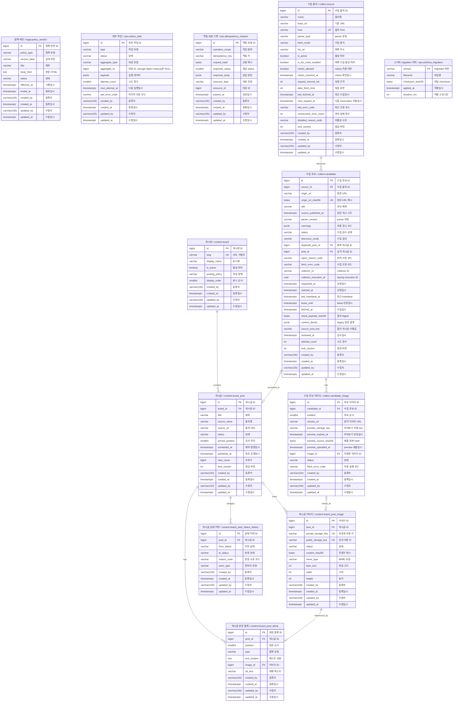

# M0 데이터 모델

M1 회원·M1.5 익게의 추가 계약은 [회원·익게 기술 설계](06-member-community-design.md)를 따른다. 이 문서의 M0 한정 계약과 구분한다.
- 문서 상태: M0 데이터 계약 · Core/legacy/direct 저장 경계와 구현 차이 명시
- 최초 기준일: 2026-09-04
- 문서 대조일: 2026-09-24 (DDL 파일 대조, DB 재조회 아님)
- DBMS: PostgreSQL 18
- 문자 인코딩: 데이터베이스 `UTF8`
- 시간 기준: `TIMESTAMPTZ(3)`로 절대 시각을 저장하고 DB·session timezone은 UTC, 화면에서 Asia/Seoul 변환

## 1. 모델링 원칙

1. 게시판 내부 식별자와 URL `slug`, 변경 가능한 표시명을 분리한다.
2. 본문은 plain text와 복수 이미지를 순서대로 배치할 수 있게 block으로 저장한다. TEXT block의 입력을 HTML이나 Markdown으로 해석하지 않는다.
3. 공개 이미지는 원본 URL이 아니라 object storage key로 참조한다.
4. 게시 상태 변경과 이력은 같은 transaction에서 저장한다.
5. 물리 삭제보다 공개 상태 차단을 먼저 수행한다.
6. provider·스토리지·컴퓨트 사업자 이름을 핵심 테이블에 넣지 않는다.
7. 모든 schema 변경은 순번 migration으로 적용하고 운영 DB에서 init SQL을 재실행하지 않는다.
8. 논리명은 한국어 업무 용어, 물리명은 `schema.table_name` 형식의 소문자 `snake_case`로 표기하고 double quote를 사용하지 않는다.
9. schema는 `content`, `legal`, `ops`, `collect`로 나누고 SQL·migration에서 물리명을 schema까지 명시한다.
10. entity PK는 `id`, FK는 논리 entity 기준 `<entity>_id`, URL 식별자는 `slug`, Boolean은 `is_*`, 낙관적 잠금 값은 `lock_version`으로 통일한다. 따라서 `content.board_post.id`를 참조하는 FK와 API 식별자는 각각 `post_id`, `postId`다. 연결 테이블은 의미가 분명할 때 복합 PK를 허용한다.
11. 자동 번호는 `GENERATED BY DEFAULT AS IDENTITY`, JSON document는 `JSONB`, 고정 길이 hash는 `BYTEA`와 길이 `CHECK`를 사용한다.
12. API가 반환하거나 command 처리에 사용하는 값은 반드시 저장 위치 또는 계산 근거를 이 문서에 가진다.
13. Core 업무 테이블의 공통 감사 계약은 `created_by`(등록자), `created_at`(등록일시), `updated_by`(수정자), `updated_at`(수정일시)다. 실제 적용 범위와 예외는 아래에서 구분한다.

`ops.schema_migration`은 애플리케이션 데이터가 아니라 migration runner의 무결성 ledger이므로 13번 감사 컬럼 규칙의 예외다. migrator만 기록하고 application role에는 접근 권한을 주지 않는다.
V001의 Core 8개 테이블·V003 예약 알림·V004 legacy 출처/후보/이미지에는 공통 감사 컬럼을 적용한다.
V005 receipt/quota/event, V007 discovery 설정과 direct batch/API review는 별도 식별자·시각·version·actor 구조를 사용한다.
모든 테이블에 같은 4개 컬럼이 있다고 가정하지 않는다. 후속 감사 정보의 충분성은 별도 수용 조건이며,
문서 갱신을 이유로 적용된 migration의 checksum을 바꾸지 않는다.

### M0.5 본문 HTML 저장 구조 전환 목표

현행 M0 Core는 `content.board_post_block`의 `TEXT/IMAGE` block 구조를 사용한다. 운영 인수 중인 M0 release에는 이 구조를 유지한다. 사용자 결정으로 후속 `M0.5 body-html`에서는 운영 게시글 저장 구조를 `body_html` 단일 본문과 별도 image reference 검증으로 전환한다.

목표 계약:

- `collect` schema의 원문·검수 자료는 `TEXT/IMAGE/LINK` block 단위 보관을 유지한다.
- 수집 검수 화면도 block 단위로 표시해 parser 결과, 이미지 누락, SNS·첨부 순서를 검토할 수 있게 한다.
- 검수 승인 또는 수동 작성 저장 시점에만 게시글 본문을 허용 HTML로 변환해 `content` schema에 저장한다.
- 저장 HTML은 sanitize된 제한 태그만 허용하며 script, style, iframe, SVG, 이벤트 속성, inline style, 임의 외부 URL fetch 지시를 금지한다.
- 게시글 이미지는 별도 image row가 소유하고, HTML 안의 image 참조는 해당 post가 소유한 image id 또는 안정적인 내부 token으로만 표현한다.
- 렌더링 단계가 image row를 조회해 public URL, alt, width, height를 조립한다. public object key나 signed URL을 `body_html`에 고정하지 않는다.
- migration은 기존 `content.board_post_block`을 `body_html`로 변환하고, 읽기 호환 기간·rollback 또는 재생성 경로를 명시한다.

미확정 항목:

- `body_html`을 `content.board_post`에 둘지, 별도 `content.board_post_body` 테이블로 둘지.
- HTML 내부 image 참조를 `data-image-id`로 둘지, 별도 위치 테이블로 분리할지.
- 기존 `content.board_post_block`의 제거 시점과 운영 rollback 보존 기간.

### 공통 감사 컬럼

| 논리명 | 물리명 | 타입 | 규칙 |
| --- | --- | --- | --- |
| 등록자 | `created_by` | `VARCHAR(100)` | 최초 등록 actor key |
| 등록일시 | `created_at` | `TIMESTAMPTZ(3)` | 최초 등록 시각, UTC |
| 수정자 | `updated_by` | `VARCHAR(100)` | 마지막 수정 actor key |
| 수정일시 | `updated_at` | `TIMESTAMPTZ(3)` | 마지막 수정 시각, UTC |

actor key는 `<주체 유형>:<식별값>` 형식으로 저장한다. migration·scheduler·정책 시행·수집 실행
주체는 `system:migration`, `system:scheduler`, `system:policy-publisher`, `system:outbox-worker`,
`system:collector`를 사용한다. 아래 CHECK 정규식의 허용 목록과 이 목록은 항상 같아야 하며, 새
system actor를 추가할 때 두 곳을 같은 migration에서 함께 바꾼다. 운영자는
`admin:v<keyVersion>:<base64url(HMAC-SHA-256(operatorId))>`를 사용한다. `operatorId`는 BFF
adapter가 외부 identity와 분리해 유지하는 안정적인 내부 식별자이므로 provider를 바꿔도 같은
값을 사용한다. 외부 provider subject 원문은 저장하지 않는다. M1 사용자 actor는 같은 형식의
`user:v<keyVersion>:<HMAC>`을 사용할 수 있다.

등록 시 두 actor와 두 시각은 각각 같은 값으로 시작하고, 변경 시 `updated_by`, `updated_at`만 갱신한다. 수정하지 않는 이력성 행도 네 컬럼을 유지하며 수정 값은 등록 값과 같다. 작성자·소유자처럼 업무상 필요한 주체는 감사 컬럼을 재사용하지 않고 별도 FK로 둔다.

네 컬럼은 모두 `NOT NULL`이며 각 테이블에 아래 공통 제약을 적용한다. `V002` seed와 정책 seed의 actor key는 `system:migration`이다.

```text
CHECK created_by ~ '^(system:(migration|scheduler|policy-publisher|outbox-worker|collector)|(admin|user):v[1-9][0-9]*:[A-Za-z0-9_-]{43})$'
CHECK updated_by ~ '^(system:(migration|scheduler|policy-publisher|outbox-worker|collector)|(admin|user):v[1-9][0-9]*:[A-Za-z0-9_-]{43})$'
CHECK updated_at >= created_at
```

### Schema 경계

| schema | 단계 | 책임 |
| --- | --- | --- |
| `content` | M0 Core | 게시판·게시글·본문·이미지·상태 이력 |
| `legal` | M0 Core | 정책 원문과 버전 |
| `ops` | M0 Core | outbox와 멱등 요청 |
| `collect` | M0 수집 보조·자동 수집 | legacy 출처/후보, batch 소유 결과/queue, API 소유 검수. 같은 schema여도 소유권·role 분리 |
| `identity` | M1 확장 계약 | 계정·소셜 연동·동의·session |
| `community` | M1.5 확장 계약 | 글 소유자·글별 랜덤 이름·댓글 (반응은 범위 밖) |
| `moderation` | M1.5 확장 계약 | 신고·검토·제재 이력 |

후속 단계 schema와 table은 `M0 Core` `V001`에서 만들지 않는다. 해당 단계의 planning과
system-design을 확정한 migration에서 추가한다.

## 2. ERD

아래는 Core와 legacy 주요 테이블의 관계도다. V005 receipt/quota/event와 direct batch 전체는 후반의 별도
저장 계약을 따른다. 테이블 설명의 최종 타입·제약은 연결한 순번 migration을 함께 대조한다.


```mermaid
erDiagram
  content_board["게시판 / content.board"] {
    bigint id PK "게시판 ID"
    varchar slug UK "URL 식별자"
    varchar display_name "표시명"
    boolean is_active "활성 여부"
    varchar posting_policy "작성 정책"
    smallint display_order "표시 순서"
    varchar(100) created_by "등록자"
    timestamptz created_at "등록일시"
    varchar(100) updated_by "수정자"
    timestamptz updated_at "수정일시"
  }
  content_board_post["게시글 / content.board_post"] {
    bigint id PK "게시글 ID"
    bigint board_id FK "게시판 ID"
    varchar title "제목"
    varchar source_name "출처명"
    varchar source_url "출처 URL"
    varchar status "상태"
    smallint pinned_position "공지 위치"
    timestamptz scheduled_at "예약 발행일시"
    timestamptz published_at "최초 공개일시"
    bigint view_count "조회수"
    int lock_version "잠금 버전"
    varchar(100) created_by "등록자"
    timestamptz created_at "등록일시"
    varchar(100) updated_by "수정자"
    timestamptz updated_at "수정일시"
  }
  content_board_post_block["게시글 본문 블록 / content.board_post_block"] {
    bigint id PK "본문 블록 ID"
    bigint post_id FK "게시글 ID"
    smallint position "본문 순서"
    varchar type "블록 유형"
    text text_content "텍스트 내용"
    bigint image_id FK "이미지 ID"
    varchar alt_text "대체 텍스트"
    varchar(100) created_by "등록자"
    timestamptz created_at "등록일시"
    varchar(100) updated_by "수정자"
    timestamptz updated_at "수정일시"
  }
  content_board_post_image["게시글 이미지 / content.board_post_image"] {
    bigint id PK "이미지 ID"
    bigint post_id FK "게시글 ID"
    varchar private_storage_key UK "비공개 저장 키"
    varchar public_storage_key UK "공개 저장 키"
    varchar status "상태"
    bytea content_sha256 "콘텐츠 해시"
    varchar mime_type "MIME 유형"
    int byte_size "파일 크기"
    int width "너비"
    int height "높이"
    varchar(100) created_by "등록자"
    timestamptz created_at "등록일시"
    varchar(100) updated_by "수정자"
    timestamptz updated_at "수정일시"
  }
  content_board_post_status_history["게시글 상태 이력 / content.board_post_status_history"] {
    bigint id PK "상태 이력 ID"
    bigint post_id FK "게시글 ID"
    varchar from_status "이전 상태"
    varchar to_status "변경 상태"
    varchar reason_code "변경 사유 코드"
    varchar actor_type "행위자 유형"
    varchar(100) created_by "등록자"
    timestamptz created_at "등록일시"
    varchar(100) updated_by "수정자"
    timestamptz updated_at "수정일시"
  }
  legal_policy_version["정책 버전 / legal.policy_version"] {
    bigint id PK "정책 버전 ID"
    varchar policy_type "정책 유형"
    varchar version_label "공개 버전"
    varchar title "제목"
    text body_html "본문 HTML"
    varchar status "상태"
    timestamptz effective_at "시행일시"
    timestamptz ended_at "종료일시"
    varchar(100) created_by "등록자"
    timestamptz created_at "등록일시"
    varchar(100) updated_by "수정자"
    timestamptz updated_at "수정일시"
  }
  ops_outbox_task["외부 작업 / ops.outbox_task"] {
    bigint id PK "외부 작업 ID"
    varchar type "작업 유형"
    varchar status "상태"
    varchar aggregate_type "대상 유형"
    bigint aggregate_id "대상 ID, storage object cleanup은 NULL"
    jsonb payload "실행 데이터"
    smallint attempt_count "시도 횟수"
    timestamptz next_attempt_at "다음 실행일시"
    varchar last_error_code "마지막 오류 코드"
    varchar(100) created_by "등록자"
    timestamptz created_at "등록일시"
    varchar(100) updated_by "수정자"
    timestamptz updated_at "수정일시"
  }
  ops_idempotency_request["멱등 요청 기록 / ops.idempotency_request"] {
    bigint id PK "멱등 요청 ID"
    varchar operation_scope "작업 범위"
    varchar idempotency_key "멱등 키"
    bytea request_hash "요청 해시"
    smallint response_status "응답 status"
    jsonb response_body "응답 본문"
    varchar resource_type "대상 유형"
    bigint resource_id "대상 ID"
    timestamptz expires_at "만료일시"
    varchar(100) created_by "등록자"
    timestamptz created_at "등록일시"
    varchar(100) updated_by "수정자"
    timestamptz updated_at "수정일시"
  }

  collect_source["수집 출처 / collect.source"] {
    bigint id PK "수집 출처 ID"
    varchar name "출처명"
    varchar base_url "기준 URL"
    varchar host UK "출처 host"
    varchar parser_type "parser 유형"
    varchar fetch_mode "수집 방식"
    varchar list_url "목록 주소"
    boolean is_active "활성 여부"
    boolean is_list_crawl_enabled "목록 수집 활성 여부"
    boolean robots_allowed "robots 허용 여부"
    timestamptz robots_checked_at "robots 확인일시"
    int request_interval_ms "요청 간격"
    int daily_fetch_limit "일일 상한"
    timestamptz last_fetched_at "최근 수집일시"
    timestamptz next_request_at "다음 reservation 허용일시"
    varchar last_error_code "최근 오류 코드"
    int consecutive_error_count "연속 실패 횟수"
    varchar disabled_reason_code "비활성 사유"
    int lock_version "잠금 버전"
    varchar(100) created_by "등록자"
    timestamptz created_at "등록일시"
    varchar(100) updated_by "수정자"
    timestamptz updated_at "수정일시"
  }
  collect_candidate["수집 후보 / collect.candidate"] {
    bigint id PK "수집 후보 ID"
    bigint source_id FK "수집 출처 ID"
    varchar origin_url "원문 URL"
    bytea origin_url_sha256 UK "원문 URL 해시"
    varchar title "후보 제목"
    timestamptz source_published_at "원문 게시 시각"
    varchar parser_version "parser 버전"
    jsonb warnings "추출 경고 코드"
    varchar status "수집·검수 상태"
    varchar discovery_mode "수집 경로"
    bigint duplicate_post_id FK "중복 게시글 ID"
    bigint post_id FK "승격 게시글 ID"
    varchar reject_reason_code "반려 사유 코드"
    varchar fetch_error_code "수집 오류 코드"
    varchar collector_id "collector ID"
    uuid collector_execution_id "Spring execution ID"
    timestamptz requested_at "요청일시"
    timestamptz claimed_at "선점일시"
    timestamptz last_heartbeat_at "최근 heartbeat"
    timestamptz lease_until "lease 만료일시"
    timestamptz fetched_at "수집일시"
    bytea result_payload_sha256 "결과 digest"
    jsonb content_blocks "legacy 원문 블록"
    varchar source_post_key "출처 게시글 식별값"
    timestamptz reviewed_at "검수일시"
    int attempt_count "시도 횟수"
    int lock_version "잠금 버전"
    varchar(100) created_by "등록자"
    timestamptz created_at "등록일시"
    varchar(100) updated_by "수정자"
    timestamptz updated_at "수정일시"
  }
  collect_candidate_image["수집 후보 이미지 / collect.candidate_image"] {
    bigint id PK "후보 이미지 ID"
    bigint candidate_id FK "수집 후보 ID"
    smallint position "후보 순서"
    varchar remote_url "원격 이미지 URL"
    varchar preview_storage_key "미리보기 저장 key"
    timestamptz preview_expires_at "미리보기 만료일시"
    bytea preview_source_sha256 "제출 원본 hash"
    timestamptz preview_uploaded_at "preview 제출일시"
    bigint image_id FK "저장된 이미지 ID"
    varchar status "상태"
    varchar fetch_error_code "저장 실패 코드"
    varchar(100) created_by "등록자"
    timestamptz created_at "등록일시"
    varchar(100) updated_by "수정자"
    timestamptz updated_at "수정일시"
  }
  ops_schema_migration["스키마 migration 이력 / ops.schema_migration"] {
    varchar version PK "migration 버전"
    varchar filename "파일명"
    bytea checksum_sha256 "파일 checksum"
    timestamptz applied_at "적용일시"
    int duration_ms "적용 소요시간"
  }

  content_board ||--o{ content_board_post : contains
  content_board_post ||--o{ content_board_post_block : has
  content_board_post |o--o{ content_board_post_image : owns
  content_board_post_image ||--o| content_board_post_block : referenced_by
  content_board_post ||--o{ content_board_post_status_history : changes
  collect_source ||--o{ collect_candidate : discovers
  collect_candidate ||--o{ collect_candidate_image : has
  collect_candidate_image |o--o| content_board_post_image : stored_as
  collect_candidate |o--o| content_board_post : promoted_to
```

Mermaid 내부 entity ID는 관계 연결을 위해 `schema_table`로 두고, 화면 별칭에는 `논리명 / schema.table`을 표시한다. 컬럼은 `물리명` 뒤 주석에 `논리명`을 표시한다. ERD와 아래 테이블 정의의 컬럼 집합은 같아야 한다. 컬럼을 추가·삭제하면 두 곳을 같은 변경에서 함께 고친다.

## 3. 핵심 테이블

### 게시판 — `content.board`

| 열 | 타입 | Null | 설명 |
| --- | --- | --- | --- |
| `id` | `BIGINT GENERATED BY DEFAULT AS IDENTITY` | N | PK, 내부 게시판 식별자 |
| `slug` | `VARCHAR(32)` | N | URL 경로 식별자 |
| `display_name` | `VARCHAR(50)` | N | 화면 표시명 |
| `is_active` | `BOOLEAN` | N | 공개 메뉴·작성 대상 활성 여부 |
| `posting_policy` | `VARCHAR(16)` | N | 작성 주체, M0는 `ADMIN` |
| `display_order` | `SMALLINT` | N | 메뉴 순서, `0 이상` |
| `created_by` | `VARCHAR(100)` | N | 등록자 actor key |
| `created_at` | `TIMESTAMPTZ(3)` | N | 등록일시, UTC |
| `updated_by` | `VARCHAR(100)` | N | 수정자 actor key |
| `updated_at` | `TIMESTAMPTZ(3)` | N | 수정일시, UTC |

제약·인덱스:

```text
PK (id)
UK uq_board__slug (slug)
UK uq_board__display_order (display_order)
CHECK slug ~ '^[a-z0-9]+(?:-[a-z0-9]+)*$'
CHECK length(trim(display_name)) BETWEEN 1 AND 50
CHECK posting_policy IN ('ADMIN', 'USER')
CHECK display_order >= 0
INDEX ix_board__active_order (is_active, display_order)
TRIGGER slug 변경 거부
```

초기 seed는 `slug=meme / 짤 / true / ADMIN / 10` 한 건만 넣는다.

공개 목록·상세 API와 웹 URL은 `boardSlug`를 게시판 경로 변수로 받고 내부 관계와 집계에는 `board_id`를 저장한다. 상세 조회는 `post.id`뿐 아니라 `post.board_id = board.id`를 함께 확인한다. M0에서 seed 후 `slug`는 변경할 수 없고 수정 API도 만들지 않는다. 후속 단계에서 slug 변경이 필요하면 기존 URL을 보존하는 alias·redirect 테이블과 계약을 먼저 설계한 뒤 migration으로 추가한다.

### 게시글 — `content.board_post`

| 열 | 타입 | Null | 설명 |
| --- | --- | --- | --- |
| `id` | `BIGINT GENERATED BY DEFAULT AS IDENTITY` | N | PK, 공개 게시글 식별자 |
| `board_id` | `BIGINT` | N | `content.board` FK |
| `title` | `VARCHAR(200)` | N | 제목, trim 후 1~200자 |
| `source_name` | `VARCHAR(200)` | Y | 외부 콘텐츠 출처명 |
| `source_url` | `VARCHAR(2048)` | Y | 출처 `https` URL |
| `status` | `VARCHAR(20)` | N | 초안·예약·공개·숨김·제거 상태 |
| `pinned_position` | `SMALLINT` | Y | 공지 `1~3`, 일반 글 `NULL` |
| `scheduled_at` | `TIMESTAMPTZ(3)` | Y | 예약 발행 시각 |
| `published_at` | `TIMESTAMPTZ(3)` | Y | 최초 공개 시각, 재공개 시 유지 |
| `view_count` | `BIGINT` | N | 공개 상세 화면의 참고용 누적 조회 수, 초기 `0` |
| `lock_version` | `INTEGER` | N | 낙관적 잠금 값, 초기 `1` |
| `created_by` | `VARCHAR(100)` | N | 등록자 actor key |
| `created_at` | `TIMESTAMPTZ(3)` | N | 등록일시, UTC |
| `updated_by` | `VARCHAR(100)` | N | 수정자 actor key |
| `updated_at` | `TIMESTAMPTZ(3)` | N | 수정일시, UTC |

제약·인덱스:

```text
PK (id)
FK (board_id) -> content.board(id) ON UPDATE RESTRICT ON DELETE RESTRICT
CHECK status IN ('DRAFT','SCHEDULED','PUBLISHED','HIDDEN_REVIEW','REMOVED')
CHECK length(trim(title)) BETWEEN 1 AND 200
CHECK pinned_position IS NULL OR pinned_position BETWEEN 1 AND 3
CHECK pinned_position IS NULL OR status IN ('DRAFT','SCHEDULED','PUBLISHED')
CHECK (source_name IS NULL) = (source_url IS NULL)
CHECK source_name IS NULL OR length(trim(source_name)) BETWEEN 1 AND 200
CHECK source_url IS NULL OR source_url ~ '^https://'
CHECK (status='DRAFT' AND scheduled_at IS NULL AND published_at IS NULL)
   OR (status='SCHEDULED' AND scheduled_at IS NOT NULL AND published_at IS NULL)
   OR (status IN ('PUBLISHED','HIDDEN_REVIEW','REMOVED') AND scheduled_at IS NULL AND published_at IS NOT NULL)
CHECK view_count >= 0
CHECK lock_version >= 1
UNIQUE INDEX uq_board_post__active_pin (board_id, pinned_position)
  WHERE status IN ('SCHEDULED','PUBLISHED') AND pinned_position IS NOT NULL
INDEX ix_board_post__public (board_id, published_at DESC, id DESC)
  WHERE status='PUBLISHED'
INDEX ix_board_post__scheduled (scheduled_at, id)
  WHERE status='SCHEDULED'
INDEX ix_board_post__updated (updated_at, id)
```

숨김 시 `pinned_position`은 `NULL`로 변경한다. 재공개 시 공지 위치는 운영자가 다시 선택한다.

`view_count` 증가는 콘텐츠 수정이 아니므로 `updated_by`, `updated_at`, `lock_version`을 바꾸지
않는다. 조회 수 endpoint는 공개 상태와 게시판 소속 조건을 포함한 단일 원자 증가 SQL로 경쟁을
처리한다. 이 예외는 조회 수 컬럼에만 적용한다.

공지 위치 unique index는 `SCHEDULED`와 `PUBLISHED`를 함께 덮는다. 따라서 예약 등록·수정 시점에 중복이 `409 PINNED_ORDER_CONFLICT`로 걸러지고, due 발행이 공지 위치 제약으로 실패하는 상황을 만들지 않는다. `DRAFT`는 제약 대상이 아니므로 초안 여러 건이 같은 위치를 임시로 가질 수 있고, 예약 또는 발행 시점에 검증한다.

### 게시글 이미지 — `content.board_post_image`

| 열 | 타입 | Null | 설명 |
| --- | --- | --- | --- |
| `id` | `BIGINT GENERATED BY DEFAULT AS IDENTITY` | N | PK, 이미지 자산 식별자 |
| `post_id` | `BIGINT` | Y | staging은 `NULL`, 연결 후 게시글 FK |
| `private_storage_key` | `VARCHAR(512)` | N | 비공개 canonical 원본 key |
| `public_storage_key` | `VARCHAR(512)` | Y | 공개 media object key. 공개 게시글 이미지는 `content/published/posts/{postId}/{imageId}-{sha256}.{ext}` |
| `status` | `VARCHAR(24)` | N | staging·공개·삭제 상태 |
| `content_sha256` | `BYTEA` | N | 중복·무결성 확인 hash, 32 bytes |
| `mime_type` | `VARCHAR(50)` | N | 검증된 MIME |
| `byte_size` | `INTEGER` | N | 파일 크기, 양수 |
| `width` | `INTEGER` | N | 실제 너비, 양수 |
| `height` | `INTEGER` | N | 실제 높이, 양수 |
| `created_by` | `VARCHAR(100)` | N | 등록자 actor key |
| `created_at` | `TIMESTAMPTZ(3)` | N | 등록일시, UTC |
| `updated_by` | `VARCHAR(100)` | N | 수정자 actor key |
| `updated_at` | `TIMESTAMPTZ(3)` | N | 수정일시, UTC |

```text
PK (id)
FK (post_id) -> content.board_post(id) ON DELETE RESTRICT
UK (private_storage_key)
UNIQUE INDEX uq_board_post_image__public_key (public_storage_key) WHERE public_storage_key IS NOT NULL
UK (post_id, id)
INDEX ix_board_post_image__content_sha256 (content_sha256)
INDEX ix_board_post_image__status_updated (status, updated_at)
CHECK status IN ('STAGED','PUBLIC','PUBLIC_DELETE_PENDING','PRIVATE_REVIEW','PRIVATE_DELETE_PENDING','DELETED')
CHECK octet_length(content_sha256) = 32
CHECK byte_size > 0 AND width > 0 AND height > 0
CHECK (status IN ('PUBLIC','PUBLIC_DELETE_PENDING') AND public_storage_key IS NOT NULL)
   OR (status IN ('STAGED','PRIVATE_REVIEW','PRIVATE_DELETE_PENDING','DELETED') AND public_storage_key IS NULL)
CHECK post_id IS NOT NULL OR status IN ('STAGED','PRIVATE_DELETE_PENDING','DELETED')
```

`content_sha256`는 중복 경고용이며 자동 결합·삭제에는 쓰지 않는다.

업로드 이미지는 `post_id=NULL`, `STAGED`로 시작한다. 초안 저장 transaction이 이미지를 선점하고 IMAGE block을 함께 생성한다. 발행 시 private 원본을 `content/published/posts/{postId}/{imageId}-{sha256}.{ext}` public 영역에 복사하고, 숨김 시 public object 삭제 outbox를 만든다. private 원본은 재공개·복구를 위해 유지한다.

연결 규칙:

- `content.board_post_image.post_id IS NULL`인 이미지는 아직 어떤 block에도 배치되지 않은 staging 자산이다.
- `content.board_post_image.post_id IS NOT NULL`인 이미지는 같은 `post_id`의 IMAGE block 정확히 한 건에서 참조되어야 한다.
- `DRAFT`·`SCHEDULED`에서 block 교체로 빠진 `STAGED` 이미지는 같은 transaction에서 `post_id=NULL`로 해제한다.
- `HIDDEN_REVIEW`의 block 교체는 연결 이미지의 public 삭제가 끝난 뒤 허용한다. 빠진 `PRIVATE_REVIEW` 이미지는 `post_id=NULL`, `PRIVATE_DELETE_PENDING`으로 바꾸고 private 삭제 outbox를 만든다.

복합 FK와 unique index가 소유권·중복 참조를 막는다. 연결 image마다 block이 한 건 있어야 한다는 규칙은 service와 integration test로 검증하며, 필요하면 deferred constraint trigger로 강화한다.

### 게시글 본문 블록 — `content.board_post_block`

| 열 | 타입 | Null | 설명 |
| --- | --- | --- | --- |
| `id` | `BIGINT GENERATED BY DEFAULT AS IDENTITY` | N | PK, block 식별자 |
| `post_id` | `BIGINT` | N | 게시글 FK |
| `position` | `SMALLINT` | N | 본문 순서, 1부터 연속 |
| `type` | `VARCHAR(16)` | N | `TEXT`, `IMAGE` |
| `text_content` | `TEXT` | Y | TEXT block의 plain text |
| `image_id` | `BIGINT` | Y | IMAGE block의 이미지 FK |
| `alt_text` | `VARCHAR(300)` | Y | IMAGE block 대체 텍스트, 1~300자 |
| `created_by` | `VARCHAR(100)` | N | 등록자 actor key |
| `created_at` | `TIMESTAMPTZ(3)` | N | 등록일시, UTC |
| `updated_by` | `VARCHAR(100)` | N | 수정자 actor key |
| `updated_at` | `TIMESTAMPTZ(3)` | N | 수정일시, UTC |

```text
PK (id)
FK (post_id) -> content.board_post(id) ON DELETE RESTRICT
FK (post_id, image_id) -> content.board_post_image(post_id, id) ON DELETE RESTRICT
UK (post_id, position)
UNIQUE INDEX uq_board_post_block__image (image_id) WHERE image_id IS NOT NULL
CHECK position >= 1
CHECK type IN ('TEXT','IMAGE')
CHECK (type='TEXT' AND text_content IS NOT NULL AND image_id IS NULL AND alt_text IS NULL)
   OR (type='IMAGE' AND text_content IS NULL AND image_id IS NOT NULL AND alt_text IS NOT NULL)
CHECK text_content IS NULL OR length(trim(text_content)) BETWEEN 1 AND 20000
CHECK alt_text IS NULL OR length(trim(alt_text)) BETWEEN 1 AND 300
```

TEXT는 plain text로 저장하고 출력 시 escape한다. 이미지 테이블은 파일·storage 상태를, block 테이블은 본문 배치·순서·대체 텍스트를 담당한다.

### 게시글 상태 이력 — `content.board_post_status_history`

| 열 | 타입 | Null | 설명 |
| --- | --- | --- | --- |
| `id` | `BIGINT GENERATED BY DEFAULT AS IDENTITY` | N | PK, 상태 이력 식별자 |
| `post_id` | `BIGINT` | N | 게시글 FK |
| `from_status` | `VARCHAR(20)` | Y | 이전 상태, 최초 생성은 `NULL` |
| `to_status` | `VARCHAR(20)` | N | 변경 후 상태 |
| `reason_code` | `VARCHAR(30)` | N | 변경 사유 코드 |
| `actor_type` | `VARCHAR(16)` | N | `ADMIN`, `SYSTEM` |
| `created_by` | `VARCHAR(100)` | N | 상태 변경 등록자 actor key |
| `created_at` | `TIMESTAMPTZ(3)` | N | 상태 변경 등록일시, UTC |
| `updated_by` | `VARCHAR(100)` | N | 수정자 actor key, 등록 후 변경하지 않음 |
| `updated_at` | `TIMESTAMPTZ(3)` | N | 수정일시, 등록 후 변경하지 않음 |

```text
PK (id)
FK (post_id) -> content.board_post(id) ON DELETE RESTRICT
INDEX ix_board_post_status_history__post_created (post_id, created_at DESC)
INDEX ix_board_post_status_history__reason_created (reason_code, created_at DESC)
CHECK reason_code IN ('CREATE','EDIT','SCHEDULE','PUBLISH','UNSCHEDULE','RIGHTS_EMAIL','REPUBLISH','REMOVE','SYSTEM_DUE','PINNED_ORDER_CONFLICT')
CHECK from_status IS NULL OR from_status IN ('DRAFT','SCHEDULED','PUBLISHED','HIDDEN_REVIEW','REMOVED')
CHECK to_status IN ('DRAFT','SCHEDULED','PUBLISHED','HIDDEN_REVIEW','REMOVED')
CHECK actor_type IN ('ADMIN','SYSTEM')
```

이메일 본문, 권리 소명 자료와 내부 자유 메모는 이 테이블에 저장하지 않는다.

## 4. 정책 데이터

### 정책 버전 — `legal.policy_version`

| 열 | 타입 | Null | 설명 |
| --- | --- | --- | --- |
| `id` | `BIGINT GENERATED BY DEFAULT AS IDENTITY` | N | PK, 정책 버전 식별자 |
| `policy_type` | `VARCHAR(20)` | N | `TERMS`, `PRIVACY` |
| `version_label` | `VARCHAR(20)` | N | 공개 버전, 예: `v0.3` |
| `title` | `VARCHAR(200)` | N | 버전별 문서 제목 |
| `body_html` | `TEXT` | N | 정제된 버전별 HTML 전문 |
| `status` | `VARCHAR(20)` | N | 초안·시행·종료 상태 |
| `effective_at` | `TIMESTAMPTZ(3)` | Y | 시행 시작 시각 |
| `ended_at` | `TIMESTAMPTZ(3)` | Y | 시행 종료 시각 |
| `created_by` | `VARCHAR(100)` | N | 등록자 actor key |
| `created_at` | `TIMESTAMPTZ(3)` | N | 등록일시, UTC |
| `updated_by` | `VARCHAR(100)` | N | 수정자 actor key |
| `updated_at` | `TIMESTAMPTZ(3)` | N | 수정일시, UTC |

```text
PK (id)
UK uq_policy_version__type_label (policy_type, version_label)
INDEX ix_policy_version__type_status_effective (policy_type, status, effective_at DESC)
UNIQUE INDEX uq_policy_version__effective_one (policy_type)
  WHERE status='EFFECTIVE'
CHECK policy_type IN ('TERMS','PRIVACY')
CHECK length(trim(title)) BETWEEN 1 AND 200
CHECK length(trim(body_html)) > 0
CHECK status IN ('DRAFT','EFFECTIVE','RETIRED')
CHECK (status='DRAFT' AND effective_at IS NULL AND ended_at IS NULL)
   OR (status='EFFECTIVE' AND effective_at IS NOT NULL AND ended_at IS NULL)
   OR (status='RETIRED' AND effective_at IS NOT NULL AND ended_at IS NOT NULL AND ended_at > effective_at)
```

유형별 `EFFECTIVE`는 한 건만 허용한다. 시행된 본문은 수정하지 않고 새 버전을 만든다. 정책 적용 기간은 시작을 포함하고 종료를 포함하지 않는 `[effective_at, ended_at)` 반개방 구간이다. 새 버전의 `effective_at`과 이전 버전의 `ended_at`은 같은 경계 시각을 사용한다. `body_html`은 제한된 문서용 태그와 안전한 링크만 허용하도록 저장 전에 sanitize한다.

M0 정책 시행은 관리자 API나 예약 scheduler로 제공하지 않는다. 승인된 정책 release artifact를 배포 서버에 전달하고 `npm run policies:publish -- --artifact=<path>` 단발성 명령으로 실행한다. artifact에는 유형·버전·제목·정제 전 본문·시행 시각과 checksum을 포함하며, command가 schema와 checksum을 검증하고 본문을 허용 목록으로 sanitize한다. command는 artifact 시행 시각이 서버 현재 시각보다 미래이거나 5분 넘게 과거면 거부한다. 허용 범위에서는 advisory lock으로 정책 유형을 잠근 한 transaction에서 기존 `EFFECTIVE`를 새 버전 `effective_at`과 같은 시각으로 `RETIRED` 처리하고 새 버전을 `EFFECTIVE`로 insert한 뒤 정책 URL cache purge outbox를 기록한다. 시행 시각 이전 자동 전환은 M0 범위가 아니므로 운영자는 고지된 시행 시각에 명령을 실행한다. 5분 window를 놓치면 과거 시각을 강제로 기록하지 않고 새 시행 시각을 반영한 artifact를 다시 승인한다. 실패하면 전체 DB 변경을 rollback하고 기존 정책을 유지한다.

M1의 정책 동의 이력은 문자열 label이 아니라 `legal.policy_version.id`를 FK로 참조한다.

## 5. 외부 작업 재시도

### 외부 작업 — `ops.outbox_task`

DB commit 이후 실행해야 하는 외부 작업을 기록한다.

| 열 | 타입 | Null | 설명 |
| --- | --- | --- | --- |
| `id` | `BIGINT GENERATED BY DEFAULT AS IDENTITY` | N | PK, 작업 식별자 |
| `type` | `VARCHAR(30)` | N | cache·object 작업 유형 |
| `status` | `VARCHAR(20)` | N | 대기·실행·성공·실패·중단 상태 |
| `aggregate_type` | `VARCHAR(20)` | N | `POST`, `IMAGE`, `POLICY`, `STORAGE_OBJECT` |
| `aggregate_id` | `BIGINT` | Y | 대상 aggregate 식별자. rollback된 object cleanup은 `NULL` |
| `payload` | `JSONB` | N | 실행 payload, token·개인정보 금지 |
| `attempt_count` | `SMALLINT` | N | 실패 누적 횟수, 초기 `0` |
| `next_attempt_at` | `TIMESTAMPTZ(3)` | N | 다음 실행 시각 |
| `last_error_code` | `VARCHAR(50)` | Y | 마지막 오류 분류 코드 |
| `created_by` | `VARCHAR(100)` | N | 등록자 actor key |
| `created_at` | `TIMESTAMPTZ(3)` | N | 등록일시, UTC |
| `updated_by` | `VARCHAR(100)` | N | worker actor key |
| `updated_at` | `TIMESTAMPTZ(3)` | N | 수정일시, UTC |

```text
PK (id)
INDEX ix_outbox_task__due (next_attempt_at, id)
  WHERE status IN ('PENDING','FAILED')
INDEX ix_outbox_task__running (updated_at, id)
  WHERE status='RUNNING'
CHECK type IN ('CACHE_PURGE','OBJECT_DELETE_PUBLIC','OBJECT_DELETE_PRIVATE')
CHECK status IN ('PENDING','RUNNING','SUCCEEDED','FAILED','DEAD')
CHECK aggregate_type IN ('POST','IMAGE','POLICY','STORAGE_OBJECT')
CHECK (
  (type='CACHE_PURGE' AND aggregate_type IN ('POST','POLICY'))
  OR (type IN ('OBJECT_DELETE_PUBLIC','OBJECT_DELETE_PRIVATE') AND aggregate_type='IMAGE')
  OR (type='OBJECT_DELETE_PRIVATE' AND aggregate_type='STORAGE_OBJECT')
)
CHECK (
  (aggregate_type IN ('POST','IMAGE','POLICY') AND aggregate_id IS NOT NULL AND aggregate_id > 0)
  OR (aggregate_type='STORAGE_OBJECT' AND aggregate_id IS NULL)
)
CHECK jsonb_typeof(payload) = 'object'
CHECK attempt_count BETWEEN 0 AND 8
```

worker는 처리할 행을 `FOR UPDATE SKIP LOCKED`로 선점하고 `RUNNING`, `updated_at=now()`로 바꾼 뒤 외부 작업을 실행한다. `RUNNING`이 5분 넘게 유지되면 중단된 작업으로 보고 `FAILED`로 회수한다. 실패·회수 때 `attempt_count`를 올려 지수 backoff를 적용하고 실패가 8회 누적되면 `DEAD`로 전환해 운영 알림을 만든다. cache purge와 object 삭제는 재실행해도 같은 결과가 되도록 처리한다.

`OBJECT_DELETE_PUBLIC` payload에는 token이 아닌 public storage key와 그 key로 결정되는 정확한 CDN URL을 넣는다. worker는 public object를 멱등 삭제한 뒤 CDN URL을 purge하고, 두 작업이 모두 성공한 경우에만 image를 `PRIVATE_REVIEW`로 바꾼다. purge 또는 삭제가 실패하면 image는 `PUBLIC_DELETE_PENDING`에 남고 같은 전체 순서를 재시도한다. object를 먼저 삭제하므로 purge 재시도 중 원본에서 cache가 다시 채워지지 않는다. `CACHE_PURGE`의 `POST` payload는 영향받는 목록·상세 URL을 담는다. `POLICY` payload는 `/api/v1/policies/:type`과 해당 `/terms` 또는 `/privacy` 직접 경로를 함께 담는다.

업로드 all-or-nothing rollback으로 image row가 사라진 private object는 존재하지 않는 image ID를
참조하지 않는다. 즉시 보상 삭제가 실패하면 rollback과 분리된 cleanup transaction에서
`type=OBJECT_DELETE_PRIVATE`, `aggregate_type=STORAGE_OBJECT`, `aggregate_id=NULL` outbox를 commit한다.
payload는 `privateStorageKey`, `objectCreatedAt`, `cleanupReason=UPLOAD_ROLLBACK`만 포함하고 token·원본
파일명·관리자 identity는 넣지 않는다. 일반 image row의 삭제는 기존 `aggregate_type=IMAGE`와 실제
`aggregate_id=image.id`를 유지한다.

### 예약 발행 실패 알림 — `ops.schedule_failure_alert`

예약 실패의 재시도와 운영 알림 묶음을 cron 프로세스 재시작 후에도 유지한다. `V003`에서 추가한다.
기본키는 `(post_id, scheduled_at, error_code)`이며 `post_id`는 게시글 FK다.
`attempt_count`, `first_attempt_at`, `last_attempt_at`은 실패 횟수와 최초·마지막 시도를 기록하고,
`notified_count`, `notified_at`은 마지막 전달까지 포함한 횟수와 전달 시각을 기록한다.
공통 감사 컬럼을 포함하며 actor는 `system:scheduler`다. 본문·출처 URL·관리자 identity는 저장하지 않는다.
첫 실패는 즉시 전달 대상으로 두고, 같은 예약·오류의 추가 실패는 15분 단위로 묶는다.
전달 실패 시 전달 완료 값을 갱신하지 않아 다음 cron에서 재시도한다. 알림 중복 수신은 가능하므로
수신 측은 게시글·예약 시각·오류 코드로 구성된 `groupKey`를 사용할 수 있다.

### 멱등 요청 기록 — `ops.idempotency_request`

초안 생성·발행·예약·예약 취소·숨김·재공개·삭제 command의 재전송 결과를 보존한다.

| 열 | 타입 | Null | 설명 |
| --- | --- | --- | --- |
| `id` | `BIGINT GENERATED BY DEFAULT AS IDENTITY` | N | PK, 멱등 요청 식별자 |
| `operation_scope` | `VARCHAR(120)` | N | HTTP method·route pattern |
| `idempotency_key` | `VARCHAR(128)` | N | client opaque key |
| `request_hash` | `BYTEA` | N | 경로 매개변수와 요청 본문을 포함한 정규 JSON의 SHA-256, 32 bytes |
| `response_status` | `SMALLINT` | N | 완료 HTTP status |
| `response_body` | `JSONB` | N | 재전송할 성공 `data` |
| `resource_type` | `VARCHAR(20)` | N | V004 기준 `POST`, `CANDIDATE`; Spring receipt는 별도 테이블 |
| `resource_id` | `BIGINT` | N | 양수 게시글·후보 ID. 이 테이블에 `resource_key`는 없음 |
| `expires_at` | `TIMESTAMPTZ(3)` | N | key 만료 시각 |
| `created_by` | `VARCHAR(100)` | N | 요청 등록자 actor key |
| `created_at` | `TIMESTAMPTZ(3)` | N | 등록일시(최초 수신), UTC |
| `updated_by` | `VARCHAR(100)` | N | 수정자 actor key, 등록 후 변경하지 않음 |
| `updated_at` | `TIMESTAMPTZ(3)` | N | 수정일시, 등록 후 변경하지 않음 |

```text
PK (id)
UK uq_idempotency_request__actor_scope_key (created_by, operation_scope, idempotency_key)
INDEX ix_idempotency_request__expires (expires_at)
INDEX ix_idempotency_request__resource (resource_type, resource_id, created_at DESC)
CHECK octet_length(request_hash) = 32
CHECK response_status BETWEEN 200 AND 299
CHECK jsonb_typeof(response_body) = 'object'
CHECK resource_type IN ('POST','CANDIDATE')
CHECK resource_id > 0
CHECK expires_at > created_at
```

비교 입력은 `{ params, body }`이며 객체 키를 재귀 정렬하고 배열 순서는 유지한다.
본문만 해시한 이전 구현의 기록은 새 해시와 호환되지 않는다. 기존 환경에 적용할 때는
보존 기간(24시간)이 지난 뒤 전환하거나 기존 키 충돌을 명시적으로 처리한다.
기록을 임의 삭제해 이미 성공한 명령을 다시 실행하지 않는다. 열·제약 변경은 필요하지 않다.

command transaction은 actor·scope·key의 hash로 `pg_try_advisory_xact_lock`을 먼저 얻는다. lock을 얻지 못하면 `IDEMPOTENCY_IN_PROGRESS`다. lock을 얻은 뒤 같은 actor·scope·key의 행이 있으면 request hash가 같을 때 저장된 결과를 새 request ID envelope로 반환하고, 다르면 `IDEMPOTENCY_CONFLICT`다. 행이 없으면 도메인 변경·상태 이력·outbox·완료 결과 insert를 한 transaction에서 commit한다. key는 완료 후 24시간 보존한다.

V004는 `CANDIDATE` resource type을 추가한다. V005의 Spring 2xx 완료 receipt는 별도
`collect.collector_receipt`에 collector ID·operation·key hash·request hash·응답·생성/만료 시각으로 저장한다.
PK는 `(collector_id, operation, key_hash)`이며 기본 만료는 7일이다. `ops.idempotency_request`에 UUID용
resource_key가 추가됐다는 과거 설계 설명은 실제 migration과 달라 적용하지 않는다.
초안 승격 결과는 POST를 유지한다. collector 인증은
등록 token에 연결된 collectorId를 검증하고 actor는 `system:collector`를 사용한다. Spring receipt의
`operation VARCHAR(200)`에는 `collectorClaim` 같은 고정 작업 코드를 사용하며 collector ID는 별도 PK 열이다.
관리자의 `ops.idempotency_request.operation_scope VARCHAR(120)`와 혼용하지 않는다.
일반 command는 24시간, `SPRING_V2` collector의 2xx 완료 receipt는 7일 보존한다.
429·503 등 완료되지 않은 오류는 durable response로 저장하지 않아 같은 key가 현재 상태를 재평가한다.
collector receipt에는 request SHA-256과 ID·version·lease·claim 시점 source 제한 snapshot 같은 최소 응답만
두고 title·origin URL·binary를 복제하지 않는다. 일반 재전송은 멱등 기록을 먼저 확인한다. COLLECT claim
replay는 receipt 확인 뒤 후보가 RUNNING이고 current execution·lease가 여전히 유효할 때만 현재 candidate
URL과 조합한다. result 뒤 URL 변경이나 소유권 종료가 확인되면 409 조정으로 보낸다. 첫 실행의 결과 기록과
후보 상태 변경은 같은 transaction이다.

## 6. 수집 데이터

이 절의 `source`·`candidate`·`candidate_image`는 legacy 경로다. 현행 direct는 후반의 batch 저장 계약을 따른다.
legacy metadata는 원문 URL·제목·이미지 URL을, V006 원문 모드는 `candidate.content_blocks`를 추가 저장한다.
응답 HTML raw/media/report를 직접 보관하는 direct object와 legacy 임시 preview를 혼용하지 않는다.
이미지 binary는 PostgreSQL에 넣지 않고 content 승격 사본의 metadata만 `content.board_post_image`에 저장한다.

### 수집 출처 — `collect.source`

| 열 | 타입 | Null | 설명 |
| --- | --- | --- | --- |
| `id` | `BIGINT GENERATED BY DEFAULT AS IDENTITY` | N | PK, 출처 식별자 |
| `name` | `VARCHAR(50)` | N | 운영자 표시명 |
| `base_url` | `VARCHAR(2048)` | N | 출처 기준 `https` URL |
| `host` | `VARCHAR(255)` | N | `base_url`의 소문자 host, 매칭 키 |
| `fetch_mode` | `VARCHAR(16)` | N | V004에서 `URL_ONLY`만 허용. direct의 Hot/일반 목록 분류와 별개 |
| `list_url` | `VARCHAR(2048)` | Y | V004 CHECK로 NULL. legacy discovery URL은 V007의 별도 정책 테이블 |
| `parser_type` | `VARCHAR(24)` | N | V004에서 `MANUAL`만 허용. Java registry의 parser 이름과 다름 |
| `is_active` | `BOOLEAN` | N | 출처 활성 여부 |
| `is_list_crawl_enabled` | `BOOLEAN` | N | 목록 수집 활성 여부 |
| `robots_allowed` | `BOOLEAN` | Y | 확인 결과, 미확인은 `NULL` |
| `robots_checked_at` | `TIMESTAMPTZ(3)` | Y | robots 확인 시각 |
| `request_interval_ms` | `INTEGER` | N | 최소 요청 간격, `1000` 이상 |
| `daily_fetch_limit` | `INTEGER` | N | legacy 일일 요청 상한, 1~10000 |
| `last_fetched_at` | `TIMESTAMPTZ(3)` | Y | 최근 요청 시각 |
| `next_request_at` | `TIMESTAMPTZ(3)` | Y | 날짜 경계를 넘어 유지하는 다음 외부 HTTP reservation 허용 시각 |
| `last_error_code` | `VARCHAR(50)` | Y | 최근 실패 분류 코드 |
| `consecutive_error_count` | `INTEGER` | N | 연속 실패 횟수, 초기 `0` |
| `disabled_reason_code` | `VARCHAR(30)` | Y | 자동 비활성 사유 |
| `lock_version` | `INTEGER` | N | 출처 수정 낙관적 잠금, 초기 `1` |
| `created_by` | `VARCHAR(100)` | N | 등록자 actor key |
| `created_at` | `TIMESTAMPTZ(3)` | N | 등록일시, UTC |
| `updated_by` | `VARCHAR(100)` | N | 수정자 actor key |
| `updated_at` | `TIMESTAMPTZ(3)` | N | 수정일시, UTC |

```text
PK (id)
UK uq_collect_source__host (host)
CHECK base_url ~ '^https://'
CHECK host = lower(host) AND length(host) >= 3
CHECK fetch_mode = 'URL_ONLY'
CHECK parser_type = 'MANUAL'
CHECK list_url IS NULL
CHECK NOT is_list_crawl_enabled
CHECK (robots_allowed IS NULL) = (robots_checked_at IS NULL)
CHECK request_interval_ms >= 1000
CHECK daily_fetch_limit BETWEEN 1 AND 10000
CHECK consecutive_error_count >= 0
CHECK lock_version >= 1
CHECK disabled_reason_code IS NULL OR disabled_reason_code IN ('ROBOTS_DISALLOWED','BLOCKED','FETCH_ERROR','OPERATOR')
```

V004의 `is_list_crawl_enabled`는 항상 false다. V007 legacy 목록 opt-in은 별도
`collect.source_discovery_policy(source_id, enabled, list_url, reviewed_at, policy_version)`에 저장하며
기존 수동 source를 자동 활성화하지 않는다. 현행 direct 설정·일일 budget의 구현 차이는
[수집 상세 설계](07-spring-collector-design.md#direct-실행의-미충족-통제--2026-09-24-코드-대조)를 따른다.

### 수집 후보 — `collect.candidate`

| 열 | 타입 | Null | 설명 |
| --- | --- | --- | --- |
| `id` | `BIGINT GENERATED BY DEFAULT AS IDENTITY` | N | PK, 후보 식별자 |
| `source_id` | `BIGINT` | N | `collect.source` FK |
| `origin_url` | `VARCHAR(2048)` | N | 정규화한 원문 `https` URL |
| `origin_url_sha256` | `BYTEA` | N | 정규화 URL SHA-256, 32 bytes |
| `title` | `VARCHAR(300)` | Y | 추출한 후보 제목 |
| `source_published_at` | `TIMESTAMPTZ(3)` | Y | 신뢰 가능한 원문 게시 시각, 없으면 NULL |
| `parser_version` | `VARCHAR(100)` | Y | 성공 추출에 사용한 parser 버전, 성공 시 필수 |
| `warnings` | `JSONB` | N | 기본 `[]`, 최대 20개 일반화 경고 코드. 원문·개인정보 금지 |
| `content_blocks` | `JSONB` | Y | V006 legacy 원문 TEXT/IMAGE/LINK, DB CHECK 1~40; API 1000과의 차이는 후반 명시 |
| `source_post_key` | `VARCHAR(200)` | Y | V007 출처별 게시물 식별값; source와 조합한 부분 unique |
| `status` | `VARCHAR(16)` | N | 후보 수집·검수 상태 |
| `discovery_mode` | `VARCHAR(16)` | N | `MANUAL_URL`, `LIST_CRAWL` |
| `duplicate_post_id` | `BIGINT` | Y | 중복으로 판단한 기존 게시글 |
| `post_id` | `BIGINT` | Y | 승격으로 생성된 게시글 |
| `reject_reason_code` | `VARCHAR(30)` | Y | 반려 사유 코드 |
| `fetch_error_code` | `VARCHAR(50)` | Y | 마지막 fetch 실패 분류 |
| `collector_id` | `VARCHAR(100)` | Y | 마지막으로 claim한 collector 식별자 |
| `collector_execution_id` | `UUID` | Y | 현재 또는 마지막 Spring 처리 execution, retry→PENDING에서 NULL |
| `requested_at` | `TIMESTAMPTZ(3)` | N | 관리자 입력 또는 Discord 명령 접수 시각 |
| `claimed_at` | `TIMESTAMPTZ(3)` | Y | collector가 작업을 선점한 시각 |
| `last_heartbeat_at` | `TIMESTAMPTZ(3)` | Y | 마지막 성공 heartbeat 시각 |
| `lease_until` | `TIMESTAMPTZ(3)` | Y | collector 작업 lease 만료 시각 |
| `fetched_at` | `TIMESTAMPTZ(3)` | Y | 후보 수집 완료 시각. `PENDING`·`RUNNING`에서는 `NULL` |
| `result_payload_sha256` | `BYTEA` | Y | canonical result bytes SHA-256, NEW/FETCH_FAILED 복구 대조 |
| `reviewed_at` | `TIMESTAMPTZ(3)` | Y | 승격·반려 시각 |
| `attempt_count` | `INTEGER` | N | collector 처리 시도 횟수, 초기 `0` |
| `lock_version` | `INTEGER` | N | 낙관적 잠금 값, 초기 `1` |
| `created_by` | `VARCHAR(100)` | N | 등록자 actor key |
| `created_at` | `TIMESTAMPTZ(3)` | N | 등록일시, UTC |
| `updated_by` | `VARCHAR(100)` | N | 수정자 actor key |
| `updated_at` | `TIMESTAMPTZ(3)` | N | 수정일시, UTC |

```text
PK (id)
FK (source_id) -> collect.source(id) ON DELETE RESTRICT
FK (duplicate_post_id) -> content.board_post(id) ON DELETE RESTRICT
FK (post_id) -> content.board_post(id) ON DELETE RESTRICT
UK uq_collect_candidate__origin_url (origin_url_sha256)
UNIQUE INDEX uq_collect_candidate__post (post_id) WHERE post_id IS NOT NULL
INDEX ix_collect_candidate__status_fetched (status, fetched_at DESC)
INDEX ix_collect_candidate__source_fetched (source_id, fetched_at DESC)
INDEX ix_collect_candidate__claimable (status, lease_until, requested_at)
  WHERE status IN ('PENDING','RUNNING')
CHECK origin_url ~ '^https://'
CHECK octet_length(origin_url_sha256) = 32
CHECK status IN ('PENDING','RUNNING','NEW','FETCH_FAILED','APPROVED','REJECTED')
CHECK discovery_mode IN ('MANUAL_URL','LIST_CRAWL')
CHECK title IS NULL OR length(trim(title)) BETWEEN 1 AND 300
CHECK parser_version IS NULL OR length(trim(parser_version)) BETWEEN 1 AND 100
CHECK status NOT IN ('NEW','APPROVED') OR parser_version IS NOT NULL
CHECK jsonb_typeof(warnings) = 'array'
CHECK jsonb_array_length(warnings) <= 20
CHECK (status='APPROVED' AND post_id IS NOT NULL AND reviewed_at IS NOT NULL AND reject_reason_code IS NULL)
   OR (status='REJECTED' AND post_id IS NULL AND reviewed_at IS NOT NULL AND reject_reason_code IS NOT NULL)
   OR (status IN ('PENDING','RUNNING','NEW','FETCH_FAILED') AND post_id IS NULL AND reviewed_at IS NULL AND reject_reason_code IS NULL)
CHECK status <> 'FETCH_FAILED' OR fetch_error_code IS NOT NULL
CHECK status <> 'RUNNING' OR (collector_id IS NOT NULL AND claimed_at IS NOT NULL AND lease_until IS NOT NULL)
CHECK status = 'RUNNING' OR lease_until IS NULL
CHECK status <> 'RUNNING' OR collector_execution_id IS NOT NULL
CHECK result_payload_sha256 IS NULL OR octet_length(result_payload_sha256) = 32
CHECK status IN ('PENDING','RUNNING') OR fetched_at IS NOT NULL
CHECK attempt_count >= 0
CHECK lock_version >= 1
```

`collector_execution_id`의 RUNNING 필수 CHECK는 최종 `SPRING_V2` 제약이다. PostgreSQL의 `NOT VALID`
CHECK도 새 INSERT·UPDATE에는 즉시 적용되므로 1차 migration에서는 nullable 열만 추가하고 이 CHECK 자체를
추가하지 않는다. legacy 신규 claim 중지와 RUNNING drain을 확인한 뒤 남은 legacy RUNNING을 임의 execution
ID로 채우지 않고 정상 종료·만료 처리한다. 2차 migration에서 CHECK를 ADD·VALIDATE한 다음에만 Spring
claim을 활성화한다.

`origin_url` 정규화는 scheme·host 소문자화, 기본 port 제거, fragment 제거, 추적용 query(`utm_*` 등) 제거, 경로 끝 `/` 정리까지만 수행하고 나머지 query는 유지한다. 정규화 규칙을 바꾸면 기존 해시와 충돌하므로 migration에서 재계산한다.

metadata 모드는 원문 본문을 저장하지 않지만 V006 원문 모드는 content_blocks를 저장한다. 응답 HTML raw object는 direct 경로다. `PENDING`은 BE가 관리자 URL 입력을
접수했지만 로컬 collector가 아직 처리하지 않은 상태이고, `RUNNING`은 collector가 claim한 상태다.
collector는 작업을 claim할 때 `collector_id`, `collector_execution_id`, `claimed_at`, `lease_until`,
`attempt_count`를 갱신한다. 처리 cycle의 `attempt_count < 3`이고 요청 후 24시간 미만인 만료 RUNNING은
claim transaction에서 직접 새 execution으로 재선점한다. 한계를 넘은 만료 RUNNING은
`FETCH_FAILED/LEASE_EXPIRED`로 전환한다. PENDING 복귀는 운영자 retry에서만 사용하며 새 cycle의
`attempt_count=0`과 execution·heartbeat·result digest 초기화를 함께 수행한다.
반려 사유 코드는 `DUPLICATE`, `LOW_QUALITY`, `RIGHTS_RISK`, `NOT_FUNNY`, `SOURCE_GONE`, `OTHER`를
사용한다. 후보 반려·보존 기간 만료·재시도 교체 시 연결된 로컬 수집기 임시 이미지 파일은 삭제
대상이다.

### 수집 후보 이미지 — `collect.candidate_image`

| 열 | 타입 | Null | 설명 |
| --- | --- | --- | --- |
| `id` | `BIGINT GENERATED BY DEFAULT AS IDENTITY` | N | PK, 후보 이미지 식별자 |
| `candidate_id` | `BIGINT` | N | `collect.candidate` FK |
| `position` | `SMALLINT` | N | 후보 내 순서, 1부터 연속 |
| `remote_url` | `VARCHAR(2048)` | N | 원격 이미지 `https` URL |
| `preview_storage_key` | `VARCHAR(500)` | Y | collector가 업로드한 24시간 미리보기 object key |
| `preview_expires_at` | `TIMESTAMPTZ(3)` | Y | 미리보기 object 만료 시각 |
| `preview_source_sha256` | `BYTEA` | Y | collector가 제출한 file bytes SHA-256 |
| `preview_uploaded_at` | `TIMESTAMPTZ(3)` | Y | 현재 preview 첫 성공 시각 |
| `image_id` | `BIGINT` | Y | 저장 성공 시 `content.board_post_image` FK |
| `status` | `VARCHAR(16)` | N | `DISCOVERED`, `STORED`, `SKIPPED`, `FAILED` |
| `fetch_error_code` | `VARCHAR(50)` | Y | 저장 실패 분류 |
| `created_by` | `VARCHAR(100)` | N | 등록자 actor key |
| `created_at` | `TIMESTAMPTZ(3)` | N | 등록일시, UTC |
| `updated_by` | `VARCHAR(100)` | N | 수정자 actor key |
| `updated_at` | `TIMESTAMPTZ(3)` | N | 수정일시, UTC |

```text
PK (id)
FK (candidate_id) -> collect.candidate(id) ON DELETE RESTRICT
FK (image_id) -> content.board_post_image(id) ON DELETE RESTRICT
UK uq_collect_candidate_image__position (candidate_id, position)
UNIQUE INDEX uq_collect_candidate_image__image (image_id) WHERE image_id IS NOT NULL
CHECK position BETWEEN 1 AND 20
CHECK remote_url ~ '^https://'
CHECK status IN ('DISCOVERED','STORED','SKIPPED','FAILED')
CHECK (status='STORED' AND image_id IS NOT NULL) OR (status <> 'STORED' AND image_id IS NULL)
CHECK (preview_storage_key IS NULL) = (preview_expires_at IS NULL)
CHECK (preview_storage_key IS NULL) = (preview_source_sha256 IS NULL)
CHECK preview_source_sha256 IS NULL OR octet_length(preview_source_sha256) = 32
CHECK status <> 'FAILED' OR fetch_error_code IS NOT NULL
```

`preview_storage_key`와 `preview_source_sha256`의 동치 CHECK도 최종 `SPRING_V2` 제약이라 1차 migration에
추가하지 않는다. private preview는 재인코딩된 bytes여서 collector 업로드 원본의 hash를 복원할 수 없으므로
기존 preview hash를 backfill하지 않는다. legacy preview를 24시간 TTL·cleanup으로 모두 만료시키고
storage key·expiry를 함께 비운 뒤 2차 migration에서 CHECK를 ADD·VALIDATE한다. 검증이 끝나기 전 Spring
preview upload를 활성화하지 않는다.

한 후보의 이미지 후보는 최대 20건까지 저장한다. 여기서 저장한다는 뜻은 `remote_url`, 순서, 상태 같은
metadata 저장이며 image binary 저장이 아니다. 초과분은 저장하지 않고 후보 상세에 잘렸다는 사실만
표시한다. 운영자 미리보기가 필요하면 로컬 collector가 thumbnail 또는 재인코딩 가능한 preview 파일을
BE collector preview upload API로 제출하고, BE는 private staging object로 최대 24시간 보관한다.
관리자 응답에는 `previewPath`만 제공하고 로컬 임시 파일의 내부 절대 경로와 `preview_storage_key`는
응답하지 않는다. preview가 만료되면 원격 URL metadata만 표시하거나 collector 재처리를 요청한다.

### 수집 후보 상태 전이

| 현재 | 허용 다음 상태 | 추가 조건 |
| --- | --- | --- |
| 없음 | `PENDING` | 관리자 URL 또는 인증된 collector의 Discord URL 접수, 정규화 URL 중복 없음 |
| `PENDING` | `RUNNING` | 로컬 collector가 작업 claim |
| `RUNNING` | `RUNNING` | lease 만료, attempt_count 3 미만·요청 후 24시간 미만이면 새 execution으로 직접 재선점 |
| `RUNNING` | `NEW` | 등록·활성 출처 매칭·robots 허용·요청 상한 통과, 정규화 URL 중복 없음, 추출 성공 |
| `RUNNING` | `FETCH_FAILED` | fetch gate 거부·응답/파싱 실패 또는 lease attempt/24시간 한계 초과 |
| `FETCH_FAILED` | `PENDING` | 운영자 재시도 접수, fetched_at·fetch_error_code·lease/execution/result digest 초기화, attempt_count=0 |
| `NEW` | `APPROVED` | 초안 생성 transaction 성공, 선택 이미지 1~20건 모두 `STORED`, 각 IMAGE block의 alt 필수 |
| `NEW` | `REJECTED` | 운영자 반려, 사유 코드 필수 |
| `FETCH_FAILED` | `REJECTED` | 운영자 반려 |
| `APPROVED` | 없음 | terminal state, 이후 편집은 게시글에서 수행 |
| `REJECTED` | 없음 | terminal state |

접수·claim을 제외한 후보 변경 command는 요청의 `lockVersion`과 DB `lock_version`을 비교한다. 다르면 `409 CANDIDATE_VERSION_CONFLICT`를 반환한다.

### 스키마 migration 이력 — `ops.schema_migration`

| 열 | 타입 | Null | 설명 |
| --- | --- | --- | --- |
| `version` | `VARCHAR(20)` | N | PK, `V001` 형식 순번 |
| `filename` | `VARCHAR(200)` | N | 적용한 파일명 |
| `checksum_sha256` | `BYTEA` | N | 파일 SHA-256, 32 bytes |
| `applied_at` | `TIMESTAMPTZ(3)` | N | 적용 완료 시각, UTC |
| `duration_ms` | `INTEGER` | N | 적용 소요 시간 |

```text
PK (version)
UK uq_schema_migration__filename (filename)
CHECK version ~ '^V[0-9]{3,}$'
CHECK octet_length(checksum_sha256) = 32
CHECK duration_ms >= 0
```

Core readiness는 배포 artifact의 기대 migration version을 `ops.is_schema_ready(expected_version TEXT)`에
전달해 Boolean만 받는다. 함수는 ledger의 숫자 순번상 최대 version과 기대값을 비교하며 ledger가
비어 있으면 false다. 기대값을 DB에서 읽어 자기 자신과 비교하지 않는다. migrator 소유의
`SECURITY DEFINER` 함수로 만들고 `SET search_path = pg_catalog`, schema-qualified 정적 SQL만 사용한다.
`PUBLIC`의 EXECUTE를 회수하고 application role에 이 함수의 EXECUTE만 부여한다. ledger 자체의
SELECT·DML은 허용하지 않는다. 함수는 V001, 실제 역할별 grant는 배포 권한 SQL에 있다.
9월 23일 운영 ledger/권한 관측과 현재 재조회 필요성은 [운영 상태](../operations/current-status.md)를 따른다.
외부 health 응답에는 version을 내보내지 않는다. 이 테이블은 §1의 13번 감사 컬럼 규칙 예외다.

## 7. 상태 전이

| 현재 | 허용 다음 상태 | 추가 조건 |
| --- | --- | --- |
| 없음 | `DRAFT` | title과 block 1개 이상 |
| `DRAFT` | `SCHEDULED` | 미래 `scheduled_at`, 공개 가능한 이미지, 같은 게시판의 `SCHEDULED`·`PUBLISHED` 공지 위치와 중복 없음 |
| `DRAFT` | `PUBLISHED` | source pair·block·이미지 검증 통과, 공지 위치 중복 없음 |
| `SCHEDULED` | `DRAFT` | 예약 취소 |
| `SCHEDULED` | `PUBLISHED` | 예약 도래 또는 운영자 즉시 발행 |
| `PUBLISHED` | `HIDDEN_REVIEW` | `RIGHTS_EMAIL` 등 사유 |
| `HIDDEN_REVIEW` | `PUBLISHED` | 운영자 재검토·cache purge, 기존 `published_at` 유지 |
| `HIDDEN_REVIEW` | `REMOVED` | 최종 삭제 결정 |
| `REMOVED` | 없음 | terminal state |

모든 command는 요청의 `lock_version`과 DB 값을 비교한다. 다르면 `409 POST_VERSION_CONFLICT`를 반환한다.

command별로 기록할 수 있는 `reason_code`는 다음으로 제한한다.

| command | 허용 `reason_code` |
| --- | --- |
| 초안 생성 | `CREATE` |
| 초안·예약·숨김 글 수정 | `EDIT` |
| 예약 | `SCHEDULE` |
| 즉시 발행 | `PUBLISH` |
| 예약 취소 | `UNSCHEDULE` |
| 숨김 | `RIGHTS_EMAIL`, `EDIT` |
| 재공개 | `REPUBLISH` |
| 최종 삭제 | `REMOVE` |
| scheduler 예약 발행 | `SYSTEM_DUE` |
| scheduler의 공지 충돌로 초안 복귀 | `PINNED_ORDER_CONFLICT` |
| 후보 승격 초안 생성 | `CREATE` |

허용 목록 밖의 값은 `400 VALIDATION_FAILED`로 거부한다. `actor_type`은 운영자 command에서 `ADMIN`, cron·단발성 command에서 `SYSTEM`이다.

## 8. 페이지 계산

### 일반 목록

- page size: `20`
- 정렬: `published_at DESC, id DESC`
- 공지: 별도 query 0~3건
- 일반 글: `pinned_position IS NULL`만 count·page 계산
- M0는 전체 일반 글이 적으므로 `LIMIT 20 OFFSET (page-1)*20`을 사용한다.

### 상세의 현재 페이지

현재 글보다 앞에 있는 공개 일반 글 수를 같은 정렬 기준으로 계산한다.

```text
newer_count = COUNT(
  published_at > current.published_at
  OR (published_at = current.published_at AND id > current.id)
)
list_page = FLOOR(newer_count / 20) + 1
```

현재 글이 공지면 `list_page=1`로 반환하고 공지 영역에서 현재 행을 강조한다.

## 9. 보존과 삭제

아래 표의 수집 후보 보존은 legacy에 한정한다. direct는 2026-09-26 최종 결정으로 이미지·첨부·원문 HTML·본문을
검수 완료·반려 후 7일에 삭제하고 미검수 자료는 수집일부터 4주(28일) 보관한다. **중복 방지용 최소 식별자는 무기한 보관**한다.
[제품 결정과 기술 계약](../planning/content-collection/README.md#13-m0-마무리-결정--2026-09-26)을 따른다.
상태·시각·키·회수·백업의 목표 계약은 [M0-D01](#m0-d01-retention)을 따른다. 기존 cleanup과
V003 불변 trigger는 새 계약의 구현 증거가 아니다. 구현은 COL-04, 백업은 OPS-03으로 인계한다.

| 데이터 | 보존 |
| --- | --- |
| 게시글·상태 이력 | 운영 중 유지, `REMOVED`도 물리 삭제하지 않음 |
| public image | 숨김 후 우선순위 outbox로 삭제하고 cache purge |
| private 원본 | 게시글 `REMOVED` 후 30일 복구 유예 뒤 삭제 |
| private staging orphan object | 생성 후 24시간이 지났고 DB image row·미완료(`PENDING`,`RUNNING`,`FAILED`,`DEAD`) cleanup outbox에 key가 없으면 inventory가 삭제 |
| 수집 후보 `PENDING` | 24시간 이상 미완료 시 상태 유지·운영 알림. collector 중단만으로 실패 전환하지 않음 |
| 수집 후보 `RUNNING` | 24시간 이상 또는 claim 3회 한계의 만료 lease는 `FETCH_FAILED/LEASE_EXPIRED` |
| 수집 후보 `NEW`·`FETCH_FAILED` | 수집 후 30일, 이후 삭제 |
| 수집 후보 `REJECTED` | 반려 후 30일, 이후 삭제 |
| 수집 후보 `APPROVED` | 승격 게시글이 남아 있는 동안 유지 |
| 수집 출처 | 운영 기간 유지, 비활성 처리로 중단 |
| outbox 성공 행 | 30일 |
| outbox DEAD 행 | 해결 후 90일 |
| idempotency key | 일반 command 완료 후 24시간, `SPRING_V2` collector 2xx 완료 receipt는 7일 |
| 정책 본문 | 모든 시행 버전 유지 |

## 10. 기존 DB와 migration 경계

운영 진입점은 `apps/api/src/commands/migrate.ts`를 빌드한 `apps/api/dist/commands/migrate.js`이며,
`npm run db:migrate`로 실행한다. MigrationsService와 TypeORM DB 인프라가 기존 `apps/api/migrations/` SQL을 적용한다.
과거 실험 init SQL과 구분하며 파일 존재·DB 적용·제약 검증은 각각 별도 증거로 판정한다.

M0 migration은 `V001__name.sql` 형식으로 관리하고 `ops.schema_migration`(§6)에 version,
filename, SHA-256 checksum과 적용 시각을 기록한다. runner는 PostgreSQL advisory lock으로
동시 실행을 직렬화하고 migration 한 건을 한 transaction으로 적용한다. 이미 적용된 파일이
없어지거나 checksum이 바뀌면 실행을 중단해야 한다.

- `V001__core.sql`: `content`, `legal`, `ops`와 M0 Core 애플리케이션 테이블·제약·인덱스
- `V002__meme.sql`: `meme / 짤 / true / ADMIN / 10` 게시판 seed
- `V003__schedule_alert.sql`: 예약 발행 실패 알림 상태
- `V004__collection_assist.sql`: `collect` schema·출처·후보·이미지. 승인 전 외부 출처 seed는 없다.
- `V005__spring_collection.sql`: Spring V2 실행·receipt·요청 예산·예약·운영 이벤트. 엄격 제약은 drain 후 별도 명령으로 적용한다.
- `V006__collection_content.sql`: legacy 원문 content_blocks와 1~40 배열 CHECK
- `V007__collection_discovery.sql`: legacy discovery 정책·source post key·LIST reservation
- `V008__batch_review.sql`: API 소유 batch 검수·멱등 영수증·검수 상태 trigger
- Collector V001~V006은 별도 ledger/SQL로 적용한다. direct 결과는 V002, 실행 소유권/완료 불변은 V003,
  실패·기간 제외는 V004, Discord queue/confirmation은 V005, 소유자 전용 MIME 정정은 V006이다.
- 개발 연결 확인용 init SQL은 운영 migration과 분리한다.
- 운영 정책 본문은 migration seed로 시행하지 않는다. 승인된 artifact를 `policies:publish`로 시행한다(§4). 로컬 테스트 fixture는 운영 DB와 분리한다.

## 11. 실행 준비 gate

아래 항목은 전체 요구사항 gate다. 초기 파일 존재만으로 체크하지 않으며 실제 migration·test 파일과
해당 실행 결과를 함께 확인한 항목만 완료로 바꾼다.
이 목록은 초기 수용 기준이며 빈 체크박스가 현재 DDL·테스트 부재를 뜻하지 않는다. 현재 로컬·운영 증거는
[요구사항 대조](../development-specs/requirements-status.md)의 O01/O03/O07과 연결한 결과 보고서를 따른다.

- [ ] `V001`에 application schema, 모든 table·constraint·partial index·composite FK를 PostgreSQL DDL로 구현
- [ ] `V002`에 `meme / 짤 / true / ADMIN / 10` seed 구현
- [ ] 출시 승인된 약관·개인정보처리방침 artifact를 정책 발행 CLI로 시행하고 공개 조건 확인(운영 승인 별도)
- [ ] 빈 PostgreSQL 18에 `V001 -> V002` 순차·동시 적용 test
- [ ] 동일 migration 재실행 차단, checksum 변경 거부와 적용 version 확인 test
- [ ] 이미지 선점 경쟁, 연결 image당 IMAGE block 정확히 한 건, 숨김 글 image 제거, block `alt_text`, 공지 순서 충돌, 낙관적 잠금, 멱등 key 경쟁 integration test
- [ ] 상태별 시각 column과 정책 상태 제약 test
- [ ] 공개 상세 조회 수 endpoint의 공개 상태 확인·원자 증가·payload 거부·실패 격리 test
- [ ] 중단된 `RUNNING` outbox 회수와 실패 8회 `DEAD` 전환 test
- [ ] upload rollback 뒤 별도 cleanup transaction의 `STORAGE_OBJECT` outbox와 image ID 비참조 test
- [ ] 재공개 시 최초 `published_at` 유지와 private image 재승격 test
- [ ] `REMOVED` 전이와 private 원본 30일 지연 삭제 test
- [ ] M0 수집 보조에서 출처가 `URL_ONLY`와 목록 수집 비활성으로 생성되는지 test
- [ ] 정규화 URL 중복 후보 거부와 동시 요청 경쟁 test
- [ ] 후보 승격 transaction 실패 시 후보 상태 원복과 staging 이미지 orphan 분류 test
- [ ] 후보 이미지 20건 초과 절단과 `STORED` 이미지의 `image_id` 유일성 test
- [ ] 후보 30일 보존 만료 삭제와 `APPROVED` 후보 유지 test
- [ ] 같은 게시판 `SCHEDULED`·`PUBLISHED` 공지 위치 중복 거부와 due 발행 성공 test
- [ ] `ops.schema_migration` version·checksum 기록과 application role 직접 접근 차단과 readiness 함수의 기대 version 일치·불일치 test
- [ ] `system:policy-publisher`·`system:collector` actor key가 감사 컬럼 CHECK를 통과하는지 test
- [ ] rollback·restore 환경에 migration version 검증 추가

모든 항목이 통과하기 전에는 데이터 계층을 “구현 준비 완료” 또는 “구현 완료”로 표시하지 않는다.

## Spring 수집 배치 저장 경계

[Spring 상세 설계](./07-spring-collector-design.md)의 legacy 서버는 운영자 PC의 전용 PostgreSQL 18에서
`batch`·`quartz`·`collector` schema를 사용한다. 아래 spool/quota 설명은 그 호환 경로다.
현행 direct는 API와 같은 database에서 테이블·role을 분리하며 별도 PC의 원격 접속은 독립 인수 조건이다.
API는 batch 결과 7개 테이블 SELECT만, batch는 자신의 결과/queue만 쓰고 `content`·API 검수는 바꾸지 않는다.

local `collector` schema는 trigger request HMAC, `jobRequestId`, candidate/execution ID, 상태·시각·hash,
암호화 spool의 random reference와 notification outbox만 저장한다. Batch ExecutionContext와 Quartz
JobDataMap에도 이 최소 참조만 넣고 token·원문 HTML·title·origin URL·image binary·절대 경로를 넣지 않는다.
result 원문 payload와 image temp는 macOS Keychain key로 AES-256-GCM 암호화한 local spool에 둔다.

Core에는 다음 quota 표를 추가한다.

### Direct 요청 budget — `collect.batch_request_budget`

Collector V010의 direct 전용 최소 집계다. `source_key`가 기본 키이며 KST `budget_date`,
`request_count`, `next_allowed_at`, `updated_at`만 보관한다. 원문·URL·운영자 identity는 저장하지 않는다.
단건·목록·queue·probe와 dry-run의 모든 HTTP 시도는 같은 source 한도에서 차감한다.
`reserve_batch_request(text,integer,bigint)` 제한 함수의 row lock·DB 시각·2초 permit으로
동시 예약·재시작·자정 경계를 처리한다. V015 `defer_batch_request(text,bigint)`는 Retry-After에 따라 next_allowed_at을 늘리기만 하며 사용량을 초기화하지 않는다. batch에 일반 row 수정·삭제 권한은 주지 않는다.
최소 집계는 선택 백업에 포함하며 원문 제외 table과 구분한다. 상세 동작은
[COL-01/02 요청 통제](07-spring-collector-design.md#col-0102-direct-요청-통제--2026-10-06)를 따른다.

### 출처 요청 budget — `collect.source_request_budget`

V005 legacy의 일일 예산이다. direct 실행기는 이 테이블을 사용하지 않는다.

| 열 | 타입·조건 | 역할 |
| --- | --- | --- |
| `source_id`, `budget_date` | BIGINT FK, DATE; 복합 PK | source별 날짜 예산 |
| `reserved_count` | INTEGER NOT NULL, 기본 0, 0 이상 | 예약 즉시 증가·환불 없음 |
| `lock_version` | INTEGER NOT NULL, 기본 1, 1 이상 | 낙관적 잠금 |

이 테이블에는 `created_at`·`updated_at`·actor 컬럼이 없다. 개별 시도 시각은 reservation에 저장한다.

### 출처 요청 reservation — `collect.source_request_reservation`

실제 V005/V007 컬럼과 제약을 따른다.

| 열 | 타입·Null | 역할 |
| --- | --- | --- |
| `id` | UUID, N | PK |
| `source_id` | BIGINT, N | source FK |
| `candidate_id` | BIGINT, Y | candidate FK, 삭제 시 SET NULL; legacy discovery는 후보 없이 예약 |
| `collector_id` | VARCHAR(100), N | 등록 collector |
| `collector_execution_id`, `job_request_id` | UUID, N | 실행·요청 식별 |
| `request_key_hash`, `request_hash` | BYTEA, N, 각 32 bytes | source/key unique, 동일 요청 내용 대조 |
| `request_kind` | VARCHAR(10), N | ROBOTS/DETAIL/REDIRECT/IMAGE; V007부터 LIST 추가 |
| `budget_date` | DATE, N | 차감 날짜 |
| `reserved_at`, `valid_until`, `next_allowed_at` | TIMESTAMPTZ(3), N | 예약·permit 만료·다음 허용 시각 |
| `reserved_count`, `remaining_count` | INTEGER, N | 최초 예약 응답 재구성 |
| `status` | VARCHAR(10), N, 기본 ISSUED | ISSUED/EXPIRED; 실제 원격 송신 증거 아님 |

`(source_id, request_key_hash)`가 unique다. candidate 삭제는 reservation 연쇄 삭제가 아니라 SET NULL이다.
permit·잔여량·시각 계산의 서비스 계약과 실제 DDL CHECK를 구분한다. 초기 문서의 retention index와
`valid_until > reserved_at` CHECK는 V005/V007 DDL에 없으므로 존재한다고 가정하지 않는다.

### Collector 운영 이벤트 — `collect.collector_operational_event`

| 열 | 타입·Null | 역할 |
| --- | --- | --- |
| `id` | UUID, N | PK |
| `collector_id` | VARCHAR(100), N | collector별 delivery 중복 범위 |
| `delivery_id` | UUID, N | `(collector_id, delivery_id)` unique |
| `job_request_id`, `candidate_id` | UUID / BIGINT, Y | 실행·후보 참조; candidate 삭제 시 SET NULL |
| `event_code` | VARCHAR(40), N | V005 allowlist 오류/조정 코드 |
| `severity` | VARCHAR(5), N | INFO/WARN/ERROR |
| `delivery_status` | VARCHAR(16), N | UNACKNOWLEDGED/ACKNOWLEDGED, 기본 UNACKNOWLEDGED |
| `attempt_count` | INTEGER, N | 0~100 |
| `occurred_at`, `created_at` | TIMESTAMPTZ(3), N | 발생·접수 시각 |
| `last_attempted_at`, `acknowledged_at` | TIMESTAMPTZ(3), Y | 최근 시도·운영자 확인 |
| `request_hash` | BYTEA, N, 32 bytes | 멱등 요청 내용 대조 |

Discord 알림 outbox의 FINAL_FAILED와 이 Core 이벤트의 UNACKNOWLEDGED를 같은 상태 enum으로 합치지 않는다.
정확한 허용 코드·DDL은 [V005](../../apps/api/migrations/V005__spring_collection.sql), LIST 확장은
[V007](../../apps/api/migrations/V007__collection_discovery.sql)을 따른다. 앞선 설계의 전역 delivery unique와
unacked index가 실제로 생성됐다고 보지 않는다.

quota reservation은 source와 당일 budget row를 잠그고 `source.next_request_at`, 일일 상한, execution·
version·상태를 같은 transaction에서 확인한다. permit 발급과 budget 증가·다음 허용 시각 갱신은 한
transaction이다. local DB나 memory quota를 권위로 사용하지 않는다.

| 배치 측 상황 | BE 후보 상태 해석 |
| --- | --- |
| 실행 요청 접수·대기 | 후보가 생성됐다는 뜻이 아님. 기존 접수 API 성공 후 PENDING |
| 선점 성공·추출 중 | RUNNING, 현재 collectorId·executionId·lease·lockVersion 필요 |
| 결과 API 성공 | NEW 또는 FETCH_FAILED. 추출 실패 결과 제출 성공과 배치 기술적 성공은 별개 |
| Batch 실패·중지·프로세스 종료 | 후보 상태 자동 rollback 없음. RUNNING lease 만료 또는 이미 제출된 상태를 확인해야 함 |
| result 후 preview 실패 | NEW일 수 있음. 후보를 무조건 FETCH_FAILED/PENDING으로 되돌리지 않음 |
| NEW preview 만료·누락 | `PREVIEW_REFRESH` execution으로 이미지만 재처리. 일반 claim·result 반복 금지 |
| Batch 완료 | 검수·초안 생성·발행 완료를 의미하지 않음 |

Job/Step, replay·digest reconcile, lease·quota와 local 보존은 07의 확정 기준을 따른다. framework schema와
위 service migration, constraint, cleanup·동시성 test가 실제로 작성·실행되기 전에는 구현 완료가 아니다.


## 원문 수집 후보 확장 (2026-09-20)

`collect.candidate.content_blocks JSONB NULL`은 원문 모드의 순서 있는 TEXT/IMAGE/LINK 배열이다.
NULL은 기존 metadata 모드와 아직 성공한 원문이 없는 후보를 뜻한다. 배열 길이는 1~40이며
이미지 참조는 candidate_image.position과 1:1로 검증한다. result transaction에서 저장하고 retry·reject 때 NULL로
초기화한다. SQL migration `V006__collection_content.sql`이 DDL 정본이며 TypeORM synchronize는 사용하지 않는다.
본문·URL은 관리자 상세와 암호화 수집기 spool에만 노출하며 로그·Batch metadata에는 넣지 않는다.
필드·승격·보존 계약은 [Spring 설계 §16](07-spring-collector-design.md#16-원문-수집과-별도-pc-실행-확장)을 따른다.

**미해결 구현 차이(2026-09-24):** legacy `CollectionContentBlocks` OpenAPI와 `validateContent()`는 1000블록을
허용하지만 V006 DB CHECK는 40이다. 41~1000블록 result는 API 검증과 DB 저장 한도가 다르므로 호환 완료가 아니다.
direct `batch_item.body_blocks` 경로와 구분하고, legacy 재활성화/유지 시 새 migration·경계 테스트로 맞춘다.
적용된 V006 파일이나 checksum을 덮어쓰지 않는다. 이번 문서 검토에서 실제 제출·DB 쓰기는 실행하지 않았다.

## Direct batch와 API 검수 저장 계약

현행 테이블 역할은 다음과 같다. 물리 컬럼·제약은 [Collector migration](../../apps/collector/src/main/resources/db/)과
[API V008](../../apps/api/migrations/V008__batch_review.sql)을 함께 대조한다.

| 소유 | 테이블 | 식별자·저장 내용 |
| --- | --- | --- |
| batch | `batch_source` | source_key PK, host·chart/policy 식별·갱신 시각; 실행에 주입한 source 설정과 구분 |
| batch | `batch_run` | UUID PK, source·chart·mode·state·실행 한도·시작/종료·owner backend·version |
| batch | `batch_item` | UUID PK, run/source/post key·canonical hash·본문/첨부/SNS·raw key·수집 상태·실패/제외 사유·version |
| batch | `batch_media` | UUID PK, item/position unique, IMAGE/FILE·remote URL·object key·hash·MIME·size |
| batch | `batch_failure` | UUID PK, run/item·phase/code·재시도·제한 접근 detail·occurred_at |
| batch | `batch_report` | run PK/FK, object key·hash·JSONL 건수·created_at |
| batch | `batch_checkpoint` | run PK/FK, page/item 진행·state JSON·version·updated_at |
| batch만 접근 | `batch_confirmation` | UUID PK, interaction/actor/channel HMAC·canonical URL·만료·queue request FK·version |
| batch만 접근 | `batch_queue` | request UUID PK, source/post key·canonical hash·state·attempts·active run·owner·다음 실행·version |
| API | `batch_review` | item UUID PK, 검수 snapshot digest·item/review version·상태·post FK·운영자 actor/갱신 시각 |
| API | `batch_review_request` | actor/scope/request_key PK, digest·응답·created_at; 검수/승격 멱등 영수증 |
| migration 소유자 | `batch_media_correction` | operation UUID PK, media/revision unique, 변경 전 snapshot·MIME·사유·실행자·transaction·시각 |

모든 이름은 `collect.` schema를 생략해 표기했다. API가 SELECT하는 batch 결과는 위 첫 7개뿐이며
queue/confirmation과 유지보수 ledger에는 API/batch runtime 권한을 확대하지 않는다.
`batch_review`는 독립 설치를 위해 batch_item FK를 두지 않고 서비스에서 존재·version·digest를 검증한다.
content post FK·승격 URL/source 중복·검수 전이는 DB 제약과 trigger로 보호한다.

- source session advisory lock과 owner backend가 수집 쓰기를 보호한다. RUNNING은 source당 하나다.
- item은 FETCHING에서 FETCHED/FAILED/BLOCKED/SKIPPED_POLICY로 끝난다. 완료 FETCHED snapshot은 runtime에서 불변이며
  실패·기간 제외의 재시도는 새 run으로 수행한다. 기간 제외 사유와 실패 코드를 혼용하지 않는다.
- 수집 상태와 검수 상태는 다르다. 중간 상태 없이 UNREVIEWED에서 APPROVED/REJECTED로 직접 판단하며 승인 snapshot만 DRAFT로 승격한다. 기존 REVIEWING 행은 조회 시 UNREVIEWED로 해석하고 다음 판단으로 전환한다. API V011은 신규 REVIEWING 저장을 거부하며 과거/만료 행은 소급 변경하지 않는다.
  post 연결 후 검수 행은 불변이며 별도 발행이 있어야 공개된다.
- direct DB에는 원문 본문과 미디어 metadata가, 비공개 object에는 raw/media/report bytes가 있다.
  본문·URL이 없는 metadata 시스템이라고 고지하지 않는다. 일반 로그·공개 API에서 수집 내부 정보를 제한한다.
- DB의 max_pages 100/max_items 10000 CHECK와 CLI 10/100 및 source별 더 낮은 상한은 다른 층의 제한이다.
  큰 DB 허용값을 CLI 실행 허용값으로 사용하지 않는다.
- V003 이후 runtime DELETE 거부와 완료 불변 trigger가 있다. 9/27에는 API V009·Collector V007~V010의 제한 함수·회수 worker를 추가해 보존/삭제를 로컬 검증했다. 일반 runtime DELETE 거부는 유지하며 실제 운영 회수 인수는 별도다.


### Collector V006 MIME 정정 감사

`collect.batch_media_correction`은 migration 소유자만 쓰는 append-only 유지보수 ledger다.
media별 증가 revision과 operation UUID로 조건부 수정·재실행을 구분하며, 이전 media JSON snapshot,
새 MIME, item version, 사유 코드와 실행자/transaction/시각을 보존한다. API 검수 및 batch runtime의
소유 테이블에 포함하지 않는다. [정정 함수·잠금·복구 계약](07-spring-collector-design.md#batch-v006-완료-이미지-mime-정정)을 따른다.


<a id="m0-d01-retention"></a>
## M0-D01 — direct 보존·삭제의 목표 계약

2026-09-26 확정 설계의 신규 모델·함수·권한은 9/27 API V009/V010·Collector V007~V010 및 회수 worker로 구현·로컬 검증했다. 기존 API V001~V008/Collector V001~V006은 수정하지 않았다. [D01-T1~T7 증거](../../worklog/2026-09-27/m0-implementation/COMPLETION-AUDIT.md)와 실제 운영 migration/제한 삭제 인수를 구분한다. API 소유 게시글 사본은 §9의 기존 정책을 유지한다.

### 시각과 상태

모든 계산은 PostgreSQL `timestamptz(3)`와 DB UTC 시각으로 하며 화면만 KST로 표시한다. 일은 달력 날짜가 아니라 24시간이다. item 수집 상태와 별도로 `retention_state=LIVE|PURGE_PENDING|PURGE_FAILED|PURGED`를 둔다.

| 필드·조건 | 계약 |
| --- | --- |
| `collected_at` | 최초 raw/body/media 저장을 시작하는 transaction의 DB 시각. 재시도·재파싱으로 변경하지 않음. 성공 종료의 `fetched_at`과 구분 |
| `review_finalized_at` | API 검수에서 최초 APPROVED 또는 REJECTED가 commit된 DB 시각. 이후 재검수·반려 전환·초안 생성으로 갱신하지 않음 |
| `expires_at` | 최초 검수 확정 전 `collected_at + 28 days`; 그 기한 **전** 확정한 경우 `review_finalized_at + 7 days`. 검수 시점이 27일째면 34일째 만료 가능. 재검수로 다시 28일이나 새 7일을 부여하지 않음 |
| 기한 경계 | `clock_timestamp() >= expires_at`이면 접근·검수·승격·다운로드 불가. equality도 만료. 만료 전에 시작했어도 최종 commit 때 다시 검사 |
| 수집 실패·기간 제외 raw | raw를 남겼으면 동일한 collected_at·28일 적용. 성공 원문으로 집계하지 않음 |
| 원문 확인 중 만료 | 검수 잠금·사용자 열람이 기간을 연장하지 않음. `410 BATCH_ITEM_EXPIRED` 및 로컬 임시 사본 회수 |
| PURGE_PENDING/FAILED | 원문 열람 금지 유지. 실패는 삭제 완료가 아니며 `purged_at`은 모든 대상 readback 완료 후에만 기록 |

최초 검수 확정 시 API transaction이 제한 함수 `collect.finalize_retention(item_id, expected_version, decision)`를 호출한다. 함수는 batch 소유 lifecycle 행과 API review 행을 같은 잠금 순서로 검사하고 시각을 확정한다. API에 batch item의 일반 UPDATE·DELETE 권한을 주지 않는다. 설치 역할이 소유한 함수의 EXECUTE만 허용하고 SECURITY DEFINER의 고정 search_path·인자/상태 검증·PUBLIC EXECUTE 회수를 요구한다.

### 최소 중복 키

별도 nullable 표기가 없는 신규 필드는 NOT NULL이며 시각·버전 불변 조건을 DB 함수/trigger로 검사한다. 새 batch 소유 `collect.batch_dedup_key`는 `id UUID PK`, `source_key VARCHAR(80)`, `normalization_version SMALLINT`, `post_key_hash BYTEA`, `canonical_hash BYTEA`만 영구 보관한다. 제목·본문·전체 URL·원문 post key·actor·수집 시각·파일명은 넣지 않는다. `source_key+normalization_version+post_key_hash`와 `normalization_version+canonical_hash`는 각각 UNIQUE다. post key 없는 adapter는 canonical 식별값을 post key 입력으로 사용한다. hash는 비식별 보장을 뜻하지 않으며 제한 접근 metadata다.

- 정규화 v1: 승인된 adapter의 상세 URL 규칙을 고정한다. HTTPS·허용 host, 소문자 host·기본 port 제거·fragment 제거를 공통 적용하고, 게시물 식별에 필요한 board/id query는 보존한다. 추적 query 제거·alias·경로 case 규칙은 adapter별 fixture로 명시하며 임의 정렬/삭제하지 않는다.
- SHA-256 입력은 UTF-8 length-prefix tuple `(v1, source_key, adapter canonical post key)` 및 `(v1, canonical URL)`이다. 원문 body hash를 식별자로 쓰지 않는다. 모든 hash 열에는 `CHECK(octet_length(해당_열)=32)`를 두며 bytea 길이 수식자를 사용하지 않는다. 같은 글 수정·이미지 교체는 새 글이 아니다.
- FETCHED 확정 transaction에서 중복 키를 먼저 INSERT하고 item을 연결한다. 실패/차단만 있는 요청은 영구 성공 키를 만들지 않아 제한 재시도를 허용한다. 기존 FETCHED 자료와 post_id가 있는 검수의 post_collection_origin은 삭제 전에 같은 키로 backfill한다. 참조 count 불일치·중복 충돌이면 삭제 활성화를 거부한다.
- 한 hash만 일치하면 같은 source·adapter alias 규칙으로 확인한다. 두 hash가 서로 다른 기존 행을 가리키거나 source가 다르면 `DEDUP_IDENTITY_CONFLICT`로 거부하고 원문을 자동 병합·덮어쓰지 않는다. hash 충돌 의심은 사용자 검토 대상으로 남기며 일반 runtime에서 키 삭제를 허용하지 않는다.
- 원본 삭제 후 같은 키 재접수는 `DUPLICATE`, 원문을 다시 fetch/생성하지 않는다. 아직 존재하면 item 링크, 삭제됐으면 링크 없이 만료 안내만 반환한다. M0는 normalizer v1을 고정한다. 후속 버전은 입력 URL에 대해 과거 버전 lookup을 먼저 수행해 기존 dedup UUID를 재사용하고 미일치인 새 원문에만 새 버전 키를 만든다. 삭제된 원문을 역산/backfill하지 않으며 과거 버전 lookup 제거·충돌 검증 없는 전환은 금지한다.

### 부수 사본과 삭제 소유권

| 대상 | 보관·회수 계약 |
| --- | --- |
| item title/body/URL/attachment/SNS, raw/media bytes 및 remote URL | item expires_at까지. batch retention 전용 작업이 삭제 |
| 상세 report·checkpoint·failure.detail·MIME correction 이전 snapshot | 원문/URL을 담을 수 있으므로 연결 item의 가장 이른 expires_at까지. run 전체 report는 그때 먼저 삭제하고 같은 기한의 나머지 payload도 함께 정리한다. item 없는 run failure/checkpoint는 run.started_at+28일, 원문 없는 run/code/count 요약은 run 종료+7일에 정리한다. 새 형식은 item별 파일로 분리. 최소 code/count 외 일반 로그 복제 금지 |
| queue | URL은 terminal 즉시 삭제, 미완료는 접수+24시간 또는 연결 item expires_at 중 빠른 기한. 요청 중단 시 EXPIRED. terminal code/requestId는 terminal+7일까지만 |
| Discord confirmation | 기존 10분 만료 또는 확인 완료 즉시 URL·actor/channel HMAC 제거. 중복 확인 receipt는 trigger HMAC/requestId만 24시간 |
| API Web 요청·멱등 receipt | [D02](#m0-d02-input-model). raw URL은 전달 또는 24시간 만료 즉시 제거, 조회용 최소 상태는 terminal+7일. item 만료가 빠르면 그때 제거 |
| batch_review·batch_review_request | 원문 식별값·digest·actor·응답은 item expires_at까지. 승격 시 별도 API 소유 `content.post_collection_origin(post_id PK/FK, dedup_id UUID UNIQUE)`에 최소 연결만 남겨 기존 content 정책으로 관리. 원문 삭제로 게시글을 지우지 않음 |
| 로컬 다운로드·preview·승격 임시 파일 | 신규 direct는 크기 제한된 메모리/stream을 사용하고 장비 디스크에 원문 임시 복제를 만들지 않는다. 기존 디스크 잔재는 활성화 전 inventory로 회수. crash orphan과 API 임시 staging은 생성+24시간과 item expires_at 중 빠른 기한, 종료/실패는 즉시 회수. 원문 파일을 로그/작업 기록/일반 backup에 복제하지 않음 |
| 삭제 ledger/manifest | item UUID·random object key·기한·대상 kind·상태/code만. 원문/URL/파일명 없음. 성공+7일 후 제거. 미완료 작업은 삭제를 계속 시도하며 남은 대상과 초과 시간을 장애로 보고; 새로운 보관 예외가 아님 |
| API 게시글 private/public 이미지·본문 사본 | API 소유 독립 key·hash. 수집 객체를 직접 참조하지 않으며 §9 기존 콘텐츠 보존. 첨부는 기존대로 원문 링크만 게시 |

`collect.batch_retention`은 item UUID, dedup UUID nullable, collected_at, review_finalized_at nullable, expires_at, retention_state, version, purged_at nullable, purge_owner UUID nullable, purge_lease_until TIMESTAMPTZ(3) nullable를 갖는다. `collect.batch_purge_object`는 `(item_id, object_key) PK`, kind, expected hash nullable, deletion state, attempts, last_error_code를 갖는다. 삭제 완료 후 7일에 lifecycle·manifest를 지우고 영구 dedup key만 남긴다. 임시 key는 원문 제목/URL을 포함하지 않는 UUID 경로로 만든다.

### 경쟁·순서·권한

1. API 소유 정리 함수는 만료된 review/receipt만 지우고 content 연결은 유지한다. 함수 이름·실행 역할·대상 table은 migration allowlist로 고정한다. API 검수/승격과 batch 회수는 공통 item advisory lock → retention row → review row 순서로 짧게 잠근다. read/preview도 기한을 검사하고 `Cache-Control: private,no-store`로 응답한다. 재검수는 최초 확정 시각을 유지한다.
2. 승격은 최대 120초의 기존 준비 예산 안에서 사본을 만들고 최종 transaction에서 lock·버전·deadline을 재확인한다. 만료/회수 선점이면 commit 금지·새 사본 보상 삭제. 성공한 post_collection_origin과 content 사본은 회수 대상에서 제외한다. 긴 다운로드 동안 DB transaction을 열어 두지 않는다.
3. 만료 worker는 batch가 소유하되 비상시 수집 PC와 무관하게 서버에서 사용자 관리 timer로 실행한다. 매분 기한 도달 건을 `PURGE_PENDING`으로 선점하고 raw/미디어/부수 사본 목록을 고정한다. purge lease는120초·30초 heartbeat이며 만료 lease는 다른 실행자가 같은 manifest로 회수한다. 완료/실패 기록은 owner token·version 조건부 갱신으로 늦은 실행자의 완료 처리를 거부한다. 기한 도달 시 논리 접근은 즉시 차단한다. 물리 삭제 지연은 측정·장애 처리하며 정상 보존 연장으로 취급하지 않는다.
4. 수집/승격 writer는 만료 fence를 매 PUT 및 최종 commit에서 검사한다. run별 object prefix를 쓰고 중단 writer의 늦은 PUT도 inventory로 재회수한다. preview stream은 deadline에서 중단한다. API나 batch에 원문 영구 다운로드 URL을 발급하지 않는다.
5. 전용 `blariyo_collect_retention` 실행 계정은 고정 함수와 collect 전용 객체 삭제만 허용한다. content/legal·private/public media·백업 자격증명 없음. `blariyo_batch`의 기존 완료 불변·DELETE 거부는 유지한다. trigger는 설치 역할 소유의 검증된 purge 함수에서만 제한 삭제를 허용하며 임의 세션 flag로 우회하지 못한다.
6. object DELETE→HEAD/목록 재확인→DB 본문·부수 row 정리→API 소유 정리 함수→ledger 성공 순서다. 404는 해당 정확한 key의 삭제 성공, 403/timeout은 실패다. object 실패 중에도 API 접근 차단과 DB payload 비우기는 먼저 수행할 수 있으며 삭제 manifest는 유지한다. object key를 content 참조로 잘못 썼으면 자동 보호·연장 대신 승격 결함으로 중지하고 독립 사본 복구 후 기한 내 회수한다.
7. 부분 실패는 1/5/30분 후 재시도, 이후 1시간마다 한 번과 Discord 경보. 신규 수집과 만료 회수를 독립 실행한다. 만료 `LIVE`·`PURGE_PENDING`·`PURGE_FAILED`가 남아 있어도 목록 수집·URL queue·Web mailbox를 전역 중단하지 않는다. `retention_backlog()`는 미처리 여부를 나타내며 수집 허용 조건으로 사용하지 않는다. 회수 지연 건수·시간은 계속 장애로 기록하고 Core 수동 운영을 유지한다. 복원 inventory의 배타 잠금과 항목별 만료 fence는 그대로 적용한다. 삭제 실패를 성공으로 바꾸거나 원문을 별도 백업으로 옮기지 않는다.

### 백업·복원 경계

7일 DB 백업에 삭제 대상 payload를 넣지 않는 **선택적 논리 백업**을 채택한다. 현행 full dump와 다르며 [D03](05-security-operations.md#m0-d03-drive)의 전환 검증을 선행한다. 영구 dedup·API 콘텐츠/최소 승격 연결·원문 없는 삭제 manifest는 복구 대상이다. direct의 일시적 원문과 검수 대기는 장애 복구 시 자동 재생성하지 않는다. 이 손실 가능성은 운영 인수에서 확인하며 콘텐츠 사본의 복구 범위는 줄이지 않는다.

복원은 외부 경로·수집·worker를 닫고 schema/ledger→dedup/content→삭제 manifest와 R2 inventory 대조→현재 시각으로 만료 재적용→orphan 회수→private/public 참조·중복 검증 순서다. 복원된 queue/receipt로 원문을 다시 가져오지 않는다. 복원은 direct payload를 되살리지 않으므로 수집 쓰기를 동결한 전체 collect inventory 중 복원된 item이 없는 객체는 **즉시 orphan 회수**한다. 과거 backup의 review_finalized_at/기한이 오래됐더라도 그 시각까지 기다리지 않는다. content/private/public prefix는 이 대상이 아니다. 기한/소유권을 검증할 수 없는 객체는 원문을 읽어 재구성하지 않고 접근 차단·사용자 회수 목록으로 분리하며 미완료를 장애로 기록한다. 회수가 끝나기 전 수집/검수는 재개하지 않는다.

### 후속 migration과 수용 시나리오

- 새 API migration: 최초 검수 시각·함수, 최소 post 연결, 만료 접근/영수증 정리 및 D02 입력 요청. 새 Collector migration: dedup/lifecycle/manifest, queue URL nullable·EXPIRED·trigger/권한, report 참조 구조. 기존 적용 SQL/checksum 변경 금지.
- 설치 순서: 수집/검수 쓰기 정지→기존 정상 백업 확인→새 모델/제한 함수의 additive 설치·metadata backfill dry-run→검증된 선택 백업·기존 full 사본 대체→API guard→worker dry-run→제한 삭제. 과거 collected_at은 fetched_at과 run 시작/객체 생성 중 **가장 이른 입증 시각**을 사용한다. 검수 최초 시각이 없으면 updated_at을 최초로 가장하지 않고 수집+28일과 updated_at+7일 중 빠른 기한으로 이행해 기간을 늘리지 않는다. 시각 근거가 전혀 없으면 즉시 만료 후보로 분리한다.
- rollback은 새 입력·worker 정지와 이전 앱의 read-only 전환까지다. 파기된 raw 복구·삭제 키 제거·기존 raw 포함 백업 복원으로 되돌리지 않는다. content 정상 사본은 유지한다.

| 시험 ID | 기대 결과·검증 방법 (9/27 로컬 검증, 실제 운영 인수 별도) |
| --- | --- |
| D01-T1 | 7일/28일 직전 허용·정각 거부, UTC/KST 경계 동일: 고정 DB clock 통합 시험 |
| D01-T2 | 27일째 첫 승인→34일 만료, 재검수/반려 전환으로 연장 없음, 28일 정각 최초 검수 거부 |
| D01-T3 | 승인/승격/삭제 동시 실행에서 하나의 순서만 commit, 만료 뒤 content 사본 생성 0, 기존 사본 hash 유지 |
| D01-T4 | DELETE 일부 403/timeout·늦은 PUT·프로세스 crash 후 재실행, 원문 접근 410·최종 DB/object 부재·중복 키 유지 |
| D01-T5 | API/batch 직접 삭제·불변 수정·content prefix 삭제 거부, retention 함수의 기한 전 호출 거부 |
| D01-T6 | 보고서·MIME snapshot·receipt·임시 파일에 원문 canary를 심어 만료 후 모든 저장 경로 부재 확인 |
| D01-T7 | 만료 전 백업을 만료 후 격리 복원해 raw 복구 0, queue 재실행 0, 같은 URL 접수 DUPLICATE, 게시글 사본 유지 |

<a id="m0-d02-input-model"></a>
## M0-D02 — Web 입력 mailbox와 runtime 설정 모델

API 소유 `collect.web_collection_request`: `id UUID PK`, `actor VARCHAR(100)`, `idempotency_key VARCHAR(200)`, `request_hash BYTEA`, `source_key VARCHAR(80)`, `canonical_url TEXT nullable`, `canonical_hash BYTEA`, `post_key_hash BYTEA`, `normalization_version SMALLINT`, `requested_at TIMESTAMPTZ(3)`, `accept_before TIMESTAMPTZ(3)=requested_at+24h`, `lease_token UUID nullable`, `lease_until TIMESTAMPTZ(3) nullable`, `previous_request_id UUID nullable`, `closed_at TIMESTAMPTZ(3) nullable`. UNIQUE(actor,idempotency_key); URL 최대 2048자. API만 INSERT하고 batch는 고정 claim/ack 함수만 호출한다.

- batch는 API 소유 `claim_web_requests(limit<=20)` 함수로 60초 lease·token을 받아 source 재검증 후 자신의 queue와 `batch_input_receipt`를 만들고 `ack_web_request`로 URL을 제거한다. **한 DB transaction** 안에서 처리하며 외부 fetch를 그 transaction에 포함하지 않는다. lease token·accept_before를 다시 검사한다. source 잠금 순서는 D01 item 잠금보다 앞선다. 늦은 owner의 ack는 실패한다.
- batch 소유 `collect.batch_input_receipt`: `request_id UUID PK`, `queue_id UUID nullable`, `item_id UUID nullable`, `state`, `error_code nullable`, `retryable BOOLEAN`, `version BIGINT`, `updated_at`, `terminal_at nullable`. 모든 시각은 DB 기준. API는 URL·queue 내부값 없는 고정 view만 SELECT한다. batch는 receipt를 queue 상태 전이와 같은 transaction에 갱신하며 version을 1씩 증가시킨다. API가 batch_queue/confirmation을 조회·변경할 권한은 여전히 없다.
- 상태는 `PENDING → ACCEPTED → RUNNING → SUCCEEDED|FAILED|BLOCKED`, 원문 중복은 `DUPLICATE`, 수락 전 또는 queue 대기 중 24시간 경계는 `EXPIRED`. API 응답은 자기 요청과 receipt를 합친 **조회 projection**이다. PENDING/EXPIRED 계산은 API 소유 요청 기한, 실행 결과는 batch receipt만 기준으로 한다. batch가 멈추면 성공/실패를 임의 추정하지 않는다.
- 동일 actor+key+동일 request hash는 최소 24시간 같은 requestId, 본문 차이는 409. 다른 키의 같은 canonical/post identity는 `(normalization_version,canonical_hash) WHERE closed_at IS NULL` unique로 기존 활성 요청에 연결한다. source+post hash도 같은 조건 unique다. batch의 terminal 반영 함수와 API 만료 함수만 closed_at을 닫으며 timeout만으로 활성 키를 해제하지 않는다. 다른 actor의 key는 별도 request alias receipt로 원래 requestId에 24시간 매핑하며 URL은 저장하지 않는다. D01 영구 dedup이 완료 원문의 재수집을 막는다. 응답 유실은 같은 키 재전송 또는 GET으로 확인한다. item 만료로 receipt가 먼저 제거된 경우에도 영구 중복 키를 검사해 외부 재수집을 막는다.
- 수락 전 만료 행의 URL 삭제는 API 소유 cleanup 함수가 담당한다. 수락 이후는 batch queue TTL·receipt terminal+7일과 D01의 더 빠른 원문 기한을 적용한다. URL 제거 뒤 hash는 멱등 비교에만 사용한다.
- 재시도: queue의 일시 네트워크 오류만 기존 최대 3회·30초 지수 backoff, 24시간 accept deadline 안에서 수행한다. BLOCKED/정책/파싱/원문 삭제/한도 초과는 자동 재시도 금지. 수동 retry는 별도 API에서 새 requestId를 생성하고 이전 requestId를 연결하며 source 재검증·버전·멱등 키를 요구한다. 이전 실패를 성공으로 덮지 않는다. 만료 원문/영구 dedup 대상은 retry 거부.

batch 소유 `collect.batch_source_runtime`은 `(instance_id UUID,source_key) PK`, `config_version CHAR(64)`, `normalization_version`, `loaded_at`, `heartbeat_at`, `effective_policy JSONB`를 갖는다. API는 비밀 없는 projection SELECT만 가능하다. 실행기는 안전 필드만 canonical JSON으로 hash하고 시작/설정 reload 성공 후 version·loaded_at을 원자 갱신, 30초마다 heartbeat한다. 5분 미만은 CURRENT, 5분 이상 STALE, 등록만 있고 runtime 없는 경우 ABSENT다. 여러 active instance의 version이 다르면 CONFLICT이며 입력을 503으로 거부한다. 파일 경로·토큰·DB 주소·bucket credential은 포함하지 않는다. runtime row는 마지막 heartbeat+28일 삭제하며 부재를 가동 증거로 대체하지 않는다.


D02 mailbox 보충: `collect.web_collection_request_key`는 API 소유 `(actor,idempotency_key) PK`, request_hash, request_id, expires_at(생성+24h)의 alias/멱등 매핑이다. 요청과 mapping을 같은 transaction에 insert한다. retry·create 모두 이 표를 먼저 조회하며 같은 hash면 원래 requestId를 반환한다. request row 정리 시 mapping도 제거하되 완료 원문은 영구 dedup으로 다시 막는다. 원문 없는 terminal 상태를 보관하는 receipt는 기한에 정리되며 request와 queue의 상태를 서로 UPDATE하지 않는다. 이 테이블 데이터도 선택 백업에서 제외한다. claimed 작업의 서로 다른 정규화 버전은 `NORMALIZATION_VERSION_MISMATCH`로 BLOCKED 처리하고 fetch하지 않는다. API의 URL 식별 코드와 Java adapter는 동일 golden fixture로 canonical/post key를 비교한다.


D01 구현 선택 근거: 전체 URL/post ID 영구 보관 대신 두 SHA-256 식별값과 source/버전/UUID만 보관한다. HMAC은 key rotation·유실 시 영구 중복 판정 복구 의존성이 생겨 채택하지 않았으며 hash를 익명정보로 가정하지 않는다. 최초 검수 시각 고정은 재검수마다7일을 재시작하는 대안의 무한 연장을 막는다. 수집 PC 실행에 회수를 맡기는 대안은 장비 미가동 중 만료를 지킬 수 없어 서버의 별도 retention 실행을 선택했다. 적용 뒤 normalization 버전은 병행 lookup으로 되돌릴 수 있지만 원본 파기·영구 키 삭제는 rollback 대상이 아니다.

삭제 구현의 FK 순서: report/checkpoint/failure.detail·correction snapshot과 confirmation 연결을 먼저 정리하고 queue의 item/run 연결 및 API review/receipt를 제한 함수로 닫은 뒤 media→item을 지운다. 다른 LIVE item이 참조하는 run은 삭제하지 않는다. 그 run의 원문 없는 FK용 UUID/source/state shell만 최종 자식 삭제+7일까지 남기고 본문·page URL·checkpoint payload는 가장 이른 기한에 제거한다. 이는 원문 보관 예외가 아니다. API review INSERT/UPDATE trigger도 deadline을 검사하므로 옛 앱이 finalize 함수를 호출하지 않는 경로로 새 기한을 우회하지 못한다.

D02 요청 digest는 검증된 원래 `{url}` JSON의 canonical serialization(정렬된 property, 공백 없는 JSON)을 SHA-256한 값이다. URL 식별용 canonical_hash와 분리하므로 같은 Idempotency-Key에 다른 URL 문자열을 보내면 정규화 결과가 같아도409다. retry digest는 previous requestId와 expectedVersion이다. projection version은 PENDING=0, receipt 최초 상태=1부터 증가, receipt 없이 기한 만료면1; updatedAt은 해당 전이 DB 시각(기한 만료는 acceptBefore)이다. retry는 새 requestId/version0으로 시작한다.

batch가 꺼진 채 ACCEPTED 대기 요청의 acceptBefore를 넘긴 경우 GET은 EXPIRED·BATCH_QUEUE_EXPIRED로 계산하며
updatedAt=acceptBefore, version=마지막 receipt version+1을 반환한다. receipt/queue를 쓰지 않는다.
batch가 실제 EXPIRED receipt를 기록하면 그 version을 그대로 사용하므로 추가 가산하지 않는다.
RUNNING과 이미 끝난 receipt의 결과는 시간만으로 덮어쓰지 않는다.


API 승격 중 준비한 private staging은 content 게시글에 commit되기 전까지 `sourceExpiresAt`을 회수 outbox에 전달한다. 만료/승격 실패 후 해당 API worker가 자기 private credential로 회수하며 collect retention 계정에 private/public 삭제 권한을 주지 않는다. commit된 사본은 이 source deadline의 대상에서 제거하고 content 기존 정책을 적용한다. D01-T3/T6에서 두 객체 집합과 outbox 실패 뒤 회수를 각각 확인한다.

### 2026-09-27 확인 전 Discord 취소 구현

Collector V010의 `cancel_confirmation`은 actor/channel HMAC을 검사하고 확인과 같은 advisory lock으로 직렬화한다. 확인 전 취소는 URL·source/post 원문을 즉시 NULL로 만들며 `cancelled_at`·HMAC·기존10분기한만 남긴다. 같은 취소는 멱등이며 취소 후 확인/동일interaction 재준비는 거부한다. 이미 queue에 접수된 요청을 취소하지 않는다. 만료 후 회수는 기존 제한 worker가 수행하고 일반 runtime DELETE 권한은 늘리지 않는다. 실제5역할 거부 및 동시 확인/취소 시험은 [최종 감사](../../worklog/2026-09-27/m0-implementation/COMPLETION-AUDIT.md)를 따른다.

## 공통코드 그룹 — V013

`content.common_code_group(group_key VARCHAR(40) PK, display_name VARCHAR(200), lock_version, created_by/at, updated_by/at)`와 `content.common_code(group_key FK, code VARCHAR(40), display_name, reference_key VARCHAR(80) NULL, lock_version, created_by/at, updated_by/at)`를 사용한다. 코드 PK는(group_key,code), 연결 키는(group_key,reference_key) UNIQUE다. 그룹/코드/연결 키·생성 감사 값 불변, 이름 수정은 lock_version+1 및 감사 갱신. content 백업에 포함한다.

source 그룹만 코드를 `^[a-z][a-z0-9]{3}$`로 제한하고 reference_key에 기존 Collector 식별자를 필수 연결한다. 타 그룹은 일반 코드 형식(소문자/숫자/하이픈/밑줄,최대40자), reference_key=NULL. 독립 Collector 결과와 FK를 만들지 않는다. 코드 이름은 검수·실행 설정·새 초안에서 공유하되 기존 게시글 수정값은 보존한다.

| 수집 연결 식별자 | source 코드 |
| --- | --- |
| theqoo | thqo |
| ppomppu | pmpu |
| yuldo | yldo |
| inven | invn |
| dogdrip | dgdp |
| ruliweb | rlwb |
| arcalive | arca |
| bobaedream | bbae |
| clien | clin |
| dcinside | dcid |
| dmitory | dmtr |
| etoland | etld |
| fmkorea | fmkr |
| goodgag | ggag |
| humoruniv | hmun |
| instiz | inst |
| mlbpark | mlbp |
| natepann | ntpn |
| pgr21 | pgr2 |
| todayhumor | tdhm |
| youtube-community | ytcm |

V012의 적용 이력/checksum은 유지한다. V013에서 기존 source_code 행의 이름·버전·감사를 위 매핑으로 이관하고 원본 테이블을 대체한다. 미등록 매핑 발견 시 전체 transaction을 거부하며 원본을 유지한다. 공통 그룹의 정보 유실을 막기 위해 자동 down은 COMMON_CODES_ROLLBACK_REQUIRES_HANDOFF로 거부하며 복귀는 별도 데이터 이관이 필요하다.

### 이미지 실패 자동 정리 기록 (2026-10-05)

Collector V011의 `batch_image_retry`는 item UUID·첫/최종 오류 코드·재시도/삭제 시각만 저장해 글당 추가 시도를 한 번으로 제한한다. `batch_image_cleanup`은 item/run UUID와 파일 삭제 완료 시각만 보관한다. 원문·제목·URL은 두 테이블에 저장하지 않는다. 두 최소 기록은 선택 백업에 포함해 복원 후 중복 수집과 파일 삭제 재개를 보장한다. 삭제한 글은 기존 `batch_dedup_key`의 해시로 중복을 차단한다.

삭제 함수는 live·source/run 소유권·미검수·게시글 미연결·MEDIA/IMAGE 오류와 기존 재시도 기록을 확인한다. 수집 item/media/failure와 해당 미검수 review만 삭제하고 공유 run/report와 API 게시글은 보존한다. 원래 retention 만료일은 유지하며 파일 정리는 별도 정확한 item/run prefix 목록으로 수행한다. [실행 계약](07-spring-collector-design.md#이미지-실패-1회-재시도와-자동-삭제--2026-10-05)을 따른다.

### 수집 실패 수동 삭제 기록 — Collector V014

`collect.batch_manual_deletion(item_id PK,item_version,deleted_at,deleted_by)`와 `collect.batch_manual_cleanup(item_id FK,run_id,completed_at,PK(item_id,run_id))`는 payload 삭제·복원 후 재정리를 위한 최소 기록이다. 이미지 재시도 원장과 분리하며 수집 내용·URL은 저장하지 않는다. API 역할은 직접 읽기/쓰기 없이 제한 삭제 함수만 호출한다. 선택 백업에는 이 기록과 dedup identity를 포함하고 원문은 계속 제외한다.
