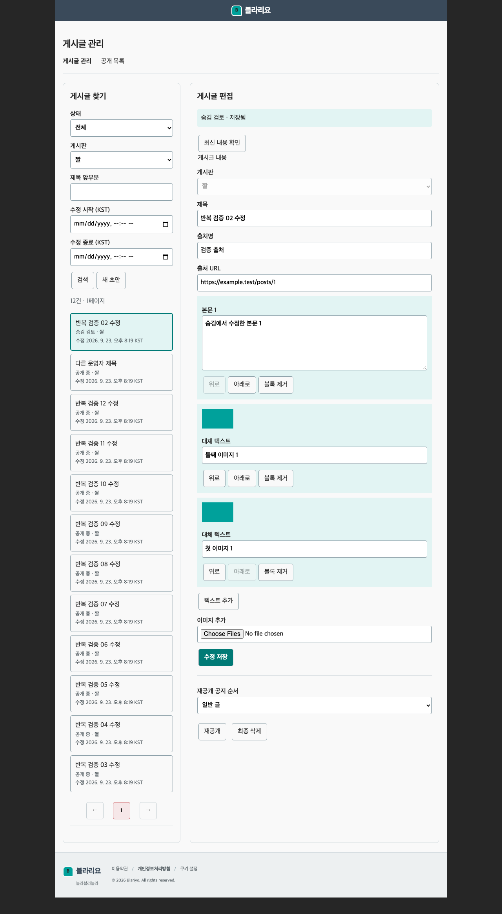
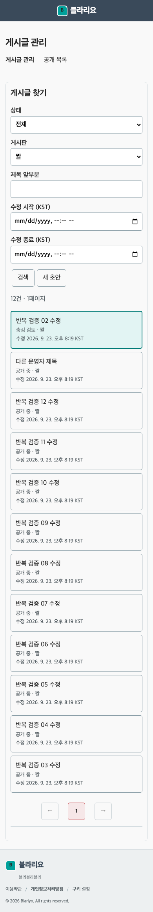
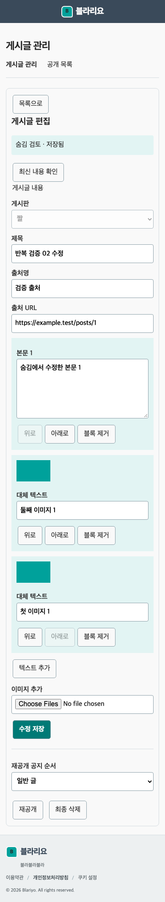

# M0 Core 관리자 화면 검토물

2026-09-23. 기존 편집기·색상·API를 사용한 실제 Nuxt 화면이다. 제품 계약은
[화면 설계](../../planning/03-screen-design.md#관리자-게시글-화면), 동작 계약은
[개발 명세](../../development-specs/m0-core/admin-post-management/admin-post-management.dev.md#d08-admin-post-editor)를 따른다.
캡처는 격리 DB의 합성 게시글과 로컬 테스트 인증으로 생성했다. 운영자 사용성 인수·실제 Access 인증·운영 배포 증거가 아니다.
실행 근거와 남은 항목은 [마감 결과](../../../worklog/2026-09-23/admin-core/RESULTS.md)에 있다.

## 화면

데스크톱 1280px: 검색 목록과 같은 편집기를 나란히 배치한다. 상태·게시판·KST 수정일을 표시하며
버전 번호는 API 요청에만 유지한다.

모바일 390px: 목록에서 글을 선택하면 편집 영역으로 전환한다. 목록 복귀 시 선택 항목으로
포커스를 돌리며 상태 변경으로 검색 결과에서 빠진 경우에는 새 초안으로 돌린다.

## 상태별 체크리스트

| 상태 | 동작·안내 | 개발자 로컬 확인 |
| --- | --- | --- |
| 목록 | 상태·게시판·제목 prefix·수정일 검색, 페이지, KST 표시 | 브라우저·통합 검사 |
| 목록 loading/empty/error | 영역별 진행, 빈 결과, 실패 후 재시도; 오래된 결과 숨김 | 브라우저 검사 |
| 새 초안·DRAFT | 제목·본문·출처·공지·이미지/alt·순서, 초안 생성·수정 저장 | 12건 UI/API/DB 대조 |
| 업로드 | 10파일/100MiB·파일10MiB, 전체 성공 또는 전체 실패, 실패 파일별 안내 | 413/415/503 브라우저·통합 검사 |
| 미저장 | 이탈 확인, 상태 명령 차단, 처리 중 편집·글 선택 차단 | 브라우저 검사 |
| 저장 불확실 | 입력·요청 키 유지, 동일 요청 결과 확인, 중복 생성 방지 | 응답 후 상세 실패 복구·DB 1건 확인 |
| 동시 수정 | 최신 내용 재조회 전 경고, 입력 자동 덮어쓰기 없음 | 다른 version PATCH 후 충돌·입력 유지 |
| SCHEDULED | KST 기본 슬롯·임의 미래 시각, 확인 후 예약·취소, 즉시 발행 | UI/DB 시각 대조·due worker 중복 0 |
| PUBLISHED | 읽기 전용, 공개 상세 링크, 확인 후 숨김 | 공개 API 200→404·미디어 회수 |
| HIDDEN_REVIEW | public 이미지 회수 중 변경 제한, 최신 확인 후 수정·재공개 | DB 상태·object 삭제·재공개 대조 |
| REMOVED | 최종 삭제 확인, 읽기 전용·preview 없음 | 브라우저·API 검사 |
| 권한 없음 | 인증/권한 안내, 관리 데이터 미노출 | 익명 UI/API 401·403 회복 및 auth 단위/통합 |
| 반응형·키보드 | 320/390/768/1280px, 가로 넘침 없음, 순서 버튼·포커스 복귀 | Chromium 실행 및 캡처 검토 |

화면 검토 통과는 보조기기 전수 접근성 인증이나 실제 운영자의 수동 12건 인수를 뜻하지 않는다.
새 관리자 프레임워크·통계·drag-and-drop·일괄 발행·수집 자동 승인/발행은 포함하지 않는다.
