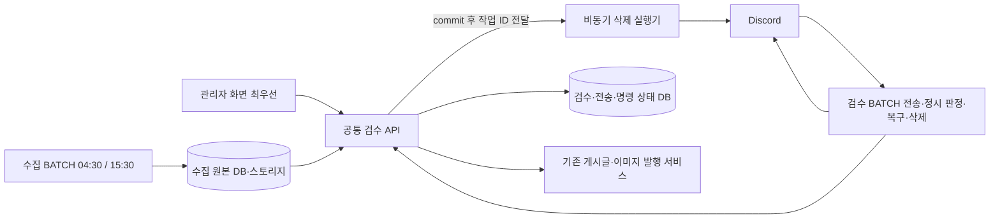

# Discord 검수 DB·API·배치·복구 상세 설계안

- 담당: Codex / 작업 폴더: `/Volumes/MicroVault/iCloudDrive/git/private/blariyo`
- 브랜치: `feature/collection-schedule-0430-1530` / 확인 기준: `d2139f3`
- 상태: 종료 — 상세 설계안·정적 정합성 확인 완료, 구현 미착수 / 작성: 2026-10-07 21:07 KST / 갱신: 21:16 KST
- 변경 범위: 이 문서와 [구현 계획](IMPLEMENTATION-PLAN.md)의 최신 설계 링크. source·정본·DB·설정·외부 서비스·Git 변경 작업은 수행하지 않는다.
- 기준선 재확인: 이전 `9012d0c` 이후 다른 담당이 운영 수집/측정 작업을 `7a121f1`, `d2139f3`로 커밋했다. [종결 기록](../collection-session-closeout/README.md)에서 Discord 두 폴더를 제외한 담당 범위를 확인했다. 이 설계는 새 HEAD를 읽고 기존 Discord 기록을 보존하며 진행한다.
- 사용자 확정과 설계 선택을 구분한다. 아래 신규 테이블·경로·주기는 구현할 계약의 제안이며 설치/구현 완료를 뜻하지 않는다. 이전 API 이미지 전용 Discord job 제안은 **BATCH worker → 공통 API**로 대체한다. 후속 확정인 관리자 즉시 삭제는 **commit 후 API 측 비동기 실행기의 최초 시도**, 미실행/실패 재시도는 BATCH가 담당한다. Discord 삭제를 DB TX나 관리자 응답 대기에 묶지 않는다.

## 1. 확정 정책과 범위

| 항목 | 기준 |
| --- | --- |
| 메시지 | 글당 헤드 1개: 번호·제목·출처. 스레드에 원문 순서대로 문장/이미지 메시지 |
| 기본 반응 | 헤드와 각 본문 메시지에 봇이 👍·❌. 봇/미등록자 반응은 판정 제외 |
| 헤드 👍만 | 승인·발행 |
| 헤드 ❌만 | 글 전체 반려 |
| 헤드 양쪽 또는 둘 다 없음 | 무승인, 다음 배치 재확인 |
| 본문 | 무반응/👍만이면 포함. 검수자의 👍 외 반응이 있으면 해당 단위 제외. 혼합도 제외 |
| 검수 배치 | 매일 07:30·17:00 Asia/Seoul, 이전 무승인 건도 다시 확인 |
| 만료 | 전체 전송·기본 반응 준비 완료 시각부터 48시간. 이후 첫 배치에서 최신 반응 확인 후 여전히 무승인이면 반려 |
| 수정 예정 글 | 무승인으로 유지. 새 제목/문장 편집·수정창·편집 보류 버튼은 후속 개발. 무승인 만료의 예외로 만들지 않음 |
| 관리자 우선 | 명시적인 관리자 처리 명령이 Discord 명령보다 우선. 단순 화면 조회는 처리 명령 아님 |
| 메시지 정리 | Discord 명령은 발행 완료/반려 확정 후 삭제. **관리자 명령은 승인 또는 반려 DB 확정 직후 삭제**하며 발행 성공을 기다리지 않음 |
| 삭제 실패 | 삭제만 재시도. 2회 이상 실패하면 살아 있는 해당 스레드에 실제 승인/발행 결과 안내 1건 생성·갱신 |
| 삭제 실행 | 업무 결과와 삭제 대기 등록만 같은 TX. 실제 Discord DELETE는 commit 후 별도 비동기 실행. 관리자 응답은 삭제 완료를 기다리지 않음 |

수정 예정 글을 무승인으로 만드는 운영 방법은 헤드 👍를 해제하거나 👍·❌를 함께 두는 것이다. ❌만 남기면 다음 배치에서 반려되므로 수정 대기를 의미하지 않는다. 준비 완료 48시간 이후 첫 정상 판정 배치에서도 무승인이면 만료 반려된다. 현재 관리자의 제목 입력 등 기존 기능을 제거하지 않으며 새 편집 기능은 추가하지 않는다.

## 2. 실행 위치와 책임

**정기 Discord 자동화는 BATCH에서 실행하고, 승인·반려·게시글 변경은 공통 API를 호출해 처리한다.** 관리자도 같은 API 업무 서비스를 사용한다. 관리자 승인/반려 후 최초 삭제는 API 측의 제한된 비동기 실행기에 맡긴다. API에 정시 검수 timer/Gateway를 추가하지 않는다.



| 구성 | 책임 | 경계 |
| --- | --- | --- |
| 수집 BATCH | 기존 출처 수집·원본/미디어 보관 | 현재 `collect.batch_*` 소유·전용 저장소 범위 유지 |
| 검수 BATCH | API 작업 claim, Discord 전송/반응 관찰/삭제, API 단계 실행·재시도 | `apps/collector` 안 별도 `DiscordReviewMain` 실행 진입점 제안. 수집 pipeline/legacy Gateway와 독립 |
| API | 권한·원본/선택 검증, 관리자 우선권, 영속 상태·중복 방지, 초안/발행, 관리자 삭제의 비동기 실행 등록 | 기존 `BatchReviewService`·`PostsService` 업무 로직 재사용/추출 |
| DB | 단일 업무 상태·실행 기록 보존 | 검수 BATCH에는 신규 API 소유 테이블이나 `content.*` 직접 DML 권한을 주지 않음 |

- 검수 BATCH는 API client와 Discord client만 필요한 별도 실행 모드다. 수집 DB/R2 비밀을 그대로 주입하지 않는다. 원문 단위와 검증된 이미지 bytes는 권한 있는 내부 API에서 받는다. 공통 JAR 재사용은 가능하나 수집기 전체 스케줄러를 같이 기동하지 않는다.
- 최신 수집 기본 실행은 [BatchMain](../../../apps/collector/src/main/java/com/blariyo/collector/ops/BatchMain.java)의 direct 경로다. 기존 Spring Batch `collectCandidateJob`·`CoreClient`가 신규 검수 작업을 이미 지원한다고 가정하지 않는다.
- 수집 전체의 2시간 실행 한도 때문에 15:30 수집과 17:00 검수가 겹칠 수 있다. 별도 작업 잠금/자원 한도를 두고, 한 JVM/수집 잠금 아래 검수를 직렬로 묶어 17:00 전체를 기다리게 만들지 않는다. 정시까지 준비된 글만 판정한다.
- 대안: API 이미지를 일회 job으로 쓰면 내부 함수를 재사용하기 쉽지만 사용자가 요구한 BATCH 실행 소유와 달라 초기 제안을 대체한다. 모든 SQL/게시글 로직을 Java로 옮기는 안은 관리자와 규칙이 이중화되고 기존 소유권을 깨므로 채택하지 않는다.

## 3. DB 모델 — 기존 검수 + 신규 5개 테이블

아래 이름은 제안. 신규 테이블은 API migration/role이 소유하고 BATCH는 내부 API로 접근한다. DB 시각은 `timestamptz`, 원문/선택 hash는 SHA-256, Discord snowflake는 문자열로 직렬화한다. 환경별 DB·채널·credential을 분리한다.

| 테이블 | 주요 열 | 제약·인덱스 |
| --- | --- | --- |
| 기존 `collect.batch_review` | item/version/digest, APPROVED 또는 REJECTED, lock_version, post_id, updated_by | 글의 확정 판정/초안 연결 유지. 무승인을 기록하려고 APPROVED를 임의 초기화하지 않음 |
| `collect.batch_review_control` | item_id, authority(DISCORD/ADMIN), decision_epoch, active_command_id, last_observation_reason, updated_at | item_id PK. epoch는 관리자 의사 접수/새 소유권 세대에 증가. 결과 상태를 독립 복제하지 않고 review/command와 함께 조회 |
| `collect.discord_review_delivery` | id, item_id, item_version, source_digest, renderer_version, environment, guild/channel/head/thread_id, review_number, delivery_state, ready_at, expires_at, head_seeded, generation, lease_owner/until/token, next_export_at/next_cleanup_at/next_notice_at, last_scan_slot/result, cleanup_state/attempt_id/failure_count, head_deleted_at/thread_deleted_at, notice_state/message_id/error | 환경·item·version·generation unique, 활성 전달 건은 글당 1개. 작업 상태별 재시도 시각·`(ready_at,id)` 인덱스. 준비 전 ready/expires NULL |
| `collect.discord_review_part` | delivery_id, ordinal, content_unit_id, fragment_index, kind(TEXT/IMAGE/LINK), source_block/offset/image_position, unit_digest, message_id, send_state, seeded_flags, attempt_nonce | `(delivery_id,ordinal)` PK, Discord message ID unique. 긴 한 문장의 여러 fragment는 같은 unit ID. 원문 TEXT 전체를 로그/추가 저장소로 불필요하게 복제하지 않음 |
| `collect.batch_review_command` | id, item_id, origin(ADMIN/DISCORD/SYSTEM), action, actor, worker_id, item_version/review_version/decision_epoch, source_digest/selection_digest, excluded_unit_ids, evidence, scan_slot, idempotency_key/request_hash, stage, post_id/post_version, lease_token/until, retry_count/next_attempt_at, result/error/timestamps | 명령별 key unique·같은 key 다른 body는 충돌. 글당 활성 명령 1개 partial unique. post_id는 신규 명령에서 새 글을 복제하지 않고 기존 연결 재사용 |
| `collect.discord_review_scan_run` | environment, scheduled_slot, started_at, cutoff_at, cursor, state, lease_token/until, finished_at, summary_counts | `(environment,scheduled_slot)` PK. 같은 회차 중복 실행 차단, 누락/부분 수행 구분 |

- 기본 준비 완료 전제: manifest의 모든 메시지 ID와 각 👍/❌ 생성 완료가 저장돼야 한다. API가 최초 READY 전이 시 `ready_at=DB now()`, `expires_at=ready_at+48시간`을 설정한다. 후속 반응/재조회/복구는 이 시각을 바꾸지 않는다.
- 판정 actor는 API의 등록 Discord user → 내부 operator 매핑으로 산출한다. 클라이언트가 임의 admin actor를 지정하지 못한다. 기존 관리자 actor 제약은 유지하고 자동 반려 전용 system actor만 제한적으로 추가한다. system actor는 무승인 기한 만료 반려만 가능하며 승인·발행은 금지한다.
- command evidence는 승인/반려/제외에 쓰인 단위·operator·관찰 시각과 전체 조회 완료 표식을 보존한다. 원시 Discord 사용자 ID 접근은 제한하고 일반 로그에는 싣지 않는다. 같은 내용 hash라도 서로 다른 승인 시도의 key를 무한 재사용하지 않는다.
- 갱신은 `expected epoch + version + lease_token` 조건으로 수행한다. lease 만료 후 예전 worker가 살아나도 결과를 덮어쓸 수 없다. 외부 HTTP 성공 후 ack가 유실된 경우에는 아래 복구 절차를 따른다.
- delivery/command는 control에 연결하고 part는 delivery에 연결하되, 원본 batch item에는 독립 migration/원문 만료를 고려해 cascade FK를 두지 않는다. 대상 존재·원문 버전은 서비스에서 검사한다. 완료된 전송의 head/thread/part ID는 cleanup이 확정되기 전 제거하지 않는다. message ID가 아직 없는 전송 중 항목은 중복 방지 표식과 ack 보완으로 고아 메시지를 회수한다.
- 분할 관찰 입력은 delivery의 `pending_observation_id/slot`, `observation_chunks` JSONB, `observation_started_at/completed_at`에 임시 보관한다. 동일 chunk key/digest는 재생하고 다른 내용은 충돌로 막는다. 원문 단위 수·전체 byte 상한을 검증하고 완전성 확인 후 command evidence로 필요한 결과만 옮긴다. 중단/오래된 관찰은 폐기하며 다음 회차에서 사용하지 않는다.

### 기존 migration에서 반드시 바꿀 경계

- [V008](../../../apps/api/migrations/V008__batch_review.sql)은 actor를 admin 형식으로 제한하고 post_id가 있으면 APPROVED여야 한다. [V011](../../../apps/api/migrations/V011__direct_batch_review.sql)은 post 연결 이후 review 갱신 자체를 막는다. 새 migration으로 제한된 system 반려와 관리자 선점 후 미발행 초안 반려를 명시해야 한다. 과거 migration을 수정하지 않는다.
- 관리자 반려가 DRAFT_READY 이후 도착하면 기존 post_id는 보존하고 해당 Discord 명령을 취소한다. review APPROVED→REJECTED는 **관리자 명령·같은 post_id·게시글 DRAFT·epoch 일치** 조건에서만 허용하는 제약을 추가한다. 이 초안은 자동 발행 금지로 표시하고 관리자에 ‘반려된 연결 초안’으로 보여준다. 무조건 삭제하거나 발행 후 숨김으로 우회하지 않는다.
- 연결된 반려 초안의 일반 게시글 발행 API도 공통 control/review fence를 검사해야 한다. 이후 관리자가 명시적으로 재승인할 때 같은 초안을 재사용한다. 이미 PUBLISHED면 검수 반려로 되돌리지 않고 기존 게시글 숨김/제거 흐름을 사용한다.
- 연결 초안의 재승인도 관리자 명령·같은 post_id·DRAFT·현재 epoch/선택 digest 조건으로만 허용한다. 원문이 이미 만료된 경우 수집 검수의 재승인을 임의 허용하지 않고 기존 게시글 관리/보존 계약을 따른다. 기존 promote의 중복 출처 검사를 제거하지 않고 ‘이미 연결된 동일 초안 재개’ 경로를 명시적으로 분리한다.
- [V009](../../../apps/api/migrations/V009__batch_retention.sql)는 원문 만료 때 기존 review/receipt를 제거한다. 새 전달·삭제 대상 ID까지 cascade 삭제하지 않는다. 원문 만료는 먼저 신규 발행을 차단하고 Discord 삭제 대기를 남긴다. 정리 불능 건의 최소 메시지 ID/오류 기록은 유지해 재시도 가능하게 한다. 이력 보존 기간은 기존 운영 정책과 함께 정본 갱신 시 정하며 원문 보존 기한을 연장하지 않는다.

## 4. 상태와 관리자 우선권

### 서로 다른 상태를 분리

| 구분 | 전이 |
| --- | --- |
| 전달 | QUEUED → SENDING → READY, 장애 시 RETRY_WAIT/BLOCKED |
| 관찰 | NO_REACTION / CONFLICT / APPROVE / REJECT / UNKNOWN. 관찰은 곧 확정 판정이 아님 |
| 승인 명령 | ACCEPTED → PREPARING → DRAFT_READY → PUBLISHING → PUBLISHED |
| 반려 명령 | ACCEPTED → REJECTED |
| 명령 예외 | RETRY_WAIT / NEEDS_ADMIN / SUPERSEDED_BY_ADMIN. 현재 진행 단계는 별도 보존 |
| 삭제 | NONE → PENDING → RUNNING → RETRY_WAIT 또는 DONE. 안내 상태는 별도 |

무승인은 `batch_review`의 신규 확정 판정값이 아니다. NO_REACTION/CONFLICT를 관찰로 기록하고 다음 회차에 재조회한다. 수정 예정이라는 이유만으로 자동 만료를 면제하지 않는다. 본문 전체 제외/발행 장애는 승인 의사가 있는 NEEDS_ADMIN이며 무승인 만료와 구분한다.

### 관리자 최우선 규칙

1. 관리자 명령은 인증·입력·원문 snapshot 검증 후 짧은 transaction에서 `authority=ADMIN`, `decision_epoch++`와 관리자 명령을 저장한다. 이전 Discord 명령을 supersede하고 이후 scan의 신규 판정을 막는다. 일괄 반려·기존 개별 API도 이 진입점을 통과시킨다.
2. Discord의 승인/초안/발행 단계는 시작 시와 **최종 DB commit 직전** control epoch·현재 권한·review/item version을 재확인한다. 관리자 의사가 접수됐으면 다음 단계로 진행하지 않는다.
3. 긴 이미지 다운로드·변환·공개 사본 준비 중에는 control row lock을 유지하지 않는다. 관리자 명령 접수가 느린 I/O 뒤로 밀리지 않게 한다. final transaction만 `control → review → post → image` 순서로 필요한 행을 잠근다. 직접 post API도 같은 순서로 맞춰 교착을 막는다.
4. DB에 관리자 의사가 저장되기 전에 Discord 발행 commit이 이미 끝났다면 과거 발행을 취소했다고 보고할 수 없다. 관리자 화면에 최신 post 상태를 반환하고 숨김/제거 명령을 사용하게 한다. 브라우저 클릭 시각이나 동시에 날아온 패킷 순서만으로 절대 우선권을 보장한다고 표현하지 않는다.
5. 관리자 처리 접수 후 오류가 나더라도 Discord로 권한을 자동 반환하지 않는다. 관리자에서 해당 명령을 재개/다른 처리를 선택한다. 단순 상세 조회·화면 이탈은 선점/권한 변경을 일으키지 않는다.
6. 관리자 승인 또는 반려와 같은 transaction에서 cleanup 대기를 등록한다. 최상위 commit 이후 API 측 비동기 실행기에 작업 ID를 알리고 관리자 응답은 삭제를 기다리지 않는다. **관리자 승인 이후 발행 실패는 Discord 유지 조건이 아니다.** 관리자 화면에서 초안/명령을 복구하고 Discord를 다시 만들지 않는다. BATCH 장애 중에도 API의 비동기 최초 삭제는 가능하며 실패 재시도만 지연된다.

- 관리자 요청의 원문 버전/hash가 바뀌었으면 여전히 충돌 처리한다. 원문은 그대로인데 Discord의 중간 단계 때문에 review 버전만 바뀌었다면 현재 상태를 서버에서 대조해 관리자 선점 경로로 처리한다. 이를 단순 stale 409로 반복 거부해 Discord를 사실상 우선하지 않는다. 다른 관리자 변경과 이미 완료된 공개 발행은 자동 덮어쓰지 않는다.
- 기존 Discord 초안과 관리자가 확인한 선택 digest가 다르면 관리자 소유권을 먼저 확보하고 새 최종 미리보기를 요구한다. 서로 다른 본문을 같은 승인으로 재사용하지 않는다. 이번 범위에서 자유 편집 기능을 도입하지 않으며 최종 선택이 확정된 동일 초안만 발행한다.

관리자 승인 시에는 화면이 확인한 최종 본문/제외 목록을 명령에 고정한다. Discord 제외 목록을 조용히 복원하거나 최신 목록을 뒤늦게 덮어씌우지 않는다. 이번에는 편집 기능 대신 최종 발행 후보의 읽기 전용 미리보기와 상태 표시만 추가한다.

## 5. API 계약안

모든 신규 경로는 설계용이며 현재 존재하는 endpoint가 아니다. `/internal/discord-review/v1`은 전용 worker 인증·기능 flag·환경/채널 검증을 적용한다. 외부 reverse proxy는 이 경로를 공개하지 않고 지정 내부 네트워크에서만 접근한다. 로컬 worker는 로컬 API만 사용한다.

| 메서드·경로 | 입력 | 결과·책임 |
| --- | --- | --- |
| `POST /internal/discord-review/v1/work/claim` | kind(EXPORT/RECOVER/CLEANUP), limit, workerId | API가 대상 선택·lease 부여. id/token/version, canonical manifest 또는 복구 명령 반환 |
| `POST .../deliveries/{id}/ack` | leaseToken, generation, attemptId, event·messageId·seed 완료·오류 | 전달 진행/READY·삭제 시도 결과 저장. 허용 event만 받고 임의 review 상태 변경 금지 |
| `GET .../deliveries/{id}/media/{position}` | 읽기 scope·전달 권한 | 기존 preview 검증을 재사용한 제한 bytes. 공개 URL/storage key 노출 없음 |
| `POST .../scans` | scheduledSlot, workerId | DB 시각으로 도래한 정시 회차만 개설/재개, slot/cutoff/lease 반환 |
| `GET .../scans/{id}/items` | cursor, limit, scanToken | READY≤cutoff, 미처리·무승인 목록. 관리자 소유/완료 제외 |
| `POST .../scans/{id}/observations` | delivery/version/epoch, head·part별 유효 반응 증거, observedAt, completeness, idempotencyKey | API가 반응 판정·권한·만료 계산 후 UNAPPROVED 또는 commandId 저장. worker 전달 `decision`을 그대로 신뢰하지 않음 |
| `POST .../commands/{id}/advance` | leaseToken, expectedStage/version, Idempotency-Key | 다음 업무 단계 하나 실행, 같은 단계 재호출은 저장 결과 반환 |
| `GET .../commands/{id}` | 읽기 scope | 실제 stage/postId/결과 확인. timeout 이후 새 명령을 만들기 전에 사용 |
| `POST .../scans/{id}/finish` | scanToken | 서버가 미완료 대상/오류를 대조해 COMPLETE/PARTIAL 판정 |
| `POST /api/v1/admin/collect/batch-items/{id}/commands` | APPROVE_PUBLISH 또는 REJECT, snapshot/versions, title, selectionDigest, Idempotency-Key | AdminGuard 유지. 관리자 epoch 선점 및 공통 명령 접수 |
| `GET /api/v1/admin/collect/batch-items/{id}` 확장 | 기존 인증 | delivery/command/authority·무승인 이유·최종 본문·삭제/안내 실패 표시 |

- 관리자 경로는 기존 인증/MFA를 유지한다. 승인/발행 서비스의 중복 실행 코드를 Java에 복제하지 않는다. 서버의 각 advance 호출은 유한한 한 단계만 수행하고 API가 background timer를 돌리지 않는다. 관리자도 같은 실행 서비스를 요청/재개하므로 BATCH 중단이 관리자 처리 중단을 뜻하지 않는다.
- 기존 [CollectorGuard](../../../apps/api/src/http/collector.guard.ts)는 URL 접수 flag·LEGACY/SPRING scope와 계약에 묶여 있다. 기존 토큰을 넓히지 않고 전용 `review:read`, `review:delivery`, `review:observe`, `review:execute`, `review:cleanup` scope를 둔다. 서비스 인증과 실제 검수자 발행 권한은 별도로 검사한다. 해시 기반 token 검증·회전/회수 구조만 재사용한다.
- 내부 호출 client는 정해진 API origin만 허용하고 redirect를 따르지 않는다. 기존 CoreClient의 loopback/HTTPS 제약을 일반 외부 HTTP 허용으로 풀지 않는다. 운영 컨테이너 전용 네트워크의 고정 API 서비스명·경로만 예외로 구성하고 공개 edge 차단을 별도 검증한다.
- worker는 신뢰된 관찰자다. API가 Discord를 다시 조회하지 않으므로 worker가 제출한 증거를 외부 독립 증명으로 표현하지 않는다. API는 guild/channel/등록 message/unit·operator 매핑·부분 조회 여부를 검증하며 범용 actor/자유본문 입력은 거부한다.
- status: 잘못된 입력 400, 인증 401/403, 원문 만료 410, 권한 선점/버전/단계 충돌 409, 의존성 장애 503, 제한 429. 처리 명령 접수는 202와 commandId, 저장된 결과 조회/재생은 200. 기존 200/201 전용 receipt에 202를 억지로 저장하지 않고 신규 command receipt로 관리한다.
- 예시 관찰에서 sourceDigest/epoch는 API가 지급한 값을 되돌려 보낸다. API가 직접 excludedUnitIds와 selectionDigest를 계산한다. DB source를 Discord 텍스트로 덮어쓰는 필드는 없다.

```json
{
  "deliveryId": "<uuid>",
  "itemVersion": 3,
  "decisionEpoch": 2,
  "sourceDigest": "<sha256>",
  "observedAt": "<UTC timestamp>",
  "head": {"thumbsup": ["<reviewer-ref>"], "x": []},
  "parts": [{"unitId": "<unit-id>", "otherReactions": ["<reviewer-ref>"]}],
  "completeness": {"head": true, "parts": true, "pagination": true}
}
```

위 예시의 `parts`는 축약 표시다. 실제로는 대상 unit/fragment를 전부 대조하고 누락을 ‘반응 없음’으로 처리하지 않는다. `reviewer-ref`는 제한된 식별정보이며 API가 현재 내부 operator로 해석한다.

## 6. 배치 시간·대상과 처리 순서

| job | 시각/간격 | 동작 |
| --- | --- | --- |
| 기존 수집 | 04:30/15:30 KST | 원문 수집. 새 검수 작업에서 출처 호출을 다시 실행하지 않음 |
| `discord-review scan` | **07:30/17:00 KST** | 신규 판정·무승인 재확인·48시간 만료 반려, 접수 명령 진행과 최초 삭제 |
| `discord-review maintain` | **1분 간격을 설계 초기값으로 제안** | 전송·이미 접수한 명령·삭제·안내 복구. 새로운 승인 판정은 하지 않음 |
| 관리자 비동기 정리 | 승인 또는 반려 DB commit 직후 | API 측 실행기에 첫 삭제를 알림. 요청은 삭제를 기다리지 않으며 미실행/실패는 BATCH가 복구 |

- export는 개별 수집 item의 DB commit 후 후보화한다. 수집 전체 종료를 기다리지 않고 maintenance가 API에서 새 후보를 가져온다. 처음 활성화할 때 기존 미검수 전체를 자동 전송하지 않으며 적용 시작 cutoff 이후를 대상으로 한다.
- API가 원문 snapshot과 안정된 contentUnitId·문자 구간을 가진 manifest를 만들고 BATCH가 표시한다. Java/TypeScript에 서로 다른 문장 분할 규칙을 중복 구현하지 않는다. 긴 문장의 여러 fragment는 동일 unit에 연결하며 어느 조각의 제외 반응도 문장 전체에 적용한다.
- 스레드가 보관돼도 저장된 ID로 조회하며, 전송/안내 때 필요하면 허용된 범위에서 보관을 해제한다. 잠김·권한 거부·Discord 첨부 한도 초과는 명시적으로 BLOCKED 처리한다. 이미지가 빠진 글을 READY로 만들거나 공개 원본 링크로 대체하지 않는다. 긴 관찰 입력은 제한된 chunk로 delivery의 임시 관찰 기록에 저장하고 모든 fragment/페이지가 갖춰진 observationId만 접수한다. API body 상한을 무제한으로 풀지 않는다.
- READY 이전 헤드의 사람 반응을 완전한 내용에 대한 승인으로 쓰지 않는다. 준비 완료 직전에 사람의 헤드 반응을 제거하고 확인한 뒤 READY를 저장·안내하는 안이다. 봇 반응과 본문의 제외 표시는 유지한다. 제거/확인 실패면 READY 전환을 막는다. Discord와 DB의 원자적 전환은 불가능하므로 ‘마지막 확인 이후 받은 반응’을 인정하는 관찰 경계를 문서화하고 실제 Discord에서 검증한다. READY 이후 일반 복구에서는 사람 반응을 지우지 않는다.
- scan은 회차 시작 시 cutoff와 slot을 저장하고 `(ready_at,id)` 기준 cursor로 순회한다. 가변 목록에 OFFSET만 적용해 항목을 건너뛰지 않는다. delivery별 last_scan_slot/result/재시도 시각을 저장해 페이지 중간 실패가 cursor 뒤로 사라지지 않게 한다. 이전 무승인은 다음 slot에도 포함한다.
- 환경당 활성 scan은 1개다. 이전 회차 미완료 중 다음 정시가 되면 아직 접수하지 않은 오래된 관찰을 폐기하고 현재 회차로 넘긴다. 과거 반응을 복원했다고 기록하지 않고 현재 반응을 조회한다. 이미 접수한 명령은 recover가 이어간다.
- 글별 순서: **API 현재 상태/관리자 우선 확인 → 헤드 반응 조회 → 승인 후보라면 전체 본문 반응 조회 → API 판정/접수 → 단계 실행 → 완료 후 정리**. ❌ 단독 반려와 무승인 만료에는 본문 제외 목록이 필요 없지만 헤드 조회가 불명확하면 반려하지 않는다. 발행에는 본문 전체의 완전한 관찰이 필요하다.
- 접수 후 반응 변경은 해당 명령을 바꾸지 않는다. 접수 전 관찰 유효기간은 초기 120초로 제안한다. API 대기로 초과하면 다시 관찰하며 조회 자체가 오래 걸린 글도 보류한다. 길이별 대표 표본으로 조정하며, 변경 없는 과거 조회를 시각만 갱신하지 않는다. 작업 중 권한 회수는 자동 재시도가 아닌 NEEDS_ADMIN으로 처리한다.
- 검수 timer가 중단돼 놓친 회차는 DB slot 기록으로 인지한다. maintenance는 누락/부분 회차의 scan을 복구하되 당시 반응을 추정하지 않는다. 정상 운영의 신규 판정 시작은 07:30/17:00이고, 장애 복구의 늦은 실행은 별도 표시한다. timer 옵션 하나로 모든 회차 복구가 보장된다고 주장하지 않는다.
- 초기 job 자원 제안: Collector JAR 경량 CLI·CPU0.25·RAM256MiB·이미지 전송 동시 1개, 요청/작업별 시간 상한. 기존 512MiB 수집과 겹칠 때 호스트 여유를 측정해 조정한다. 자원이 부족하면 전송을 늦추고 반응 scan을 우선한다. 이 수치는 실측 전 설계값이다.

## 7. 승인·부분 발행 흐름

1. API가 헤드 반응을 집계한다. 👍만=승인, ❌만=반려, 양쪽/없음=무승인. 무승인은 DB 시각이 expires_at 이상이면 반려, 이전이면 다음 회차 대상이다. 조회 실패는 UNKNOWN이며 무승인이 아니다.
2. 승인 후보는 API가 원문과 manifest로 최종 본문을 구성한다. 원문 완전성·hash·이미지 참조 검사 후 선택 본문의 유효성·용량·필수 출처를 다시 검사한다. 제외 이미지는 게시용으로 복사하지 않는다.
3. 전체 본문 제외/유효하지 않은 후보는 NEEDS_ADMIN으로 보류하고 승인 의사를 기록한다. 이를 무승인 자동 반려로 바꾸지 않는다. 새로운 편집 화면은 추가하지 않는다.
4. command에 제외 unit·selection_digest·actor·epoch를 고정한다. PREPARING에서 이미지를 준비하고 짧은 최종 transaction에서 epoch/version을 확인한 뒤 APPROVED·DRAFT·postId·단계 결과를 함께 저장한다. 기존 승인→전체 본문 promote를 그대로 호출하지 않고 공통 executor로 검증/단계를 추출한다.
5. DRAFT_READY에서 기존 PostsService 발행을 호출한다. 공개 사본 준비 후 commit에도 control fence를 적용하고, post/command=PUBLISHED/cleanup=PENDING을 함께 확정한다. 기존 receipt가 다른 transaction에서 먼저 확정될 수 있는 경로는 복구 시 postId·receipt로 누락된 명령 결과를 보완한다.
6. Discord 명령은 발행 성공 후 BATCH가 TX 밖에서 삭제한다. **관리자 명령은 위 4번의 승인 commit 시점에 비동기 삭제를 요청**하며 5번의 성공을 기다리지 않는다. 관리자 반려도 commit 직후 같은 비동기 경로를 사용한다.
7. 관리자 승인 이후 발행이 실패하면 동일 postId로 관리자/접수 명령 복구 경로에서 재시도한다. Discord 메시지를 다시 생성하지 않는다. 승인 완료·발행 미완료와 Discord 삭제 완료는 동시에 성립할 수 있다.

공개 이미지 준비 뒤 관리자 선점으로 commit이 거부된 경우에는 명령이 준비한 미연결 사본만 기존 정리 경로로 회수한다. DB commit 결과가 불명확하면 post/image/receipt를 확인하기 전에 공개 사본을 지우지 않는다. 직접 주소로 접근 가능한 공개 사본이 게시글 DB commit보다 먼저 준비되는 기존 발행 방식의 한계도 유지되므로, 게시글 미발행을 ‘어떤 이미지 bytes도 공개되지 않음’으로 과장하지 않는다.

## 8. 장애·복구 계약

| 상황 | 복구 | 금지하는 동작 |
| --- | --- | --- |
| 헤드 전송 응답 유실 | 짧은 nonce 보장 범위와 전달 식별 표식으로 기존 메시지 대조. 장기/대조 불명은 BLOCKED | 결과 불명 상태에서 새 헤드 중복 생성 |
| 스레드/본문 중간 실패 | 저장한 ID/ordinal로 미완료 부분만 재개. 준비 전 발행 금지 | 일부 전송을 완료로 기록 |
| 반응 조회 401/403/429/timeout | 권한/연결을 구분. 429는 Retry-After, 정상 조회 이후 판정 | 반응 없음으로 추정해 만료 반려 |
| API 응답 유실 | 같은 key로 command 조회/재호출 | 새 key로 승인/게시글 재생성 |
| 초안 성공·발행 실패 | 동일 postId·선택 digest로 발행 단계만 재개 | 원문 전체로 새 초안 생성 |
| 발행 성공·결과 ack 유실 | post/receipt를 대조해 결과 보완 후 cleanup | 중복 발행 |
| 관리자 선처리 | epoch 불일치로 Discord 작업 중단. 확정된 관리자 판정에 따라 즉시 정리 | 늦은 Discord 판정으로 덮어쓰기 |
| 관리자 승인 성공·삭제 성공·발행 실패 | 관리자에 기존 초안/실패 상태 표시, 발행 단계 재개 | Discord 메시지 재생성/새 승인 요구 |
| 삭제 실패 | 시도당 1회 집계, 미삭제 대상만 재시도 | 승인/초안/발행 재실행 |
| 원문 보존 만료 | 신규 발행 중단·Discord 회수 등록. 기존 초안은 retention 계약 적용 | 원문 URL 재수집 후 과거 승인 재사용 |

### TX와 분리된 비동기 삭제

- 승인/반려와 `cleanup=PENDING`을 같은 DB transaction으로 저장한다. rollback이면 삭제 대기도 남지 않고 외부 삭제도 시작하지 않는다. **최상위 commit 완료와 DB 연결/잠금 반환 후** API 측 실행기에 작업 ID만 전달한다. 호출자는 Discord HTTP를 await하지 않고 저장된 업무 결과와 `cleanupStatus=PENDING`을 반환한다. 별도 상태 조회에서 DONE/RETRY_WAIT/BLOCKED를 확인한다.
- 실행기는 애플리케이션 수명주기가 관리하는 동시 실행 수 제한 큐다. 최초 동시 삭제 1개를 제안한다. API에는 삭제 응답을 기다리는 코드나 실패를 방치하는 `void fetch(...)`를 두지 않는다. 메모리 알림은 빠른 시작 수단이며 DB의 PENDING 기록이 복구 근거다. 새 Redis/브로커는 추가하지 않는다.
- 실행기가 작업을 받을 때 짧은 claim TX로 lease/token을 확정하고 즉시 commit·연결 반환한다. **DB TX·행 잠금·session advisory lock을 하나도 유지하지 않은 상태에서** Discord 헤드/스레드를 삭제한다. HTTP 완료 후 별도의 짧은 ack TX로 결과만 기록한다. BATCH에서도 같은 원칙을 적용한다.
- 현재 [DatabaseContext](../../../apps/api/src/persistence/database.ts)는 AsyncLocalStorage로 QueryRunner를 전달하고 중첩 transaction은 외부 TX를 재사용한다. 따라서 중첩 service의 성공 반환을 commit으로 간주하거나 요청 scope 안에서 비동기 함수를 호출하는 것만으로 분리가 보장되지 않는다. 최상위 after-commit 경계와 별도 실행 context를 명시적으로 구현하고 기존 QueryRunner/EntityManager/request 객체를 task에 전달하지 않는다.
- API 측 실행기는 이 경우의 최초 Discord 삭제만 수행한다. BATCH는 전송·관찰·정시 판정·일반 정리·복구를 담당한다. 삭제 adapter는 저장된 delivery의 head/thread ID만 사용하며 외부 입력의 임의 메시지를 삭제하지 못하게 한다.
- API와 검수 BATCH에 필요한 bot 비밀을 각각 비공개 mount하고 운영·로컬을 분리한다. API는 최소 삭제 adapter만 호출하지만 bot token 자체가 endpoint별 권한으로 나뉘는 것은 아니다. 두 프로세스가 같은 bot의 요청 제한을 공유하므로 429와 Retry-After를 공통 재시도 시각에 반영한다. webhook만으로 반응 조회/스레드 관리를 대체하지 않는다.
- 전송 중 관리자 판정이 확정돼도 같은 삭제 규칙을 적용한다. export lease를 취소하고 새 메시지 생성을 차단하며, 이미 날아간 외부 요청의 뒤늦은 ack는 업무 판정에 반영하지 않고 ID만 정리 대상으로 수용한다. 미확인 전송 시도가 남았으면 cleanup을 최종 DONE으로 닫지 않는다.
- 첫 삭제 작업의 외부 HTTP 총 상한은 초기 3초로 제안하되 이는 **비동기 worker의 한도이며 관리자 응답 대기 시간이 아니다**. 삭제 오류를 승인 실패로 바꾸거나 브라우저 재호출로 승인 자체를 반복하지 않는다.
- commit 직후 알림 유실/프로세스 종료/큐 포화가 생겨도 DB의 PENDING을 maintenance가 처리한다. API worker와 BATCH는 동일 cleanup lease/token/attemptId로 경합을 막는다. graceful shutdown은 신규 점유를 중단하고 시간 안에 끝나지 않은 작업을 lease 만료 후 복구 가능하게 남긴다.
- 일괄 반려도 글별로 삭제 대기를 영속 등록하고 응답은 외부 삭제를 기다리지 않는다. 큐에서는 동시 실행 수를 제한하며 미실행 건은 BATCH가 이어받는다. ‘즉시’는 정시 scan까지 기다리지 않고 비동기 실행을 알린다는 뜻이며, 장애/대량 작업에서도 삭제 완료 시각을 보장한다는 뜻이 아니다.

### 삭제 2회 실패 안내

- 헤드→스레드 순서로 삭제하고 헤드 실패 시 스레드를 보존한다. 한 worker/API 시도의 여러 HTTP 오류는 실패 1회다. 중복 ack는 횟수를 늘리지 않는다. 최초 API 시도와 이후 BATCH 시도를 같은 카운터로 센다.
- 실패 2회가 저장되면 notice_state=PENDING. BATCH가 다음 삭제 시도 전 최신 DB 결과를 조회해 스레드에 `승인: 완료 / 발행: 완료 또는 미완료 / 게시글 번호·링크 / 메시지 삭제 재시도 중` 안내 1건을 남긴다. 반려도 구분하고 미발행을 발행 완료로 쓰지 않는다.
- 이후에는 같은 notice_message_id를 갱신한다. 안내 응답 유실은 고유 표식으로 대조한다. 안내 실패는 삭제 실패 카운터와 분리하고, 안내 불능 때문에 삭제를 영구 중단하지 않는다.
- 스레드가 이미 삭제됐거나 쓰기 권한이 없으면 안내 불가 사유를 보존해 관리자에서 표시한다. 새 스레드를 만들지 않는다. 권한 오류는 삭제 완료가 아니다. 해당 대상의 정상적인 not-found 확인만 삭제 완료로 인정한다.
- 외부 삭제 성공과 DB ack 사이 crash는 다음 조회/404로 완료를 복원한다. 이미 사라진 스레드에 안내했다고 기록하지 않는다.
- 재시도 초기값은 1분→5분→15분, 이후 최대 15분 간격에 작은 임의 지연을 추가한다. Discord Retry-After가 더 길면 우선한다. 401/403은 BLOCKED로 두고 설정 복구 후 재개한다. 안내 미전송이 남았는데 차단 이유가 해소되면 안내 작업도 별도로 재개한다.

## 9. 구현 대상과 완료 판정

| 범위 | 주요 변경 |
| --- | --- |
| Collector | 신규 `discordreview/` CLI·ReviewApiClient·DiscordRestClient·export/scan/maintain. 기존 parser/출처 HTTP 간격 유지 |
| API collection | 공통 command/executor/control·본문 선택·전용 worker guard/controller·snapshot/media·delivery repository·after-commit 비동기 삭제 실행기/adapter |
| API posts | 수집 게시글의 관리자 우선 fence, 반려 연결 초안 발행 제한, 이력/receipt/cleanup 일관성 |
| DB | 신규 5표·기존 trigger의 제한적 확장·index·API 권한·retention 연계. batch writer의 content 권한 추가 없음 |
| 관리자 Web | 공통 command·최신 상태/최종 본문 표시·우선권·기존 명령 재개·삭제 상태. 새 편집 기능 없음 |
| 운영 | 검수 전용 systemd/로컬 LaunchAgent·실행기·환경/secret 분리·내부 API 경로·flag·자원 관찰 |
| 정본 | planning의 Discord 검수/전체 본문 승격 정책, system-design의 DB/API/보안/Collector, 개발 명세/OpenAPI·생성 타입·계약 hash/reason |

- 현행 보안 문서는 Discord에 image binary를 보내지 않도록 규정한다. 사용자가 지정한 전용 검수 채널의 이미지 표시로 제한해 계약을 바꾸고 일반 로그/공개 API 원문 비노출은 유지한다. 법무 미정·출시 차단 조건을 이 설계로 해제하지 않는다.
- 구현 순서: 계약 동기화 → DB/control·공통 명령 → API → BATCH 전송/scan → cleanup/recover → 관리자 연계 → 통합 검증. API/BATCH 버전 호환을 유지하고 기능 flag OFF 상태에서 단계 배포한다.
- 관리자 우선 검증: 관찰 중 선점, 공개 이미지 준비 중 선점, 발행 commit 직전 선점, 초안 이후 반려, 일반 publish 경로 우회 차단. 이미 commit된 발행은 최신 상태·관리자 후속 조치로 분리한다.
- 반복 실행 검증: 같은 command의 post 생성 수/발행 이력이 늘지 않아야 한다. 삭제 실패 재시도로 승인·초안·발행 호출이 추가되지 않아야 한다. 관리자 승인 즉시 삭제 뒤 발행 실패도 복구할 수 있어야 한다.
- TX/비동기 검증: rollback 시 Discord 호출 0회, DELETE 실행 중 활성 TX/점유 연결 없음, 느린 Discord 응답과 관리자 응답 분리, 중첩 TX의 최상위 commit 이전 실행 0회, commit 후 알림 유실/BATCH 복구, 큐 포화/중복 점유/프로세스 종료·ack 유실을 확인한다.
- 기타: 부분 전송/조기 반응, 헤드 양쪽 반응, 본문 다른 이모지/권한 회수/긴 문장, 전체 제외, 조회 페이지 누락, 48시간 전후·만료 회차 👍 단독, 무승인 다음 회차 재확인, 429, process kill/API 응답 유실, 삭제2회/안내 실패/수동 삭제, 원문 회수, 환경 혼용 거부.
- 실제 Discord 검증은 메시지/반응/권한/보관·잠금/삭제를 포함하고 합성 시험과 구분한다. 17:00 수집·검수·이미지 발행 중첩 부하와 실제 48시간 관찰도 별도 증거로 남긴다.

## 10. 근거와 이번 검증 범위

- 정본: [Collector 소유권](../../../docs/system-design/07-spring-collector-design.md), [보안](../../../docs/system-design/05-security-operations.md), [운영 예약](../../../deploy/collector/README.md). source: [검수 controller](../../../apps/api/src/features/collection/batch-review.controller.ts), [검수 service](../../../apps/api/src/features/collection/batch-review.service.ts), [게시글 service](../../../apps/api/src/features/posts/posts.service.ts), [관리자 화면](../../../apps/web/app/pages/admin-batch.vue).
- Discord: [메시지·반응 API](https://docs.discord.com/developers/resources/message), [요청 제한](https://docs.discord.com/developers/topics/rate-limits). 반응 API는 emoji/type별 사용자 목록을 페이지 조회하며 반응 발생 시각은 제공하지 않는다. 따라서 과거 slot 시점의 반응을 정확히 재현한다고 하지 않는다.
- 정합성 검토 대상: 확정 판정표, API/BATCH 권한, 관리자 우선 commit 경계, 선택 목록 고정, 관리자 즉시 삭제와 BATCH 단독 재시도, 후속 편집 기능 혼입, 원문 보존과 Discord 회수 분리.
- 이번에는 설계·정적 대조만 수행했다. migration/API/worker/UI는 미구현. build/test/DB/Discord/운영 접속·commit/push/배포는 실행하지 않았다. 변경 문서 2개의 로컬 참조 34개·명시적 anchor·코드 fence·공백 검사와 `git diff --check` 통과. 실제 Mermaid 렌더링은 미실행이다. HEAD `d2139f3` 유지·기존 다른 세션 변경 보존을 확인했다. 상세 설계안 작성 완료와 정본 반영·구현·운영 검증 완료는 구분한다.
