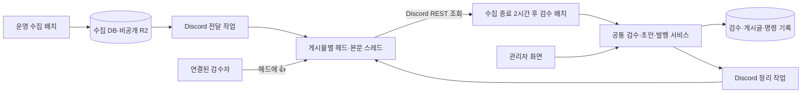

# Discord 게시물별 스레드·👍 지연 검수 계획

> 파일·DB·API·배치별 작업 분해와 검사/배포 순서는 [구현 계획](IMPLEMENTATION-PLAN.md)을 따른다.

> 최신 일정은 [07:30·17:00 고정 실행 결정](#fixed-review-schedule)을 따른다. 아래 최초 계획의 수집 종료+2시간/10분 반복 제안은 대체됐다.
> 완료 메시지의 삭제 방식은 [발행 완료·반려 후 삭제 검토](#completed-message-cleanup)를 따른다. 초기 완료 사본7일 보존안 대신 처리 완료 후 삭제하는 권고안이다.

- 담당: Codex / 작업 폴더: `/Volumes/MicroVault/iCloudDrive/git/private/blariyo`
- 브랜치: `feature/production-collection-20261004` / 재확인 HEAD: `9012d0cf3311631099a98e62ec4f55f7abe14c7a`
- 상태: 종료 — 사용자 구체화 반영·정적 검수 완료, 구현 미착수 / 갱신: 2026-10-07 20:20 KST
- 요청: 게시물마다 헤드/본문 스레드를 자동 생성하고, 헤드의👍를 수집2시간 후 배치가 승인·발행하며, 관리자 선처리는 Discord 삭제, 무반응은2일 뒤 반려한다.
- 범위: 이 신규 후속 계획과 이전 계획의 후속 링크만 작성. 구현·제품 정본·운영 설정·DB·Discord 발송/삭제·Git 반영은 수행하지 않는다.
- 담당 확인: 운영 앱 배포 기록은20:15 종료. HEAD 이동은 해당 배포 기록 커밋으로 확인했다. 이전 수집 시험 dirty2개·untracked 기록을 보존한다.
- 우선순위: 이번 사용자 결정이 [앞선 버튼·요약 방식](README.md)보다 우선한다. 이전 문서는 당시 제안으로 보존하며, 후속 구현은 이 문서를 계획 기준으로 삼는다.

## 1. 사용자 확정 사항과 보완 제안

| 항목 | 이번 사용자 결정 |
| --- | --- |
| 자동 전달 | 수집 게시물1건당 Discord 헤드 메시지1개 생성 |
| 헤드 | 번호·제목·출처 |
| 바디 | 헤드에 연결한 스레드에 이미지1개 또는 텍스트1문장씩 원문 순서대로 전송 |
| 승인 의사 | 사용자가 해당 **헤드**에👍 반응하면 승인 및 발행 의사로 해석 |
| 실제 실행 | 수집 배치2시간 후 Discord를 조회하는 별도 배치가 승인·발행 |
| 관리자 우선 처리 | 관리자에서 먼저 처리했으면 해당 Discord 메시지 삭제 |
| 무반응 | 👍 없는 게시물은2일 뒤 반려 |

버튼·slash 검수, 요청 시에만 보여주는 카드, 배치별 요약만 전송, 원문 이미지 Discord 미전송, 매8시간 MFA 재활성화 제안은 이번 방식에 적용하지 않는다. 관리자 화면은 기존 인증을 유지하고 Discord 검수자는 명시적으로 연결·해지한다. 사람의👍로 공개 의사를 확인하며 클릭 즉시 발행하지 않는다.

보완 제안은 확정 사항과 구분한다.

- 첫 조회: 해당 수집 실행의 종료 시각+2시간. 실행 실패/중단이어도 정상 저장된 글은 대상으로 삼을 수 있어야 하므로 실행 종료 상태와 글별 FETCHED를 분리한다. 종료 시각을 알 수 없는 비정상 실행은 추정하지 않고 복구 확인한다.
- 재조회 간격: 사용자에게 질문 전달. **2시간 후 최초 조회, 이후10분마다 조회**를 추천하지만 회신 전에는 미확정이다. 대안은2시간 후1회와2일 만료 시 최종1회다.
- 2일 기산점: **해당 글의 Discord 본문 전송 완료 시각+48시간**을 추천한다. 수집 시각보다 늦게 전달된 글도 실제 검수 시간을 확보하기 위한 제안이다. 사용자가 기산점을 지정하면 그 결정을 따른다.
- Discord 경로로 발행/자동 반려한 메시지: 완료 상태·게시글 링크를 헤드에 표시한 뒤 검수 종료+7일 이내 헤드/스레드 삭제 제안. 관리자 선처리 건은 즉시 삭제 대기 등록한다. 완료 메시지 보존 기간은 미확정이다.

## 2. 메시지 형태와 전송 계약

```text
비공개 검수 채널
└─ #000123 | 발행 예정 제목 | 출처명           ← 헤드, 👍는 여기에
   └─ 스레드: #000123 본문
      ├─ 텍스트 첫 문장
      ├─ 이미지 1
      ├─ 텍스트 두 번째 문장
      ├─ 텍스트 세 번째 문장
      └─ 이미지 2
```

- 번호는 게시글 발행 전의 **검수 번호**다. DB에서 한 번 부여하고 재시도에도 유지한다. 공개 게시글 ID와 혼동하지 않으며 헤드→itemId 매핑으로 사용한다. 제목은 기존 공통 보정 규칙의 발행 예정 제목, 출처는 공통코드 표시명이다.
- 일반 텍스트 채널의 메시지에 스레드를 연결한다. Discord 용어상 PUBLIC_THREAD지만 부모 채널을 비공개로 제한하면 그 채널 접근자에게만 노출된다. 서버 전체에 공개하는 설정이 아니다.
- 기존 TEXT/IMAGE/LINK 순서를 유지한다. TEXT는 문장 경계로 나누고, 경계가 불명확한 짧은 줄·목록은 한 단위로 보존한다. 요약·윤문·생략을 하지 않는다. URL·소수점·약어·인용부호·한국어 종결부호를 회귀 표본으로 검증한다.
- 한 문장이 Discord의 메시지2000자 제한을 넘으면 잘라 버리지 않고 같은 문장의 `(1/2)`처럼 연속 조각으로 보낸다. 구현은 표기/escape까지 포함한 실제 길이를 계산한다. LINK/SNS 참조는 본문 위치에 링크1개를 보존하고 새로운 외부 크롤링은 하지 않는다.
- IMAGE는1개씩 첨부한다. 기존 검증된 원본을 순서에 맞춰 전송하며 애니메이션을 임의 정지 이미지로 대체하지 않는다. 실제 첨부 크기 제한을 넘거나 업로드/렌더가 실패하면 완전 전송으로 표시하지 않는다. 압축·잘라내기·공개 다운로드 링크 우회 없이 관리자 확인 대상으로 남긴다.
- R2의 비공개 원본을 서버가 인증해 읽고 Discord에 업로드한다. R2 bucket/storage key/서명 URL을 채널에 노출하지 않는다. 현재 문서의 Discord 이미지 전송 금지 부분은 이번 요구에 맞는 **지정 채널 검수 사본 예외**로 개발 단계에서 갱신한다. 사용자 결정을 별도 허가 요청으로 반복하지 않는다.
- 글별 순차 전송과 조각 번호·내용 hash·Discord messageId를 저장한다. 헤드/스레드 생성→바디 전체 전달→본문 수/이미지 수/hash 확인→`READY` 순서다. 전송 중 헤드에는 `전송 중`을 표시하고 자동 승인을 막는다.
- 전송 중 일찍 누른👍가 뒤늦게 완성된 내용을 승인한 것으로 처리되지 않도록 READY 직전에 조기 반응을 정리하고, 그 후의 반응부터 유효하게 취급한다. 제거 실패면 READY를 열지 않는다. READY 헤드에 승인 확인 예정 시각과 무반응 기한을 추가 안내한다.
- 멘션은 생성/수정 모두 비활성화하고 raw HTML을 실행하지 않는다. 봇 외 일반 사용자의 본문 메시지 쓰기는 막고 검수자는 보기/반응 권한만 두는 구성을 추천한다. 수집 텍스트의 명령문을 실행하지 않는다.

## 3. 인프라·작업 분리



- `discord-export`: 수집 결과가 저장되면 글별 전송 대기를 자동 등록/탐지하고 헤드·바디를 전달한다. 수집 절차의 자동 후속 작업이지만 수집 DB transaction이나 외부 수집 요청을 Discord 전송 완료까지 붙잡지 않는다. 처음에는60초 주기 탐지 또는 수집 종료 후 wake-up과 영속 재탐지를 병행하는 안이다.
- `discord-review`: 일정이 도래한 READY 항목의 헤드와 실제 반응자를 조회하고 공통 승인/반려 명령을 접수한다. 재실행/중단 후에도 dueAt·진행 위치를 DB에서 복구한다.
- `discord-cleanup`: 관리자 선처리·원문 만료·완료 보존 만료에 따른 스레드/헤드 삭제를 재시도한다. 관리자 처리 commit과 같은 transaction에서 정리 대기를 남긴다. 삭제 성공을 관리자 성공의 선행 조건으로 두지 않는다.1분 이내 최초 삭제 시도를 운영 목표로 제안한다.
- 기존 운영 API에 내부 명령/CLI·systemd timer를 연결하는 방향을 우선한다. 별도 상시 Gateway, Discord 공개 HTTP endpoint, 검수용 slash/button receiver가 필요하지 않다. 기존 `/collect` Gateway와 interaction 수신 경로가 충돌하지 않는다.
- bot credential은 Discord 담당 서버 프로세스에만 배포한다. 수집기에 관리자 서비스 토큰·content/public 쓰기 권한을 추가하지 않는다. API 소유 검수 서비스만 상태·게시글을 변경한다.
- 단순 incoming webhook 대신 **Bot 인증 REST API**를 사용한다. 기존 봇을 재사용할 수 있는지는 운영 credential/채널 권한 확인 후 결정한다. 새 Application 생성은 필수 전제가 아니다.
- 전달·이미지 처리 동시1개, 발행 동시1개로 시작한다.2GB 서버에서 이미지 재검증/Discord 업로드와 발행이 겹친 최대 메모리를 측정한 뒤 조정한다. Java 수집용512MiB와 API256MiB 상한을 봇 작업의 가용량으로 착각하지 않는다.

## 4. 👍 판정과 시간 규칙

| 시점/상태 | 처리 |
| --- | --- |
| 첫 검수 시각 전 | 메시지 게시·검수 가능, 발행하지 않음 |
| 검수 시각 이후 READY, 유효👍 있음 | 동일 item snapshot에 대해 승인→초안→발행 명령1개 접수 |
| 검수 시각 이후 READY, 👍 없음,48시간 전 | 대기 유지 |
| 48시간 도래, 유효👍 있음 | 승인 처리 우선. 무반응 반려로 덮어쓰지 않음 |
| 48시간 도래, 정상 조회로 유효👍 없음 확인 | `REJECTED`, 사유 `DISCORD_NO_APPROVAL_TIMEOUT` |
| Discord 조회/권한/본문 검증 오류 | 결과 미확인·재조회. 자동 반려하지 않음 |
| 관리자 처리 또는 다른 명령 이미 확정 | 재판정하지 않고 해당 상태를 따름 |
| 승인 명령 접수·초안 생성·발행 실패 | 그 명령을 복구. 무반응 만료 대상으로 되돌리지 않음 |

- 표시된 reaction count만으로 승인하지 않는다. 해당 헤드의👍 반응자 목록을 읽고 연결된 내부 운영자와 대조한다. bot 반응·다른 사람·스레드 바디에 붙인👍는 무시한다. 초기 유효 검수자는 OWNER1명이다.
- 기본👍와 피부색 변형을 명시적으로 정규화하고 같은 사용자1명으로 처리하는 안이다. 커스텀 이모지는 이름이 thumbsup이어도 승인으로 취급하지 않는다. 일반/슈퍼 반응 조회 유형과 페이지네이션(최대100명)을 처리한다. 둘 중 하나라도 필요한 조회가 실패하면 없음으로 판정하지 않는다.
- 승인 명령을 확정하기 직전에 현재 반응과 운영자 권한을 다시 조회한다. 반응을 취소한 상태면 미접수. DB 명령 확정 이후 취소는 이미 시작한 공개 작업을 자동 철회하지 않는다. 이 경계는 헤드의 안내에 명시한다.
- Discord 반응 조회와 우리 DB commit은 하나의 transaction이 될 수 없다. 마지막 확인 시각/actor/대상 snapshot을 감사 증거로 남기며 아주 짧은 반응 취소 경합을 완전히 제거했다고 주장하지 않는다.
- REST 반응 목록은 정확한 반응 생성 시각을 제공하지 않는다. **48시간이 지난 첫 정상 조회 시 관찰한 상태로 최종 판정**하는 안이다. 장애 후 발견한👍가48시간 이전에 눌렸다고 추정하지 않는다. 초 단위 마감 이전 반응만 받아야 한다면 Gateway 사건 기록이 추가로 필요하므로 별도 범위다.
- 전송 미완료/첨부 누락/원문 변경은 자동 승인·자동 반려에서 제외하고 관리자 확인 대상으로 둔다. Discord 오류를 운영자의 무반응으로 취급하지 않는다.

예시(기산점/10분 반복 채택 시): 수집 종료10/7 16:30, 글 전송 완료16:35 → 첫 승인 조회18:30, 이후10분마다, 무반응 최종 판정10/9 16:35 이후 첫 정상 조회.2일은 달력 날짜가 아니라48시간이다. 저장은 UTC, 안내는 KST를 사용한다.

## 5. 관리자 충돌·삭제·발행 복구

- 관리자가 승인/반려/초안 생성/발행을 확정하면 해당 item의 Discord 판정 권한을 먼저 닫고 정리 대기를 남긴다. 조회만 하거나 저장되지 않은 제목을 입력한 상태는 처리 완료로 간주하지 않는다.
- 두 경로가 경합하면 DB의 동일 item 작업 점유·item/review 버전 검사로 먼저 확정된 처리만 허용한다. 관리자 행위가 먼저 commit된 건은 Discord가 덮어쓰지 않는다. Discord가 먼저 명령을 확정한 건은 관리자가 진행 상태/결과를 보며, 진행 중 명령을 취소 없이 덮어쓰지 않는다.
- 삭제 대상은 헤드뿐 아니라 **연결된 본문 스레드와 첨부 메시지 전체**다. 스레드 삭제와 헤드 삭제를 각각 확인한다. 둘 중 하나만 성공해도 미완료 대기를 유지한다. archive는 삭제로 계산하지 않는다. 이미 없음404는 대상 ID 확인 후 삭제 완료로 처리,403/429는 실패/대기다.
- 수동 삭제로 헤드가 사라진 미검수 건은 무반응으로 반려하지 않는다. 전송 무결성 오류로 두고 관리자에게 알린다. 관리자 처리 근거가 있으면 남은 스레드를 정리한다.
- 원문/발행 제목 snapshot이 달라지면 기존 반응으로 새 내용을 승인하지 않는다. 이전 전달을 닫고 새 revision을 만들거나 관리자에서 처리한다. 기존👍를 새 revision에 승계하지 않는다.
- 승인→초안→발행은 서버의 영속 명령으로 실행하고 각 단계의 receipt와 postId를 보관한다. 재실행 시 기존 초안/발행 결과부터 조회한다. 발행 실패를 반려로 바꾸지 않는다.
- 관리자가 먼저 승인해 초안 생성/발행에 실패했더라도 Discord를 다시 의사결정 창구로 열지 않는다. 관리자에서 후속 복구한다.
- 2일 뒤 반려는 검수 상태 변경이다. R2/DB 원문 즉시 삭제를 뜻하지 않는다. 현행 검수 완료·반려 후7일, 미검수28일 보존 계약은 유지한다. Discord 자체 사본 삭제 정책은 위 제안대로 정본에 별도로 반영한다. Discord 삭제 API 성공을 외부 CDN/백업까지 즉시 제거된 증거로 보고하지 않는다.

## 6. 최소 저장 정보·멱등 처리

| 기록 | 필수 필드 |
| --- | --- |
| Discord 전달 | itemId·검수 번호·수집 실행ID·revision·itemVersion/reviewVersion/contentDigest·제목·게시판·채널/헤드/스레드 ID·상태 |
| 바디 조각 | 원문 block/문장/분할 순서·text 또는 media hash·messageId·전송 결과 |
| 일정 | runFinishedAt·exportCompletedAt·firstScanDueAt·rejectDueAt·nextAttemptAt·lastSuccessfulScanAt |
| 판정 명령 | 내부 actor·경로DISCORD/WEB/SYSTEM·observedAt·decision·snapshot·idempotency key·단계/postId/실패 |
| 정리 대기 | item/revision·thread/head 대상 ID·사유·시도/오류·다음 실행·각 대상 삭제 확인 |

- 자동 반려 actor는 사람을 가장하지 않는 system actor를 사용하고 timeout 사유·마지막 정상 반응 조회를 기록한다. 승인 actor는 실제 반응한 연결 운영자다. timer 계정에 임의의 관리자 role 헤더를 조립하는 권한을 주지 않는다.
- 전달 키는 itemId+revision+partIndex로 고정한다. Discord nonce/enforce_nonce의 단기 중복 방지와 DB receipt를 함께 사용한다. 장기 응답 유실은 저장된 ID·메시지 순서/표식을 대조하고 불명확하면 발송을 멈춰 확인한다. nonce가 영구 중복 방지를 보장한다고 가정하지 않는다.
- 수집 결과 자체를 Discord에서 역으로 재구성해 발행하지 않는다. Discord는 검수 사본/의사 표시이며 발행 본문은 동일 digest의 DB/R2 정본에서 만든다.
- 첫 활성화는 신규 수집부터 전달하는 안이다. 기존 미검수 건 일괄 전송은 별도 선택으로 두고2일 기산점을 소급 적용하지 않는다.

## 7. 처리량과 개발 순서

게시물 N개, 평균 문장 S개, 이미지 I개라면 헤드/본문만 `N×(1+S+I)`개 메시지와 N개 스레드를 만든다. 예를 들어100건·문장10개·이미지5개면 **1,600개 메시지+100개 스레드**다. 이는 설명용 계산이며 실제 수집 평균이 아니다. 전송 소요시간은 Discord route별 제한·이미지 크기로 실측하고429 Retry-After를 따른다.

| 단계 | 개발 범위 | 예상 작업일 | 완료 조건 |
| --- | --- | ---: | --- |
| 0 | 시간 기산점/반복 주기 확정, 이미지 외부 검수 사본·자동 반려 정책, planning/보안/API/spec 갱신 | 0.5~1 | 이전 제외 규칙·버튼 제안과 모순 제거 |
| 1 | 공통 승인/발행 명령·점유·단계 복구·관리자 전환·정리 대기 | 2~3 | 경합·중복·부분 실패 재개 |
| 2 | 헤드/스레드·문장/이미지 순차 전송·완전성·재시도·revision | 2~3 | 누락/잘림/중복·미완성 승인0 |
| 3 | 👍 반응자 조회·2시간/48시간 일정·자동 반려·작업 복구 | 1.5~2 | 시간 경계·취소·장애 오판 방지 |
| 4 | 관리자 선처리 삭제·완료/만료 회수·알림·자원 제한·timer | 1~1.5 | 헤드/스레드 잔존 추적과 재시도 |
| 5 | Discord 실환경·관리자·부하·배포/인수 | 1~1.5 | 아래 수용 기준·실제 운영자 확인 |

개발자1명 기준 **8~12작업일 추정**, 실시간48시간 만료 관찰은 별도2일이다. 기존 계획과 작업량 구성은 달라졌다. 기한/착수일은 미정이며 이번에는 구현하지 않는다.

## 8. 검증·운영 수용

- 텍스트/이미지 혼합·긴 문장·URL·한국어 문장·GIF·첨부 초과 표본에서 원문 순서와 완전성을 비교한다. 일부만 전송한 글은 READY0건.
- 같은 수집 결과 재시도·헤드/스레드/바디 전송 응답 유실·프로세스 재기동에서 무결성과 중복 방지를 확인한다.
- 정상👍·피부색·일반/슈퍼·bot/타인·바디 반응·전송 중 조기 반응·권한 회수·최종 확인 전 취소를 검증한다.
- 첫 조회 직전/직후·48시간 직전/직후·서비스 중단 후 복귀에서 판정한다. 조회 실패/수동 헤드 삭제/전송 실패는 자동 반려0건.
- 관리자 선처리와 Discord 명령 동시성, 본문 변경과 기존👍, 초안 성공/발행 실패를 검사한다. 중복 게시글·발행0건.
- 관리자 처리 후 헤드·스레드 삭제를 둘 다 확인한다. bot의 MANAGE_THREADS 등 필요한 권한 거부도 검사하며 채널 전체 관리자 권한으로 해결하지 않는다.
- 비공개 검수 채널의 접근 권한을 실제 다른 계정으로 확인한다. 봇 자격은 별도 비밀 경로로 전달하고 메시지/로그에는 기록하지 않는다.
- 운영2GB에서 수집1개+이미지 전송1개+발행1개,100건 예시 규모를 실제 대표 표본으로 측정한다. 공개 오류/OOM/가용256MiB 미만이면 새 작업 접수를 중단하는 기존 시험 기준을 재사용한다.
- 개발 환경의 가상 시간48시간 검사와 실제 운영48시간 관찰을 분리한다. 알림 전송만 먼저 활성화하고, OWNER가 지정한 검증 게시물로👍→지연 승인/발행을 확인한 뒤 무반응 반려를 활성화한다.
- export/review/autoReject/cleanup을 각각 제어하되 중지 기간을 무반응으로 소급 계산하지 않는다. 재개 시 정상 조회 후 판정하며 승인된 작업/초안은 보존한다. 비밀 회수·권한 오류 중 자동 판정을 멈춘다.

## 9. 최신 운영 기록과 외부 근거

- 앞선 계획 이후 [운영 앱 배포 기록](../production-web-api-deployment/README.md)이20:15 종료로 갱신됐다. 기록상 운영 main은 `b57724d`, API V013/Collector V015이며 웹/API 배포·읽기 검증 완료다. 운영 정기 collector timer는 여전히 미활성으로 기록돼 있다. 이번 턴에는 운영을 직접 조회하지 않았다.
- [Discord Message](https://docs.discord.com/developers/resources/message): 메시지2000자, Get Reactions의 사용자 목록·type/after/limit, 단기 nonce 중복 억제. reaction count만으로 권한을 판정하지 않는다.
- [Discord Channel](https://docs.discord.com/developers/resources/channel): 메시지에서 스레드 생성, 메시지당 스레드1개, thread ID=헤드 ID, 파일 업로드/본문 전달은 별도 호출.
- [Discord Threads](https://docs.discord.com/developers/topics/threads): 부모 채널 권한·스레드 권한, 삭제는 MANAGE_THREADS 필요, archive와 삭제 구분.
- [Discord rate limits](https://docs.discord.com/developers/topics/rate-limits):429 Retry-After 준수. 고정 초당 호출 수를 보장하지 않는다.

이번 수행은 사용자 요구와 source/정본·공식 문서 대조 및 계획 기록이다. 실제 API 호출로 운영 메시지를 읽거나 쓰지 않았고, 코드/DB/서버/정본 수정·테스트/빌드·commit/push/배포는 하지 않았다. 재조회 주기·2일 기산점·Discord 완료 사본 보존 제안은 확정값과 구분해 남긴다.

- 기록 검증: 이전/후속 계획의 로컬 링크12개(중복 포함) 존재 확인, 공백 검사와 `git diff --check` 통과. 작업 전후 기존 dirty/untracked 경로 목록 유지, 이번 소유 폴더의 계획만 작성/추가했다.

<a id="fixed-review-schedule"></a>

## 10. 후속 확정 — 검수 배치07:30·17:00 KST

- 담당: Codex / 작업 폴더: `/Volumes/MicroVault/iCloudDrive/git/private/blariyo`
- 현재 브랜치: `feature/collection-schedule-0430-1530` / HEAD: `9012d0c`
- 상태: 종료 — 사용자 일정 결정 기록 / 갱신: 2026-10-07 20:21 KST
- 담당 경계: 다른 세션의 `collection-schedule`은 수집 스케줄·정본·운영 변경 진행 중이며 Discord 기록 제외를 명시했다. 이 세션은 본 계획과 진입 링크만 담당하며 브랜치/index/스케줄 파일을 변경하지 않는다.
- 사용자 확정: 운영·로컬 정기 수집04:30/15:30을 기준으로 **Discord 검수 배치는 매일07:30/17:00 Asia/Seoul**에 실행한다.

| 구간 | 수집 시작 | Discord 검수 실행 | 시작 시각 간격 |
| --- | --- | --- | --- |
| 오전 | 04:30 | 07:30 | 3시간 |
| 오후 | 15:30 | 17:00 | 1시간30분 |

- 수집 종료+2시간 및10분마다 반복 조회 제안은 적용하지 않는다. 고정 시각이 기준이며 수집 시작과 종료를 혼동하지 않는다.
- 각 회차에서 해당 회차 수집물뿐 아니라 이전부터 남아 있는 READY·미처리 대상도 확인한다. 직전 실행 후 새로 붙인👍는 다음07:30 또는17:00 회차에서 처리한다.
- 정시까지 바디 전송이 끝나지 않은 글은 다음 회차로 넘긴다. 준비 완료를 추정하거나 일부 내용만으로 발행하지 않는다.
- 이번 결정은 승인 확인 일정이다. 무반응2일 기산점과 자동 반려 검사 주기는 아직 별도 미확정이며 위의48시간 기산점 제안을 사용자 확정으로 바꾸지 않는다.
- 적용 상태: 계획 기록만 갱신. 실제 운영/로컬 검수 timer 설치·Discord 조회/발행은 미실행. 수집04:30/15:30의 실제 적용 증거는 해당 수집 담당 기록을 따른다.

<a id="completed-message-cleanup"></a>

## 11. 후속 검토 — 발행 완료·반려 메시지 삭제

- 담당: Codex / 폴더·브랜치: 위10절과 동일. 변경 경로: 이 계획만.
- 상태: 종료 — 가능성 확인·처리 조건 제안 / 갱신: 2026-10-07 20:21 KST
- 요청: 승인이나 반려된 메시지도 채널에서 삭제할 수 있는지 확인.
- 결론: 가능. Discord의 메시지 삭제와 스레드 삭제 API를 사용한다. 봇이 작성한 헤드를 삭제하고 본문 스레드 전체도 별도로 삭제·확인한다. 스레드 삭제에 필요한 MANAGE_THREADS를 지정 채널 범위로 부여한다.

| 상태 | 권장 삭제 시점 |
| --- | --- |
| Discord👍 승인 후 발행 성공 | 게시글 PUBLISHED·명령 결과 저장 후 바로 정리 대기 등록 |
| 2일 무반응 반려 | REJECTED 확정 저장 후 바로 정리 대기 등록 |
| 관리자 선처리 | 기존 확정대로 해당 검수 창구를 닫고 헤드/스레드 정리 |
| Discord 승인·초안 생성 후 발행 실패/결과 미확인 | 메시지 유지·실패 안내, 기존 초안으로 복구. 발행 성공 후 정리 |
| 미검수/판정 조회 실패 | 메시지 유지, 정상 판정 전 자동 삭제하지 않음 |

- 07:30/17:00 검수 배치가 승인·발행을 마친 항목은 같은 회차에서 최초 삭제를 시도한다. 반려/관리자 처리도 상태 확정 후 정리 대기를 즉시 등록한다. 실패한 삭제는 전용 정리 작업이 재시도하므로 외부 서비스 지연 중 즉시 삭제 완료를 보장하지 않는다.
- 최종 상태와 삭제 대기 기록을 함께 commit한 뒤 Discord를 삭제한다. 삭제 때문에 승인/발행을 다시 실행하지 않으며, thread/head 각각의 삭제 성공 또는 대상 없음 확인이 있어야 정리 완료다.
- 처리 이력(검수 번호·itemId·판정 actor·시각·사유·postId)은 서버에서 조회할 수 있게 유지한다. 채널을 미처리·복구 필요 건 중심으로 정리해도 업무 이력을 잃지 않는다.
- Discord 검수 사본 삭제는 공개 게시글 삭제나 DB/R2 원문 즉시 삭제를 의미하지 않는다. 기존 원문 보존 계약은 별도다.
- 근거: [메시지 삭제](https://docs.discord.com/developers/resources/message#delete-message), [스레드 삭제와 권한](https://docs.discord.com/developers/topics/threads#editing-deleting-threads). 이번에는 계획 기록만 변경했으며 실제 메시지 삭제·권한 변경·구현은 하지 않았다.

## 12. 후속 확정 — 삭제 실패 안내·본문 제외

- 2026-10-07 20:50 KST 사용자 추가 요구: 삭제 실패는 삭제만 재시도하고, 2회 이상 실패하면 해당 스레드에 승인/발행 여부를 남긴다. 본문 이미지·문장에 👍 외 반응이 있으면 해당 부분은 발행에서 제외한다.
- 상세 구현·경계·검증은 [구현 계획 11절](IMPLEMENTATION-PLAN.md#cleanup-notice-and-content-exclusion)을 따른다. 이전의 ‘바디 반응 무시’는 글 승인에만 해당하며, 본문 선택에는 새 규칙을 적용한다. 구현/Discord 호출은 아직 하지 않았다.
