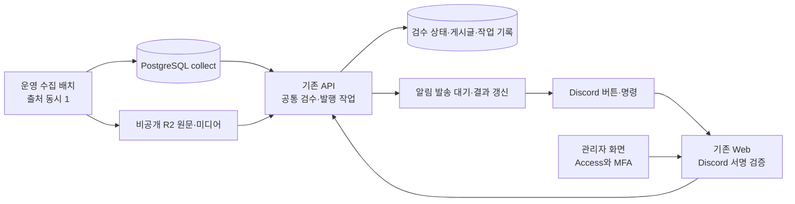

# 운영 수집 결과의 Discord·관리자 병행 검수 개발 계획

> 현재 개발 작업 순서는 [구현 계획](IMPLEMENTATION-PLAN.md)을 따른다. 아래는 최초 제안이며, 메시지·반응·시간·삭제에 대한 후속 사용자 결정은 구현 계획과 연결된 반응 배치 계획에 반영했다.

- 담당: Codex / 작업 폴더: `/Volumes/MicroVault/iCloudDrive/git/private/blariyo`
- 브랜치: `feature/production-collection-20261004` / 확인 HEAD: `1c255a9ba261903c6a64804edb29ef0fa0b70da1`
- 상태: 종료 — 계획 작성·정적 검수 완료, 구현 미착수 / 갱신일: 2026-10-07 KST
- 요청: 수집기의 운영 실행 구조를 반영해 Discord 검수 방법과 개발 순서를 구체화한다.
- 산출물·변경 경로: 이 계획 기록만. 구현·정본 수정·운영 조회/변경·Discord 발송·Git 반영은 하지 않는다.
- 담당 경계: `production-web-api-deployment`는 다른 세션이 진행 중. 해당 checkout·배포·기존 dirty 2개 정본과 기존 untracked 기록은 보존한다. 이 신규 기록 폴더만 담당한다.
- 이전 검토: [10/6 가능성 검토](../../2026-10-06/discord-admin-review/README.md). 로컬 PC 상시 가동 전제는 이번 목표 구조에 적용하지 않는다.
- 문서 성격: 구현 승인 전 제안. 아래 신규 명칭·API·수치·일정은 계획값이며 현행 구현/운영 설정이 아니다.

## 1. 결론과 기준선

**운영 Web/API에 Discord 검수 창구를 추가하고, 관리자와 같은 검수 상태·처리 서비스를 사용한다. 수집 배치는 저장까지만 담당한다.** 초기 기능은 알림, 검수 목록/단건 선택, 승인 및 발행, 반려, 처리 결과 확인이다. AI 자동 판단·자동 발행, 전체 본문 편집, 일괄 승인·삭제는 제외한다.

사용자는 운영에서 수집기를 실행하도록 인프라를 변경했다고 설명했다. 이를 목표 구조로 반영한다. 다만 현재 직접 읽은 정본/증거의 상태는 다음과 같으며, 상시 운영 완료를 추정하지 않는다.

| 구분 | 이번 확인 | 계획에 미치는 영향 |
| --- | --- | --- |
| 인프라 계약 | [수집 기획](../../../docs/planning/content-collection/README.md):3, [수집 설계](../../../docs/system-design/07-spring-collector-design.md):24는 동일 서버 일회 시험을 명시 | 개발 착수 때 정기 운영 결정·배포 완료 상태에 맞춰 정본 재대조 |
| 운영 시험 기록 | [실측](../production-collector-trial/README.md): goodgag 5건 저장, CPU0.5·512MiB·heap256MiB·출처 동시1, 메모리 피크90.83MiB. 임시 컨테이너·접근 권한 회수, timer 미전환 | 작은 표본의 기록이며 Discord+발행+수집 동시 부하 보장은 아님 |
| 앱 배포 | [배포 기록](../production-web-api-deployment/README.md): 진행, PR #17/CI 단계 | 운영 구 API와 로컬 새 검수 계약을 혼용하지 않음. 최종 SHA/schema 확인이 실연동 선행 조건 |
| 관리자 현재 source | [admin-batch.vue](../../../apps/web/app/pages/admin-batch.vue)의 `executePending`이 승인→초안→발행을 순차 실행 | 연속 실행·복구를 API의 공통 작업으로 이동 |
| API 현재 source | [BatchReviewService](../../../apps/api/src/features/collection/batch-review.service.ts)의 버전/digest/중복 키/원문 중복 검사 | 신규 Discord 경로도 같은 검사 통과 |
| Discord 현재 source | [DiscordGateway](../../../apps/collector/src/main/java/com/blariyo/collector/discord/DiscordGateway.java)는 `/collect`·확인/취소만 처리 | 수집 batch CLI를 운영에 올리는 것만으로 검수 봇이 켜지지 않음 |
| 기존 범위 | [기능 명세](../../../docs/development-specs/m0-collection-assist/collection-assist/collection-assist.dev.md):53은 Discord 검수/발행 제외 | planning→기술/API→개발 명세 순으로 범위 변경 필요 |

## 2. 운영자가 실제로 쓰는 방법

본문·이미지의 Discord 직접 표시 여부는 사용자에게 선택 질문을 전달했다. 회신 전 초안은 **제목·출처·수집 시각·상태를 Discord에서 보고, 원문/이미지는 관리자 상세로 확인**하는 안이다. 본문 요약을 AI로 새로 생성하지 않는다. 원본 미디어의 Discord 복사는 현행 보안 계약과 별도다.

1. 준비: 운영자가 `https://blariyo.com/admin`에서 기존 Access/MFA로 로그인한다. 자신의 Discord 사용자 ID를 OWNER가 연결한 뒤 `Discord 검수 사용`을 켠다. 제안 유효 기간은 최대8시간이며 언제든 끌 수 있다.
2. 수집 결과가 생기면 비공개 운영 채널에 `새 검수 대상 N건 / 검수 대기 M건` 요약을 올린다. 채널명·ID는 `(미정)`이며 기존 운영 채널을 재사용할 수 있다. 배치 실행별 요약 메시지 1개를 갱신하고 모든 글을 개별 자동 전송하지 않는다.
3. `[검수 시작]` 또는 `/review next`로 검토 가능한 항목 한 개를 요청한다. `/review list`는 한 번에10개, `/review status`는 대기·처리 중·실패 수를 보여준다. 원문 만료, 수집 실패/진행, 이미 게시글에 연결된 항목은 새 검수 대상에서 제외한다.
4. 요청한 사람에게만 보이는 카드에 아래 내용을 표시한다. 링크는 기존 `/admin/batch?itemId=<UUID>`를 사용하고 관리자 인증을 유지한다.

```text
[검수 전] <발행 예정 제목>
출처: <출처명> · 수집 완료: <KST>
본문·이미지는 상세에서 확인하세요.

[관리자 상세] [승인 및 발행] [반려] [다음 글]
```

5. 승인 선택 시 최종 제목·게시판(meme)·즉시 공개 의미를 별도의 본인 전용 확인 카드로 보여준다. `[내용 확인 · 발행]`을 눌러야 접수한다. 제목을 바꾸려면 관리자 화면에서 처리한다. Discord는 저장되지 않은 관리자 입력을 공유한다고 표시하지 않는다.
6. 반려도 확인 후 확정한다. `다음 글`은 이번 조회에서만 건너뛰며 새 보류 상태·영구 반려를 만들지 않는다. 카드에서 실패 자료 삭제는 제공하지 않는다.
7. `처리 중 → 발행 완료/반려 완료`를 표시한다. 초안까지 생성했지만 발행 실패하면 `초안 보존 · 발행 재시도 필요`와 관리자 링크를 제공한다. 초기 버전의 수동 실패 복구는 관리자로 통일한다.
8. 관리자에서 먼저 처리한 항목은 Discord에서 `다른 경로에서 처리됨`으로 전환한다. 오래된 카드에는 최신 내용을 자동 대입해서 승인하지 않는다. 새 카드로 다시 확인한다.

공통 채널 요약에는 건수·상태·조회 버튼만 두고, 제목/출처는 권한 확인 후 본인 전용 응답으로 제공한다. 링크 미리보기와 멘션을 차단하고 수집 텍스트를 명령·Markdown 지시로 해석하지 않는다. 본문·이미지 편집, 이미 발행한 글 숨김·수정은 기존 관리자 기능을 사용한다.

## 3. 권장 인프라



| 방식 | 장점 | 제약 | 판단 |
| --- | --- | --- | --- |
| 수집기에 기존 JDA Gateway 확장 | 기존 Discord 코드 일부 활용, 새 HTTP 수신 경로 없음 | 일회 batch 종료 후 연결 없음. 상시 Java 실행/추가 자원·수집 권한과 관리 권한 분리 필요 | 대안 |
| **기존 Web의 HTTP Interactions + API 작업 처리** | 별도 상시 봇/JVM/서버 불필요, batch 가동과 독립 | 서명 검증 endpoint와 전달/재시도 계약 필요 | **추천** |
| 별도 봇 서버 | 장애·자원 격리 | 서버/배포/비용 증가 | 현재 선행 조건으로 두지 않음 |

- 기존 VM의 Web/API/PostgreSQL/R2 경계를 활용한다. collector에 content/public DB·object 쓰기 권한 또는 관리자 서비스 토큰을 배포하지 않는다.
- API 안의 전용 경량 runner가5초 간격으로 영속 작업을 확인하고 발행은 동시1개로 제한하는 안이다. 원문 신규 대상 탐지는60초, 결과 동기화는10초 이내 목표다. 실제 부하 측정 뒤 조정한다.
- runner는 DB에서 한 작업을 조건부 점유하고 점유 만료 후 복구한다. 여러 API 인스턴스/재시작 때 중복 실행을 막는다. 현재 outbox의 점유·복구 패턴을 참고하되 Discord 오류가 기존 이미지 삭제/캐시 작업을 지연시키지 않게 전용 작업 유형·실행 예산을 둔다.
- 작업 HTTP 접수와 실제 이미지/발행 처리를 분리한다. 새 Redis/RabbitMQ·상시 Java 프로세스 도입을 초기 조건으로 삼지 않는다.
- 같은 Discord Application의 interaction을 HTTP와 Gateway 양쪽에서 동시에 받지 못한다. **검수용 Application을 별도로 두는 안**을 기준으로 기존 `/collect` Gateway 설정을 유지한다. 기존 Application 미사용이 확인되고 통합을 선택하면 모든 명령의 전달 경로를 함께 이관해야 한다. Application 생성은 이번 계획에서 실행하지 않는다.
- 단순 알림용 incoming webhook만으로 승인 버튼 수신을 구현하지 않는다. 검수용 App의 공개키(수신 검증)와 bot token(요약 메시지 생성/갱신)을 구분한다.

## 4. 인증·권한 계약

1. 제안 공개 경로는 `POST /api/integrations/discord/interactions` 하나다. 현재 존재하는 URL이 아니다. Discord Ed25519 서명을 원본 요청 본문과 timestamp로 검증한 뒤에만 JSON을 처리한다. 잘못된 서명401, 검증된 PING만 PONG 반환. 요청 크기64KiB 상한·5분 timestamp 허용 폭을 자체 정책 초안으로 둔다.
2. 이 경로는 Discord 호출을 받아야 하므로 브라우저용 Access 로그인/Origin 검사를 적용하는 관리자 프록시와 구분한다. 기존 `/admin*`, `/api/v1/admin/*`의 보호는 유지한다. Cloudflare/WAF/캐시/리다이렉트가 서명 요청·PING을 막지 않는지 별도로 확인한다. 관리자 경로 전체 예외는 만들지 않는다.
3. 검수 App ID·허용 guild/channel·개별 Discord 사용자 ID를 확인한다. 초기 허용자는 **현재 OWNER 한 명**이다. 표시 이름이나 Discord 역할만으로 발행 권한을 부여하지 않는다.
4. 기존 운영자 등록과 연결한 내부 operatorId로 actor를 만들며 Core가 허용한 명령만 전달한다. 연결/해지·8시간 이내 검수 활성화는 Access/MFA 관리자 경로에서만 수행한다. 일반 브라우저가 보내는 actor/role 헤더는 신뢰하지 않는다.
5. Core는 Discord 명령의 연결 버전·유효 grant·내부 역할·기능 flag를 접수 시와 실행 직전에 재검사한다. 권한이 회수되거나 만료되면 미실행 작업을 중지한다. 이미 성공한 단계는 보존하고 재인증 후 같은 작업의 잔여 단계만 재개한다. 권한 회수는 이미 완료된 공개 작업을 되돌리는 명령이 아니다.
6. Web은 좁은 내부 검수 명령으로만 전달하며 외부가 임의 Core URL을 지정할 수 없다. service token/role/actor의 기존 신뢰 경계를 문서화하고, Discord 출처 표시와 grant 검증을 추가한다. collector 인증을 관리자 인증으로 승격하지 않는다.
7. bot token은 서버 비밀 저장소에서만 읽고 client bundle·worklog·로그에 넣지 않는다. app 사용자·channel ID는 제한 설정으로 관리하고 감사 로그에는 내부 actor·채널 유형·작업 ID를 남긴다.

## 5. 공통 API·상태 처리

기존 검수 상태 `UNREVIEWED/APPROVED/REJECTED`와 게시글 상태를 유지하고, 실행 단계는 별도 작업 기록으로 관리한다. `REVIEWING` 같은 새 사용자 상태를 다시 도입하지 않는다.

| 제안 기능/경로 | 입력·결과 | 필수 검사 |
| --- | --- | --- |
| 기존 batch 목록/상세 | FETCHED·미검수·기한 내·미연결 대상 | 인증·현재 기능 flag·만료·snapshot |
| `POST /api/v1/admin/collect/batch-items/:id/commands` | action=`APPROVE_AND_PUBLISH` 또는 `REJECT`, itemVersion/reviewLockVersion/contentDigest, 명시적 제목/게시판, 요청 키 →202 commandId | 현재 snapshot/권한, 본문/이미지 완전성, 같은 item 활성 작업 단일성 |
| `GET /api/v1/admin/collect/review-commands/:commandId` | 단계·성공 결과·postId·에러/다음 행동 | 운영자 권한, 개인정보 최소화 |
| `POST .../review-commands/:commandId/resume` | 기존 명령과 동일 의미로 잔여 단계 재개 | 관리자 전용 초기 제공, 재인증/현재 postVersion/상태 검사 |
| 관리자 Discord 활성화/해지 | 내부 operator와 연결 버전, 최대8시간 만료 | OWNER, Access/MFA, CSRF/Origin |

위 경로·DTO·operationId는 구현 전 API 계약에서 확정한다. 기존 `/review`, `/draft`, 게시글 `/publish`의 내부 검증 서비스는 재사용한다. 관리자도 새 공통 명령을 사용하도록 바꾸고 기존 endpoint가 남는 동안에는 동일한 항목 작업 점유/버전 검사를 적용한다.

승인 흐름: `QUEUED → REVIEWED → DRAFT_CREATED → PUBLISHED`. 반려 흐름: `QUEUED → REJECTED`. 실패/중단은 마지막 성공 단계와 errorCode를 보관한다. 상세 복구 내용은 관리자에게 표시하며 Discord에는 짧은 결과만 제공한다.

- 카드 표시 당시 itemVersion, reviewLockVersion, contentDigest, 최종 제목·게시판을 확정 요청에 묶는다. confirmation은 사용자·채널·item snapshot에 귀속하며10분 유효 제안이다. 원문/권한 만료가 더 빠르면 그 시각을 따른다.
- Discord interaction ID를 중복 키로 쓰고 body hash를 함께 저장한다. 다른 interaction의 반복 클릭도 item 활성 작업/최종 상태로 차단한다. 단계별 내부 요청 키는 commandId에서 안정적으로 파생한다.
- item 잠금 확인과 작업 생성은 원자적으로 처리한다. 작업 간 이미지 I/O 중 긴 DB transaction을 유지하지 않는다. 기존 `BatchReviewService`의 잠금과 순서를 정리해 중첩 잠금·교착을 방지한다.
- 다른 쪽에서 변경한 내용을 최신 버전으로 자동 덮어 넣지 않는다. 충돌이면409와 재조회 안내. 원문 만료410, 권한 없음403을 구분한다.
- 초안 생성 응답 유실 시 기존 receipt/postId를 먼저 조회한다. 신규 초안을 다시 만들지 않는다. 발행 결과가 불확실하면 현재 게시글 상태·명령 receipt를 조회한 뒤 판단한다.
- 부분 실패 후 초안 제목/본문을 관리자가 바꾸면 자동 재발행하지 않는다. 게시글 버전이 달라진 작업은 새 내용을 확인한 관리자에게 인계한다.

## 6. 영속 데이터·알림·보존

최소 추가 데이터는 아래4종이다. 기존 기능과 합칠 수 있는 저장소는 계약 검사 후 재사용하며 테이블 이름은 미정이다.

| 데이터 | 내용 | 보존 제안 |
| --- | --- | --- |
| 검수 활성화 grant | operator·연결 버전·유효기간·회수 시각 | 유효 최대8시간, 만료 후 감사에 불필요한 연결값 제거 |
| 검수 명령/단계 receipt | commandId·actor·source(WEB/DISCORD)·item/version/digest·action·단계·postId·오류 | 활성 작업은 완료까지, 종료 receipt90일 제안. 기존 감사/멱등 보존과 구현 전 통일 |
| 표시 snapshot/confirmation | 난수 토큰·item snapshot·확정 제목·사용자/채널·만료 | confirmation10분, 카드 참조24시간 이내 및 원문 만료 중 짧은 기간. 원문 사본 없음 |
| 전달 대기/메시지 대응 | 대상 run/command·channel/messageId·전달 버전·재시도 시각 | 처리 완료 뒤7일 최소 요약, 본문/이미지 저장 안 함 |

- button custom_id에는 `review:confirm:<opaque-token>`처럼 짧은 난수 참조만 넣는다. 권한·제목·digest 전체를 넣지 않으며 서버에서 대응을 검증한다.
- API는 collect를 읽어 검토 대상만 발견하고 API 소유 전달 기록에 unique key를 남긴다. collector가 API 알림 테이블에 직접 쓰지 않는다. 최초 활성화에서는 과거 자료를 글별 발송하지 않고 현재 대기 건수 요약1개로 시작한다.
- 요약은60초 단위로 합치고 동일 run 메시지를 갱신한다. 단건 검수/처리 결과는 요청자에게만 보인다. 15분을 넘긴 본인 전용 interaction 응답은 갱신 가능하다고 가정하지 않으며 `/review status`와 관리자에서 결과를 다시 조회한다. 채널 요약은 bot REST+messageId로 갱신한다.
- interaction은3초 안에 응답한다. 목표2초 안에 영속 접수를 확인하고 지연 응답을 반환한다. DB가 늦으면 성공 접수를 확정하지 않고 재조회 가능한 요청 ID를 안내한다. 응답 이후 인메모리 비동기 함수만으로 실행을 보장하지 않는다.
- Discord429는 Retry-After 준수, 일시 장애는 지수 지연+상한,401/403은 발송 정지와 관리자 알림으로 처리한다. DB 검수 성공과 메시지 갱신 실패를 별도 집계한다.
- 신규 메시지 생성 응답 유실은 DB unique만으로 Discord 메시지 정확히1회를 보장하지 못한다. 안정적 메시지 식별자/Discord 지원 중복 억제 적용 가능성을 구현 시 확인하고, 결과 미확인 상태에서는 무조건 재발송하지 않는다. 중복 메시지가 남더라도 승인 명령은 서버에서 중복 차단한다.
- 관리자 화면은 조작 후·탭 복귀·상세 재진입 시 재조회한다. 열려 있는 검수 화면만10초 제한 폴링 제안, 편집 중 제목을 덮어쓰지 않고 변경 안내를 띄운다. 실시간 WebSocket은 초기 범위에서 제외한다.
- 기존 원문7일/28일 보존 규칙을 연장하지 않는다. Discord 이미지 사본·raw HTML·storage key·서명된 원본 다운로드 링크는 제공하지 않는다. 본문/이미지 직접 검수를 선택하면 전송/삭제/고지/전체 내용 확인 기준을 별도 설계해야 한다.

## 7. 구현 순서·예상 소요

기간은 개발자1명 기준 순수 작업일 추정이며 약속된 기한이 아니다. 현재 앱 배포·운영 수집 정기 전환·외부 계정 준비·관찰 대기시간은 제외한다. 전체 예상 **8~12작업일 + 운영 관찰1일**이다.

| 순서 | 산출물·변경 범위 | 예상 | 완료 기준 |
| --- | --- | --- | --- |
| 0 · P0 | 운영 목표/배포 SHA/schema 재확인, 알림 필드·MFA grant 확정, planning·보안·API·기능 명세 갱신 | 0.5~1일 | 구현 가능한 계약, 기존 범위 제외 문구·운영 동거 정합성 정리 |
| 1 · P0 | API 영속 검수 명령·점유·단계 복구·migration·DTO, 기존 review/promote/publish 연결 | 2~3일 | 중복/동시/재시작/응답 유실 및 초안 보존 검사 |
| 2 · P0 | 관리자 화면 공통 API 전환·상태 조회·실패 재개·Discord 계정 활성화/회수 | 1~1.5일 | 기존 승인·반려 기능 유지, MFA/권한·버전 충돌 브라우저 검사 |
| 3 · P1 | 검수 App HTTP 수신, 서명·허용목록·명령/카드·확인·짧은 응답 | 1.5~2일 | 실제 테스트 guild에서 정상·위조·다른 사용자·만료 거절 |
| 4 · P1 | 대기 탐지·요약·발송 대기/429·관리자/Discord 동기화·비밀 설정 | 1.5~2일 | 알림 장애·메시지 삭제·대량 누적·재시작 복구 |
| 5 · P0 | 통합 검사·2GB 동시 부하·기능 flag·runbook·운영 단계 전환 | 1.5~2.5일 | 아래 수용 조건 통과, OWNER 실제 인수 |

1~2단계를 먼저 완료하면 Discord 없이도 관리자 승인 중 브라우저 이탈/서버 재시작 복구를 검증할 수 있다. 3단계의 서명/PING·계정 준비는 영속 작업 구현과 독립적으로 준비할 수 있다. 공유 작업 폴더의 수정 담당을 중복 지정하는 뜻은 아니다.

예상 변경 영역: `apps/api/src/features/collection/`, 인증/역할·persistence/migration, `apps/web/server/`·`admin-batch.vue`, API/OpenAPI·generated contracts·contract-evolution, deploy 설정/운영 안내·관련 테스트. Java parser·수집 출처 로직·DB 역할 확장은 원칙적으로 불필요하다. 배포 작업과 겹치는 정본/설정은 현재 담당 종료 후 이관한다.

## 8. 필수 수용 조건

| 검사 | 통과 기준 |
| --- | --- |
| 서명/PING | 정상 PING만 응답, 잘못된 서명·변조 raw body·허용 폭 밖 timestamp는 작업0건 |
| 권한 | 다른 guild/channel/사용자, 해지·만료 grant, OWNER 해제는 처리0건. 큐 대기 중 회수도 검사 |
| 이중 조작 | Web/Discord 동시 승인·반려100회 조합에서 오래된 요청 거절, 게시글/발행 이중 실행0 |
| 영속 복구 | 승인 직후/이미지 처리 중/초안 commit 직후/발행 응답 직전에 중단·재기동, 동일 command 결과 복구 |
| stale 내용 | 수집 내용·review·초안 제목/본문 변경 뒤 예전 카드 클릭은 자동 최신 승인0 |
| 부분 실패 | 초안1개 보존, 발행 실패가 승인 미실행으로 표시되지 않음, 관리자에서 잔여 단계 재개 |
| 만료·보존 | expired item 클릭 거절, 원문7/28일 정책 유지, 원본 미디어의 Discord 공개0 |
| 알림 장애 | 429/5xx/401/403/메시지 삭제/전송 응답 유실을 구분, 검수 DB 성공 유지, 불명확 메시지 무한 재발송0 |
| 장애 분리 | collector 종료 상태에서도 Discord 검수 가능, Discord 중단 상태에서도 관리자 검수 가능 |
| 브라우저 | 모바일/desktop, Access 재인증, 탭 복귀, 편집 중 외부 변경·중복 버튼 처리 |
| 운영 부하 | 출처1개 수집+발행1개+알림에서 메모리/CPU/공개응답/DB lock 측정. 수집5건 시험 결과로 대체하지 않음 |
| 기존 기능 | 해당 API/Web/Collector 경계 회귀와 migration/contract·quality 검사, 원격 verify는 실제 배포 SHA 기준 |

운영 부하의 초기 중단 기준은 기존 시험과 같은 OOM·지속 공개 오류·host 가용 메모리256MiB 미만이다. 응답 지연은 같은 조건의 실행 전 기준선과 비교해 p95 2배 초과가5분 지속되면 신규 검수 작업 접수를 중지하고 원인을 조사하는 제안이다. 실제 사용자 SLO 확정값은 아니다. 단건 발행 메모리 피크가 API256MiB 상한에 맞는지 반드시 별도 확인한다.

## 9. 운영 활성화·되돌리기

1. **준비:** 배포 완료 SHA·API/Collector migration·백업 증거, OWNER 연결값, 테스트/운영 App 공개키·bot token·guild/channel, 공개 origin, route/WAF 설정을 확인한다. 비밀은 로컬/서버 전용 입력 경로로만 전달한다.
2. **알림 단계:** 쓰기 flag OFF로 운영 결과 요약·상세 링크만 켠다. 기존 데이터 일괄 발송은 하지 않는다. 봇 권한은 지정 채널 보기/메시지 전송/기록 읽기 등 실제 필요분만 허용하고 Administrator는 부여하지 않는다.
3. **검수 단계:** 테스트 환경에서 승인·반려·발행·실패 복구를 통과한 후 OWNER1명으로 활성화한다. 운영에서 실제 공개할 글은 OWNER가 명시적으로 선택·확정한다. 자동 시험 발행을 하지 않는다.
4. **관찰:** 최소1일 동안 신규 대상 누락·처리 지연·중복·알림 실패·자원 영향을 기록한다. 이는 별도 Core7일 관찰 완료를 뜻하지 않는다.
5. **중단:** `discordReviewWriteEnabled` OFF 및 grant 회수로 새 Discord 변경을 막는다. `discordReviewNotifyEnabled`는 별도다. 접수된 미완료 작업도 중지 원인을 확인하고 관리자에서 명시 재개한다. 중간 초안/최종 게시글은 삭제하지 않는다.
6. **기록:** commandId·itemId·postId·판정 actor·경로·배포 SHA·테스트 결과와 미검증을 보관한다. additive schema를 우선하고 다운 migration/구 이미지 복귀는 호환성 검증 없이 실행하지 않는다.

## 10. 착수 전 결정과 확인 상태

| 항목 | 이 계획의 추천/상태 |
| --- | --- |
| Discord 본문·이미지 직접 표시 | 미응답. 첫 안은 제목/출처/시각·상세 링크, 버튼 처리 |
| 실행 위치 | 운영 Web/API HTTP Interactions 추천, collector와 수명 분리 |
| 권한 | OWNER1명, 관리자 MFA 후 최대8시간 활성화 추천 |
| 봇 Application | 검수 전용 App 추천. 기존 `/collect`와 수신 경로 충돌 방지 |
| 실제 IDs·token | `(미정)`, 개발·테스트 실연동 전에만 필요. 채팅에 비밀 요청하지 않음 |
| 운영 상시 collector·앱 배포 완료 | 이번 턴 실조회 안 함. 현재 파일은 시험 완료/앱 배포 진행. 다음 실행에서 최신 증거 확인 |
| 개발 착수일·확정 기한 | `(미정)`, 이번 요청은 계획 수립 |

## 11. 외부 근거·검토 범위

2026-10-07 Discord 공식 문서를 직접 확인했다. 아래 제한은 구현 시에도 재확인한다.

- [Interactions 개요·서명 검증](https://docs.discord.com/developers/interactions/overview): 공개 endpoint·PING·Ed25519/timestamp 검증과 위조 서명401.
- [Interaction 수신·응답](https://docs.discord.com/developers/interactions/receiving-and-responding): Gateway와 HTTP 수신은 Application별 택일, 최초3초 응답·후속 token15분. 카드 자체가15분 뒤 모두 만료된다는 뜻은 아니다.
- [Component 규격](https://docs.discord.com/developers/components/reference): button custom_id1~100자. 난수 참조로 상태를 서버에 둔다.
- [Rate limits](https://docs.discord.com/developers/topics/rate-limits):429의 Retry-After/retry_after에 따라 재시도한다.

수행은 정본·현재 source·배포 Compose·최근 운영 기록 대조와 계획 작성이다. 운영 실조회·DB 변경·실수집·Discord 연결/발송·빌드/테스트·commit/push/배포를 수행하지 않았다. 법무 문서는 원본 전송·보존 경계 확인에만 사용했으며 법률 적합성 판정은 하지 않았다.

- 기록 검증: 로컬 참조9개 존재, 기존 tracked diff와 신규 계획의 공백 검사 통과. 작업 전후 Git 상태 대조에서 이번 계획 외 변경 경로 목록 유지. 기존 문서/소스는 이번 세션에서 쓰지 않았다.
- 자체 검수: 일회성 운영 시험과 상시 운영을 구분하고, 같은 App의 Gateway/HTTP 충돌·짧은 응답/영속 작업·메시지 전달 불확실성·기존 endpoint 경합·본문/이미지 외부 전송 경계를 계획에 반영했다.

## 후속 사용자 결정 — 게시물별 스레드와 반응 배치

사용자가 게시물별 헤드/본문 스레드 자동 전송, 헤드👍 승인 의사, 수집2시간 후 판정 배치, 관리자 선처리 시 메시지 삭제,2일 무반응 반려를 지정했다. [후속 계획](REACTION-BATCH-PLAN.md)이 위 버튼·요약·8시간 활성화 제안보다 우선한다. 위 본문은 당시 계획으로 보존한다.

이후 사용자가 검수 시각을 **매일07:30·17:00 KST**로 확정했다. [고정 일정 결정](REACTION-BATCH-PLAN.md#fixed-review-schedule)이 수집 종료+2시간/10분 반복 제안을 대체한다.
