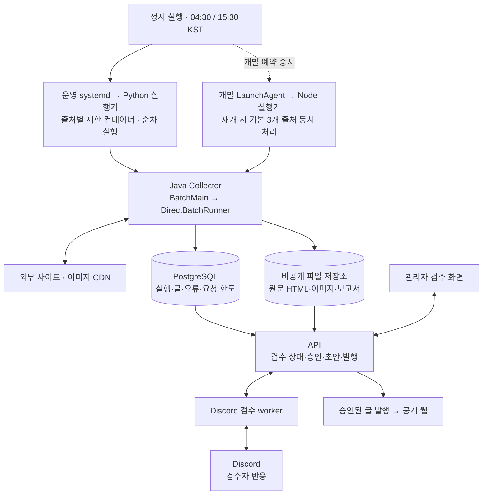
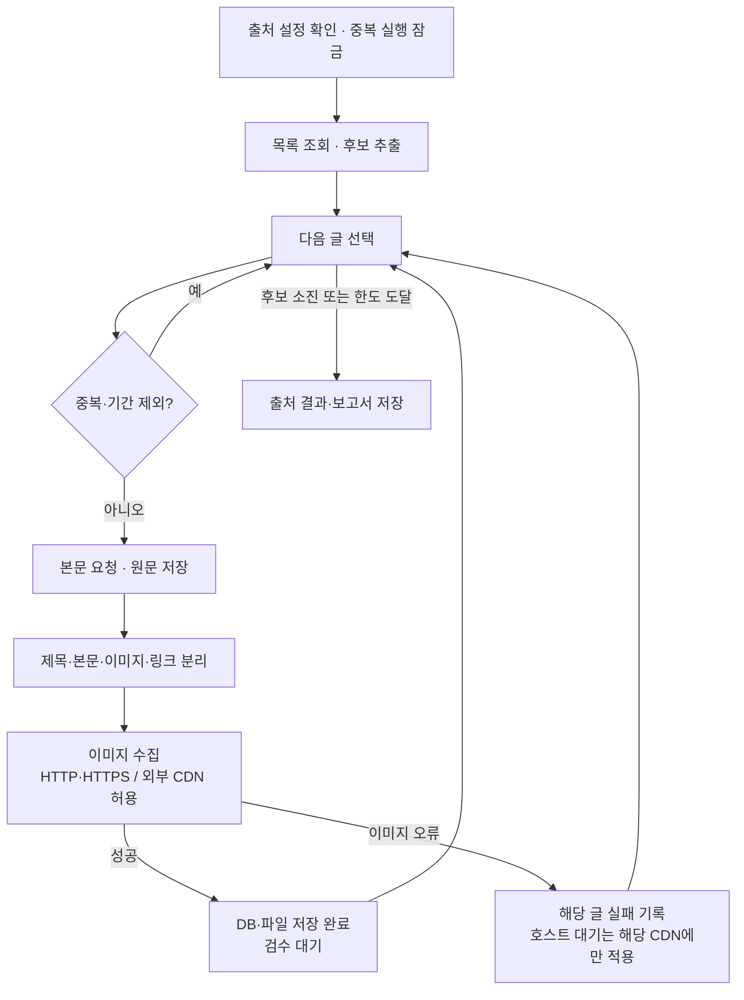

# 배치 구성·동작 시각화

- 담당: Codex / 상태: 종료 / 작업일: 2026-10-09 KST.
- 작업 폴더: `/Volumes/MicroVault/iCloudDrive/git/private/blariyo` / 브랜치: `feature/discord-review`.
- 담당·변경 범위: 이 작업 기록만. 기존 image-source-policy 소스/문서 변경과 다른 untracked 기록을 보존했다.
- 요청: 현재 배치 프로그램 구성과 동작 방식을 시각화한다. 설계 변경·배치 실행·운영 접근·배포는 하지 않았다.
- 적용 스킬: visualize. 정적 구성과 분기는 Mermaid로 표현한다.

## 전체 구성

- DB/파일 저장소는 환경별로 분리된다. 그림의 공통 Collector 노드는 같은 구현을 의미하며 운영·개발 자원을 공유한다는 뜻이 아니다.
- 수집 자체로 발행하지 않는다. 검수 worker의 상태·명령은 API/DB가 관리하며 관리자 화면과 동일 상태를 사용한다.
- 검수 scan 설정은07:30·17:00 KST. 유지 작업은 종료 후60초 간격이며 전송·명령 진행·정리와 scan 호출을 포함한다. API의 슬롯/잠금이 중복 처리를 통제한다.

## 출처 내부 흐름

- HTTP/외부CDN 허용과 이미지 오류의 글 단위 격리는10/9 로컬 변경 기준이며 운영 미배포다.
- 내부망 차단·DNS 검증/IP 고정·형식/용량 검사·출처 요청 예산은 계속 적용한다. 이미지가 빠진 글을 성공으로 처리하지 않는다.
- 이미지 외 본문 접근/목록 실패·DB/예산/소유권 오류에는 별도 출처 중단 조건이 남는다. 이미지 외 집계 대상 오류3회도 출처 종료 조건이다.
- 운영 실행기는 출처별 실패를 기록하고 다음 출처로 진행한다. 자원/서비스 보호 또는 전체 시간 제한은 전체 실행을 중단할 수 있다.

## 코드 대조와 검증

- `deploy/collector/run.py`: 운영 실행 잠금, 출처 순차 처리, 컨테이너 CPU0.5/RAM512MiB, 출처7분/전체2시간 제한, 보고서와 자원 측정.
- `deploy/collector/blariyo-collection.timer`:04:30/15:30 KST 설정.
- `scripts/local/run-batches.mjs`, `scripts/local/batch-concurrency.mjs`: 개발 출처 pool 기본3개. 현재 자동 실행은 중지.
- `apps/collector/src/main/java/com/blariyo/collector/run/DirectBatchRunner.java`: 출처 잠금·목록·중복·기간·원문·파싱·미디어·실패 분리·보고서.
- `SourceRequests.java`, `SourcePolicy.java`, `PinnedHttp.java`: 요청 한도/이미지 정책/전송 경계. 상세 변경 증거는 [이미지 정책 작업](../image-source-policy/README.md).
- `apps/collector/src/main/java/com/blariyo/collector/discordreview/DiscordReviewMain.java`, `DiscordReviewWorker.java`: API 중심 검수 scan/maintain 작업.
- `apps/api/src/features/collection/discord-review.service.ts`, `review-command.service.ts`: 검수 슬롯과 초안/발행 명령. memory의 공유 상태 설명은 현재 코드와 대조했다.
- `deploy/discord-review/*.timer`: 정시 scan과 유지 작업 간격.
- 정본: `docs/planning/content-collection/README.md`, `docs/system-design/07-spring-collector-design.md`; 현재 `docs/status.md`, `docs/roadmap.md` 확인.
- 개발 launchctl4개는 모두 disabled/미로드 재확인. 운영 서비스의 현재 가동 여부는 이번에 조회하지 않았으며 설정을 설명한다.
- 소스 변경·테스트 재실행 없음. Mermaid는 원문 정적 검토이며 별도 렌더러 화면 검증은 하지 않았다. `git diff --check` 확인.
